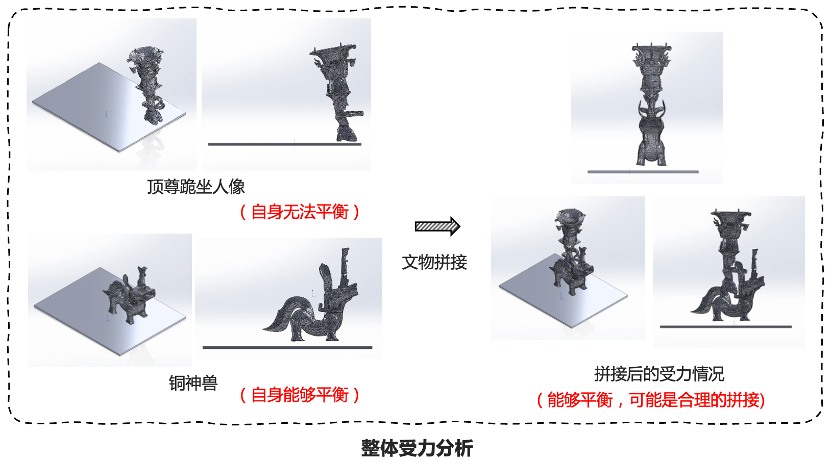

# 拼成了！腾讯AI首次模拟拼接三星堆文物

今天故事的主角是一尊铜像。

就是它——来自三星堆的 **国宝级文物“铜兽驮跪坐人顶尊铜像”** （或名“兽托顶尊跪坐铜人像”）。

在中国乃至世界范围内首次发现，有这样独特的形制和繁缚装饰的文物。

这是它刚出土的样子。

这是它经过清理后的样子。

可以看到，它残缺、开裂、变形、腐蚀严重，很多碎片都不见了，修复难度极大。

而且这还不是一件完整的文物，这件3号坑出土的顶尊跪坐铜人像，还有一个底座，是从8号坑提取的大型立人青铜神兽，拼在一起，才是完整的铜兽驮跪坐人顶尊铜像。

理论上它们能拼到一起，但考古学家们不建议这么做。因为它经历了3000多年的磨砺，本体很脆弱，通高都超过2米，如果做拼对实验，有可能会对文物造成不可逆的损伤。

这是大部分出土文物所面临的挑战： **脆弱残缺、修复难度大，稍微不注意可能就有不可逆的损伤。**
截止2022年11月，四川省文物考古院新发现的三星堆6座祭祀坑共出土17000多件文物，而整个四川省从事文物保护及修复的一线人员不足200人，这也是我们国家考古界长期面临的问题。

而且，对考古专家来说，要在残缺的情况下通过严谨合理的推演和经验判断，还原出文物原本的样貌，时间紧迫，任务繁重，挑战也非常大。

大家还能有机会一睹这些国宝级文物的“真容”吗？

我们的技术团队说，试试看！

今年3月， **腾讯SSV数字文化实验室、腾讯 PCG ARC Lab** ，和 **四川省文物考古研究院** 合作，成立了联合团队，利用腾讯的 AI
智能计算分析、计算机视觉等技术，基于专业文献，开始了 **首个试点文物模拟拼接工作** 。

今天，在四川省考古院的文物考古专家指导下，我们有了阶段性的成果，这座 **“铜兽驮跪坐人顶尊铜像”已顺利完成模拟拼接** 。

这是它在数字世界里的样子。

我们能360°翻转看它独特的行制和精美繁复的装饰，通过色彩还原等技术，感受它在几千年前铸造出来时的辉煌。

AI 是怎么做到的？

首先，“兄弟相认”。要确认这两个不同坑的文物是否能拼到一起。

以往要靠肉眼观察和经验判断，可能没那么严谨，现在我们通过 AI 智能计算分析两件文物的三维模型，提取神兽和人像接触面的几何特征信息，
计算它俩的特征相似性，就能得出拼接的匹配度。

（匹配度高达75%，确认过“接口”，是亲兄弟没错了）

接着，做“矫形手术”。根据几何分析和变形的裂缝检测和矫形算法，能把神兽和人像变形的部分矫正。

经过更多“临床试验”，我们希望 AI 未来就能给文物考古学家们提供可解释、可交互的裂缝矫形和整体姿态矫形的参考，有更精确的修复依据。

然后，“查漏补缺”。根据形状分析的对称性补全算法，可以给专家们提供文物原貌的多种猜想参考。

比如神兽通常有对称的两只耳朵，所以也为这只大型立人青铜神兽，补齐了另一只耳朵。

最后，“合体”！这里要拿出课本里学过的经典图形学的几何拼接知识了。

通过量化数据和几何拼接算法，快速把多个碎片拼接比对，给出合理的拼接方式。再对整体受力进行分析，判断两个“高个子”合在一起，怎么才能站稳不容易“平地摔”。

（有种 AI 在拼乐高的错觉）

就这样，在小小的数字世界里拼啊拼，AI 能轻松提供文物修复的可行性方案。 **目前，这些算法模型已经在模拟数据集上验证并达到行业领先水平。**

未来它还会进一步学习更高阶技能——如何在有碎片缺失的情况下进行拼接计算。

我们还用 AI 算法，辅助进行文物病害分析。

根据三维模型，测量计算文物的裂缝长度、各横截面数据、整体姿态和受力情况等，这样就方便专家们在进行文物劣化病害分析时，有更量化的支撑数据。

下一步，我们和四川省考古院的联合项目组，还会研发AI辅助考古线绘图工具。

因为现在的考古绘图对人工依赖度高，像三星堆有几万件文物等着绘图师绘制，行业内的绘图师又很少，会严重影响到考古研究报告的发布进度。

（绘图师：画不完，根本画不完）

而通过深度学习，AI 就能辅助快速生成各维度的考古线绘图。计划先试点应用到三星堆的出土文物中，未来再逐步向全行业开放，帮助提升我国文物考古研究的工作效率。

四川省文物考古研究院院长唐飞表示：

希望我们的 AI 继续努力学习，帮助考古学家们更好更高效地开展考古和文化研究工作。

文物，绝不是静止的古董，它是活着的历史。希望文物都能“恢复”它们本来的样子，带我们窥探那些曾经的故事。

