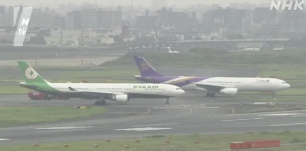
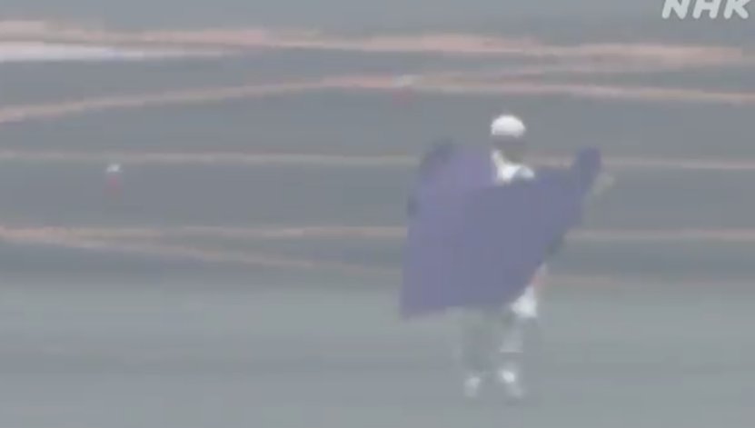

# 日媒：在羽田机场两架飞机发生碰撞，现场发现疑似机翼碎片

_据日本广播协会报道视频，10日，日本羽田机场两架民航飞机发生碰撞_

【环球网报道】据日本朝日电视台报道，10日在东京羽田国际机场，一架长荣航空飞机和一架泰国航空飞机在跑道上发生机体碰撞，目前涉事跑道已被封锁。日本国土交通省正在确认情况。

_据日本广播协会报道视频，现场附近有疑似机翼碎片的物体散落_

报道称，两架飞机目前停留在机场跑道中，现场附近有疑似机翼碎片的物体散落。目前尚未有碰撞事故造成人员受伤的报告。

