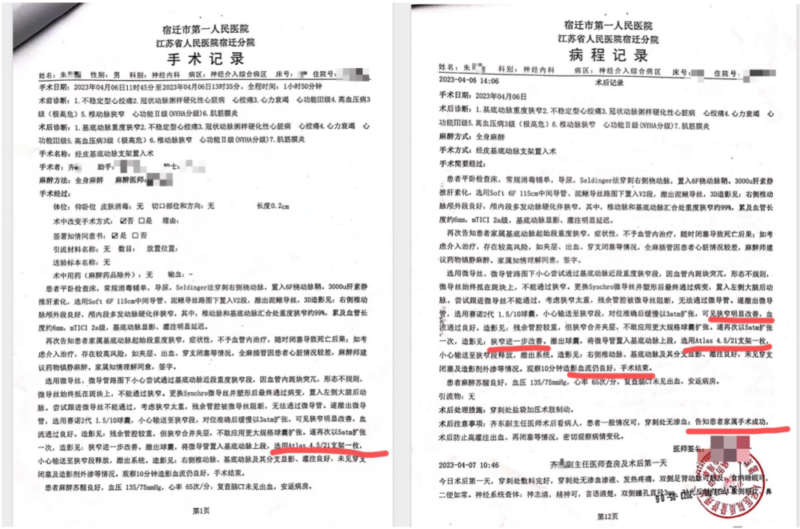
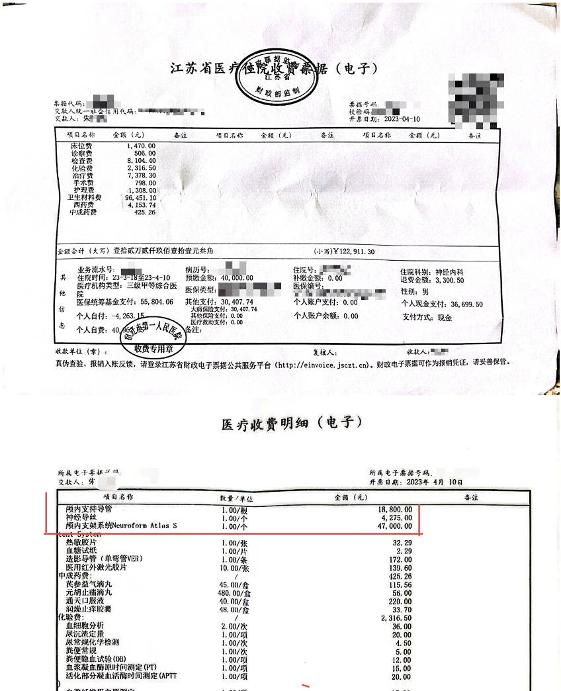

# 江苏一患者因脑梗去世，医生承认支架植入失败，病历中却谎称手术成功

因父亲突发严重脑梗症状送医抢救，朱先生才发现，不久前医生称成功植入父亲颅内血管的高价进口支架竟然“消失”了。朱先生说，眼看事态败露，涉事的操刀医师方才承认，此前的手术未能成功放置支架。

朱先生提供的录音中，涉事医生称，“我做了这么多手术，没做成的时候很少，当时这个支架没放成，我觉得很打脸，感觉有点不好看，下不了台。”

6月7日，朱先生父亲因动脉血栓堵闭致大部分脑干坏死，不幸去世。朱先生表示，他们将就涉事医院和医护人员故意隐瞒支架未能植入事实、伪造病历虚构手术经过、未装支架却收取费用等情况，向当地法院提起民事诉讼，追究医院和医生医疗过失责任。朱先生认为，院方和相关医护人员均应承担相应的行政责任和赔偿责任，构成犯罪的还应承担刑事责任。

6月9日下午，澎湃新闻记者致电宿迁市第一人民医院纪委，询问前述情况及涉事医生处理情况，接线工作人员表示，“这个不好给你答复，目前不方便说”。

9日晚，澎湃新闻致电涉事医生齐某，对方表示不接受采访，称“相关部门已经调查了，具体听官方的公布消息”，后挂断了电话。

**老人住院后接受脑血管支架植入术，病历称手术成功**

今年3月18日，62岁的朱老汉因反复胸痛，被送入江苏省宿迁市第一人民医院心血管内科住院治疗。这家医院的官网介绍，该医院是宿迁市唯一一所综合性三级甲等公立医院，于2016年正式运营。

3月19日，朱老汉胸痛问题有所减轻，但经检查发现其椎动脉狭窄。3月28日，朱老汉被转入宿迁市第一人民医院神经内科继续接受治疗。3月31日，朱老汉接受脑动脉造影手术，神经内科副主任医师齐某为主刀医生。手术记录显示，朱老汉冠状动脉粥样硬化，其左侧椎动脉颅内段闭塞，右侧椎动脉颅内段、基底动脉重度狭窄。

宿迁市第一人民医院官网介绍，齐某是医学硕士、脑卒中中心介入医疗组组长，从事神经介入手术10余年，擅长全脑血管造影术、颅内外血管狭窄支架植入术、慢性闭塞血管开通术，尤其擅长急性脑血管闭塞取栓开通手术，累计手术量4000余例。

朱老汉的儿子朱先生告诉澎湃新闻，当时医生告知家属，如果不予血管内介入治疗，患者随时可能因动脉闭塞导致死亡的结果。经家属签字同意后，4月6日，齐某再次作为主刀医生，对朱老汉进行经皮基底动脉支架植入术，术后告知家属手术成功。

基底动脉是人脑血管中重要的主干血管，供应脑干、小脑及部分大脑组织，周围遍布穿支血管，对术者的操作要求极高。手术过程中，手术者需要操作导丝及导管，通过迂曲的血管定位至狭窄的病灶，通过球囊扩张血管后精准释放支架。

朱先生提供的病程记录和手术记录均显示，手术过程中，齐某选用了一枚Neuroform Atlas
4.5/21支架输送至病变狭窄段释放。病程记录中多次提到血管狭窄问题得到改善，告知家属手术成功。

_朱老汉接受经皮基底动脉支架植入术的手术记录及病程记录复印件。朱先生供图_

根据4月7日至4月10日的查房记录，朱老汉术后病情平稳，症状有所好转。4月10日，朱老汉出院，家属结清了住院医疗费用，合计12万余元，部分自费。澎湃新闻记者注意到，当日收费票据及相关明细中，卫生材料费近10万元，其中，Neuroform
Atlas进口颅内支架47000元。

_朱老汉的出院收费票据及部分明细。朱先生供图_

**老人突然发病，医生承认支架植入失败**

5月4日，朱老汉突发严重脑梗。他先被救护车送至江苏省宿迁市泗洪县分金亭医院抢救。令家属没想到的是，当时的CT检查发现，其颅内段部分动脉已严重堵闭，同时未发现此前植有支架。“我们当时不相信这个检查结果，认为这是小医院，可能检查不出来，所以我们决定转送到之前的医院。”朱先生说，朱老汉又被转入宿迁第一人民医院，曾作为主刀医生的齐某此时才承认，之前未能在患者颅内血管成功植入支架。

随后，朱先生一家又连夜将朱老汉转送至南京鼓楼医院。朱先生称，5月5日，齐某和宿迁第一人民医院的院方代表也来到该医院，再次沟通。

_朱老汉在泗洪县分金亭医院的CT检查报告，显示颅内并无支架。朱先生供图_

“说实话，我做了这么多手术，没做成的时候很少，当时这个支架没放成，我觉得很打脸，感觉有点不好看，下不了台。”在朱先生提供的录音中，齐某承认患者颅内没有支架，也不知道支架究竟在何处。他说，支架一般预装在微导管上，但在手术过程中，导管抵达病变处被推出时，并没有看到支架自动释放撑开的显影，“360度转圈就是看不到，这是第一次遇到（这种情况）”。录音中，齐某猜测，可能是支架存在出厂质量问题，或在推送过程中出现脱载的情况，也有可能支架始终“就在微导管里”。但当家属询问其是否留存了微导管，齐某称，“已经扔了。”

据中国医师协会心血管内科医师分会指南与共识工作委员会、中青年冠状动脉专家沙龙组织专家2019年制定的《冠状动脉支架脱载的处理和预防专家共识》，冠状动脉支架脱载与病变、器械和技术操作等因素密切相关，目前支架脱载的发生率极低，已降至1%以内，但所导致的“次生”并发症发生率达20%，可导致脑血管意外、急性心肌梗死、甚至死亡。

“我做完手术后的心情非常复杂，当时确实有一点侥幸心理，因为（手术）做完后患者的血管很好，血流没有支架也完全够用。”齐某在上述录音中说。对于未能安装支架却仍收取费用的情况，齐某表示，“支架没有用，但也浪费掉了。你说不收费，去哪儿出这个东西？那还得让医院贴钱，（我）也怕处分。”

朱先生告诉澎湃新闻，就后续治疗费用等情况，当天他们未能与到场的宿迁市第一人民医院院方协商一致。5月10日，朱老汉在鼓楼医院再次接受支架植入手术，但术后，其颅内基底动脉全部血栓堵闭导致脑干损坏3/4以上。6月7日中午，朱老汉不幸去世。

6月9日下午，澎湃新闻记者多次致电涉事的宿迁市第一人民医院医务处，或未能接通，或由对方接起后直接挂断。记者又致电宿迁市第一人民医院纪委，询问前述情况及涉事医生处理情况，接线工作人员表示，“这个不好给你答复，目前不方便说”。

