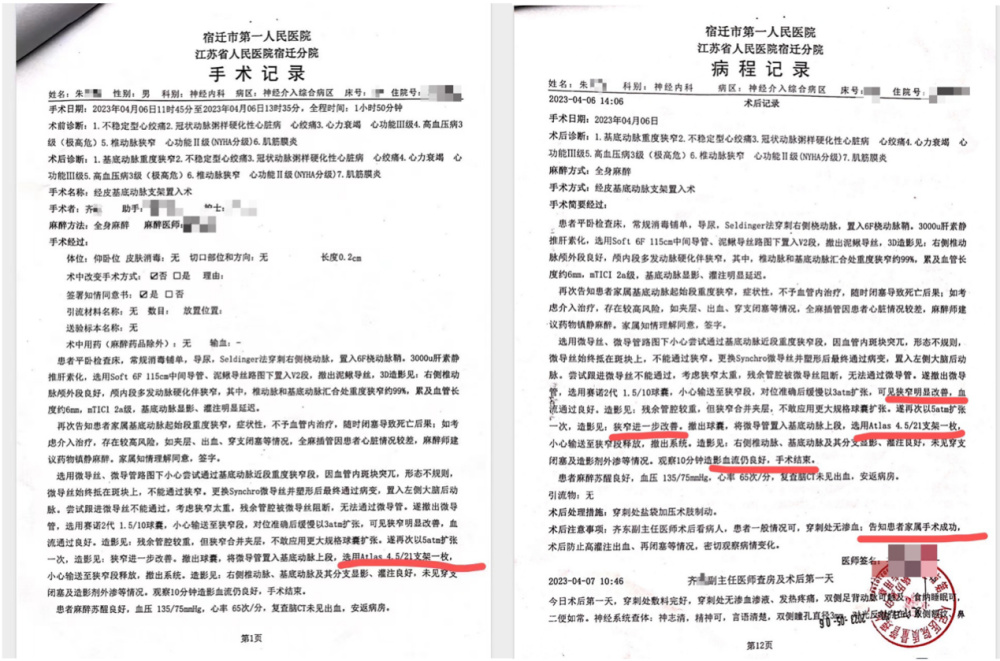
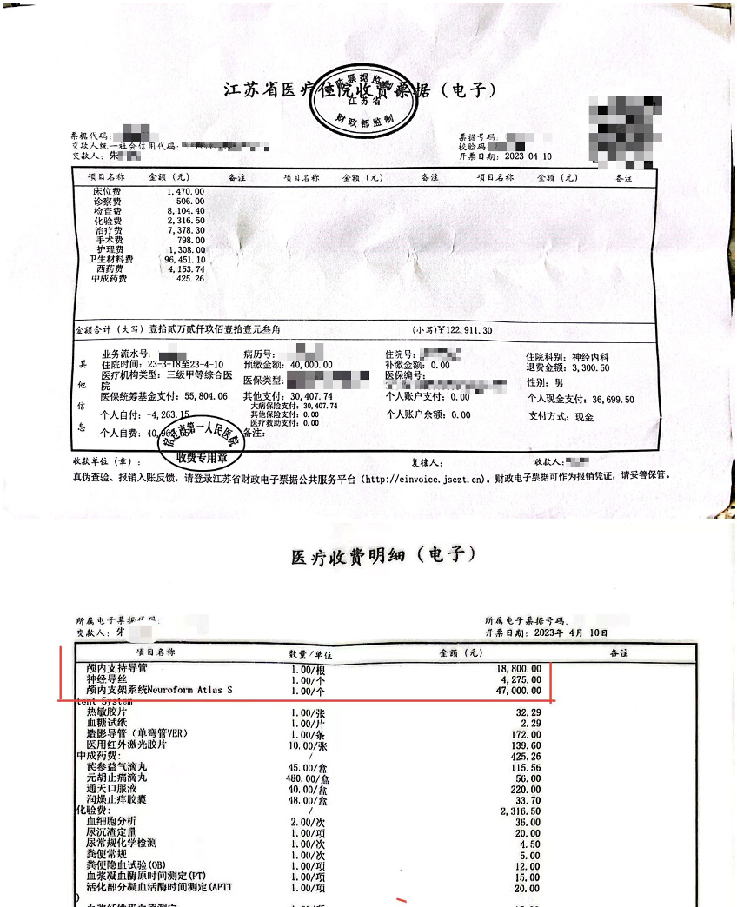
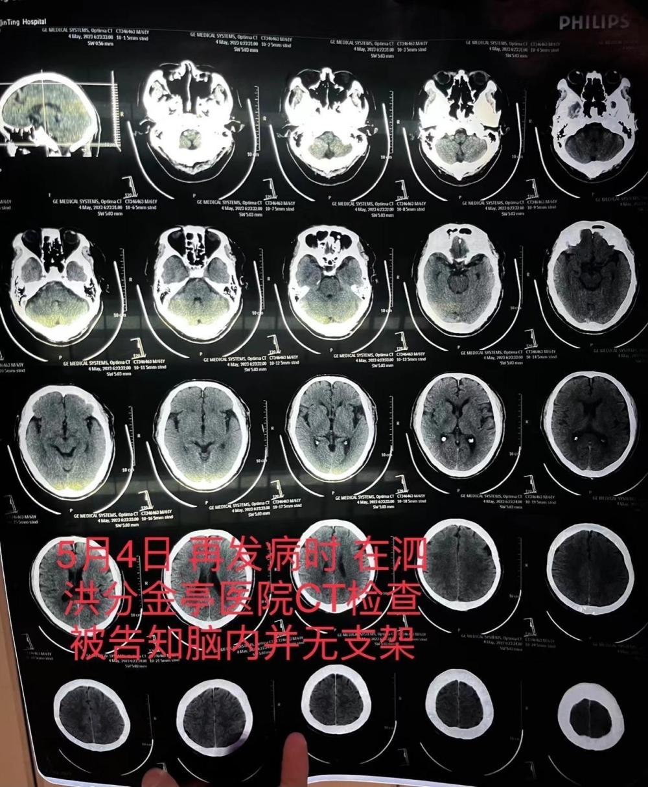

# 江苏老人脑梗去世，医生未植入支架却隐瞒，专家：已非一般医疗过失

受访专家：北京大学法学院教授 孙东东

环球时报健康客户端记者 张冕 田雨汀

6月10日，#老人突发脑梗发现医生隐瞒未植入支架#词条登上热搜，引发社会广泛关注。“环球时报健康客户端”记者对事件进行梳理，并采访了业内专家，专家对此发表了个人观点。

**事件时间线梳理**

**医生未成功植入支架，却告知家属手术成功并收费**

据江苏一患者因脑梗去世，医生承认支架植入失败，病历中却谎称手术成功，今年3月18日，62岁的朱老先生因反复胸痛，被送入江苏省宿迁市第一人民医院心血管内科住院治疗。

3月19日，朱老先生胸痛问题有所减轻，但经检查发现其椎动脉狭窄。

3月28日，朱老先生被转入宿迁市第一人民医院神经内科继续治疗。

3月31日，朱老先生接受脑动脉造影手术，神经内科副主任医师齐某负责。手术记录显示，朱老先生冠状动脉粥样硬化，其左侧椎动脉颅内段闭塞，右侧椎动脉颅内段、基底动脉重度狭窄。朱老先生的儿子朱先生告诉记者，当时医生告知，如不进行血管内介入治疗，患者随时可能因动脉闭塞导致死亡。

经家属同意，4月6日，齐某作为主刀医生，对朱老先生进行经皮基底动脉支架植入术，术后告知家属手术成功。家属提供的病程记录和手术记录也显示，手术中，齐某选用一枚Neuroform
Atlas 4.5/21支架输送至病变狭窄段释放。病程记录中多次提到的血管狭窄问题得到改善，告知家属手术成功。

4月7日至4月10日查房记录显示，朱老先生术后病情平稳，症状好转，于4月10日出院，家属结清住院医疗费用，合计12万余元，部分自费。当日收费票据及相关明细中，卫生材料费近10万元，其中Neuroform
Atlas进口颅内支架47000元。

5月4日，朱老先生突发严重脑梗，被救护车送至江苏省宿迁市泗洪县分金亭医院抢救。CT检查发现，其颅内段部分动脉已严重堵闭，未发现此前植有支架。家属不相信这个检查结果，朱老先生又被转入宿迁市第一人民医院，曾作为主刀医生的齐某此时承认，之前未能在患者颅内血管成功植入支架。

随后，朱先生一家连夜将朱老先生转送至南京鼓楼医院。5月5日，齐某和宿迁第一人民医院院方代表来到该医院，再次沟通。

5月10日，朱老先生在南京鼓楼医院再次接受支架植入手术，但术后颅内基底动脉全部血栓堵闭，导致脑干损坏3/4以上。

6月7日中午，朱老先生去世。

在朱先生提供的录音中，齐某说：“说实话，我做了这么多手术，没做成的时候很少，当时这个支架没放成，我觉得很打脸，感觉有点不好看，下不了台。”

支架没放成，去哪里了？齐某说，支架一般预装在微导管上，但在手术过程中，导管抵达病变处被推出时，没有看到支架自动释放撑开的显影。“360度转圈就是看不到，这是第一次遇到”。齐某猜测，可能是支架存在质量问题，或在推送过程中出现脱载，也有可能支架始终“就在微导管里”。但当家属询问其是否留存微导管，齐某称，“已经扔了。”

未安装支架为何仍收取费用？齐某表示，“支架没有用，但也浪费掉了。你说不收费，去哪儿出这个东西？那还得让医院贴钱，（我）也怕处分。”

6月9日下午，记者多次致电涉事的宿迁市第一人民医院医务处，或未能接通，或由对方接起后直接挂断。记者又致电宿迁市第一人民医院纪委，询问前述情况及涉事医生处理情况，接线工作人员表示，“这个不好给你答复，目前不方便说”。

朱先生表示，他们将就涉事医院和医护人员故意隐瞒支架未能植入事实、伪造病历虚构手术经过、未装支架却收取费用等情况，向当地法院提起民事诉讼，追究医院和医生医疗过失责任。

**一位神经内科医生认为：**

**“可能与使用的支架类型、型号、长短不合适有关，导致在指定位置无法撑开，应第一时间告知家属。”**

北京某三甲医院神经内科主任医师万先生根据现有报道内容，在接受“环球时报健康客户端”记者采访时表示，基底动脉区被称为“生命禁区”，主要负责脑干等重要脑区供血，直接影响呼吸、心跳等基本生命活动，基底动脉介入手术风险极高。

老人病程记录写，其基底动脉重度狭窄。万医生表示，狭窄程度超过70%才是重度狭窄，此时确实需要及时进行干预治疗，否则可能危及生命。治疗方法包括口服药物、介入手术等，介入手术方式包括球囊扩张、支架植入术。“无论采取哪种疗法，都需要以患者为中心，选择最适宜的疗法。介入支架手术主要由两到三名医生完成，一名医生主刀，另外一两名医生辅助，并记录手术全过程。”

万医生告诉记者，脑血管支架手术的操作主要分为5步：

第一步，局部消毒和麻醉，医生一般选择手腕上的桡动脉或大腿内侧的股动脉处进行穿刺，随后置入动脉鞘管；

第二步，通过此鞘管插入造影导管或导引导管，并顺着外周动脉抵达椎动脉（左、右椎动脉入颅后汇合成基底动脉，所以造影时先找椎动脉）的开口；

第三步，当导管到达椎动脉开口后，医生要在X线透视下，通过注入造影剂来显示基底动脉，确定是否存在病变，以及病变位置等情况；

第四步，在确定基底动脉存在狭窄性病变，并决定介入治疗后，医生通过导引导管送入一根如发丝一样细的导引导丝，穿行于动脉管腔内，并最终抵达基底动脉血管远端。之后，医生选择合适型号的球囊，到达狭窄部位球扩后，再将选好的支架送到病变部位释放到位。

第五步，再次进行动脉造影，确定手术成功后，撤出导引导丝、导引导管，随后拔出动脉止血鞘管，采用局部加压方法进行局部止血。

万医生告诉“环球时报健康客户端”记者，齐某提到支架到达基底动脉位置进不去，可能有两方面原因：一是可能与使用的支架类型、型号、长短不合适有关，导致在指定位置无法撑开；二是技术水平不足。此时，医生应第一时间告知家属，尽早转到更有能力的医院，为患者实施手术。

万医生表示，齐某将支架消失归因于支架脱载和质量问题，是其为手术失败找的一个借口，因为目前临床上支架脱载的发生率极低（不到1%）。后续经CT检查也未发现支架，很可能是被其扔掉了。虽然手术是由主刀医生全权负责和指挥，但手术不成功，却记录为“成功”，有可能是整个手术团队共同隐瞒的结果。正是由于手术失败，又未及时告知家属，才给老人后续再次发病、身亡埋下隐患。

万医生表示，大家不要因此对医生队伍失去信心，这种情况属于极其偶发的个例，绝大多数医生秉持着对生命的尊重，会尽己所能为患者提供最适宜的治疗。希望有关部门尽快对此事件展开调查，给患者家属、社会公众一个说法，否则会对医患关系产生不利影响。

**北京大学法学院孙东东教授认为：**

**“本应预见不良结果可能出现，却抱着侥幸心理未采取防范措施，放任不良结果出现并隐瞒实情，就不仅仅是一般医疗过失问题了。”**

北京大学法学院孙东东教授也对此事件进行了评价。他说，上述事件虽属医疗行业中较罕见的情况，但也暴露出相关管理问题。

“不同医院的诊疗水平有高有低，医务人员在诊疗过程中也不能100%避免出错。”孙东东说，2021年1月1日起施行的《中华人民共和国民法典》第1219条规定：医务人员在诊疗活动中应向患者说明病情和医疗措施。“如果手术中未能成功放入支架，当时应告知患者家属，可能家属还能接受。”

“本应预见不良结果可能出现，却抱着侥幸心理没有采取防范措施，放任不良结果的出现并隐瞒实情，就不仅仅是一般的医疗过失问题了。”按《民法典》1221条规定，医务人员在诊疗活动中未尽到与当时医疗水平相应诊疗义务，造成患者损害的，医疗机构应承担赔偿责任。当地卫生行政健康主管部门可能还会依照《医疗纠纷预防处理条例》的规定，对医院和医生进行处罚，如果性质严重，有可能吊销该医生的医师执业许可证，具体处罚由有关部门按照相应规定执行。

孙东东介绍，中华医学会曾做过相关统计，在全国发生的医疗纠纷中，真正构成医疗事故的平均不到30%，但涉及工作不到位的就多了，其中“说明不到位”排第一位，约占67%。“术前充分准备，严格掌握手术适应征（哪些情况能做、哪些情况不能做）；术中发现新的变化和问题时，及时与患者家属沟通，说明相应情况；术后做好患者生理指标、康复预后、跟踪随访等相关监护管理。一个完整的流程下来，医生、医院均应具有完备的处理方案，并严格执行。”

如何防范类似案件的发生？孙东东表示，目前从国家法律到行业规范都有详细的规定。《民法典》是基本法，体现了医患双方具有法律地位的平等性，是平等主体之间的法律关系；去年3月1日起施行的《中华人民共和国医师法》第三章明确指出，医师在执业过程中的行为准则，包括基本义务、专项义务等；2018年10月1日施行的《医疗纠纷预防和处理条例》则细化和明确了部分具体的规范要求。此外，中华医学会制定的相应诊疗规范、技术规范等，也都有明确规定。“关键在于执行落实！”

责编：王晓晴

主编：李迪

