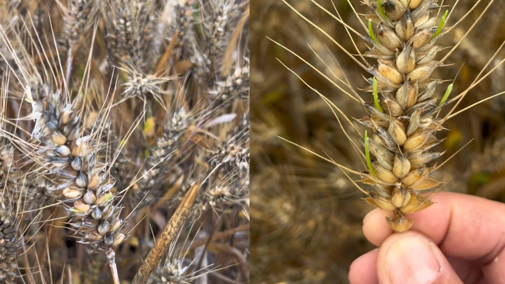
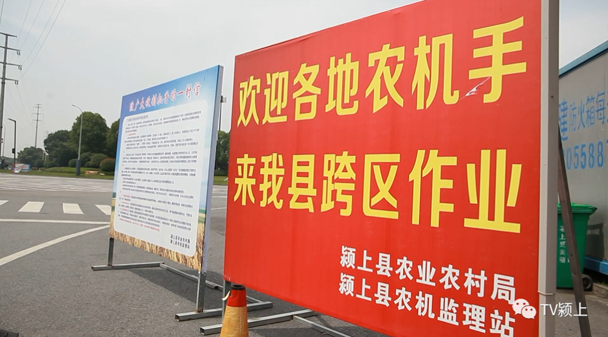
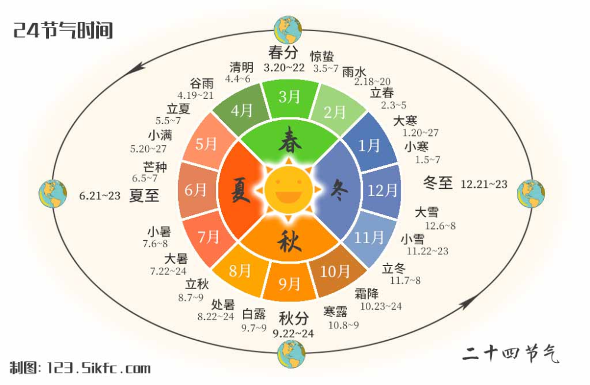

# 河南小麦歉收事件背后，专家：以传统节气指导农业正在失灵

核心要点

  * _1_ 收割机跨区作业在我国一直存在，高速公路对收割机免费但是有条件：农机手要申领跨区作业证；超宽超重的机械要按照交通部的规定办理超限证。
  * _2_ 跨区作业虽然讲究全国一盘棋，但存在地方本位主义。不仅要在地方层面进行协调，还需要在市或更高的省级区做好农机的跨区域调配工作，以避免出现这次由于突然因素导致的农机市场恐慌问题。
  * _3_ 节气指导农业生产存在一定的区域性和时代性。此外，还要考虑作物的品种，不同品种成熟时间不同，就不能按照节气指导来统一生产。
  * _4_ 气候极端化在农业上的反映就是农业的经营风险在增加，因为农业本身就和自然条件紧密结合在一起应积极培育“中等规模农业经营“并且维持老人农业的地位，尽量克制大规模的土地流转和规模化的经营，这也是应对极端气候风险的一个选择。

5月下旬以来，河南多地遭遇“烂场雨”，小麦歉收、霉变、发芽等问题突出，不少农民因此蒙受较大损失。此事一经发酵，迅速引发广泛社会关注。

异常天气、抢三夏（夏收、夏种、夏管）、农民难、高速收费等相关话题也再度回到人们讨论的视野。而这些话题的背后，一个容易被人忽视的背景，是围绕三农问题的节令物候、基层治理、农业种植模式等等，在今天都已经发生了很大的变化。只有弄清楚这些变化，我们才能更真切地理解今天的农村、农业和农民。

_小麦发霉、发芽（图/网络）_

腾讯新闻《一起来唠科》联合《陌生的乡土》，邀约博物学科普作者任辉、中科院大气所气象学家魏科、西北农林科技大学人文社会发展学院副教授陈靖和农业机械杂志社社长于帅一起来探讨今天农业的困局、变局与因应之道。

一、候鸟一样从南到北移动的收割机

**任辉：今年五月下旬，河南进入小麦收获的季节，突然多地连降暴雨，导致已经成熟的麦子因为缺失农业机械和突发气象问题无法及时收割，出现发霉、发芽的现象。请问我们如今的农业机械收割效率如何？如何看待收割机的跨区作业？**

**于帅：**
收割机是最常见的农业机械之一，每年生产的轮式和履带的加在一起有约20万台。目前我国的保有量，也已经超过了100万台。一台传统的56公斤级的收割机一天正常工作可以收割200亩地的麦子。而四个劳动力割1亩麦子就需要将近一天时间，且仅仅是完成收割，不包括运输和打麦脱粒时间，可见相比人力，收割机的效率要高得多。

**此外，人工打麦脱粒完之后还要进行第二遍脱粒 ，这个损失率也很高。而现在国家规定的收割机的损失率基本在2%以内，相比人工脱粒损失率要小得多。**

_5月26日，大型收割机在河南省冒雨收购小麦（图/中新社）_

**收割机跨区作业在我国一直存在，高速公路对收割机免费但是有条件。**

**跨区作业应该说是我国人民的发明，它有效地提高了收割机的利用率。在我们的邻国日本，一台收割机可能到退役总共就工作500到600个小时。但我国的收割机一个作业季度下来能工作500到600个小时，这极大地促进了我们的收割机的使用效率。**

**早在2003年，我国家农业部就发布了关于跨区作业的暂行办法，规定特别详细。这一政策保障了我们的收割机农机手在异地工作时的权益，不用担心在陌生的地方没处吃住、受人欺负等等。同时也要求当地的农业部门配合。比如现在各地都有跨区作业的服务站，各地的农业主管部门会公布专人的联系方式，让大家了解当地有多少土地需要收割、什么时候收割、需要多少收割机等等。**

**同时，对于跨区作业，高速公路对收割机是免费的，这是一项优惠政策，但免费是有条件的。第一，农机手要申领到跨区作业证；第二，随着我们的机器本身越来越大，它可能出现超宽超重的现象，那就需要按照交通部的规定办理超限证，办理后可以免费通行。**

**此次河南有部分收割机在高速被拦，就是因为这两个证件不全。不过，遇到类似今年这样的紧急情况时，收费站其实可以实行先放行、延后收费的方式，或者之后找相关的机构补登记跨区作业证和超限证，避免造成更大的损失。**

**目前来看，农机手的跨区作业证办理还有提升空间，流程比较长，操作也比较复杂，需要跑到农业局去逐级备案。我们是希望能互联网化，在线就能办理，最好是在手机上就能办好。**

**任辉 : 在跨区作业过程中是否有“特事特办”的空间？例如先让机器通行保证抢收，争取时间窗口。这种政策机制在实际操作中有没有成型？**

**陈靖：跨区作业虽然讲究全国一盘棋，但还是存在地方本位主义。**
最近的连阴雨酿成舆情，各个地方政府都非常重视，但有时也会用力过猛。比如我们最近在河南一些地方调研时，就发现大家都很紧张，对收割机的需求很大。如果天气如往年一样晴好，按照既有的作业方式，目前的收割机是可以满足需求的。但今年因为大雨，需要在很短的时间内去收割，所以各个地方都出现了机械不足的问题，部分地方政府在跨区调机械的过程就会被别的地方政府半路截住。

**所以，我们不仅要在地方层面进行协调，还需要在市或者更高的省级区做好农机的跨区域调配工作，以避免出现这次由于突然因素导致的农机市场恐慌问题。**

_安徽颍上县欢迎农机手跨区作业（图 /颍上县融媒体中心）_

**任辉：我国农业机械跨区作业的范围、成本大致如何？农机手会面临就业困境吗？**

**于帅:
从我多年调研来看，农业机械跨区作业一开始在江苏出现得比较多，如今在安徽和河南等地也开始兴起。因为第一批农机手通过跨区作业挣钱后就不干了，这一工作就逐渐向经济相对落后的地区转移。比如，山东地区作业的农机手大约有百分之七八十都来自河南。**

**实际上，农机手不光收割小麦，也收割水稻。他们从海南和四川开始，一直向北收到黑龙江。因为农作物是逐渐由南向北成熟的，所以他们的作业范围非常广，只要有作业需求的地方他们都可以到。这一过程大约是时长三到四个月，有的甚至高达六个月。一台收割机配备两到三个人，作业时间长，工作量非常大。像汝南的机手，我们调查过一些，他们一年在外收割作业，5000台收割机，一年各种各样的收入，听说将近有20个亿吧。**

**不过，这些年跨区作业市场的竞争也越来越激烈，最早的时候一台50万元的收割机，农机手可能一年就能赚回本了。到现在，可能一台十几万的收割机，也得干两年才能回本，还是很辛苦的。**

二、物候已发生变化，传统节气需要重新调整

**任辉：刚刚说到农作物是由南向北逐渐成熟的，这就涉及一个物候的概念。各地的气象会出现不同，像我们山东，可能相邻的两个地级市，每年燕子回来的时间，就能差出两三天的时间，但相对比较稳定。现在有一些网友就在说，近年的气候变化比较紊乱，呈现出极端化的趋势，今年的厄尔尼诺现象也在日益明显，那在这种情况下，我们传统用来指导农业作业的节气，现在还能比较准确地指导我们今天的农业生产吗？**

**魏科：**
节气确实是我国特有的包含科学意义的非物质文化遗产。节气的文化内涵非常丰富，包括了各种气候的特点、物候以及人们的生活生产方式等等。最近这些年的一些研究显示，对比传统节气的标准，温度、降水、时间都出现了一些偏差，尤其是温度的变化比较明显。比如，现在夏季来得越来越早，结束得越来越晚，在向两头延长；而冬季结束得越来越早，开始得越来越晚，时间在缩短。
**所以说，很多的节气和以前相比，已经略有不同。**

**我们国家很多地方，以四声杜鹃的叫声作为夏天的开始。竺可桢先生在他的《物候学》一书中有记录，在他写书的时候北京四声杜鹃的初鸣声，平均日期是5月23日。最近几年，我也每年都在北京记录四声杜鹃的叫声，我发现这几年基本上都是稳定在5月15到17号左右。你看，过去了40年，四声杜鹃初鸣提前了大概一个星期，可见物候确实是在发生变化。**

**此外，古代的节气本身就有一定的适用范围。24节气是基于中原地区的季节演变确定的，它不见得适合所有地方，比如岭南和东北就不能用24节气来指导农业生产。而且，我们还要考虑作物的品种变化。比如冬小麦有很多品种，有一些是偏早熟的，有一些是偏晚熟的。成熟的时间本身不同，就不能按照节气指导来统一生产。**

**所以，节气指导农业生产存在一定的区域性和时代性，在当下我们需要根据气候变化不断去丰富并调整节气的内涵。**

_24节气时间（图/网络）_

**至于大范围的气候异常，怎么去了解它，怎么去预估它，怎么去预测它，这方面科学界和研究部门也有很多成熟的技术和方法，集中关注几个最重要的气象指标，比如说刚提到的厄尔尼诺现象，即热带东中太平洋的海温状况。我们每年都要做关于厄尔尼诺的预测，全球各个研究中心也都高度关注厄尔尼诺的走向，因为它可能会决定未来一段时间全球的旱涝灾害。**

**我们国家有点特殊，因为季风气候，雨季主要在夏季。夏季的降雨量能占一年降雨量的绝大部分。所以我们就特别关注夏季的降雨，下多少？在哪下？以什么样的形式下？这是每年关注的重点。国家气象局，以及其他业务部门和研究机构，每年从3、4月份起，就开始做关于夏季的降水和温度的预测，尽管那时距离汛期还远。预测一部分根据经验的统计，现在越来越多依赖于超级计算机，就是我们建立气候模式，然后用超级计算机来运算，并根据算出的数据来预测。这种预测目前准确率还算可以，让我们可以提前做一些准备。**

三、尽量克制大规模的土地流转和规模化的经营

**任辉：我们一直用的一个词儿就是三农，农业，农村、农民，这三个是紧密联系，互为一体的，最终肯定会互相传导。那么在气候极端化情况下，农村管理和对农村深化的治理有没有更好的应对办法？或者说现在农村有哪些薄弱的环节更容易受到这种极端气候的冲击？**

**陈靖：气候极端化在农业上的反映就是农业的经营风险在增加，因为农业本身就和自然条件紧密结合在一起。自古以来**
，怎么去防范风险和化解风险就是我们农政思想里很重要的一个前提。

**中国传统中，大家用一个词叫小农经济，因为我们人多地少，被动地形成了一种小规模经营形式，以家庭为单位投入劳动力到农业生产当中，同时家庭其他成员也会做一些手工业作为副业，这是我们中国传统小农经济的一个非常典型的样貌。小农经济的形成，从经济、农业角度和农村农民的角度来讲都有很大的合理性。比如我们讲风险问题，小农经济以家庭为经营单位，每个人从事不同的行业，哪怕在农业上经历了一点风险，整体的承受风险的能力还是很强的。几千年我们都是季风性气候，风险是常在的，而我们传统的小农经济也稳定了几千年，可见它是有韧性的，它也形成了我们比较独特的农民的家庭结构、农村社会和小农意识等等，这是一个整体性的结果。**

**而现在的问题是，随着气候越来越极端化，小农经营格局是否还存在抗风险能力？**

**近十几年来，农村家庭里的强劳力大多外出务工，留守在家的主要是老人和妇女，大都是老年人在家种田。**

_务农老人（图
/网络）_

**目前，我们的农村同时也存在三种农业经营方式。第一种就是上面提到的老人农业，以老人为主要务农劳动力，属于经营规模在十亩以内的小规模经营；第二种是新中农，不外出务工且具有经营能力的人会将同村亲戚朋友的地承包过来，属于经营规模在五十亩以内的中等经营；第三种方式，是如今很多地方政府采取的大规模经营，动辄几百亩甚至上千亩。很多人把大规模经营当作现代农业的典型，地方政府也积极推行这种模式，把土地从小农户手中流转出来进行大规模经营。不过，目前在国内占主要的还是前两种。**

**三种经营方式在应对灾害的时候，它们的风险承受能力是不一样的。老人经营的小规模农业的承受能力最强，也能在遭遇打击后最快恢复，**
可能今年受点儿损失，明年还可以继续
**；而承受能力最弱的是超大规模的经营形式，它可能经营了好几年都在赚钱，但突然遇到十年不遇的气候灾害就会导致亏损严重，没法干了。**

**这也是我们现在去思考这个农业农村发展的一个思路，就是我们的农业经营到底是要依靠哪个主体。那从这次河南经历的风险来看，大家还是会比较警惕这种大规模的经营主体，因为它规模越大，风险越大，它的抗风险能力就会比较弱。**

**针对老人农业，**
有些人比较担心农村老龄化的现象，认为老龄化后会出现无人种地的情况，实际上在我们调查中会发现这个想象可能是过度解读了。特别是在河南等生产条件比较好的地区，就很少出现撂荒的情况。

**调研下来，目前我们是比较推崇“中农（中等规模农业经营）”的形式。一个人留守在村里种地、再进行养殖，在农闲时出去打工，能够维持家庭生计，而且他的抗风险能力还是比较强。**

**所以在这个背景之下，我们应该积极培育“中农”并且维持老人农业的地位，尽量克制大规模的土地流转和规模化的经营，这也是应对极端气候风险的一个选择。**

嘉宾信息：

**整理：伍栋阳**

**版权声明：本文系腾讯新闻《一起来唠科》独家稿件，未经授权禁止媒体转载，但欢迎转发至个人朋友圈。**

