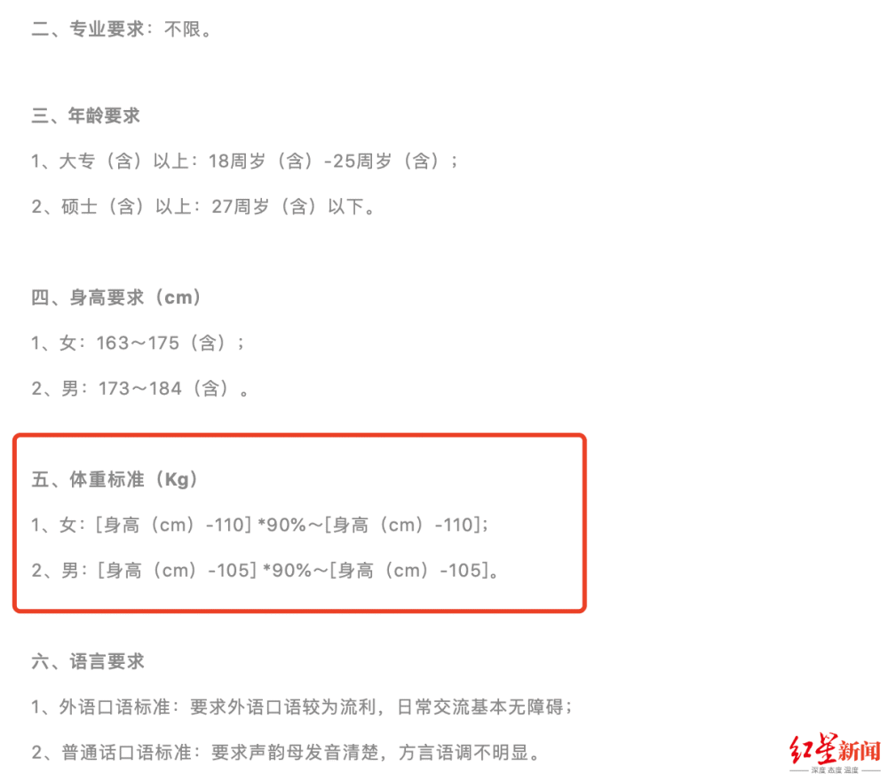
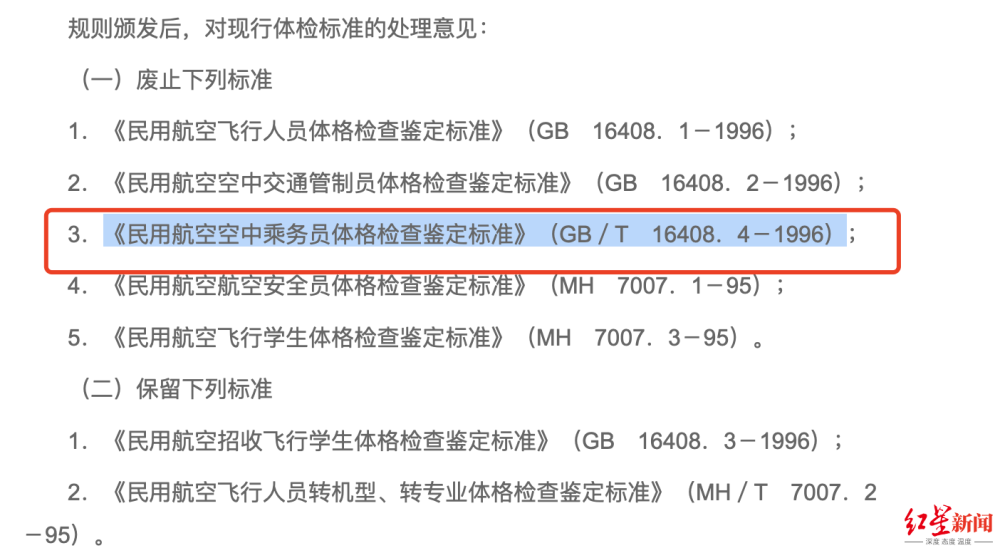

# 海航空姐超重10％就停飞？限定空乘体重文件已废止逾20年，多家航司招聘仍存在

据上游新闻报道，6月初，海南航空向其客舱部的空中乘务员发布通知，对乘务员进行“关于专业化形象的筛查和管控提示”，其中明确对女性乘务员的体型、体重进行不同等级的管控，超出标准体重值10%的女性乘务员将“立即停飞减重”。

红星新闻记者注意到，除海航外，深圳航空、北部湾航空等航司在近期发布的空乘人员招聘中，也都对空乘应聘人员给出了体重限制的要求。而我国此前出现空乘人员建议体重的相关政策性文件，实际已在2001年废止，但一名业内人士告诉红星新闻记者，“目前仍有部分航空公司会参考废止的文件，制定行业管理标准。”

至于海航的管理细则，一名知情人士在接受媒体采访时表示，体重管控的目的在于将健康管理前移，且体重管控是针对所有乘务人员，并不只局限女性。

**海航规定女乘务员超重就停飞？**

**知情人士：旨在倡导健康生活习惯**

据上游新闻报道，4日，海南航空客舱部下发了一份名为《关于专业化形象的筛查和管控提示》的文件，除相关日常工作要求外，其中对该公司的女性乘务员体型体重制定了具体的管控标准。

按照该管控标准，女性乘务员标准体重的计算公式为“身高（cm）-110=标准体重（kg）”，体重超过该数值即为超重，公司会对超重人员进行分类管控：

·超重数值在5%以下的女乘务员，将以月度为周期进行体重监控，避免组员体重持续上升。“待一月监控期满后，着制服赴乘务队进行当面复核，完成现场称重及三人面试小组评议。”

·对于超重区间在5%~10%的女乘务员，工作细则规定，将给予乘务员30天自我减重期，并以周为单位进行监控。乘务队将在每一周期结束时对乘务员进行现场称重及三人面试小组评议。“若体重上涨并突破10%上限，则立即停飞。”

·对于超重10%的女乘务员，公司则会要求立即停飞减重，乘务员所在的乘务中队将协助组员制定减重计划，督促减重效果。

为何出台乘务员体重管理的细则？据媒体报道，相关文件内容解释称，“专业化形象是重要的直观的职业形象”“我们作为窗口单位，应是一道靓丽的名片”。

相关管控内容目前是否已落实？管控群体是否只针对于女性乘务员？针对相关问题，红星新闻记者多次致电海南航空，但对方均拒绝回应。另据澎湃新闻报道，海航一名知情人士回应称，管控并不只针对女性乘务员，而是对所有性别的乘务员的统一要求。

红星新闻记者也在海南航空5月发布的空乘招聘公告中看到，无论男性还是女性乘务员，均给定了相关体重要求——女乘务员要求：【身高（cm）-110】*90%～【身高（cm）-110】；男乘务员要求：【身高（cm）-105*90%】～【身高（cm）-105】。

此外，上述知情人士还指出，超重乘务员并非被直接解读为“停飞”，而是基于常规人体体重参考标准，匹配乘务员健康体重区间测算办法，作为乘务队日常进行乘务员健康体形体态前置管理的参照依据，用于乘务员体形管理的前置识别和提示。

“此举意在通过锚定参考目标，倡导健康生活习惯，保持良好的职业形象和健康体态，而不是被动等待个别组员体形发生明显变化后影响安全服务工作。”上述知情人士解释说。

**多家航司招聘空乘给定体重标准**

**业内人士：大都出于职业形象管理考量**

实际上，对空乘人员提出体重管控要求的，并非只有海南航空一家。红星新闻在梳理多个航空公司近期发布的招聘条件时发现，对空乘人员体重给予规定的并不鲜见。

如浙江长龙航空有限公司在5月发布的乘务员招聘通知中，要求的性别仅限女性，身高为168~175cm，体重要求为【身高（cm）-110（cm）】（kg）（1±10%）；深圳航空有限责任公司在6月1日发布的招聘条件中规定，男、女乘务员体重要求均为【身高（cm）-110】*90%～【身高（cm）-110】*110%；广西北部湾航空有限责任公司在6月发布的招聘中要求，女性乘务员体重要求为【身高（cm）-110】*90%～【身高（cm）-110】，男性乘务员体重要求为【身高（cm）-105】
*90%～【身高（cm）-105】。

_↑北部湾航空发布的空乘招聘中给出体重限制条件_

但也有多家航空公司的招聘中未见对乘务员的体重限制。红星新闻记者梳理看到，如东航、厦航、南航在近期发布的乘务员招聘要求中，虽然对乘务员的身高做了明确规定，但并未在招聘信息中提及体重范围，其中仅厦门航空要求“身材匀称、举止端庄”。

体重于空乘人员而言，是否系职业的特定要求？限制背后是出于怎样的考虑？一名不愿具名的业内人士回应红星新闻记者称，“就目前而言，要求空乘人员加强体重管理，更多还是出于职业形象管理的因素。”

这名业内人士指出，在空乘职业中，很少会看到体态过于丰腴的空乘人员（无论男女），“即便没有明文规定，大家也会保持自律，尽可能保持健康生活和良好的身材。”此外，由于空乘人员和飞行员在体检时的指标要求较为严格，因此加强体重管理和健康管理，已是行业内普遍的自我要求。

**给出体重建议标准的文件已废止**

**业内人士：仍有航司会参考制定标准**

航空公司是否应该对乘务员的体重进行管控？红星新闻记者查阅发现，我国在1996年开始实施的《民用航空空中乘务员体格检查鉴定标准》（GB/T
16408.4—1996）文件中，曾对空乘人员体重给出建议标准。其中，30岁以下体重/kg=【身高/cm-110】±【身高/cm-110】*10%；30岁以上体重/kg=【身高/cm-105】±【身高/cm-105】*10%。

但记者发现，根据2001年8月发布的《中国民用航空人员医学标准和体检合格证管理规则》（中国民用航空总局令第101号）要求，上述文件便已废止，当时取而代之的标准文件，均未对乘务员的体重出台限制性规定。交通运输部2018年11月修订的《民用航空人员体检合格证管理规则》，对于空乘人员的体重等也未作出明确的限制性规定。

_↑对空乘人员体重给出建议标准的文件已于2001年废止_

废止前述文件的原因，民航局也在“101号令”中作出了解释：为了规范体检合格证管理工作，使之进一步与国际标准接轨，保证中国民用航空人员的身体健康状况符合行使相关执照权利与飞行安全的要求，并适应民航改革开放的形势。

尽管如此，另一名从业人员告诉红星新闻记者，“在对空乘人员进行筛选和管理上，一些航空公司仍然会参考旧的标准来执行。”

对空乘人员进行体重管理，是否为了最大限度降低飞机载重以此降低燃油成本？针对这一说法，上述从业人员表示，“我个人认为，这不会是主要原因。”其解释称，飞机重量的确是影响油耗的重要因素之一，但航空公司不会为此要求乘务员管理体重，“通过对飞机各项结构装置、节能设备的优化，远比空乘减脂产生的节油效果好得多。”

红星新闻记者 杨雨奇 实习生 徐三妹

编辑 张莉 责编 李彬彬

