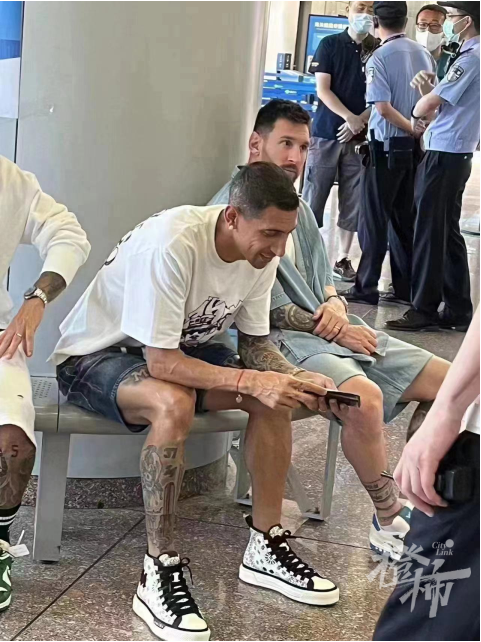
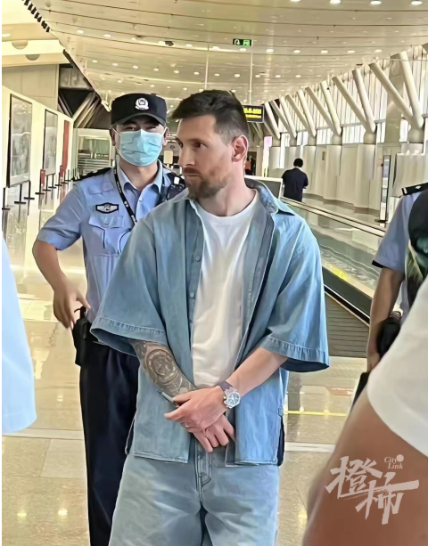
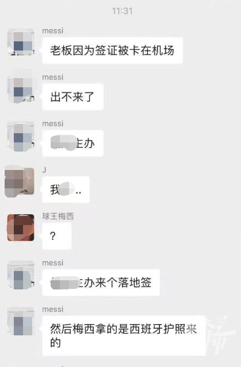
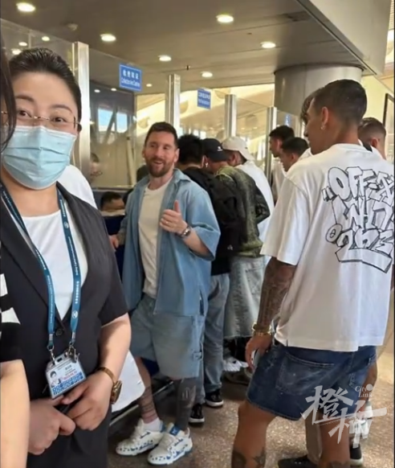
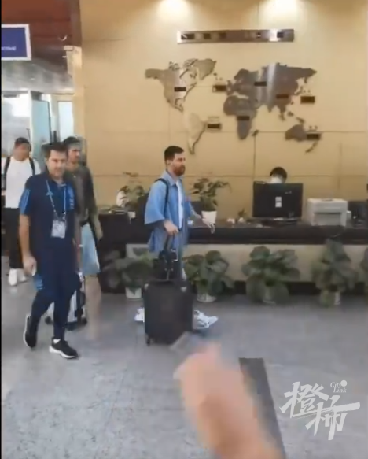
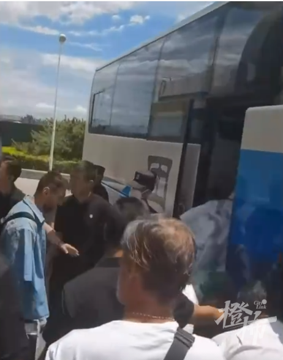
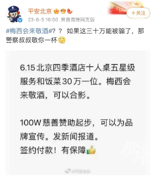

# 网传梅西抵京因签证被困机场：实为没带阿根廷护照，机场2小时解决

今天网上传出一则消息：球王梅西被困在北京机场了！

这可把球迷急坏了。

按计划，梅西今天上午乘坐私人飞机到达北京，和他一起来的有他的“保镖”德保罗以及大家熟知的球星迪玛利亚、恩佐和帕雷德斯。

因为梅西是有双重国籍的，同时持有阿根廷护照和西班牙护照。

根据修订后的《中华人民共和国政府和阿根廷共和国政府关于便利双方旅游人员签证协定》及《中华人民共和国政府和阿根廷共和国政府关于便利商务人员签证手续的协议》，中阿两国自2017年6月15日起为符合条件的两国公民办理十年有效、多次入境的旅游和商务签证。
截至目前，中国与152个国家缔结互免签证协定。中国公民持所适用的护照前往这些国家短期旅行通常无需事先申请签证。

但这次来的时候，可能因为没沟通清楚，梅西没带阿根廷护照，带的是西班牙护照。

好在经过紧急办理，大概过了两个小时左右，梅西的加急签证办好了。梅西还给北京机场边检的工作点赞，办好手续，梅西走出机场坐上大巴，等着的球迷喊着：梅西梅西！

这也是梅西的个人第七次访华之旅。

此前他的6次中国行中，有2008年北京奥运会足球决赛，那会，梅西才21岁，帮助阿根廷男足拿下奥运金牌。

到这次中国之行，梅西已经是手握大力神杯的球王。

6月15日，他将在北京工体率领阿根廷队对阵澳大利亚队，这也是双方在卡塔尔世界杯1/8决赛后的再度交手。

此外，梅西来中国之前，消息已经在球迷之间传开了。

骗子也来凑热闹了，竟说自己有门路可以和梅西合影，“30万一位，梅西可以来敬酒和合影。”

6月5日，北京市公安局官方微博“平安北京”特别发出提醒：“如果这三十万能被骗了，那警察叔叔敬你一杯！”

阿根廷中国行主办方也辟谣道，近日发现部分网络平台、个人网络用户在各大互联网平台发布：

“直播带货”“足球明星见面会”“可与梅西合影”“可与参赛球员同桌吃饭”“可与世界足球明星合影”“与足球队面对面沟通”“球衣签名”“与足球明星共进晚餐”等内容，并收取高额费用。

“提醒大家，本次赛事主办方并未安排阿根廷球员梅西及参赛两队其他球员参加任何公益或商业活动。上述网络平台上发布的信息均与主办方无关。希望大家仔细甄别，谨防上当受骗。”

