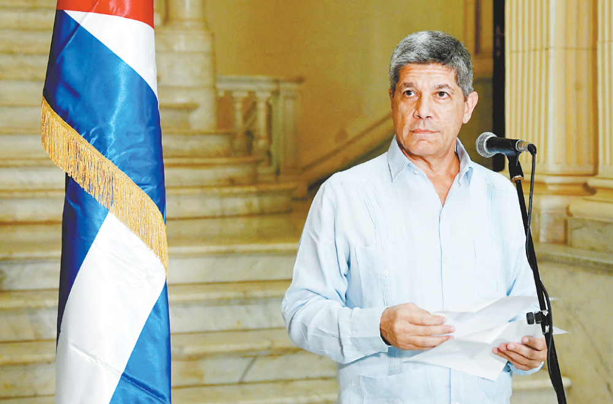

# 美媒造谣“中国在古巴建监听站”，古巴驳斥、白宫否认、中国回应！

【环球时报驻美国特约记者 郑可 环球时报记者 赵觉珵 刘欣 唐亚 环球时报特约记者 青木
柳直】美国媒体又通过传播虚假新闻向中国“泼脏水”了。当地时间8日，美国《华尔街日报》刊发“独家报道”，声称中国与古巴已达成“秘密协议”，将在距美国仅160公里的古巴基地建设所谓“监听设施”。这一消息很快被白宫以及古巴副外长德科西奥辟谣。路透社称，就连美国政府也对相关报道持“强烈怀疑”的态度。值得注意的是，上述假新闻的发布正值美国频繁放风，称国务卿布林肯将在近期访华之际。9日接受《环球时报》记者采访的国际问题专家认为，炒作所谓古巴“监听设施”反映出美国始终将拉美地区视为自身“后院”的霸权思维。相关虚假消息在此时发布，很难不让人认为，美国国内一些势力试图利用各种方式和借口，阻止已陷入紧张的中美关系出现转圜。

**古巴驳斥，白宫否认，中国回应**

《华尔街日报》8日煞有介事地说，有美国官员透露，中国和古巴已达成一项“秘密协议”，中方将在距离美国佛罗里达州160公里处的古巴某地设立“监听设施”，“可能使中国军队有能力监听美国南部广大地区的通信。”该报声称，“有关设施将使中国在一个具有经济和地缘政治重要性的地区获得立足点，在与华盛顿方面争夺影响力的过程中扩大交锋领域”。

这一报道发表后，迅速被美国多家媒体转载。美国有线电视新闻网（CNN）也宣称从两名熟悉情报机构的人士处确认了上述消息。一些日常持反华立场的政客闻风而动。美国国会参议院情报委员会主席马克·华纳和副主席卢比奥发声明称，他们对此“深感不安”，敦促拜登政府“采取措施，防止这种对美国国家安全和主权的严重威胁”。

_针对美国媒体编造中国在古巴建监听设施，当地时间8日，古巴副外长德科西奥在哈瓦那举行的新闻发布会上发表讲话，表示该报道“纯属虚构，毫无依据”。（新华视觉）_

不过，8日晚些时候，古巴和美国白宫均对上述消息予以否认。古巴外交部副部长德科西奥驳斥道，“所有这些信息纯属虚构，毫无依据，其意图是为对古巴封锁、动荡和侵略的空前强化寻找借口，并试图蒙骗美国和世界舆论”。白宫国家安全委员会战略沟通协调员约翰·柯比否认称，相关消息不准确，但说美政府正在密切关注此事。五角大楼发言人莱德也称，有关报道不准确。

中国外交部发言人汪文斌9日就相关问询表示，众所周知，造谣污蔑是美国的惯用伎俩，肆意干涉他国内政是美国的专利。美国还是全球最强“黑客帝国”、名副其实的“监听大国”。美国应该反躬自省，多做改善美古关系、有利于地区和平稳定的事，而不是相反。

**对于美国的恶意指控，已司空见惯**

所谓“中国要在古巴建设监听设施”的假消息能在美国引发如此大的关注，与美国始终将拉美地区视为自家“后院”的霸权思维有着直接关系。《环球时报》记者注意到，《华尔街日报》在其报道中毫不避讳地声称，“拉美地区长期以来被美国视为势力范围”，所谓“监听设施”将对抗带到美国“家门口”。该报还将其炮制的虚假报道与1962年美苏冷战时的“古巴导弹危机”进行对比，并按照美国的逻辑称，一旦美国指责中国，那中国可能会争辩称，在古巴的监听基地是合理的，“因为美国也在靠近中国的地方从事军事和情报活动”。

北京外国语大学国际关系学院教授宋微9日对《环球时报》记者表示，“门罗主义”一直是美国外交的传统和重要支柱，其核心就是将拉美视为自己的后院和禁脔。两百多年来，美国不断干涉拉美国家的主权，给拉美造成巨大的政治和经济灾难，导致该地区至今都没有实现真正意义上的自主发展。

美国对拉美国家主权干涉的一个集中体现就是关塔那摩监狱。公开资料显示，1903年2月23日，美国强行租借古巴东南部战略要地关塔那摩湾的部分领土，并建起军事基地。1959年古巴革命胜利后，古巴政府一直反对关塔那摩美军基地的存在，拒绝接受美方租金，要求美军撤出。2002年，美军在关塔那摩军事基地内设立监狱，该监狱因虐囚而臭名昭著。

德科西奥8日在古巴外交部新闻发布会上提到，根据古巴签署的《宣布拉美和加勒比为和平区的公告》，古巴拒绝在领土范围内有任何外国军事存在，特别是在美国非法占领的关塔那摩湾领土上。他说，对于美国的恶意指控，他们已经司空见惯，并列举了此前美国驻哈瓦那大使馆官员声称“遭到攻击”以及美国宣称古巴在委内瑞拉有军事存在等事例。

**“他们好像总喜欢凭空捏造事实”**

《华尔街日报》捏造的虚假新闻，引起古巴民众广泛关注。有网民愤怒地表示：“这当然是个弥天大谎！古巴能从中获得什么？什么都没有！美国在世界各地有800多个军事基地，至少在古巴和叙利亚是非法的！其中许多基地还包围着俄罗斯和中国。这些伪君子的虚伪和傲慢已经不是人类可企及的。”还有网民称，为造成冲突局势并给袭击古巴制造借口，《华尔街日报》在做美国政府最擅长的事情——撒谎。更有人直言：“他们好像总喜欢凭空捏造事实。”

事实上，《华尔街日报》已经不是第一次炮制涉华假新闻了。上个月，中国政府欧亚事务特别代表李辉访问欧洲，与欧盟官员举行会谈，就政治解决乌克兰危机和中欧关系等问题交换意见。但《华尔街日报》无端声称，中方要求“允许俄罗斯占据它现在占领的乌克兰部分领土”。乌克兰外长库列巴很快就在社交媒体上对此进行辟谣。在新冠疫情期间，该报还曾炮制多篇将新冠病毒来源栽赃给中国的文章。

“这个媒体帝国，是中美宣传战中的先锋。”美国记者布兰肯希普去年在“今日俄罗斯”网站发表文章称，亿万富翁默多克的媒体帝国一直带头推动西方媒体的反华言论。他拥有包括《华尔街日报》在内的一长串掌握话语权的媒体，而这些媒体“针对北京的喊话清单”是冗长的，那些具有反华色彩的例行报道，“都是别有用心的”。

一些分析人士对《环球时报》记者表示，美媒反映的只是美国政治环境的冰山一角，包括《华尔街日报》在内的很多美国主流媒体都在间歇性、不负责任地炒作中美之间的不实消息，为自己支持的党派服务。美国国内的政治气氛就是谁反华谁得分，消息越刺激越好。

**“假新闻”暗含美种种算计**

近期，拜登政府曾多次表示有意恢复中美高层沟通。美媒还放风称，美国国务卿布林肯计划访华，欲寻求改善对华关系。美国“政治新闻网”8日援引知情人士的消息称，布林肯计划最早于下周访问北京。不过中美双方均未对此确认。

美方曾单方面宣布布林肯计划于今年2月访问中国，但此后因所谓“气球事件”推迟。此次美国媒体再度爆料布林肯可能访华，所谓“中国要在古巴建设监听设施”的假消息也随之出现，很难不令人怀疑美国政坛一些不希望美中关系缓和的势力在不断破坏两国关系重回正轨。宋微认为，美国国内的反华势力在中美高层刚刚进行一些具有建设性的接触后就放出这样的假新闻，暗含美国内部的种种算计，也说明中美关系的改善仍然面临很大挑战。

中国国际问题研究院发展中国家研究所所长王友明则对《环球时报》记者分析称，美媒释放的假新闻也可能是与白宫的“合作”，“一个唱红脸，一个唱白脸”。在布林肯可能访华的关键节点，美方希望占据道义制高点，以此对中方进行要挟。

接受《环球时报》记者采访的专家认为，无论布林肯是否访华，美国都应该停止“说一套做一套”的行为模式。一边向中国发出希望沟通的信号，一边又利用种种借口打压遏制中国，对中美关系是毫无益处的。

