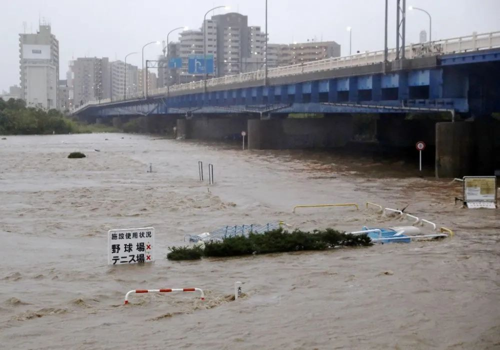

# 驻日美军基地疑“放毒”，东京一地区超半数居民血检异常

**日本东京多摩地区自来水水源疑遭美军基地污染，被检测出含有可能致癌的有机氟化合物(PFAS)。一个市民团体8日发布的调查结果显示，超过半数当地居民血液中有机氟化合物超标，健康受到威胁。**

日本媒体报道，2019年一项水质调查显示，东京多摩地区国分寺市一处净水设施检测出有机氟化合物，含量为日本国家标准的两倍多。2018年一项调查中，在位于美军横田基地东侧的立川市，一处井水检测出有机氟化合物，含量高达日本国家标准的27倍，祸首疑为美军基地使用的泡沫灭火剂。

_2019年10月12日，日本多摩川水位大幅上涨，河水浑浊。新华社/共同社_

京都大学环境卫生学副教授原田浩二说：“毫无疑问，横田基地是主要污染源。”他指出，如果长期大量饮用受污染的水，可能影响生殖健康和儿童生长发育，甚至引发乳腺癌、前列腺癌等疾病。

围绕多摩地区自来水污染问题，一个名为“曝光多摩地区有机氟化合物污染之会”的市民团体组织当地各市、町、村居民参加血液检测。这一团体8日说，参与调查的650人中，335人血液有机氟化合物超标，是日本全国平均值的大约2.4倍。

这一团体计划进一步检测多摩地区的井水和河水，同时要求日本中央政府和地方政府采取应对措施。

当地居民对自来水污染可能引发的健康问题感到担忧。一名血检结果异常的70多岁居民说：“污染越来越严重，自来水还能喝吗？子孙们一直喝这样的水，将来能安心保命吗？”

驻日美军基地此前多次被曝在冲绳等地“放毒”，涉嫌污染土地和地下水。不过，由于日方声称没有权限进入驻日美军基地调查，受污染地区周边居民只能忍气吞声。

