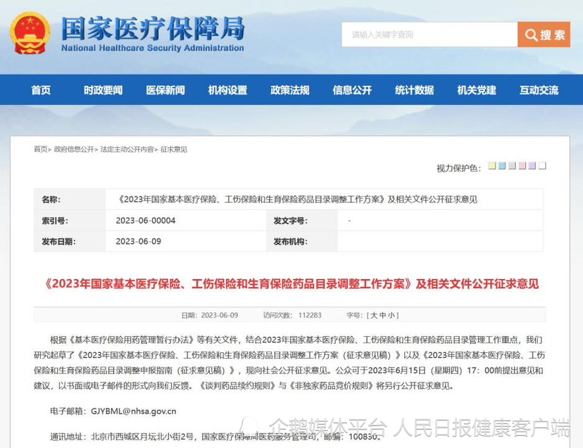

# 2023医保目录调整启动：专家呼吁应建立多层次医保体系

人民日报健康客户端记者 高瑞瑞

6月9日，国家医保局发布《2023年国家基本医疗保险、工伤保险和生育保险药品目录调整工作方案》http://www.nhsa.gov.cn/art/2023/6/9/art_113_10781.html。新版医保目录调整工作即将展开。

人民日报健康客户端发现，与往年相比，此次新文件的变动主要集中在《申报指南》。例如，在目录内西药和中成药申报范围方面，《申报指南》新增2023年12月31日协议到期，适应症或功能主治未发生重大变化，因适应症或功能主治与医保支付范围不一致，主动申请调整支付范围的谈判药品。

**企业7月开始申报，预计11月发布新版目录**

2023年国家药品目录调整分为准备、申报、专家评审、谈判、公布结果5个阶段。“今年的医保目录调整，实际上在延续过去每年度常态化动态调整的机制，但是今年目录在很多方面都存在一些优化的情况，例如适应症、拟纳入药品目录的非独家药品，采用竞价等方式同步确定医保支付标准，并且取消过去医保支付很多的规则。”中国政法大学政治与公共管理学院副教授廖藏宜告诉人民日报健康客户端记者，在这种情况下，药品要想进入国家医保目录，就需要拿出更加全面科学准入标准。

记者发现，按照国家医保局公布的工作计划，继2023医保目录调整工作方案、调整指南征求意见稿发布后，将继续修订完善谈判药品续约等规则。企业申报、形式审查以及对通过形式审查药品的公示公告将在7月-8月进行。

随后在8月-9月进入专家评审阶段，与去年的计划相比，国家医保局将今年计划中的谈判/竞价阶段延长为9月-11月，期间将开展测算评估、沟通交流以及现场谈判/竞价，最后组织谈判成功和简易续约的企业签署协议。药品目录调整结果、新版药品目录预计将在今年11月公布。

**罕见病用药应建立多层次医保体系**

根据《申报指南》，儿童用药、罕见病治疗药品方面，2023年6月30日前经国家药监部门批准上市，纳入卫生健康委等部门第一至三批鼓励研发申报儿童药品清单，以及第一、二批鼓励仿制药品目录的药品，还有说明书适应症或功能主治中包含有卫生健康委《第一批罕见病目录》所收录罕见病的药品均可纳入申报范围。

而2022年国家医保谈判中，抗癌药、罕见病药是当年度的谈判重点，有6款PD-1抗肿瘤药、19款罕见病用药参与谈判。其中SMA口服药物利司扑兰口服溶液用散在形式审查结果名单中。首款巨大淋巴结病治疗药物司妥昔单抗、防遗传性血管性水肿的拉那利尤单抗注射液等罕见病高值药也均在其中。

“罕见病用药的续保是大家重点关注的方面。一些罕见病的药品可能面临退市风险，没法续保，后续需要建设起多层次的医疗保障制度体系。”廖藏宜建议，针对一些被调出国家医保目录的罕见病用药，建议医保局应该在今年的“惠民保”以及医疗救助体系内予以兜底保障。

“我们现在不要把所有解决患者用药负担的关注点，全部寄托在基本医保基金报销，对于一些没有纳入进来，又对于患者来说具有很好疗效的创新性药品，可以通过建立多层次医疗保障制度体系来予以解决。”廖藏宜说。

