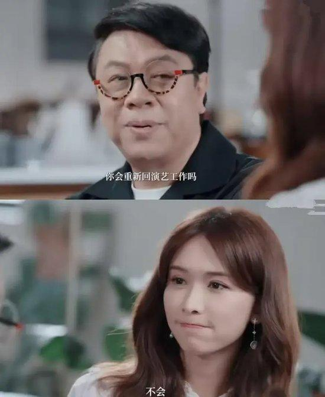
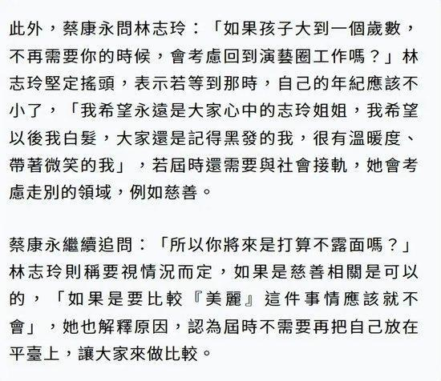
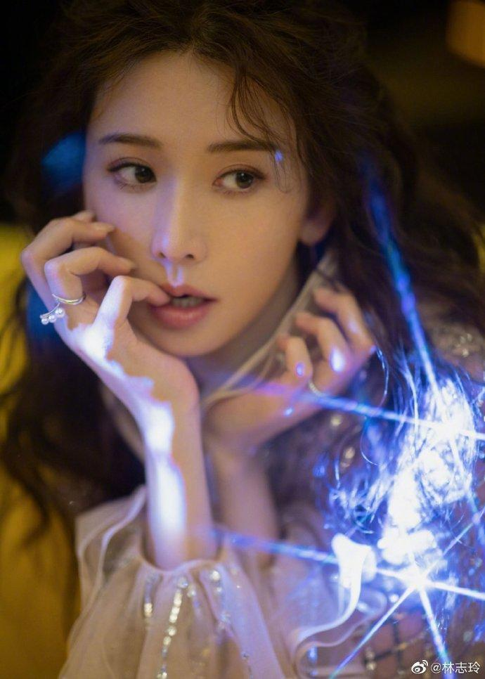
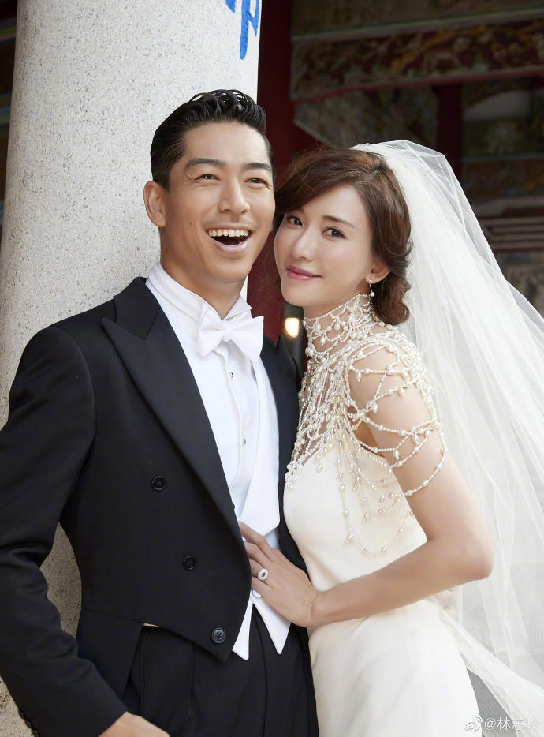

# 48岁林志玲谈退出演艺圈：希望大家记得黑发的我

近日，48岁的林志玲做客蔡康永的访谈节目《众声》，谈及了退出演艺圈一事，引发网友热议！

在节目中蔡康永问林志玲“如果孩子长大了，会考虑回演艺圈？”，林志玲摇头表示“不会”，面对吃惊的蔡康永，林志玲解释道，等小孩长大自己年龄也大了，“我希望以后我白发，大家记得还是黑发的我，很有温度、带着微笑的我。”

蔡康永继续追问：“所以你将来是真的打算不露面吗？”，林志玲称要视情况而定：“如果是慈善相关的可以”！

林志玲1974年11月29日出生于台湾省台北市，华语影视女演员、模特、主持人。2000年，林志玲签约模特公司开始职业模特生涯。

2007年，出演银幕处女作《赤壁》在片中饰演了温柔贤淑且坚强勇敢的小乔，正式进军影视领域，并凭借该片获得了第28届香港电影金像奖最佳新演员提名。后出演了《刺陵》《决战刹马镇》《101次求婚》等影视剧。

2011年，林志玲与日本艺人AKIRA因合作舞台剧相识。2018年底，二人开始交往。2019年，林志玲发文宣布与AKIRA结婚，同年举办了婚礼。2022年，林志玲发动态宣布产子当妈的喜讯。

（综合来源：红星新闻、新浪娱乐、@林志玲）

编辑：吴思

责编：廖异

审核：冯飞

