# “差点淹死！全程靠自救，根本没人管”湖南一景区漂流船倾翻多人受伤

今天， **众多游客在景区玩漂流翻船** 的消息引发关注和热议！

事故发生后，有游客在视频发视频称“沩山漂流千万慎重考虑，景区管理不当，突发情况，景区没有工作人员及时应对。最近想来的，一定慎重考虑……”

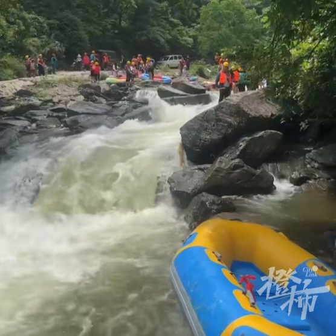

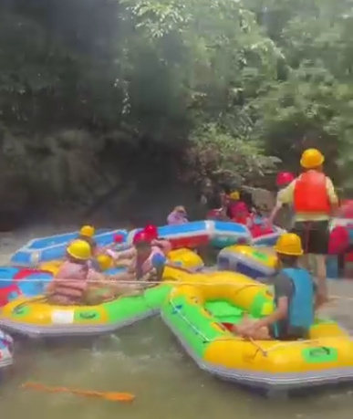

视频显示：有多条船只在漂流项目中被激流冲下，拥堵在水流里， **多名游客落水。**

**其中一只船把游客卷入船底，拖着人漂向下游。**

看到情况危急，一戴头盔的男游客沿岸边追赶船只后跳水，从船底拉出被困的女游客。

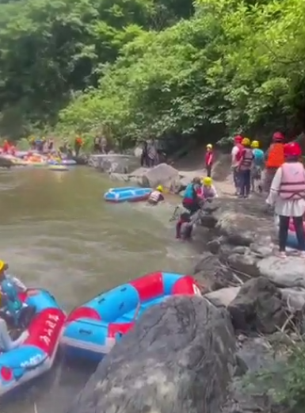

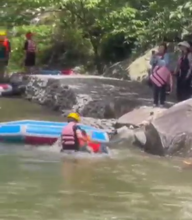

因为水流湍急，很多游客在两岸滞留观望。

另一个视频显示， **多名伤者在医务室就诊，有的女游客腿部流血，还有女游客手腕打绷带。不少游客的手臂和腿部受伤。**

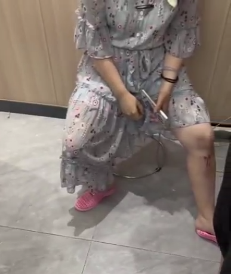

**橙柿互动了解到，事件发生地为湖南长沙宁乡县的沩山漂流。**

游客之一的周先生介绍，“昨天下午两点左右，我们是第一批漂流的。”

“可能是景区把水流开的太大，很多船拥挤在一个窄口位置，导致大家都翻船了。”

“ **我们两个人翻船后，直接从上面冲下来，景区没一个人拉我们，太危险了。** ”

“我们被困在一边的岸上，不知道怎么过去到对岸，景区也没人应对突发情况。”

“ **翻船落水的游客，都是其他游客出手救的，那些戴头盔救人的都是游客。** 昨天受伤的人蛮多。”

“后来很多人评论说，这里景区管理不当，经常有翻船事故。”

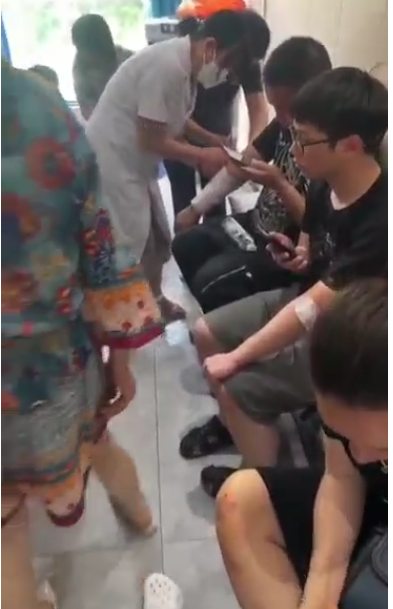

一名落水女游客回忆当时翻船的过程——

“ **意外来得太突然！船一下子进水翻了** ，老公反应快，把小的立马丢上去。”

“我就惨了，被水冲下来，不知道撞了多少下。”

“又不会游泳，被激流往两边石头上不停撞，下坡后，直接被水摁到底，又提上来。又被带到平缓处。”

“幸亏脑袋还算清醒，路过一个船，立马蹬过去。手肘、小腿磕肿了一大块。”

“老公和他朋友说，一路走过来，都救了3个。有个女的因为瘦，翻船之后，救生衣往上浮，人往下走。他路过立马把人拎起来，脸都是惨白一片。”

“安全员就站在我们船边，也束手无策。”

“给景区提点意见：安全员必须要培训，放船的节奏、卡船处理、高风险弯道、信息传递等，这些都很重要。”

还有一名游客谈翻船遭遇，“ **我也是受伤者，冲了一百多米，翻船我差点淹死在船底，那几秒感受到死亡，一片漆黑，我想把我儿子推出去……漂流我再也不去了。**
”

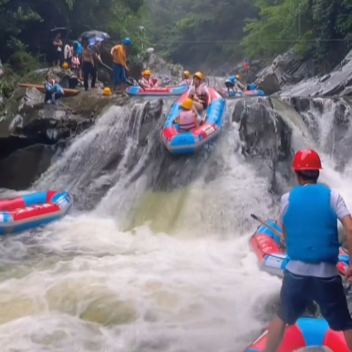

公开资料显示：沩山位于长沙最西部，距宁乡城区75公里、长沙市区95公里。这里拥有独特的高山小盆地，平均海拔为700多米，常年云遮雾绕。

**沩山漂流位于宁乡市沩山乡祖塔，据组织方介绍：漂流河道总长约5.6公里，落差200米左右，属于大落差强刺激的双人自助漂流。**

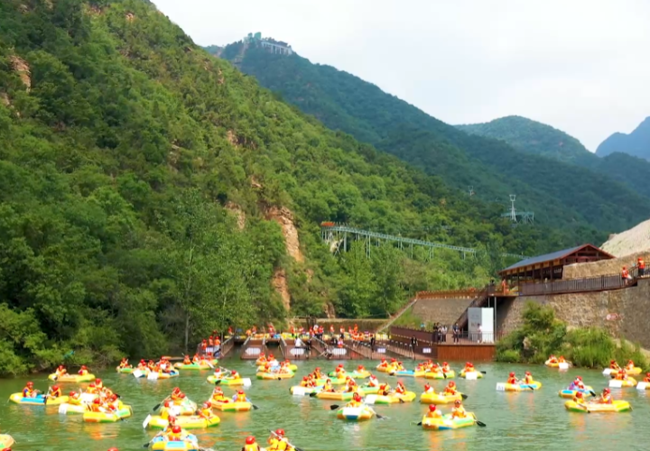

橙柿互动注意到，组织方曾在多个视频账号和自媒体推广漂流活动。

有多个网红现身说法，号称该漂流项目耗费8000万巨资打造，九个急弯64个滑道，落差近200米。

**“但是你不用担心，岸上随时有安全（员）保护你的安全。”**

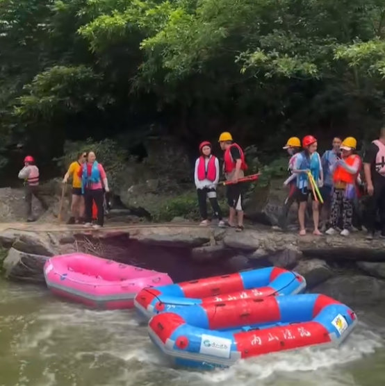

2022年，在当地媒体采访时，沩山乡政府相关负责人介绍：当年沩山避暑游客人次预计突破25万人次，带来直接经济收入突破5000万元。

**今天中午，景区的工作人员回复橙柿互动说，“目前漂流还正常营业。昨天是第一天开业，水流没控制好，目前沿河道有60多个护航人员。”**

工作人员还介绍，昨天景区这事情一直处理到12点，目前比较刺激的地方，都有工作人员。景区也有医务室，游客擦伤后会处理，严重的话会送医院。

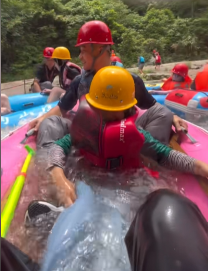

对于景区的回复，有游客表示质疑，“ **有工作人员？昨天我和朋友落水，全程靠自救，要不是同事找人帮忙，根本没人管我们。** ”

**橙柿互动留意到，去年8月，有当地人士在网上公开呼吁，强烈要求永久关停宁乡沩山峡谷漂流——**

长沙宁乡沩山乡祖塔村的峡谷漂流项目，此漂流就是被关停了十来年的原沩山漂流，漂流地段属于地质灾害点。

2017年7月1日16时左右，因受连日来持续强降雨影响，宁乡市沩山乡祖塔村（原双龙潭村）王家湾组突发泥石流，灾害导致9死27伤，还冲倒了31间民房。

由于沩山地势高，河里的水都是镇上排出的生活污水，水质不卫生根本不适合漂流用，上游河里的石头都变黑色了，对漂流游客的健康极为不利。

另外当地老百姓反映：河道内新砌的建筑物影响防洪，担心会再次引起地质灾害。由此表明，该地段根本不适宜开发漂流项目。

**招商引资搞活地方经济本是好事一桩，但这个项目对于当地老百姓而言百害而无一利，尤其是污染水源（下游就是宁乡重要的饮用水源黄材水库），和存在重大安全隐患两大硬伤。**

**致使这个项目注定不会受到当地群众的欢迎，干旱时候缺水，就跟老百姓争抗旱用水。**

**吁请坚决取缔永久关停峡谷漂流项目……**

**橙柿互动注意到，昨天，还有一家景区的漂流项目也因翻船引发公众关注。**

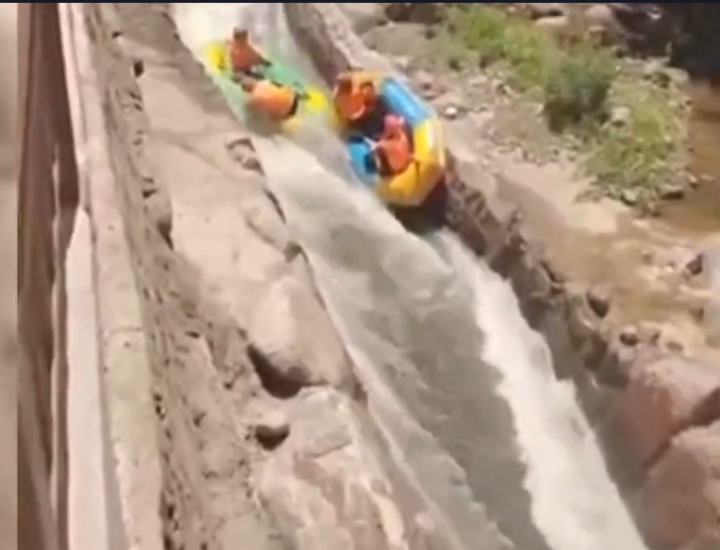

三门峡一景区游客在漂流时，被卡在漂流赛道，撞上前方的漂流船后，双双落水。

该漂流项目位于河南三门峡仰韶仙门山旅游景区。漂流船上的游客落水后，漂流船倒扣在两人头上。

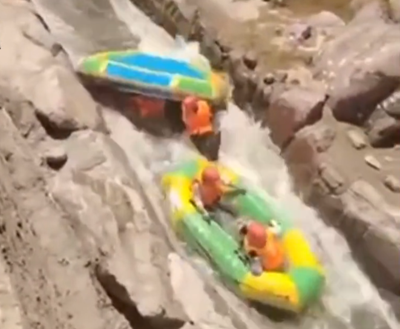

**今天中午，景区的工作人员回复橙柿互动称，昨天是有这个事情，可能比较狭窄，水流急，游客自身体重太轻。**

“不过我们都为游客购买了意外受伤保险。事发后，安全人员马上跳河，帮助游客把船只扶正，确定游客身体无碍才继续漂流……”

橙柿互动·都市快报 记者 程潇龙

