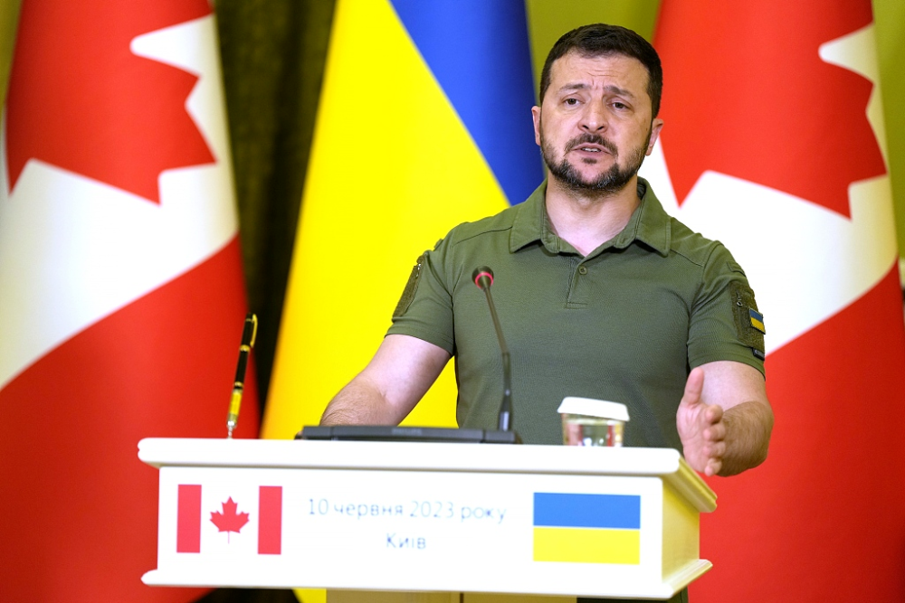

# 乌军发起大反攻，评论员：泽连斯基赌得有点大

**直新闻：乌克兰总统泽连斯基亲口向来访的加拿大总理特鲁多承认，乌军正针对俄军发起反攻行动。那么结合这几天的战局来看，乌军这一轮反攻的规模有多大，目标是什么，效果又如何呢？**

**特约评论员 吴蔚：**
“传说中”的大反攻终于上演。此前我曾作出判断，就以目前的战场态势而言，俄乌双方其实都在积极准备，等待对方发起进攻，因为防守方的优势往往更大一些。

那么为何是乌军率先发起了反攻呢？我想，政治的因素要远高于军事因素。去年底至今年初，美西方加码“投喂”乌克兰一批先进的地面装备，尤其是上百辆主战坦克与数百辆步战车。小半年过去了，接装部队基本形成战斗力，那就得在战场上把牌打出去呀，不然这些西方金主们会觉得基辅当局“不思进取”。

从俄乌战线的宏观上看，目前乌军大致处于一个“北守南攻”的态势。乌军此次所谓的“大反攻”主要发生在南部战线扎波罗热至顿涅茨克州，西起卡缅斯克，东至弗勒达尔，战场宽度大约150公里左右。自5月底乌军开始火力准备，6月初地面兵力开始形成进攻矛头。

研判一场攻势作战，我们首先要判明三个要素：战役决心、主攻方向、实施方案。

先说战役决心。根据开源情报显示，这是一场集团军级的攻势。乌军投入了两个军将近20个旅级单位的兵力，其中不乏装备德制“豹2”主战坦克以及美制“布雷德利”战车的精锐机械化步兵，他们过去小半年一直在波兰境内接受北约教官的训练。他们的参战也意味着乌军确实下了血本，展现出较高的战役决心。

再说主攻方向。以目前进攻矛头的指向来看，乌军应该是计划针对俄军占据的沃斯里夫卡、托克马克、波罗伊三个主要城镇发起进攻，依然是旨在抢夺交通要道进而向纵深发展的典型“通道作战”方式。若第一阶段进攻目标成功实现，乌军下一阶段便可以向梅利托波尔、别尔江斯克两座城市发展。如此一来，乌军将有可能一举实现将俄军战线“一刀两断”的重大战役成果，这意味着驻守在赫尔松与克里米亚半岛上的俄军将陷入补给困难的境地。

最后再看实施方案。在5月底的火力准备阶段，乌军投入了大量北约制式的精确制导武器，对扎波罗热纵深的俄军指挥、防空节点进行打击，这其实已经在很大程度上暴露了进攻意图。在6月初的地面进攻阶段，乌军多个机械化步兵旅以营级战术群、连级战斗分队的方式对俄军阵地发起进攻。这一阶段进攻的目标主要是探摸俄军防线火力点与薄弱点，探明俄军雷场布控情况，并以远程火力打击的方式摧毁俄军向前沿阵地运动的增援力量。但从6月初这几天的情况来看，乌军的攻势展开情况并不顺利。由于缺乏足够的工兵技术装备，以及严重缺乏前线战场制空权，乌军的装甲力量被迫以纵队行进未能有效展开，进而暴露在俄军炮兵与武装直升机的火力之下。

当然，对于一场集团军级的攻势作战而言，头几天的顺利与否并不绝对影响战役的成败。在美西方优势的战场监视体系支持下，乌军应该还是能够及时找到俄军战线的薄弱之处，进而向纵深实施突破。眼下战事正酣，我认为有两个悬念值得关注。

第一，乌军在先期进攻受挫的情况下是否能够及时作出战术调整，针对俄军暴露出的弱点抓住机会接续进攻。第二，俄军在成功迟滞乌军进攻矛头的情况下能否及时调动战役级火力突击，对乌军已经暴露的前线集结点进行外科手术式打击，将尚未发起冲击的乌军接续兵力摧毁在出发阵地上。

这两个悬念的揭晓方式将直接决定这场大反攻的未来走势。

**直新闻：另一方面，随着反攻的实施，乌军装备的北约制式装备诸如“豹2”主战坦克、“布雷德利”步兵战车被俄军摧毁的画面也随之出现。吴先生，这是否也是美西方主力装备“神话破灭”的时刻？**

**特约评论员 吴蔚：** 这几天在社交媒体上传播最广的俄乌战场画面当然是一辆“豹2
A6”被击伤，乌军先后动用数辆“布雷德利”战车前往救援却一个接着一个搭进去的“葫芦娃救爷爷”场景。应该说这确实是西方主战装备“神话破灭”的祛魅时刻，“豹2”的生产商德国莱茵金属公司股票甚至一度“大跳水”。

但我必须指出的是，人类文明的战争史告诉我们：没有天下无敌的武器装备，关键还是要看人的作用。一款先进的武器装备，必须由娴熟的战士去驾驶操控，在战术运用得当的情况下才能发挥其理论效能。在俄乌冲突爆发前，土耳其的“豹2
A4”、沙特的M1A2S也已经在不同的局部冲突里“丢过脸”，美西方武器装备的“神话”老早就破灭了。

具体谈谈此次出师未捷身先死的“豹2
A6”，它隶属于乌军精锐的第47独立机械化旅，在此次反攻行动中主要担负卡缅斯克至库班一线的正面突破任务。在当天的战斗中，这辆“豹2
A6”率领数辆“布雷德利”战车掩护一辆BMR-2扫雷车沿野战公路推进。进入俄军布设的雷区后，BMR触雷瘫痪，“豹2
A6”超车前出掩护不幸再次触雷瘫痪，然后就是一场“葫芦娃救爷爷”式的添油作战。最终，在俄军炮火的打击下，乌军在这条公路上损失了两位数的装甲单位。

这一幕在扎波罗热战场正面多次发生，乌军的精锐装甲力量其实大多没有抵达俄军阵地，就已经被摧毁。这是俄军依托阵地构筑与信火打击成功迟滞了乌军的进攻矛头，要知道，俄军在扎波罗热这一线已经持续经营了将近一年时间，用行话来说：炮兵闭着眼睛都能把炮弹打到精确的坐标上。这也充分暴露了乌军虽然装备了美西方的先进坦克与步战车，却缺乏足够的工程机械，比如扫雷车、破障车，导致机械化兵力无法迅速通过开阔地，进而沦为一个个靶子。现代战争，打的从来都是体系作战。

乌军的这场反攻仍在继续，眼下我们暂时无法预测这场战役的胜败。但我几乎可以肯定地说，泽连斯基应该很快又要展开新一轮外访行程，向美西方伸手要装备、要弹药。但问题就在于，谁家的钱也不是大风刮来的，如果乌军的反攻未能达到预期效果，那么这些往俄乌战场上添柴火的国家是否还会那么积极呢？

作者丨吴蔚，直新闻高级主笔，深圳卫视《直播港澳台》特约评论员

编辑丨刘立平，深圳卫视直新闻主编

排版丨董怡，深圳卫视直新闻编辑

