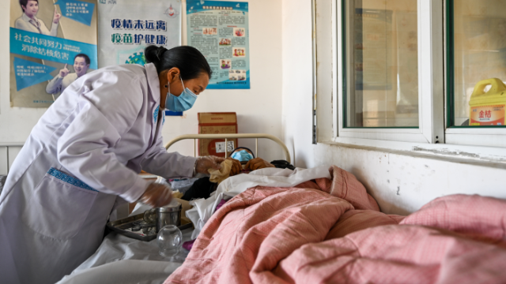
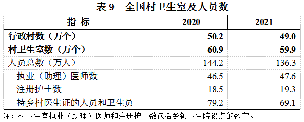

# 近三成村医超60岁，为何不退休？大部分人除300元养老补助没其他保障

村医吴华（化名）想好了，如果这个月“在村卫生室看门诊不能使用医保报销”的问题还不能解决，他就要向县卫健部门“再催一催”。

吴华今年57岁，家在河南中南部某县。上世纪八十年代末，刚刚初中毕业的吴华接替了其姑父的工作，成为当时村医疗站的一名赤脚医生。迄今，吴华工作已满38年。眼看着三个孩子都考上大学，自己距离退休越来越近，他愈发焦虑村医的待遇和保障问题。

吴华所在的乡，大多数村卫生室至今还没有被纳入医保支付的定点名单，村民诊疗仍需自费。近年来，在交通便利后，“村民看病问药总爱往镇上跑”，这让吴华苦恼不已。

改变正在发生。6月1日，河南发布全国首个地方性的健康促进条例。其中明确，对紧密型县域医共体实行医疗保险基金总额付费，强化总额预算管理，建立结余留用、合理超支分担的激励约束机制。

村卫生室是农村医疗的“最后一公里”，但近年来，乡村医生的工作重心正向基本公共卫生服务倾斜，诊疗能力则被忽视和削弱。“医保政策不支持，诊疗收入就没法提高。”吴华说。

陕西省山阳县卫健局原副局长徐毓才对记者表示，村卫生室基药的使用也与基药是否在医保目录内密切相关。未来如果继续把基本药物使用情况与村卫生室实施基本药物制度补助资金挂钩，村医将处于“两难境地”——不用基药影响补助，使用不在医保目录内的基药，医保不予支付。

今年以来，为了维护村医队伍的稳定，推进农村分级诊疗，中央和地方频频下发改善村医收入和保障机制、增进村医服务质量的文件，但多地村医、基层管理人员和医改专家告诉记者，由于处方和诊疗权没有完全下放、医保制度的报销规定还不健全，筹资支付的渠道、方式和能力整体有待优化，加之部分地区财政拨款落实不到位，目前，村医的生存和发展状况依然堪忧。

“农村的基层卫生服务发生在村卫生室，广大的村民，特别是弱势人群更容易获得，村医队伍的稳定性和服务水平的提升关乎卫生服务领域的公平性。目前，村医队伍后继无人，村医工作能力和服务质量等问题还很突出。”中国-
盖茨基金会农村基本卫生保健项目战略指导委员会成员、盖茨基金会高级项目官及高级政策顾问汪宏在接受第一财经采访时称。

怎么改变？汪宏表示，基层医疗卫生服务要有稳定的投入机制。通过进一步改革基层卫生服务的筹资和支付方式，因地制宜地探索医保资金购买基本医疗与公共卫生服务的可行方式，探索整合基本公共卫生服务基金和医保基金，建立整合型的按人头支付方式，实现“村民能承受、村医不亏本、医保不出险”的三方共赢的筹资与支付机制。

**公卫经费到付率不足**

“这三年，拿到一份钱，但要干两类活，操四份心。”吴华说。

“一份钱”是一般性医疗服务收入。“两份活”则是在前述一般性医疗服务基础上，加上政府基本公共卫生服务项目；此外，还需要顾及硬件设备的老化维修和每季度一次的基础公共卫生服务考核以及其他常规和突击检查，故而需要“操四份心”。

在正常年份，基本公共卫生服务补贴是村医收入的最主要来源。2022年，中央财政下达基本公共卫生服务补助资金685亿元，下达基本药物制度补助资金91亿元。但多地村医、县卫健体系人员告诉记者，长期以来，中央补助资金落实到地方层面，均存在被稀释的问题，乃至因资金滞留，导致村医的工资减少。

吴华算了笔账：村里2680多人，配有三名村医，2020、2021和2022年基本公共卫生服务经费人均财政补助标准分别为74元、79元和84元。按人头计算补贴，只要经费能够按时发放，加上基本药物补贴等其他补贴，村医每年每人可以拿到2万左右，如果再算上一般诊疗收入，“还能维持发展”。

但新冠疫情暴发后，更多地区财力吃紧，在基本公共卫生服务领域的资金拨付速度也因此趋缓，吴华遭遇的“基本公共卫生的补助标准提高了，但村医实际获得感减少”的现象，并非个例。

“在制度设计上，出于稳定村医队伍的需要，近五年来，国家政策正在不断加大对乡村医生在基本公共卫生资金分配上的倾斜，但激励效果仍取决于资金到付率情况。”河南宜阳县卫健委副主任刘跟党对记者表示。

刘跟党调研了解到，目前，确有一些县存在公卫补贴滞留、缓发的情况。“每年村医的公卫经费分季度按比例发放。依照规定，一季度一般需要发放75％。新冠疫情以来，县里如果能在年内完成公卫补贴发放计划，就很不容易了。”

汪宏提到，基本公共卫生服务是中央与地方共同财政事权。越是经济欠发达的地区，中央财政的占比越大。但也正是因为地方对中央转移支付的依赖，在财力吃紧、地方管理效率较低的情况下，村医保障就成了问题。

现行基本公共卫生服务支出责任实行中央分档分担，五档中有三档中央分担比例达到或超过五成。其中，甘肃、广西、贵州等12个省（自治区、直辖市），中央分担80%；河北、河南、安徽等10个省，中央分担60%；辽宁、福建、山东3个省，中央分担50%。

甘肃省卫健委2019年公布的《关于2018年度国家基本公共卫生服务项目绩效评价情况的通报》显示，一些县区资金拨付进度缓慢，资金到位率低。有的地区截至当年4月份仍有超900万元未下拨，近150万元没有下达计划。多地拨付村卫生室的补助仅为预算资金的8％～30％。其中，天水市秦州区、甘谷县抽查机构截至2018年12月31日，人均到位资金最高的只有41.54元。

对于前述问题背后的原因，甘肃省卫健委揭示了三点：其一，受绩效评价时间、结果应用等因素影响；其二，部分地区村医基本公共卫生服务能力较低，将服务数量与资金拨付挂钩后，村医承担基本公共卫生服务项目任务量不足；其三，部分县区财务制度执行管理不严格，存在不合规支出现象，将基本公共卫生服务项目资金拨付至专业机构、县级医院等非基层医疗卫生机构使用。

与此同时，2017年，中央出台文件规定40%左右的基本公共卫生服务任务交由村卫生室承担。截至目前，河南、贵州等省份已经将村卫生室承担的服务比例提高到了50%。

村医的公卫补助是多劳多得，村医任务量提高，意味着补贴配置比例也相应增加。但覆盖人群减少，可能会稀释村医的获益。过去几年，随着城镇化和人口流动增加，加之“机构全覆盖”的刚性要求，一些村医“按人头”拿到的政府补助总额因服务人口总量较少或减少而下降。

“村里人口不足500，半做村医半干农活养家。”北方某村村医表示。

**“老的退不出，新的留不住”**

根据汪宏观察，目前，村医队伍不稳定背后，与中国基层卫生服务的筹资和支付体制不完善相关，后者又可具体分为三点：

第一，基层卫生服务的资金是不足的，让保障机制难以落地；第二，资金费用虽然分配到基层卫生服务，但是公平性存在一定的问题；第三，激励和约束机制的不协调，资金的激励机制和资金的碎片化较为严重，激励机制有时候甚至出现扭曲，导致在乡村两级基层医疗卫生服务体系中，资金和资源配置可能构成竞争而非合作关系，影响村民在基层获得高质量的医疗卫生服务。

河北村医老李对“约束多，激励少”也深有体悟。“每季度一次的公卫考核，如果不合格，公卫补贴中的绩效部分会受到影响。此外，还有一些抽检。检查的部门也不一定相同，但内容往往有重叠。对于我们在检查中反映的如维护经费没到位等问题，迟迟没有反馈。”

近年来，多省份针对农村疾病谱系变化和更高层次的防治需求，额外增加了新的公共卫生服务项目，并细化了对村医的考核内容，从机制上保障村医待遇水平的提高。

比如，根据福建省财政厅和卫健委在去年年底联合发布的《福建省基本公共卫生服务补助资金管理办法》，该省“基本公共卫生服务项目”在原12大类基本公共卫生服务内容基础上，新增“老年健康与医养结合”等8项其他基本公共卫生服务内容。

该办法明确，对于“其他基本公共卫生服务”，省级财政在统筹中央资金的基础上，根据各地具体项目工作任务量、补助标准和绩效因素等安排补助资金。某市县（省级项目实施单位）应拨付资金=某项基本公共卫生服务任务数×补助标准，同时综合考虑绩效评价因素确定。

但在相关项目落地过程中，村医“无酬服务”亦有可能发生。

吴华告诉记者，村卫生院需要按照服务签约名单，给高血压、糖尿病等常见病患者开展健康服务。但实际服务量多于补贴额中的“人头数”。这是因为，在当地，政府公卫拨款是通过有关部门“先确定‘盘子大小’，再按每村人口多少比例分配”。所以，他们村此前被分配到了120个服务名额，但村里实际患者人数明显更多。

除了激励机制，保障则是村医的另一关切。

刘跟党告诉记者，针对乡村医生因在“编制外”，而无法缴纳“五险一金”和养老保险金，没有晋升渠道等问题，近年来，“乡聘村用”成为农村地区的常见解决办法。然而，在实际招募中，村医往往被“卡在了条件上”。

刘跟党说，通常情况下，“乡聘村用”需要符合二道“门槛”，一是村医年龄规定在45岁以下；二是取得执业资格为执业（助理）医师。后者在地方岗位培训经费到位的背景下，可以通过上级医疗卫生机构组织培训加以解决，但前者与养老险缴费需缴满15年相关，是刚性约束。

《2022中国卫生健康统计年鉴》显示，2021年全国乡村医生中，年龄在45岁及以上的占比近八成。其中，45～54岁的占比34％，55～59岁的占比12.1％，60岁及以上占比28.8％。

仅年龄这一档，2021年仅约1/4的村医符合“乡聘村用”招聘要求。

老龄化的加深还与“老的退不出，新的留不住”现况有关。

一名长期关注基层医疗事业的医改专家告诉记者，多年以来，多地乡村医生流失率严重。但老一辈的乡村医生往往不在流失率指标的分子之中，养老机制的不完善制约他们的退出。

记者调研结果与之类似。截至目前，安徽、江西、河南、青海等省份对在村卫生室连续工作10年以上的乡村医生每人每月给予不低于300元的养老补助等。但安徽和河南多地“60后”村医告诉记者，尽管村医可以灵活就业人员身份参加职工基本养老保险，但实际参保者寥寥。大多数村医在退休后，除了300元的政府养老补助，没有其他保障，所以他们往往选择继续坚持。

而在中青年乡村医生流失的背后，前述医改专家认为，存在薪酬待遇、工作中“水土不服”等多方面因素。

截至2021年年底，全国平均每个村卫生室年诊疗量仅有2239人次，这意味着每天仅有6个患者就诊。

6月6日午间，在接受第一财经采访时，吴华已经半天没有遇到患者了。“现在是诊疗淡季。收入经常一天不过百。”

“如果村医月收入可以足额发到5000元，那么我们也可以劝说一些村医留下来发展了。”一名中部地区某村村支书对记者表示。

“水土不服”则是因为供需错配。前述医改专家解释说，一方面，该类人才自身职业发展、专科能力提升的需求或与实际不符；另一方面，在农村地区，村民对于“老医生”的信任程度更高，对于年轻医生和新技术的使用存在一定认知偏见。

安徽某医学专科院校预防医学专业副教授对记者表示，村卫生室问诊量不多，病人临床症状处理简单，这不符合医学生从校园走向工作岗位后，积累临床经验和增加专科能力的诉求。

为了增加村卫生室岗位对医学毕业生的吸引力，刘跟党所在县去年采取的办法是以县医共体的名义招聘，并明确基层人才的双向流动机制。“但岗位依然没招满，最终3名留下来了。”

定向培养是另一种增加村卫生室“新鲜血液”的办法，但记者了解到，较长的签约时间让一些原本有意愿回家乡发展的医学毕业生踌躇不定。

比如，根据5月中旬浙江省卫健委发布的《浙江省基层卫生人才定向培养管理办法（试行）（征求意见稿）》，定向培养人员完成住院医师规范化培训或助理全科规范化培训后，按照协议到基层医疗卫生机构服务不少于5年，规范化培训时间不计入服务年限；在服务期内，定向培养人员不得因个人原因，提出提前解除聘用合同的要求。

**如何破局**

近年来，刘跟党和他的同事一直在思考一个问题：村卫生室和村医减少或不足，是目前存在的客观事实，如何让农村基层群众还能保质保量地获得基本医疗卫生服务？

去年一项工作的进展让他们看到了希望。这项工作是通过打破行政县和乡镇两级医疗卫生服务资源配置的思路，将几个区位相邻，都因老村医退休后，逐渐无人接管而走向“死亡”的村卫生室进行合并，重新选址、扩建，形成占地100多平方米的“联合村卫生室”，划归乡卫生院管理。

此后，对于符合条件的村医，改由乡镇卫生院直接聘用，身份由个体转变为乡镇卫生院员额管理人员。这些“乡管村用”的村医还将和乡镇卫生院的医务人员一起，共同组建“家庭医生团队”。“家庭医生团队”中的乡镇卫生院医生需要定期下派到“联合村卫生室”，驻点开展工作。

据刘跟党介绍，这项工作是在“河南城乡居民健康签约服务试点”基础上推行的“地方性策略”。按照河南省的最新要求，签约医生团队向签约居民提供约定的基本医疗和公共卫生服务，收取签约服务经费等补助。该笔费用通过基本药物补助、签约服务付费和基本公共卫生服务经费等筹资渠道合并解决。每个签约对象的服务经费由乡村两级机构对半分配。如果足额发放，村医人均政府拨款（基本公共卫生服务补贴、基药补贴和签约服务经费）总额达56元。

“但要想前述要求从理论变成实际，有两个前提，一是推进村卫生室产权公有和实现医保在基层的广覆盖，二是保障乡、村两级人员在任务量与经费分配上的对等。”刘跟党说。

同省份的吴华也提到，将更多符合条件的村卫生室等纳入门诊统筹定点，并以此提升诊疗收入，是他们县村医目前最大的诉求。

6月1日，《河南省基本医疗卫生与健康促进条例》正式实施，其中明确，对紧密型县域医共体实行医疗保险基金总额付费，强化总额预算管理，建立结余留用、合理超支分担的激励约束机制。

6月6日，湖南省卫健委、医保局亦公开承诺，预计在今年8月底前，会实现将符合条件的村卫生室全部纳入医保定点范围。

除河南、湖南两省之外，今年以来，山东、江西、贵州等省份下辖地区也围绕拓展农村基层的医保门诊保障范围、便利医保结算条件等方面做出新部署。

贵州习水县提出，在推进“三医联动”改革中，优化调整村卫生室医保支付政策，取消网络费，新增一般诊查费补助2元、取消5%的质量保证金，门诊报销由原来的90%提高到95%，由医保基金对家庭医生签约补助3元。

在多地优化村卫生室医保支付政策的同时，国家相关顶层设计也已经出台。

今年2月，《关于进一步深化改革促进乡村医疗卫生体系健康发展的意见》（下称《意见》）发布。其中提到，要加大医保基金支持力度。对紧密型县域医共体实行医保基金总额付费。建立结余留用、合理超支分担机制。积极通过乡村一体化管理实现村卫生室医保结算，在有条件的地方支持将符合条件的村卫生室纳入医保定点管理。

汪宏表示，推进医保门诊统筹，合理提高医保基金对乡村医疗卫生机构的总额控制指标，并逐步提高县域内医保基金用于乡村医疗卫生机构的比例，这些将有利于医保资金更合理地配置和使用。

汪宏说，首先，通过诊疗下沉，基层首诊，有利于避免不必要的资源浪费，实现医保总额控制。其次，当医保留有结余后，基于家庭医生制度，可以通过对结余资金的二次分配，进一步提升乡、村两级医务人员绩效收入。最终，当这样的收入机制打通后，村医收入水平和服务的积极性能够得到显著提升，在村民对基层就诊产生依赖和信任后，基层的医疗服务体量也会得到保障。

“难点在于村医处方受限多，可以使用的药品太少。”徐毓才对第一财经表示，即便村卫生室被纳入医保定点机构，医疗服务范围没有得到延伸和扩充，村医收入实际提升空间也很有限，并将制约村医临床能力的提升和村医的职业吸引力。“放权是破题的关键。”

根据《处方管理办法》的规定，只有经注册的执业医师，才能在执业地点取得相应的处方权。但截至2021年，我国村卫生室执业（助理）医师共475824人，占人员总数的三成左右。上述《意见》也提到，要探索在乡村医疗卫生机构赋予公共卫生医师处方权。

