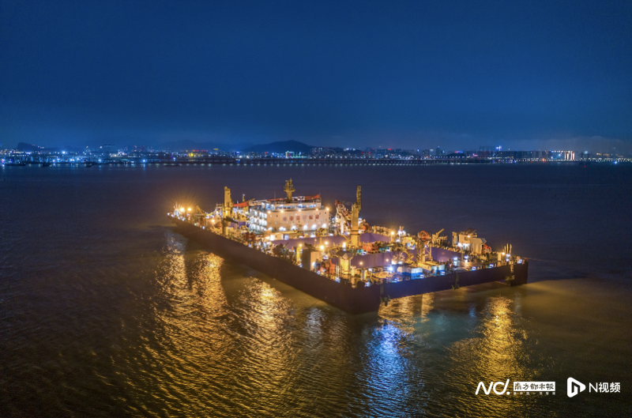
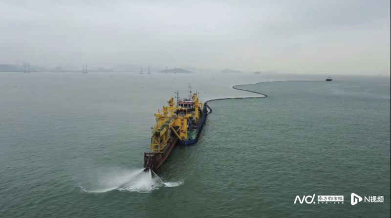
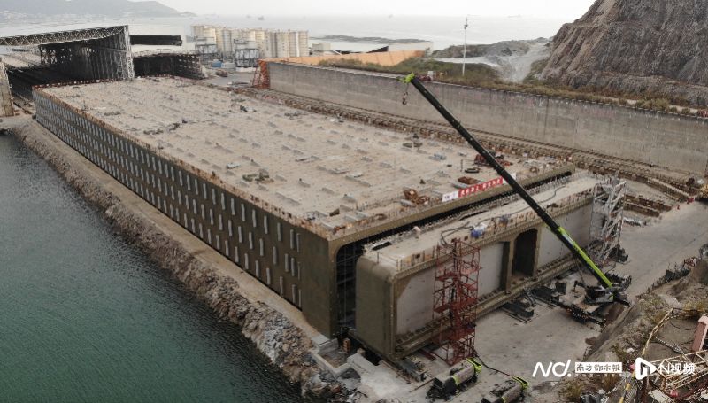
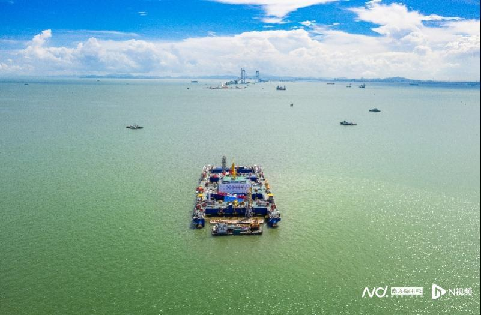

# 历时5年，深中通道海底隧道实现合龙

南都讯
6月11日8时，广东交通集团发布消息，世界最长最宽钢壳混凝土沉管隧道——深中通道海底隧道最终接头顺利推出，贯通测量结果表明，实现了与东侧E24管节精准对接。距离2018年4月海底隧道沉管钢壳试验段开工，整整5年后，这座“海底长城”终于合龙，深圳和中山两市在伶仃洋海底实现“牵手”。

深中通道是国家高速公路网G2518跨珠江口的重要组成部分，也是粤港澳大湾区核心交通枢纽工程，全长24公里，集“桥、岛、隧、水下互通”于一体。其中，海底隧道长约6.8公里，包含沉管段约5公里，由32个管节及1个最终接头组成。此前，深中通道海底隧道已由东西两侧往中间依次沉放对接了31个管节。6月8日开始最后一个管节（E23）及最终接头的整体浮运安装，至今日完成最终接头推出对接，共用时近70个小时，一举实现关键控制性工程突破，为深中通道冲刺2024年通车目标迈出重要一步。

深中通道沉管隧道最终接头正进行水下对接。

**海底绣花：高质量打造舒适基床**

据了解，海底沉管隧道工程共分为三大关键技术：基础处理、管节浮运安装及接头处理。其中，基础处理包括基槽开挖、软基处理及基床整平。基础处理的要求极高，海底20-40米深处基槽开挖精度、碎石整平精度均要求达到亚米级，堪称“海底绣花”。深中通道项目创新海相深厚淤泥层“大直径深层水泥搅拌桩+块石振密”复合地基处理新技术，软土地基沉降控制在48毫米以内，达到国际领先水平。

隧道基槽开挖是沉管管节安装的第一道工序。负责沉管隧道基槽开挖的中交广航局深中通道项目部常务副经理杨景鹏告诉记者，自2019年起至今，共完成了3500万立方米的疏浚作业，完成了约26.5万立方米的海底礁石破除。挖出来的泥沙，可以装满14000个国际标准游泳池。深中通道海底隧道位于珠江口，水文泥沙复杂、基槽回淤强度大，本次E23管节及最终接头隧址清淤要求更高，龙口区清淤操作空间被压缩至长167米、宽46米的范围内。杨景鹏说：“该区域内不到半年就回淤高达1.88万立方米，在基床上形成类似‘浆糊’的板结沉积物。我们应用‘深海吸尘器’——专用清淤船，开展精准定点清淤6000余次，用14天完成清淤任务。”

专用清淤船正在进行隧道基槽开挖。

深中通道专门研发的“一航津平2”是当前世界上最先进的沉管隧道基槽碎石整平船，在完成基槽清淤、深层水泥搅拌桩、块石抛填后，基槽碎石整平船在其上方均匀铺设1米厚的碎石层。中交一航局深中通道项目部常务副总工程师宁进进说：“碎石整平船就是一台水下‘3D打印机’，铺设碎石的方式与‘3D打印’相同，铺设完成后，碎石层的平整度可以控制在正负4厘米内，为沉管管节及最终接头铺上一层舒适的床垫。”

**钢铁长城：智能制造铸就钢铁身躯**

深中通道海底隧道长约6.8公里，总用钢量约32万吨，是国家体育场“鸟巢”用钢量的3倍。其中钢壳混凝土沉管隧道长约5公里，分为32个管节（26个标准管节、6个非标管节）和1个最终接头，标准管节长165米、宽46米、高10.6米，立起来就是一幢55层的大楼。据了解，平均每节沉管的用钢量约1万吨，焊缝长度超过270公里，最厚的钢板达到40毫米。按照施工计划，必须要达到每月出厂一节钢壳的速度，才能满足项目建设需要。为此，深中通道打造了国内首条大型钢结构“智能制造四线一系统”，并分别在广船国际和黄埔文冲船厂进行应用。“我们在国内首次实现了大型钢结构块体智能焊接及智能喷涂，极大提高了焊接的质量和速度。”深中通道管理中心总工办主任刘健告诉记者。

钢壳制造完成后，由中交四航局桂山岛沉管预制厂负责23个管节的预制，保利长大黄埔文冲龙穴岛沉管预制厂负责9个管节的预制，两处均采用智能浇筑系统进行自密实混凝土的浇筑。“经过三年多的平行研究，进行了上百组模型试验，我们研制出了高稳健、高流动性的自密实混凝土。同时，我们研发出了具备自动寻孔、自动行走、自动控制浇筑速度的智能浇筑装备及系统，极大提升了浇筑质量和速度。”中交四航局深中通道项目部生产副经理罗兵说。据了解，深中通道钢壳沉管管节共浇筑了近90万立方米的自密实混凝土，检测表明，混凝土填充密实性达到国际领先水平。

国内首条大型钢结构“智能制造四线一系统”。

**隧贯伶仃：最终接头精准推出对接**

6月11日，深中通道最终接头实现了与E24管节的精准对接。据悉，深中通道沉管隧道采用的整体预制水下管内推出式最终接头，是世界首创的全新结构装置，将最终接头与最后一节沉管（E23）一同制造，推出段放置在管节对接端的扩大端内，与最后一节沉管一并浮运沉放，待最后管节标准段与已安装管节完成对接并确认姿态合适后，推出段就像一个巨型的抽屉内盒（长5.1*宽46*高9.75米，重1600吨），利用千斤顶将推出段(抽屉)从一侧推出，与E24管节的端钢壳完成对接。深中通道管理中心总工程师宋神友介绍：“这种接头具有安全性好、施工快速、不需要大型装备、经济性好等优点。创新采用这种新接头形式的出发点和目的，是我们希望在外海沉管隧道建造中，形成更加安全、更加高效、更加精准的对接，同时在世界沉管隧道施工领域中实现新的突破，扩大我国在该领域的领先优势。”

这个世界首创的集成装置，由中交公路规划设计院负责设计，其制造难度非同一般。设计负责人徐国平说：“在最终接头的狭小空间内，一共集成了11套专用设备和系统，基本都是定制的，比如行程达到近3米的液压千斤顶。”由于是首次设计制造，建造团队需攻坚克难并持续优化设计与建造方案。广船国际深中通道项目GK01标项目部常务副经理邓凯说：“最终接头用钢量仅2000吨，为保障其制造精度，我们制造它就用了9个月。”

最后一个管节和最终接头正进行沉放对接。

深中通道管理中心总工程师宋神友告诉记者：“为了实现最终接头的精准对接合龙，我们主要做了三方面的工作，一是在最终接头实施之前，通过精益求精地沉放、对接调节控制及基于北斗测量控制系统，实现了15个管节毫米级的平面安装精度；二是研发了深水水下测控系统，通过‘双目摄影+拉线法’双测量系统，实现5毫米以内的测控精度，准确掌握推出段与E24端钢壳的相关空间姿态；三是新型最终接头推出系统方面，我们研发了千斤顶同步位移控制系统，能实现推出过程平面精度在2.5毫米以内。通过以上三方面的工作实现了合龙段高精度推出对接。”

“深中通道海底隧道顺利合龙，为打造环珠江口100公里‘黄金内湾’提速。当前，广东交通集团正协同各方，全力以赴推进深中通道建设，为进一步提高粤港澳大湾区的‘硬联通’和‘软联通’水平，为新征程上广东推进中国式现代化建设贡献交通力量。”广东交通集团党委书记、董事长邓小华表示。

南都广州新闻部出品

采写：南都记者 蒋臻 徐杰 实习生李露莉 通讯员粤交集宣岳路建杨新辉

图片由通讯员提供

