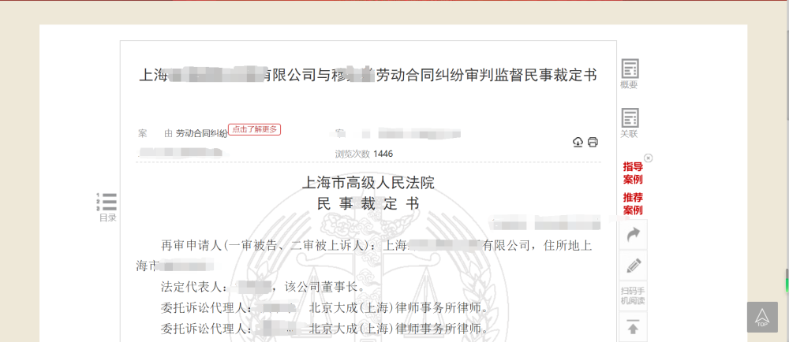

# 员工拒绝从上海调往南京被解雇，要求公司赔偿55万，法院：给44万

每经编辑：毕陆名

用人单位依法享有用工自主权，但行使权利时不能逾法越界，而应当遵循合法合理原则。用人单位根据生产经营需要调整劳动者的工作岗位、工作地点等内容时，应当充分尊重劳动者的权利，考虑劳动者的实际情况，双方协商一致解决，不得损害劳动者的合法权益。

上海一知名建筑公司员工穆某某一直在上海办公，期间收到公司要求其远赴百公里之外的南京工作的调令。然而，穆某某却不同意，并且仍在上海出勤打卡。公司以穆某某旷工为由解除劳动合同。因此，双方发生争议，对簿公堂。经审理，仲裁委、一审法院均支持公司，二审法院却认为公司违法。
**最终，法院判决公司赔偿44.6万元。**

拒绝上海调南京被“炒”

据中国裁判文书网披露的民事判决书显示，穆某某 **（女）**
于2004年11月入职上海一建筑工程有限公司，工作地点在上海，月均工资性收入18,566.07元。
**公司称，因上海本地业务萎缩，将公司业务总部移到江苏，故将穆某某调至南京。**

双方签订的《劳动合同书》显示，约定穆某某的工作地点是以工作安排为准，公司可根据其业务（生产）需要或穆某某的实际工作能力及表现，可以调动穆某某的工作岗位和工作地点，并以书面形式告知其，穆某某除有正当的合法理由外应予服从。

2018年3月1日，双方再次签订《劳动合同续签书》，约定续签合同期限从2018年4月1日至2019年3月31日，并补充约定穆某某接受全国调动及外派，如不能接受公司安排者，公司可与其解除劳动关系，并不支付任何经济补偿与赔偿。

同时，公司提供2018年8月15日施行的《XX集团职工考勤管理办法（修订）》，第十二条“旷工及期间待遇”规定，凡未经单位同意，擅自离开工作岗位，作旷工处理。

2018年8月17日，公司发出《关于工作调动的通知》，
**载明“现因工作需要，根据您跟公司签订的劳动合同续签书第（三）条，经公司研究决定，将您从成本合约中心调至江苏区域中心担任投标主管岗位，薪资不变，并作为公司外派人员享受相关福利待遇……请您于2018年8月20日至江苏区域中心报到”。**

**穆某某不同意。于是，其在2018年8月20日至2018年9月5日期间未至江苏区域中心工作，而在其原工作地点出勤。**

2018年9月5日，公司出具《解除劳动合同通知书》，载明“因你从2018年8月20日至9月5日连续旷工13天，按照公司的职工考勤管理办法第十二条……根据《劳动合同法》你已严重违反公司规章制度，公司决定从2018年9月5日起与你解除劳动合同……”。

2018年9月10日，穆某某向上海市徐汇区仲裁委员会提出仲裁申请， **要求公司支付：解除劳动合同的赔偿金28个月工资555,032.80元；**
2018年年终奖40,000元等。

不过，仲裁委并未支持，穆某某不服，遂向上海市浦东新区人民法院提出起诉。

_图片来源：视觉中国_

一审：公司解除合同合法

上海市浦东新区人民法院认为，本案的争议焦点在于2018年8月20日至2018年9月5日期间穆某某未至江苏区域中心报到出勤是否属于旷工。

首先，据穆某某与公司签订的《劳动合同书》约定其的工作地点以工作安排为准，公司根据其业务（生产）需要或穆某某的实际工作能力及表现，可以调动穆某某的工作岗位和工作地点，并以书面形式告知穆某某，穆某某除有正当的合法理由外应予服从。
**公司作为用人单位根据生产经营需要调整穆某某工作地点，系行使用工自主权的行为。**

其次，2017年2月1日及2018年3月1日，双方两次签订《劳动合同续签书》，均补充约定穆某某接受全国调动及外派，如不能接受公司安排者，公司可与其解除劳动关系，并不支付任何经济补偿与赔偿。穆某某虽主张上述条款无效，但该条款并不违反法律法规强制性规定。穆某某作为完全民事行为能力人，其在该续签书上签字，即认可该条款的效力。

再次，据公司发出的《关于工作调动的通知》内容来看，穆某某投标主管的工作岗位未发生变化，薪资不变，用人单位亦不发生变更，穆某某属于公司的外派人员，公司明确穆某某作为外派人员可享受相关福利待遇。

最后，穆某某称公司将其调往南京，会对穆某某劳动权益和家庭生活造成重大不利影响，但穆某某应积极与公司协商解决方案，而不是采取对抗的消极怠工方式来解决。双方劳动合同书中亦明确约定了“除有正当的合法理由外应予服从”，穆某某可向公司提出其无法在南京工作的正当合法理由。

综上，
**2018年8月20日至2018年9月5日期间穆某某未至江苏区域中心报到出勤的情形，应属于旷工，公司据此于2018年9月5日依据相关规章制度解除与穆某某的劳动合同并无不妥，予以采信。**

然而，穆某某不服浦东新区人民法院判决，向上海市第一中级人民法院提起上诉，给出的理由是，他在职期间工作场所一直在上海。2018年8月17日下午，公司通过其OA系统发出调令，要求其自2018年8月20日起到南京工作，未明确告知合同签订主体、具体工作地点、往返交通、住宿安排、劳动报酬等。公司在经营状况没有发生实质性改变，其岗位仍存在的情况下，
**突然单方面决定将其工作地点调往江苏，未与他进行充分协商和沟通，极大幅度增加了员工的各项成本，这是公司以此逼迫他辞职的一种手段，他有权拒绝。**

二审：一审错了，公司违法

上海市第一中级人民法院认为，工作地点是用人单位与劳动者劳动合同约定的重要内容，也是劳动者在履行劳动合同时必然考量的因素。本案中，虽然双方劳动合同中约定了工作地点为“工作安排为准”，似乎只要公司变更的工作地点符合“工作安排”的条件，劳动者就应当服从。这样过于宽泛的约定，往往无法体现劳动者的真实意思表示，也有失公平合理，故法院认为不能以上述条款约定作为认定用人单位变更工作地点合理性的依据。

用人单位因生产经营需要变更经营地属于社会经济生活中的正常现象，但由于劳动合同履行地发生了变化，是否影响到劳动合同的正常履行，应当考量该变化是否对劳动者继续履行劳动合同带来实质性的困难和影响。若未给劳动者带来实质性的困难，则劳动者有容忍、服从的义务；若已给劳动者继续履行劳动合同带来了实质性困难，则应认定劳动者未到新的工作地点上班具有正当理由，用人单位也不得以劳动者未提供劳动为由解除劳动合同。

_图片来源：视觉中国_

本案中，双方就调整工作地点存在争议，穆某某虽未到新的工作岗位出勤，但是，在穆某某已提供相关证据证明其在原岗位工作的情况下，公司仍认定穆某某旷工与事实不符。

因此，
**公司以旷工为由解除与穆某某的劳动合同，缺乏事实依据，应承担违法解除劳动合同的法律责任，向穆某某支付相应期间工资及违法解除劳动合同赔偿金。原审法院所作判决有误，本院予以更正。**

鉴于用人单位代扣的社会保险金、税费等均为个人劳动所得的组成部分，故该部分款项应当计入工资性收入。因此，公司应当支付穆某某违法解除劳动合同赔偿金18,566.07*12*2=445,585.68元。

（当事人系化名）

每日经济新闻综合中国裁判文书网

