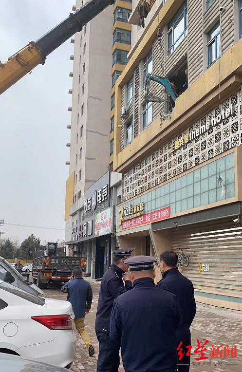
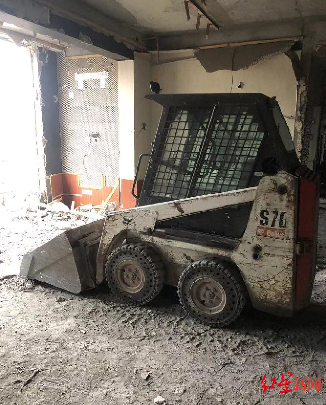

# 哈尔滨“租户私拆承重墙”事件新进展：已出修复方案，政府称维修费不需居民承担

_↑事发哈尔滨利民学苑小区。受访者供图_

今年4月，哈尔滨松北区利民学苑小区B栋一业主私拆承重墙，导致31层的居民楼出现多处裂缝。

据央视新闻6月11日报道，经过专家论证，认为检测、监测、鉴定及修复方案编制等技术工作程序合理，内容全面，分析和鉴定结果可信。
**6月11日，红星新闻记者从哈尔滨市松北区政府工作组工作人员处了解到，下一步将对利民学苑小区B栋居民楼进行修复，修复费用不需要居民承担。**

今年4月，利民学苑小区B栋2单元3层的一户业主在装修过程中动用小型挖掘机等设备对承重墙进行了破坏，导致楼体出现多处裂缝。

据央视新闻6月11日报道，哈尔滨市松北区人民政府称，利民学苑小区“私拆承重墙事件”调查组邀请中国工程院院士等9名国家权威专家组成专家组，就房屋结构安全鉴定与修复方案进行专题论证，形成专家组意见，认为检测、监测、鉴定及修复方案编制等技术工作程序合理，内容全面，分析和鉴定结果可信。松北区政府发布的具体数据显示，此次检测是委托中国建筑科学研究院国家建筑工程质量检验检测中心对利民学苑小区B栋开展的全面检测，完成对248套房屋逐一入户核查。经核查，利民学苑小区B栋二单元每层竖向承重墙构件总数为50个，承重墙截面总面积42.98平方米。装修施工拆除了其中一个构件的部分墙体，拆除截面面积约0.48平方米，占该层承重墙总截面面积的1.12%，拆除的其他墙体均为非承重墙。检测结果表明，B栋248套房屋均未发现结构构件受力裂缝，可以见到的裂缝均位于填充墙或与结构连接界面部位，不影响结构安全。此外，委托黑龙江省寒地建筑科学研究院进行楼体变形监测，连续30日不间断监测显示，各监测点数据均在国家标准允许值范围内，未见异常。

_↑此前业主利用小型挖机对承重墙进行了拆除。受访者供图_

6月11日，北京一家建筑设计院的项目经理佟先生对红星新闻记者表示，
**一般而言，建筑在设计的时候会在安全性上留出一个“余量”，如果破坏的程度不重，虽然会对楼体原有稳定性造成一定影响，但是不会影响整体结构安全，经过修复后确实是不会影响日常居住的。**

据央视新闻报道，利民学苑小区B栋二单元居民已进行临时安置，松北区成立15个工作组，做好居民生活服务保障，将委托省内一流建筑业企业启动修复施工。

6月11日，哈尔滨市松北区政府工作组一位工作人员告诉红星新闻记者，修复方案是由哈尔滨工业大学建筑设计研究院制定的，权威性和可靠性是有保证的，楼体经过修复后是会保证安全的，在正式进行维修前，还会和业主进行联系，而
**“维修费用不需要居民担心，居民一分钱都不用出。”**

据当地此前通报，承重墙被砸事件发生后，哈尔滨市公安局松北分局对涉嫌过失以危险方法危害公共安全罪的承租人张某、马某欣，施工人员常某久、刘某平及物业公司经理张某等5人，采取了刑事强制措施。
**对涉事房屋所有人朱某彬、物业公司从重按上限处罚。** 目前案件正在进一步审理中。哈尔滨市纪委监委已对该事件中存在的相关问题开展调查工作。

红星新闻记者 付垚 吴阳

编辑 潘莉 责任编辑 魏孔明

