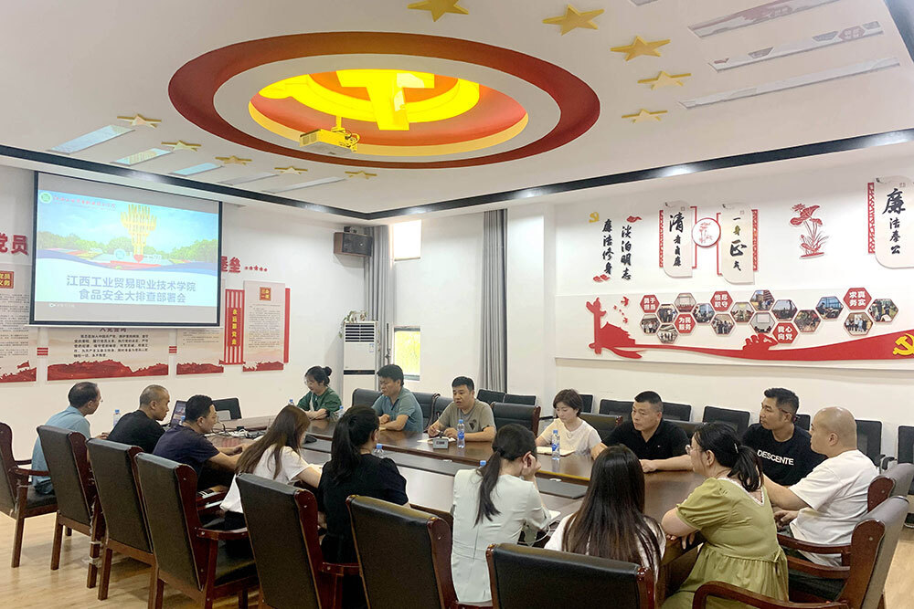
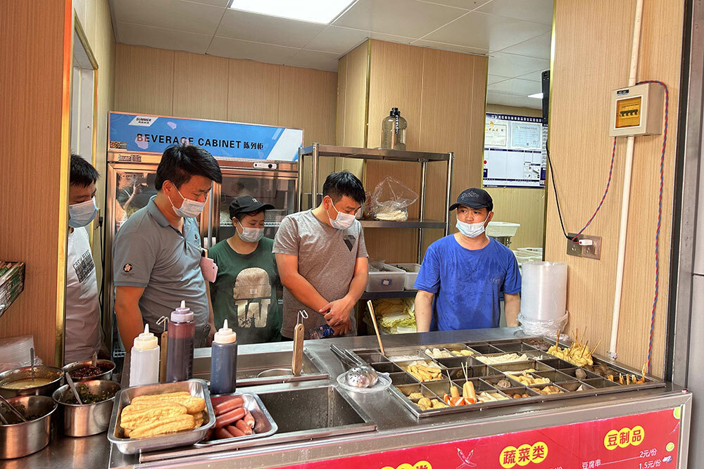
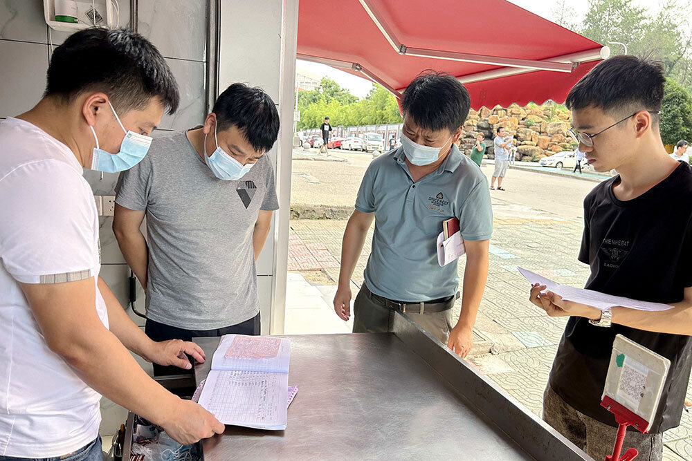
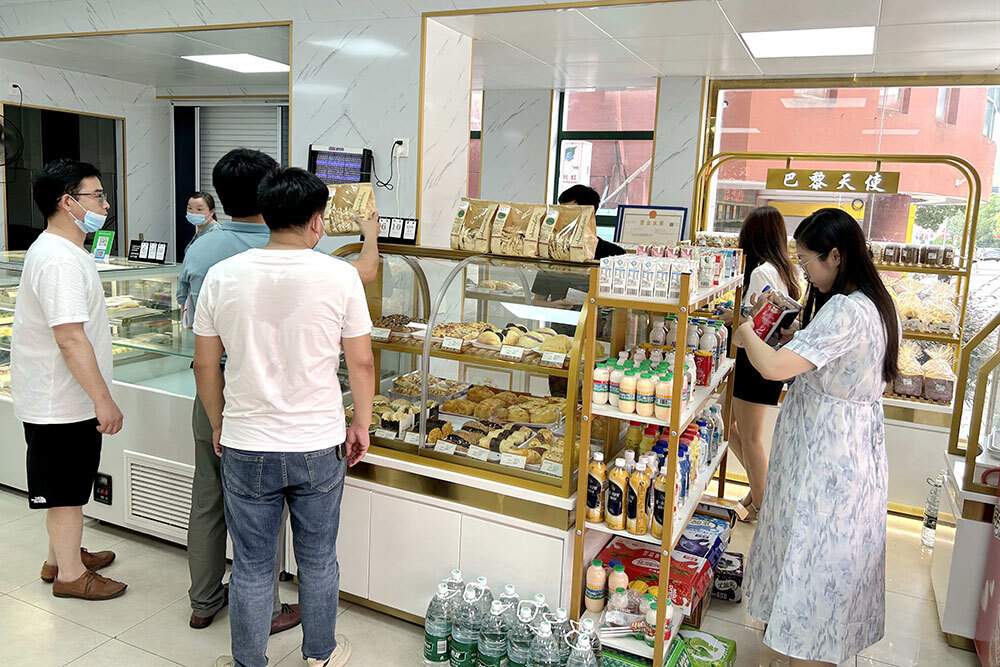
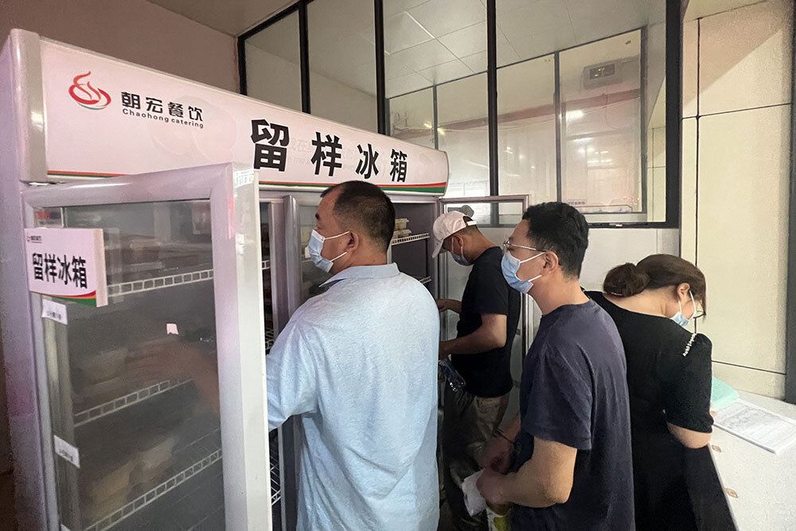

# 江西一高校紧急开展食品安全专项大排查，强调“动真碰硬”

“要瞄准重点领域，要真排查，动真碰硬。”

坐落于南昌的江西工业贸易职业技术学院宣布，自6月10日起开展食品安全专项大排查。当天，检查组对学生食堂、超市、经营食品的相关店铺进行全面摸排。

_6月10日下午3点，江西工业贸易职业技术学院组织后勤服务中心、安全保卫处人员，全院值班教师，食堂、超市、综合体负责人开展食品安全大排查部署会。
本文图片均来自江西工业贸易职业技术学院官网_

据江西工业贸易职业技术学院官网6月11日消息， **为迅速贯彻落实省委、省政府及省教育厅、省粮食和物资储备局关于校园食品安全工作要求**
，切实加强学院食品安全管理，有效预防食物中毒或其他食源性疾病的发生，保障广大师生身体健康和生命安全，6月10日中午，学院党委书记万玉青对加强学院食品安全工作进行了调度，要求后勤服务中心、安全保卫处立即行动，共同做好学院食品安全工作再排查、再强化工作。

学院方面决定，从6月10日起至本学期末，在全院范围内开展食品卫生安全专项检查。

官网消息称，6月10日下午3点，学院党委委员、副院长宋小兵组织后勤服务中心、安全保卫处人员，全院值班教师，食堂、超市、综合体负责人开展食品安全大排查部署会。

会上，宋小兵就此次检查的重要性进行强调：一是要统一思想，提高认识，各检查人员要充分认识此次校园食品安全大排查的重要性、必要性；二是要认真排查，不留死角，此次排查形式为地毯式排查，各检查人员必须要按照检查表要求，一一对照，严格排查；三是要牢记职责，保障安全，后勤服务中心要瞄准重点领域，要真排查，动真碰硬，全面落实食品安全管理责任。6月10日下午3点半，学院组织后勤服务中心、安全保卫处工作人员及全院值班人员开展食品安全专项检查，对全院学生食堂、超市、经营食品的相关店铺进行全面摸排，主要对食品三证及进货台账、操作间卫生及操作流程、主食材、水电安全、从业人员健康证明等方面进行地毯式排查。

学院方面称，今后将持续推进校园食品安全监管，强化监督力量、加大宣传力度，坚持做到“日检查、周排查、月调度”，坚决守住舌尖上的安全，真正做到严防严管严控食品安全风险，为全院师生提供安全、安心的校园食品。

澎湃新闻注意到，另有部分院校也在开展食品安全检查。

苏州高博软件技术职业学院消息称，为进一步加强对食堂卫生安全的监督管理，6月7日下午，学院后勤管理处组织相关人员对学校食堂食品安全工作进行专项检查，检查中仔细察看了食堂后厨操作间卫生状况、原料采购和贮存、食品加工操作流程、食品留样记录、清洗消毒等情况，对存在的问题立即提出整改要求。

据学院网站消息，检查结束后，检查人员向各食堂负责人反馈了检查意见并强调，食品安全是需要常抓不懈的工作，各食堂要守护“舌尖上”的安全，严格把好原材料的质量关、做好精细化管理，在食品加工制作及环境卫生等方面把工作做细做扎实，定期进行安全隐患排查，杜绝食品安全事故的发生，让全校师生吃得安全、健康、满意。

另据淮南师范学院网站消息，6月7日上午，淮南市市场监督管理局餐饮科科长舒军生一行三人到学校进行食品安全检查。

消息称，检查人员对食堂的食品安全管理机构、“60号令”制度落实、健康管理、环境卫生、原料控制、加工制售、清洗消毒等方面进行了全面检查，实地查看了仓库储存、食品留样、台账记录等情况。检查过程中，对存放在保洁柜中的餐具进行抽查，并现场询问食堂工作人员有关餐具规范消毒方面的知识。检查人员对学校食品安全工作给予肯定，同时对在检查中发现的问题也提出了明确的整改要求。

