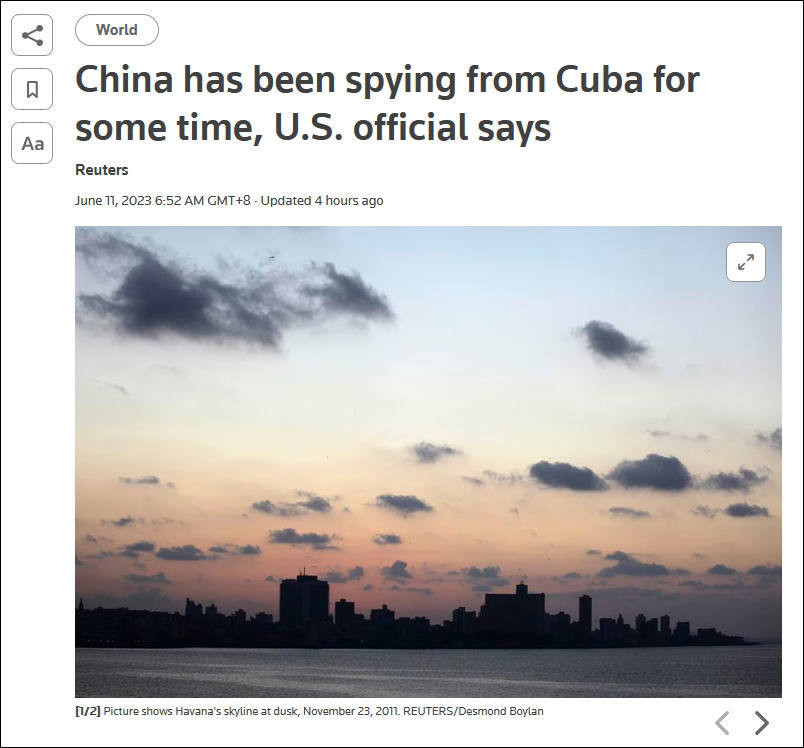
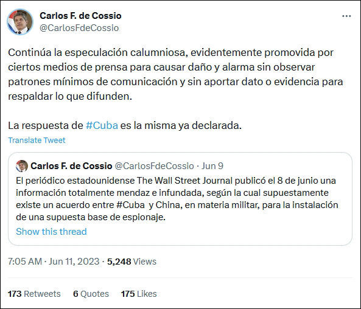

# 没完了？拜登政府官员为炒“中国间谍活动”又搬出新说辞，古巴驳斥

（观察者网讯）

美媒造谣“中国在古巴建间谍基地”反被古巴政府和白宫“打脸”后，美国官员又开始兜售新说辞。据路透社11日报道，拜登政府一名官员当地时间10日宣称，中国在古巴进行“间谍活动”已有一段时间，并于2019年升级了在该国的情报收集设施。

这很快遭到古巴政府和中国驻美国大使馆的严正驳斥。古巴副外长直指有关报道是由媒体推动的“诽谤性的猜测”，“目的是造成伤害和恐慌”。中国驻美国大使馆发言人则重申中国外交部发言人的表态，指出造谣污蔑是美国的惯用伎俩，美国才是全球最强“黑客帝国”。

_路透社报道截图_

路透社先是提到，美国《华尔街日报》此前当地时间8日曾发布报道，称中国与古巴达成了一项“秘密协议”，将在距离美国佛罗里达州仅约160公里的岛上建设所谓“电子窃听设施”，但美国和古巴政府均对该报道表示“强烈怀疑”。

报道随后写道，一名不愿透露姓名的拜登政府官员当地时间10日声称，媒体的描述“与我们所了解的不符”。不过，该官员没有具体说明该报道如何错误，也没有详细说明所谓中方是否要在古巴建立新监听设施的问题。

据报道，该官员还进一步炒作称，这个问题早在拜登担任总统之前就已经存在，“这是一个持续存在的问题，而不是一个新问题”。该官员声称，所谓中国于2019年升级在古巴情报收集设施一事，在美国的情报记录中“有据可查”。

不过，这个“最新消息”也很快被古巴副外长卡洛斯·费尔南德斯·德科西奥再度驳斥。“诽谤性的猜测仍在继续，这显然是由某些媒体推动的，目的是造成伤害和恐慌。”他当地时间10日在推特上写道，“他们没有遵守最低限度的沟通标准，也没有提供数据或证据来支持他们传播的内容。”

德科西奥说，古巴方面保留与之前相同的回应。此前，针对所谓“中国在古巴建监听站”的抹黑报道，他曾驳斥指出，“所有这些信息纯属虚构，毫无依据，其意图是为对古巴封锁、动荡和侵略的空前强化寻找借口，并试图蒙骗美国和世界舆论”。事实上，就连白宫国家安全委员会战略沟通协调员约翰·柯比和五角大楼发言人也都承认，有关消息并不准确。

_推特截图_

在被要求对此置评时，路透社说，中国驻美国大使馆一位官员重申了中国外交部发言人的表态。外交部发言人汪文斌9日就相关问询表示，众所周知，造谣污蔑是美国的惯用伎俩，肆意干涉他国内政是美国的专利。美国还是全球最强“黑客帝国”、名副其实的“监听大国”。美国应该反躬自省，多做改善美古关系、有利于地区和平稳定的事，而不是相反。

**本文系观察者网独家稿件，未经授权，不得转载。**

