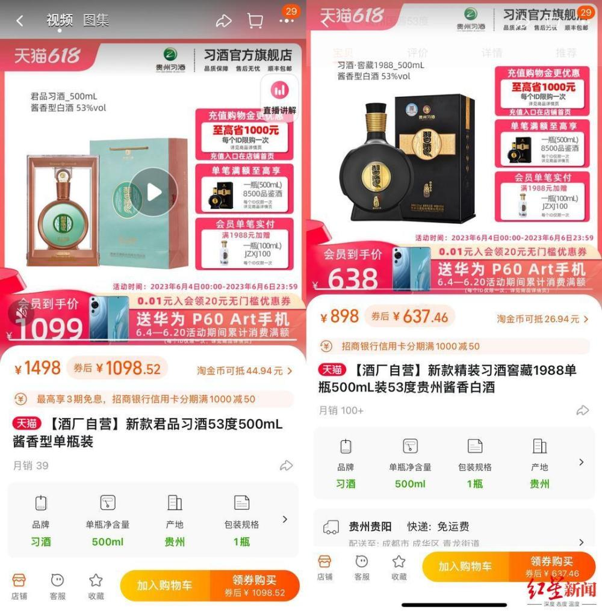
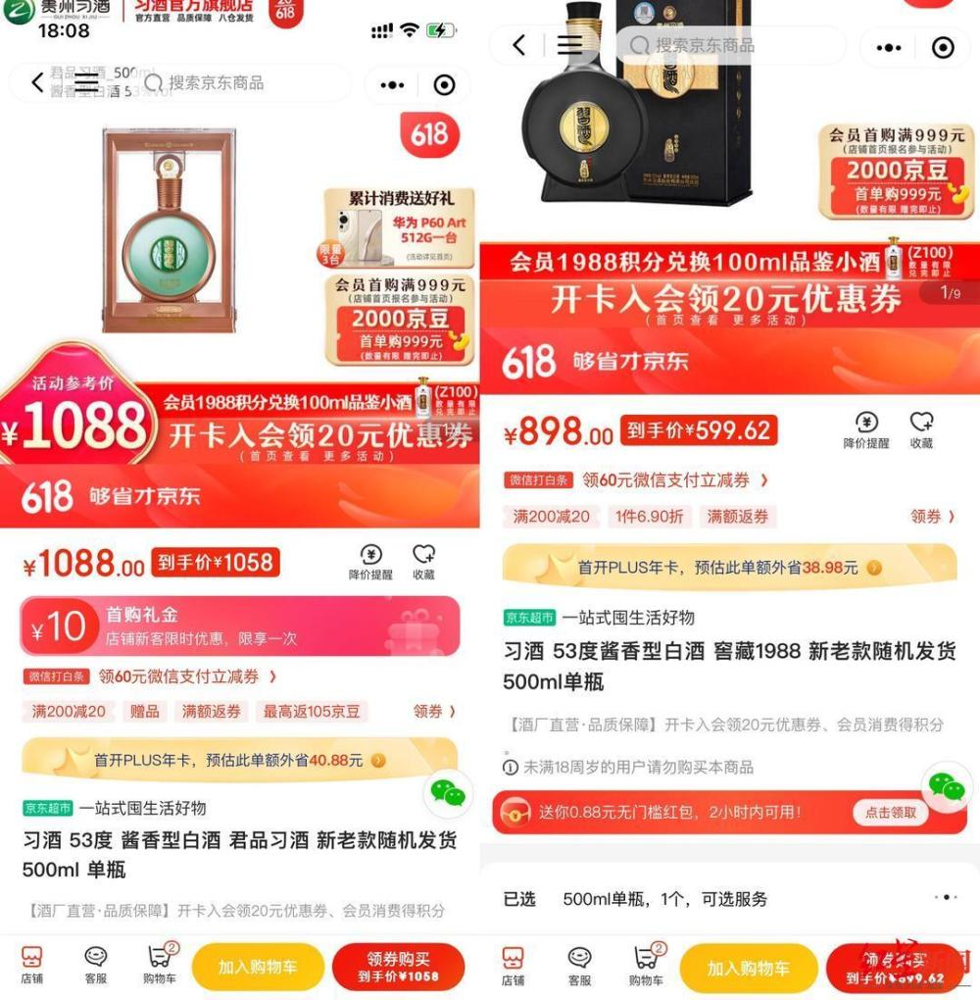

# 白酒行业内卷：价格大面积出现倒挂，消化库存是今年首要任务

距离6月18日还有一周，但早在半个多月前，各大电商就喊出了“百亿补贴、全网最低、击穿底价”口号，号称“史上最卷618”。

红星资本局发现，在各大电商盯紧消费者钱包，发布酒类开门红喜报的同时，白酒经销商们却集体叹气，面临行业性价格倒挂。

电商酒类开门红

酒企股价跌停 白酒板块走低

从目前电商平台的喜报来看，今年618的酒类销售同比增长。

淘宝天猫数据，5月31日20点起的4小时内，白酒品类同比增长超56%。其中，水井坊官方旗舰店、国窖1573旗舰店、茅台王子酒旗舰店销量同比增速均超100%。

同时，起泡酒、香槟、葡萄酒、DIY鸡尾酒品类的销量同比增速均超100%，桂林漓泉啤酒、健力士黑啤销量比去年翻了一番。

京东超市方面，5月31日20点起的28小时内，酒类商品成交额同比增长70%，成交用户同比增长60%。名优白酒成交额同比增长200%，精酿和鲜啤成交额同比增长160%。

其中茅台、拉菲、人头马成交额均同比增长300%；茅台1935成交额环比增长50倍，剑南春水晶剑750ml成交额同比增长8倍，青岛啤酒皮尔森同比增长8倍。

在电商酒类销售火热的同时，白酒板块也在6月1日由跌转升。但随后白酒板块又震荡走低，据同花顺数据，6月6日的白酒指数收跌0.93%，再创年内新低，跌回2022年12月初的水平。

6月5日，舍得酒业（600702.SH）跌停，截至6月9日收盘，股价整体下跌，报130.46元/股，跌2.20%。

对于舍得酒业的股价变动原因，财联社报道称，6月5日有券商研究机构发消息称，舍得酒业5月销售回款不及预期。

对此，舍得酒业证券部工作人员回应称，目前生产经营正常，销售回款工作也正常开展。舍得经销商透露：今年1、2月份回款较多，5月份属于淡季，舍得刚涨完价，（产品）价格也不太稳定，但目前厂商未压货。

据多位经销商告诉红星资本局，目前的市场除了茅台外，集体出现价格倒挂的问题。该情况从前述电商平台数据也能印证，销售增长的均为全国性名酒品牌。也就是说，白酒行业的马太效应更加明显。

白酒价格倒挂明显

有烟酒店已停止进货

习酒是经销商们提名较多的倒挂严重白酒品牌。

习酒想稳定经销商体系的动作，从2月9日的全国经销商市场工作会就开始了。

但习酒的倒挂并未因此停止。从占习酒销售大半的大单品来看，其以君品习酒和窖藏1988为代表的高端系列，建议终端零售价分别为1498元和898元，出厂价分别为935元和568元。

红星资本局查阅其淘宝官方旗舰店，君品习酒到手价相比3月的1100元出头已微降至1098元/瓶，窖藏1988到手价仍为600元出头，两款产品的月销量在39瓶和100多瓶。京东平台的旗舰店价格更低，君品习酒到手价1058，窖藏1988到手价已跌破600元。

_贵州习酒代表产品在天猫和京东旗舰店的售价
图源：天猫/京东平台_

在经销渠道，习酒的这两款产品继续下跌至850元和480元左右。

此外，多位河南、四川的白酒经销商告诉红星资本局，郎酒、国台、珍酒等品牌也存在倒挂。

这样“没有最低、只有更低”的市场，直接体现在渠道经销商和终端烟酒店的拿货意愿上。

一位四川省的烟酒店老板告诉红星资本局，他从4月份起就没怎么拿过新货，因为库存还有一百多万。而且现在市场混乱，如果有客户需要再调货也来得及。

当终端拿货意愿减少时，白酒经销商们的生意也受到影响。多品牌白酒经销商称，自己目前手里的货，只有去年的2/3左右。

动销不足，着急的还有酒企。行业老二五粮液（000858.SZ）也面临大单品倒挂问题。在股东大会上，五粮液副总经理刘洋表示，受多因素影响，今年“普五”价格确实有所倒挂，但今年有信心实现顺价。五粮液的解决方式包括拿出2个亿自建专卖店。5月30日，其公告，将在全国范围内高质量建设一批第五代专卖店，两年期费用总预算为2亿元，为提升公司专卖店渠道能力，进一步将专卖店打造成为服务C端客户的核心阵地。

白酒行业积累诸多问题

消化库存是首要任务

拉长时间来看，白酒行业的集体倒挂，也许源于行业的转折点。

4月3日，中国酒业协会理事长宋书玉在2023年贵州白酒企业发展圆桌会上说，2023年可能是中国酒业在长周期发展中的变革之年、转型之年和分化之年。

他解释，从产业的数据看，白酒产业长周期的特征非常明显。白酒产业在高速增长周期中积累了诸多问题，也随着经济大环境影响而逐渐显现，长期积累的内部和外部矛盾已经突破了临界点。虽然产业经济指标保持正常，但是面临着从产业结构变化到市场消费外部的变化等多方面因素叠加发展，表现在以下三个方面：

一是产能扩张与产销量下滑的矛盾。二是名酒价格带降维与盈利能力持续性的矛盾。名酒价格在降低后是否具备持续的消费动力，是否保持产业盈利能力的持续性，也值得深思。三是名酒渠道下沉与区域酒突围的矛盾。在这样的因素叠加下，宋书玉认为，白酒行业的关键词是产能和库存。

2023年年初，白酒消费水平反弹上扬的态势明显，后期是否具备持续消费动力值得期待，也值得深思。疫情三年白酒渠道扩容快速。新渠道消化能力不强，聚道竞争骤然升温。

也就是说，消化库存是白酒行业2023的首要任务。

红星新闻记者 程璐洋 俞瑶

编辑 肖子琦

