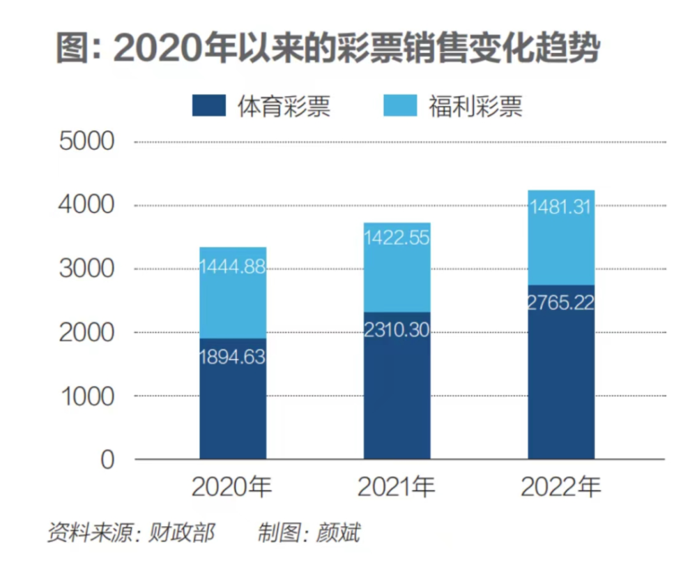

# 经济越不景气，彩票销量越好？彩民：中1000万可能比赚1000万容易

_2023年4月5日，上海南京路步行街上的一家即开型体育彩票亭。图/视觉中国_

**文｜《财经》记者 张舸**

**编辑｜王延春**

今年以来，彩票消费持续走高。根据财政部数据，1月-4月全国累计销售彩票1751.50亿元，同比大增49.3%，创五年来新高。
**不仅如此，过去三年，彩票的销售也一直保持着高速增长。可以说，彩票不仅未受任何下行因素拖累，反而在一众消费品中逆势而上。**

有人认为彩票是“穷人税”，也有人认为“中1000万比赚1000万容易”，社会对彩票的认知似乎也出现分化。当前消费并未全面回暖，为什么彩票的销售反而大旺？这背后反映出怎样的经济信心？弱复苏格局下，市场预期又该如何提振？

**彩票成为消费“黑马”**

5月31日晚上7点半，北京市曙光南路的中国福利彩票站门前，彩民仍然络绎不绝。刮刮乐的货架前，四五位彩民在排队选卡，店员林杰一边忙着结账、兑奖，一边给买“大乐透”的彩民出号码单。

记者驻足的半小时里，陆陆续续进来了20多位彩民，更有人一次买多张、多种彩票，移动支付的到账提醒不断，几沓刮刮乐很快就销售一空。一墙之隔的房产中介“链家”门口，几位地产经纪人无所事事地刷着手机，店里显示仍在“营业中”。

**林杰告诉《财经》记者，今年以来，彩票站的生意很好。从上午开店到晚上关门，一直有人来买彩票，高峰期，店里两三个人帮忙都忙不过来。**

不仅如此，越来越多年轻人加入购彩大军。林杰表示，现在老彩民不少，但最近门店业绩持续增长，更多得益于年轻客户。“这楼上就是写字楼，午休和下班那会儿来买彩票的人很多，有的人还是结伴一起来的。”北京三元桥附近另一彩票站的工作人员告诉《财经》记者。

**打开小红书，“彩票中奖”词条的浏览量已达2.2亿，相关的“彩票中奖技巧”**

亦成为时下热门话题。在长视频平台哔哩哔哩上，搜索与彩票相关的视频有1010条，热度最高的视频有1171万次播放。彩票在年轻人的社交圈里流行起来。

实际上，过去三年，彩票的销售一路高歌猛进。根据财政部数据，2022年全国彩票销售额总计4246.52亿元，同比增长13.8%；2021年彩票销售额同比增速亦达到11.8%。今年以来，1月-4月全国累计销售彩票1751.50亿元，同比大增49.3%；其中，4月全国福利彩票和体育彩票共销售503.26亿元，同比增速高达62%。而且全国所有省份的销售数据都在增长。

与之形成对比的是，当前的消费回暖仍不明显。根据中国人民银行发布的居民信贷数据，4月居民短期贷款较上月减少1255亿元；居民中长期贷款较上月减少1156亿元。一般来说，短期贷款多为个人消费类贷款，中长期贷款则多用于购车、购房等家庭类大额消费支出。二者的下降，说明当前居民的消费需求并未完全释放。

另外，受低基数推动，4月社会消费品零售总额同比增长18.4%，但两年平均增速和四年平均增速均较3月回落。按照消费类型看，1月-4月，商品零售133945亿元，同比增长7.3%；餐饮收入15888亿元，增长19.8%。如果以销售增速来看，人们对于彩票的消费热情，显著高于其他消费品。

**可以说，彩票消费不仅未受任何下行因素拖累，反而在一众消费品中逆势而上。**

**彩票中的“口红效应”**

有业内人士认为，在经济尚未完全复苏、消费略显疲软的今天，彩票又是非刚需消费的一种，人们的购彩欲望理应被遏制。当前的畅销、流行似乎并不符合逻辑。

25岁的柳长街是北京一家市场营销公司的员工，最近每周都会去公司附近的彩票站买两张刮刮乐以做放松。最初接触到彩票是在社交平台上刷到了“彩票中奖”的视频，觉得有趣也想跟风试试手气。他告诉《财经》记者，“运气好的时候能中20元钱回一下本，多数时候还要倒贴钱。但是中奖的话，会觉得自己今天运势不错，心情也会很好。”

同样作为彩票站老主顾的雨泽，是一家美容美发店的技术总监。不忙的时候，雨泽会去附近的商店买包烟，发现店里兼营彩票后，也会顺便买几张。
**他感觉，买彩票就像工作之余的一种放松，虽然理性上知道不可能借此发财，“但终归是一种希望”。**

“五一”放假的时候，雨泽去彩票站一口气买了60张“好运十倍”刮刮乐，里面有30多张中了小奖，算下来还是亏本的。他告诉《财经》记者，疫情刚刚过去，想出去旅游是肯定的，但这两年没赚到什么钱，加上高峰期旅游的人太多，所以选择买彩票当作假期消遣。一张“好运十倍”的面值是10元，如果中了头等奖，奖金有40万元。“运气这东西说不准，万一呢？”雨泽说。

**林杰表示，最近几个月店里卖得最好的是刮刮乐，平均月销量增长了近40%。“主要是年轻人喜欢买，玩法简单也不贵，中个10元、15元的，就和图个好彩头一样。”**

中国人民大学经济学院副教授王云告诉《财经》记者，从行为经济学角度分析，购彩行为一般受两个因素影响：一是消费者的风险偏好；二是其主观估计的中奖概率。

王云认为，近年来彩票大卖，说明受经济大环境、个体收入变化影响，部分人的风险偏好水平出现变化，从“相对风险规避”转至“相对风险偏好”。也就是说，更多人愿意花点小钱，买张彩票“碰运气”，哪怕没有中奖。

**需要指出的是，此处的“风险爱好”与当下部分人对大额投资、重大事项变动的避险情绪并不矛盾。一注双色球只需2元，对大多数人来说，购彩花费还称不上“风险”。**

另外，彩票中奖是有概率的，而买彩票的人通常会“过高估计小概率事件”，即主观估计的中奖概率大于实际中奖概率。“这种情况下，人们购彩时也会获得更多的正向心理反馈，这与‘口红效应’之间也存在相通之处。”王云表示。

“口红效应”是指因经济萧条而导致口红热卖的一种现象。每当经济不景气时，并非生活必需品的口红的销量反而会直线上升。这是因为即使生活窘迫，人们仍然会有消费的欲望，口红作为一种“廉价的奢侈品”，可以对消费者起到心理安慰的作用。

“彩票作为一种游戏，既有开奖的刺激，又能提供中奖后改变生活的期待。”王云表示。在经济增长放缓、消费普遍降级的当下，它充当了某种更廉价的娱乐活动，成为人们消费降级过程中的心理犒劳。

彩票具有低投入、小概率、高回报的特性。一张张红红绿绿的刮刮乐卡片上，“喜相逢”“甜蜜蜜”“好运十倍”被大大地印在最显眼的位置，对多数彩民而言，尽管概率微乎其微，但仿佛只需要花几块钱，就能买到背后的美好寓意。

**彩票背后**

尽管当前博彩行业大旺，但仅靠价值5元到50元不等的彩票，依旧难以支撑起中国的消费复苏。不仅如此，彩票的市场需求实际上是经济景气程度的反向指标。此前，《国家彩票》杂志刊登的文章《经济越不景气，彩票越受欢迎？》称，在经济不确定的形势下，人们更钟爱购彩。

上海财经大学经济学院教授黄振兴对《财经》记者表示，即便彩票中奖后能带来一定收入，但长期来看，购买彩票仍是一种负收益的投入，因为彩票的期望收益是负数。在这种情况下，彩票消费增加，说明在人们的潜意识里，劳动致富的机会正在减少，因此更愿意通过彩票“博一把”，看看能否凭借运气实现一夜暴富。“这也意味着人们对当前经济的信心不足。”黄振兴强调。

26岁的伊桐偶尔会在下班路过彩票店时进去“碰碰运气”。最近几个月，伊桐在打算换工作。本来以为疫情结束后，生活就会好起来，但现在感觉并不乐观，目前只能继续在现在的公司待着，一边干一边“骑驴找马”。
**她告诉《财经》记者，不能说对未来失去希望，但的确感到有些无助和迷茫，该做的努力都做了，但生活现状好像没什么改变。“干脆买张彩票试试，现在中1000万可能比赚1000万容易。”伊桐说。**

实际上，除了彩票受捧，越来越多迹象表明，人们对经济前景预期减弱，避险情绪增加。今年以来，黄金、保险等风险对冲类产品的需求持续走俏。根据中国期货业协会数据，4月，黄金期货的成交量同比增加62.4%，成交金额同比增长79.76%；另外，国家金融监督管理总局数据显示，前四个月全国保费收入2.3万亿元，财寿险增长均超过10%。

**上海某基金公司销售人员告诉《财经》记者，当前市场收益并不如预期景气，投资者避险情绪浓厚，近期计划以安全为卖点进行产品销售。**

此外，居民的储蓄意愿亦在同步增强。浙商证券首席经济学家李超指出，由于对未来收入的悲观预期影响，居民超额储蓄仍在继续积累。结合4月居民存款数据估算，2020年-2023年4月中国居民超额储蓄体量已增长至6.46万亿元，相较上月继续增加约5000亿元。“也就是说，即使疫情因素消退，居民仍在积累超额储蓄，预计未来较难大量释放至消费、购房。”李超说。

**如何激发市场信心**

早在2022年12月，中央经济工作会议即指出，2023年经济工作千头万绪，要从战略全局出发，从改善社会心理预期、提振发展信心入手，纲举目张做好工作。

尽管信心是微观个体的内生动力，但通过层层传导，最终会作用到宏观经济上。如同悲观的情绪会在市场蔓延，如果一部分群体有信心、很乐观，也同样会感染到周围每一个人。同时，人们的期望也在影响着经济发展的结果。越有信心，经济发展越向好，越是悲观，经济发展也将一同受阻。

最终，经济发展的结果再次反作用于人们的预期。经济高速发展时，社会的消费、投资增加，经济增长与信心皆会进入一个正向循环。黄振兴强调，“当务之急在于，如何避免经济发展由于缺乏信心而进入负向循环。”

**首先，把稳定民营经济信心放在第一位。长江商学院会计与金融学教授、投资研究中心主任刘劲告诉《财经》记者，当前信心不足的源头在于民营经济的预期不振。**

民营企业贡献了五成以上的税收、七成以上的创新及八成以上的就业岗位。一旦其经营萎靡、信心受损，后续的倒闭、裁员将对就业造成冲击，进而影响居民的收入增长，对消费、投资需求复苏形成制约，甚至形成一连串负面的连锁反应。

如何引导民营企业消除顾虑，刘劲认为可以从三方面入手：

一是从融资渠道上给予民企支持。民营企业中多数是中小微企业，由于缺乏合理抵押物和稳定的现金流，融资时往往面临更严格的信贷审批。银行等金融机构要对审批、风控制度进行创新，建立更适合民营企业的担保机制。

二是加强对民企私有产权的保护。无论是财产权，还是控制权，民营企业都有权自主支配。尽快从法律、制度层面对其完善，研究出台有关“民营企业产权保护”相关的法律法规，尊重民营企业家的合法权益。

三是在文化和舆论领域保护民营企业家。舆论环境也是营商环境的一部分，不实舆论对民营经济的伤害是无形的。需要建立对不实舆论的惩处机制，对严重影响企业形象的行为，依法追究责任并要求承担赔偿。

**其次，需要保障收入、资产价值稳定。对个体而言，可持续的工资、保值的固定资产是信心的来源。**

收入稳定的前提是工作稳定。当前务必要落实就业优先政策，特别是大学毕业生、就业困难群体等重点群体的就业。黄振兴认为，可以通过政策补贴的形式，刺激更多企业吸纳就业，保证居民收入。短期内重点扶持吸纳劳动力较多的行业，长期来说，可根据市场情况，逐步将补贴倾斜至战略新兴领域。

有恒产者有恒心。固定资产端方面，黄振兴建议，亦可以通过政策的松紧调节，减少人们固定资产的大幅波动。对中国绝大多数家庭来说，房子就是最重要的固定资产。无论房价大跌还是大涨，都会切实影响到一部分人的预期。“房价大涨，影响准备买房者的信心；房价大跌，也会影响已经购房者的信心。”

不仅如此，地产是周期之母，它的持续下行会对各行各业信心造成损伤。刘劲指出，尽管2022年下半年以来，政府对房地产行业的监管已经有所调整，出台了“金融十六条”等多条利好政策，但目前来看，还需要加强政策的力度和落地能力。可以适度考虑“取消限购”“降低购房利率”及“购房首付标准”等措施的出台。

**最后，稳定信心还需防止经济社会进一步分化。不患寡而患不均。信心不仅来源于绝对值，也来源于相对值。**

黄振兴认为，分化可以是居民之间的贫富差距，也可以是民企和国企之间竞争不平等。尽管社会的分化不可避免，但减缓分化的速度和程度，可以极大缓解它对于社会信心的负面影响。

2023年是“扩大内需”年，促进消费成为提振经济的关键。单凭彩票消费的增长，尚还无法带来复苏奇迹。但值得庆幸的是，信心可以。

