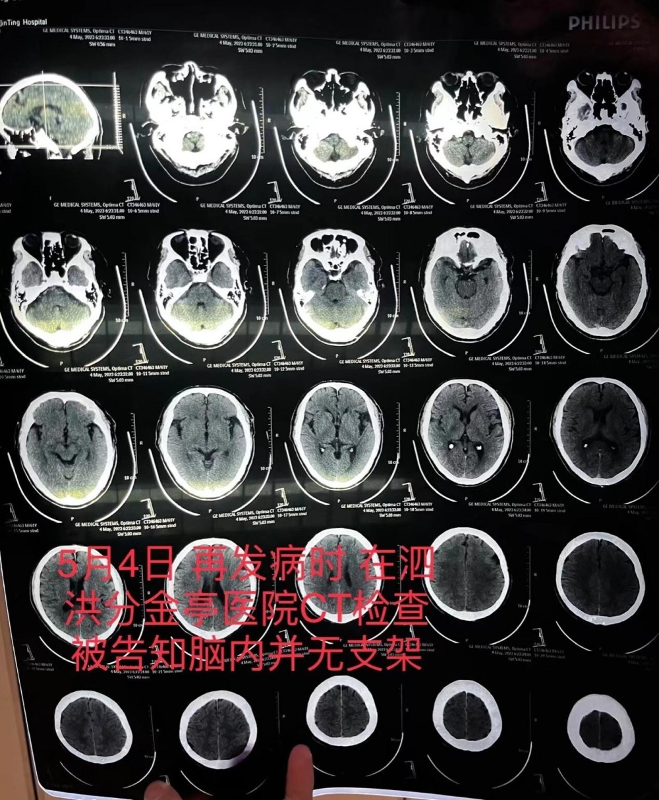

# 因脑梗去世老人曾被隐瞒未植入支架，法学专家：已不是一般医疗过失

6月10日，澎湃新闻刊发《江苏一患者因脑梗去世，医生承认支架植入失败，病历中却谎称手术成功》一文，受到广泛关注，其背后的法律问题，也引发网友热议。

_朱老汉在泗洪县分金亭医院的CT检查报告，显示颅内并无支架。朱先生
供图_

多位关注医疗纠纷的律师向澎湃新闻分析表示，目前单凭患者家属提供的住院病历记录、涉事医生的电话录音等内容，无法判断医院医疗行为是否存在过失，须进行鉴定。不过，涉事操刀医生的隐瞒行为，已经违反了《民法典》和《医师法》等相关法律和医师职业道德规范。若经过当地卫健委调查，证实其行为与患者死亡存在因果关系，性质严重的，涉事医生会被吊销行医执照，还可能因涉嫌“医疗事故罪”，被追究相关刑事责任。

还有律师指出，医务人员为患者治疗是一种“职务行为”，当发生医疗纠纷后，若存在医疗责任，则院方是赔偿责任主体。

9日晚，逝者的儿子朱先生告诉澎湃新闻，老人已下葬，但其并未告知是否已进行尸检。对此，有律师表示，由于涉事医院的手术记录等病历涉嫌伪造，司法鉴定已存在一定难度，若老人未能接受尸检，死因难以明确。

此外，针对支架未能植入却被收费的情况，接受采访的律师均认为，从现有证据来看，该笔费用应当由院方承担。有律师还提出，如果支架费用通过医保结算，涉事医院可能存在骗保嫌疑。

**家属计划采取民事诉讼**

今年4月6日，62岁的朱老汉在江苏省宿迁市第一人民医院神经内科接受经皮基底动脉支架植入术，该医院神经内科副主任医师齐某为主刀医生，术后告知家属手术成功。

朱先生提供的病程记录和手术记录均显示，手术过程中，齐某将一枚Neuroform Atlas
4.5/21支架系统，输送至病变狭窄段释放。记录中多次提到，血管狭窄问题已在手术中得到改善。

4月10日，朱老汉出院，病情稳定好转，住院医疗费用合计12万余元，部分自费。但还不到一个月，5月4日，朱老汉突发严重脑梗，被送至江苏省宿迁市泗洪县分金亭医院抢救。该院的CT血管造影显示，其颅内段部分动脉已严重堵闭，同时，并未发现植有支架。朱老汉随后被家人转入宿迁市第一人民医院，曾作为主刀医生的齐某此时承认，之前未能在患者颅内血管成功植入支架。

得知真相后，朱先生一家连夜将朱老汉转送至南京鼓楼医院。5月10日，朱老汉在该院再次接受支架植入手术，但术后其颅内基底动脉已全部血栓堵闭导致大部分脑干损坏，老人已无自主意识，无法自主呼吸。6月7日中午，朱老汉不幸去世。

在抢救期间，齐某和宿迁市第一人民医院院方代表也来到鼓楼医院。朱先生提供的电话录音中，齐某承认患者颅内没有支架，也不知道支架究竟在何处。因术中见到患者血流恢复良好，他称存在“侥幸心理”，因此隐瞒了支架未能植入的情况。“说实话，我做了这么多手术，没做成的时候很少，当时这个支架没放成，我觉得很打脸，感觉有点不好看，下不了台。”齐某说。

6月10日中午，澎湃新闻致电宿迁市卫生健康委员会，未获得有效回复。江苏省宿迁市第一人民医院纪委的电话也始终无人接听。

根据现有报道内容，北京某三甲医院神经内科主任医师万医生接受“环球时报健康客户端”记者采访时表示，基底动脉介入手术风险极高。狭窄程度超过70%的重度狭窄，需要及时进行干预治疗，否则可能危及生命。治疗方法包括口服药物、介入手术等，介入手术方式包括球囊扩张、支架植入术。“无论采取哪种疗法，都需要以患者为中心，选择最适宜的疗法。介入支架手术主要由两到三名医生完成，一名医生主刀，另外一两名医生辅助，并记录手术全过程。”

万医生分析称，齐某提到支架到达基底动脉位置进不去，可能有两方面原因：一是可能与使用的支架类型、型号、长短不合适有关，导致在指定位置无法撑开；二是技术水平不足。“此时，医生应第一时间告知家属，尽早转到更有能力的医院，为患者实施手术。”

按照《医疗纠纷预防和处理条例》第二十二条，患者可以采取以下四种维权方式：（1）医患双方协商解决（2）共同委托医疗纠纷调解委员会进行调解解决争议（3）向卫生行政部门投诉，通过行政调解方式处理争议（4）向人民法院提起民事诉讼，通过司法程序解决争议。

由于未能和宿迁市第一人民医院协商一致，朱先生决定采取民事诉讼，希望追究医院和医疗人员的医疗过失责任。

**医院和涉事医生各应担何责？**

多位专家指出，目前单凭患者家属提供的住院病历记录、涉事医生的电话录音等内容，无法判断医院医疗行为是否存在过失，必须先经过当地医学会或者司法鉴定机构进行鉴定。不过，涉事操刀医生的隐瞒行为，已经违反了《民法典》和《医师法》等相关法律和医师职业道德规范。若经过当地卫健委调查，证实与患者死亡存在因果关系，性质严重的，涉事医生有被吊销医师执业许可证的风险，还可能因涉嫌“医疗事故罪”，被追究相关刑事责任。

6月9日晚，朱先生称，其从院方得知齐某已被停职，其提供的一张微信聊天截图显示，齐某自称所有工作已经停摆。记者当天致电宿迁市第一人民医院纪委询问齐某被停职一事，接线工作人员称，“不方便说。”

北京大学法学院孙东东接受环球时报采访时指出，上述事件虽属医疗行业中较罕见的情况，但也暴露出相关管理问题，“本应预见不良结果可能出现，却抱着侥幸心理没有采取防范措施，放任不良结果的出现并隐瞒实情，就不仅仅是一般的医疗过失问题了。”

“故意隐瞒支架的情况比较少见，但性质较为恶劣。”上海政博律所主任律师王政告诉澎湃新闻，其从业以来，只接过两起隐瞒支架植入情况的医疗纠纷案件，但终以调解的方式和解。他认为，在本起事件中，若患者家属反映的情况属实，不管医院方对医生故意隐瞒支架未能植入、伪造病历虚构手术经过等情况是否知情，当发生医疗纠纷后，若存在医疗责任，则赔偿责任主体为医院，而非医生个人。因此医院无论是否知情，负有的法律责任程度都一样，“医院应承担主责以上。”

北京中闻律师事务所冯爱国律师同样表示，因医务人员的治疗行为是一种“职务行为”，按照《民法典》第1218条，应由其所在医院代替其向患方承担责任。因此，经鉴定后，若医院医疗行为存在违反医疗卫生法律、法规、诊疗护理规范等过错，且该过错行为与患者死亡结果存在因果关系，那么，涉事医院应当依据《民法典》第1218条、第1221条和第1179条，承担相应的医疗费、护理费、住院伙食补助费、死亡赔偿金、丧葬费等费用。

北京中医药大学医药卫生法学教授邓勇补充称，若院方存在明显过错，医疗行为与患者的死亡之间存在一定的因果关系，涉事医院和医护人员的行为还违背《医师法》《医疗机构管理条例》《病历书写规范》等法律法规中对于“告知义务”等的相关规定，应受到相应的行政处罚。同时，如果认定医务人员由于严重不负责任，造成就诊人死亡或者严重损害就诊人身体健康，还会涉嫌构成“医疗事故罪”，应承担相应的刑事责任。

“不过，这个案子有可能比较难鉴定。”王政告诉澎湃新闻，患者家属虽然有其它医院的CT血管造影等证据，但只能证明事后患者颅内没有支架。而专家在后续实际司法鉴定过程中，需要对患者在涉事医院的手术记录等病历进行鉴定，但这份至关重要的病历又涉嫌造假，加上老人已入葬，如果未尸检，死因难以明确，医院可以辩称是死因不明，维权难度较大。

不过，若能证实病历造假，当地卫生监督部门会对应做出处罚，除了撰写病历的医务人员以外，科室主任、分管医务处科长、医院相关负责人均可能承担一定责任，具体需按照各地卫生监督的相关规定为准。“一般是予以罚款，性质非常恶劣的话，卫生监督部门可能会暂停涉事医生执业资格，甚至吊销医疗机构执照。”王政说。

至于涉事医生称未成功植入但已消耗的高价支架，费用究竟该由谁来承担？受访律师均认为，应当由院方承担。

根据朱先生提供的收费票据，朱老汉在宿迁市第一人民医院住院费用共计12万余元，其中，医保统筹基金支付5万余元，大病保险支付3万余元，剩余自费。各项费用中，卫生材料费近10万元，其中，Neuroform
Atlas进口颅内支架一枚价格显示为47000元。

冯爱国分析称，医患双方基于合同法律关系，按照《民法典》第577条，当事人一方不履行合同义务或者履行合同义务不符合约定的，应当承担继续履行、采取补救措施或者赔偿损失等违约责任。因此，患方可依据前述规定，要求医方返还植入支架的相关医疗费用。

邓勇认为，支架植入手术的费用主要产生在手术操作以及术中耗材上，未植入支架却收取患者全部的耗材费用不合法，同时也违背了医师职业道德和诚信信用原则，费用应由医院全部承担。

此外，邓勇还特别提醒，遇到相似的医疗纠纷，患者家属首先且必须留存好证据，封存、复印全部病历，包括主观病历和客观病历。若患者死亡的，如家属对患者死亡原因有异议的，建议48小时内进行尸检，有冷冻条件的，可延长至7日内。如果已经错过时间或已经火化下葬导致无法尸检的，可以同意鉴定机构根据病历推定患者死亡原因。

