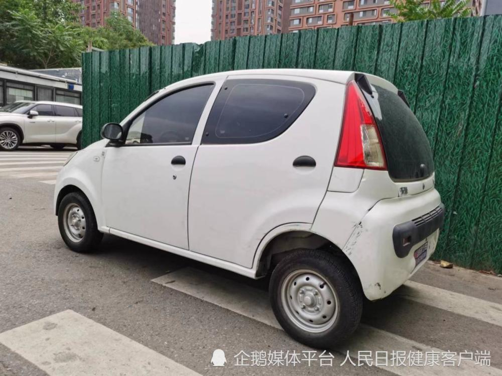
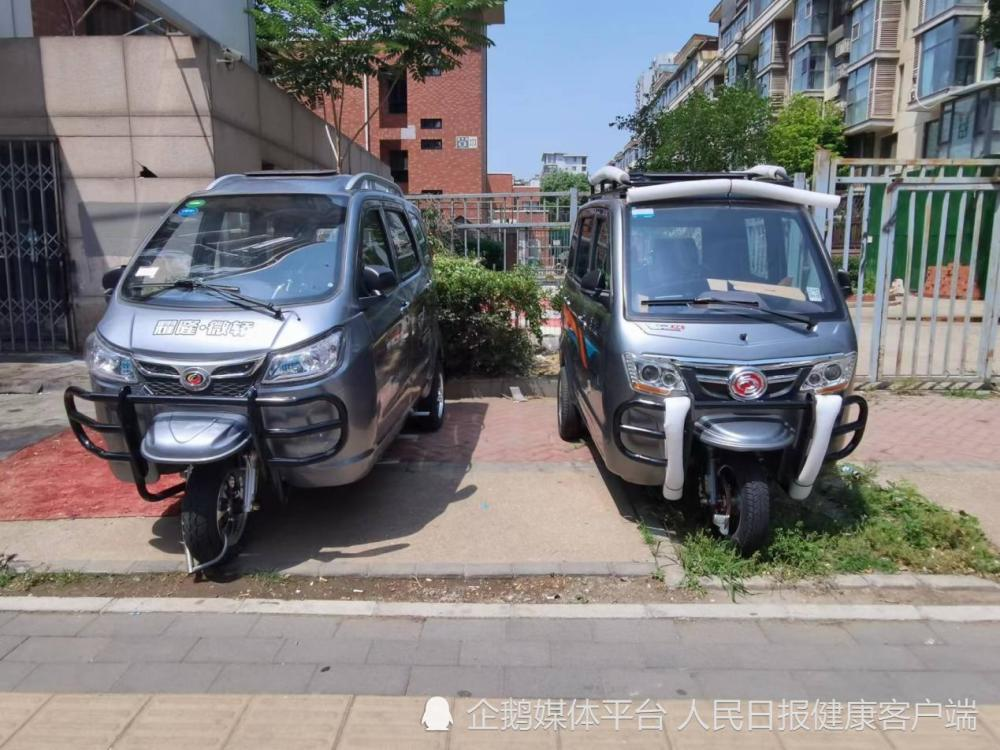

# 老年代步车即将退场，老年人出行需求如何填补？

**人民日报健康客户端记者 周学津**

66岁的郭良同（化名）被交警告知，平日里陪他走南闯北的“小车”，从明年1月1日起就不能上路行驶了。

据2021年7月12日北京发布的《关于加强违规电动三四轮车管理的通告》，违规电动三四轮车过渡期截至2023年12月31日，过渡期后（2024年1月1日起），违规车辆将不得上路行驶，不得在道路、广场、停车场等公共场所停放。违规上路行驶或停放的，执法部门将依法查处。

“那我以后出门在外得想个法子了。”郭良同说。

_北京的马路上仍能看到停泊的老年代步车。周学津 摄_

**老年代步车是杜撰概念**

“有些老人开得很‘野’，逆行、闯红灯、上环路。我开车遇到都尽量避开。”在出租车司机刘鹏（化名）看来，这种老年代步车给予驾驶者的视野范围很窄，转弯时非常容易与行车发生剐蹭。

老年代步车是低速电动车，俗称“老头乐”，绝大多数属于违规电动三轮、四轮车。据“北京交警”消息，2022年北京发生违规电动三轮、四轮车亡人交通事故130余起。工信部公布的一项统计数据显示，2013年到2018年，因低速电动车引发的交通事故达83万起，造成1.8万人死亡、18.6万人受伤，由低速电动车引发的事故起数和死亡人数逐年增长。

北京交管部门曾发布文章指出，所谓的“老年代步车”是生产厂商凭空编造的一个词，这种车辆绝大部分属于违规电动三轮、四轮车，未经工信部许可生产，未列入《道路机动车辆生产企业及产品公告》，车辆性能不符合机动车安全技术标准。

国家发展和改革委员会综合运输研究所城市交通中心主任程世东告诉人民日报健康客户端记者，所谓的老年代步车普遍被设计成窄车身、轻底盘，用材廉价，车辆稳定性差，缺乏基本的安全配置，很多车辆出厂前可能都未进行碰撞测试，安全性能无法保证。

早在2016年，中国消费者协会曾对当时市场上热销的3款老年代步车进行碰撞试验。实验结果显示，即使是在设定条件比实际发生事故更宽松的情况下，老年代步车内驾驶座上的假人仍发生头部受伤严重、前座位移导致胸部受伤，甚至车身脱离，假人直接撞击方向盘和风挡的情况。

“2021年7月开始，北京就不允许再生产和销售老年代步车了，现在还在马路上跑的几乎都是2021年7月之前卖出去的。那时候老年代步车均价在5000元到6000元左右。现在我们只卖国标三轮车，‘老头乐’已经不卖了。”曾经售卖老年代步车的王刚（化名）告诉人民日报健康客户端记者，以往售出的老年代步车不需要上牌、不需要考驾照，也不需要上保险。

_需要驾驶者考取摩托车驾照才能上路的三轮车。周学津
摄_

**有些家庭的“无奈选择”**

王刚的门店外停着一辆老年代步车，人民日报健康客户端记者发现，这辆老年代步车只有可以显示电量和速度的显示屏，没有安全带，有雨刷器和雾灯，自带暖风。“以前有人说这就是个农用三轮车套了一层壳。”王刚说。

人民日报健康客户端记者走访多位老年代步车车主了解到，目前，绝大多数老人驾驶老年代步车的主要用途是接送孩子、为家庭采购物品等，对于出行需求大的老年人、收入不高的家庭来说，老年代步车是一个高性价比的出行工具。

出租车司机刘鹏的父亲也开着一辆老年代步车，他认为老年代步车之所以较为常见，是源自很多家庭较为“无奈的选择”，“购车花费高、摇号等得久，即使上述两个问题都得到解决，考驾照对于老年人来说难度较大。”

程世东告诉人民日报健康客户端记者：“欧美国家机动化驾驶起步早，很多人在年轻时就已经取得驾照。这几年，我们也一直在完善相关的政策。2020年10月，我国取消申请小型汽车、小型自动挡汽车、轻便摩托车驾驶证70周岁的年龄上限。”程世东认为，随着我国居民人均寿命提升、健康状况改善，放宽学驾年龄是适应老龄化社会发展的新需求。

**老年代步车退场，原需求如何补齐？**

4月12日，北京市交管局再次强调，自2024年1月1日起，违规电动三、四轮车不得上路行驶，不得在道路、广场、停车场等公共场所停放。除北京外，江苏、安徽等地也出台了对老年代步车的管制措施。

“虽然可以买正规的三轮摩托车或者直接买个汽车代步，但就算不考虑摇号的问题，让我这六十多岁的老头去学驾照就不是件容易的事。今后出行该怎么办，我确实还得好好想想。”郭良同说。

程世东介绍，目前，我国大多数城市实现了公交车线路的“500米覆盖”，但这种覆盖是以站点为圆心，以500米为半径画圆后，圈出来的大致范围。在前往公交车站点的路上，由于具体线路的影响，从家到站点的实际距离可能已经超过了500米。“和年轻人相比，老年人的体力储备普遍不高，且体力消耗快，为了让老年人的出行更舒适、更有效率，交管部门可以进一步优化城市公共交通线路，提高城市公共交通的覆盖率。”

“如果短时间内无法完成城市公交线路的调整，可以采用‘社区交通微循环’的方式。”程世东解释，在假定现在公交线网站点不变的前提下，社区可以借鉴景区里摆渡车的形式，让老年人从家门口到公交站或地铁站都有车辆接送。“满足老年人出行需求，一定要让车子多跑路，让老人少跑路。”

湖南大学建筑与规划学院副教授、健康城市研究室主任丁国胜认为，在老龄化的时代背景下，保障老年人的日常出行需求，满足其获取日常物资和健康资源的需求，是建设健康城市的重要方面。从长期来看，这是一个如何响应健康老龄化的问题，对老年人出行进行适老化改造是非常重要的方面。

丁国胜告诉人民日报健康客户端记者，短期来看，老年代步车退场后，可能会给曾经驾驶的老人带来一定不便，需要政府、社区和家庭在这个过程中共同发挥作用。“政府应加强相关政策的宣贯，为营造更加健康和安全的出行环境营造氛围；社区可以形成老年互助组织，针对社区老年人的需求制定相应计划，鼓励社区志愿者帮助老人；家庭成员则应主动帮助老人获取各类物资、服务和设施，鼓励其了解相关政策，采取更加安全的交通出行方式。”

无论是国内，还是国外，针对老年出行的适老化改造都进行了非常多有益的探索。“建设老年关爱城市非常重要，可以持续提高公共交通适老化改造水平，提高老年人公交出行的安全感和体验感。真正考虑老年人的出行特点和需求，有针对性地进行适老化改造，使得老年人出行各个环节更加安全，更有保障，更为健康。此外，营造老年关爱的文化，形成互助互爱的社区环境，能够及时帮助解决老年人出行中遇到的问题，这是一个比物质性适老化改造更加重要的问题。”丁国胜说。

“前几天，跟孙子闲聊时听到一句话，我印象很深‘世界那么大，我想去看看’。我们确实年龄大了，其实生活的范围不止眼前这一方小天地，我们也希望去远方，探索更大的世界。”郭良同的“小车”退役了，但能让他去远方的“路”正越来越宽。

