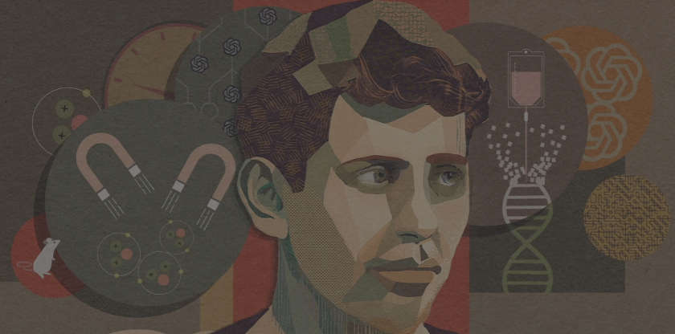

# 赚了几辈子都花不完的钱后，美国科技富豪们想要长生不老

**划重点：**

  * _1_ 抗衰老研究是一个有前途的投资领域，2024年全球市场规模超过2710亿美元。
  * _2_ 包括扎克伯格、贝索斯、泰尔、谷歌联合创始人等硅谷科技圈大佬均向抗衰老领域投入巨资。
  * _3_ ChatGPT之父奥特曼投入1.8亿美元研究抗衰老，自己悄悄服用二甲双胍。
  * _4_ 马斯克公开反对寿命的过度延长，称旧观念会造成“社会窒息”，阻碍进步。

腾讯科技讯
6月11日消息，以色列历史学家尤瓦尔·赫拉利在《未来简史》中写道，等到人类拥有巨大的新能力、饥荒、瘟疫和战争的威胁也终于消除，接下来的目标很可能是长生不死、幸福快乐、以及化身为身。自古以来，人类一直渴望青春之泉。如今，我们对健康的痴迷开始蔓延到对生命永恒的追求。在数十亿美元资金的支持下，硅谷抗衰老初创公司正在寻求延缓人类的衰老与死亡。

根据市场数据研究平台CB
Insights提供的数据，2018年，投资者向老龄化和抗衰老初创公司投入了超过8.5亿美元。到2024年，全球抗衰老市场规模预计将超过2710亿美元。抗衰老研究看起来像是一个有前途的投资领域，原因在于过去并没有吸引到太多的资金，至少相对于问题的规模而言。根据美国医疗保险和医疗补助服务中心的数据，美国近五分之一的国内生产总值（约4.3万亿美元）用于医疗保健，其中大部分用于治疗老年人。长寿研究人员普遍认为，如果一种药物可以延缓衰老，它可能有助于推迟一系列严重疾病，包括癌症和心脏病。

目前，美国的抗衰老产业主要分为两派：以研究长寿的科学家为主的健康派（healthspanners），和以硅谷大佬为主的永生派（immortalists）。健康派倡导，人类应通过健康的生活方式减缓衰老过程，获得更长久、更高质量的生存。他们认为，人类不会长生不老，也不希望人类长生不老。相反，健康派寻求识别和阻止绝症的原因。在他们的完美世界里，人类都将健康充实地生活，然后快速无痛地辞世。

另一方面，永生派认为人类有可能--甚至很有可能--
利用科学技术来阻止死亡。像算法和高级人工智能一样，永生派相信他们可以给人体编程，创造一个进化由人类而不是自然控制的未来。

从生物学的角度来看，活得越久，我们在地球上就越不受欢迎。从技术上讲，我们只有一项工作--
传递自己的基因。之后，我们只是占用空间。所以，当我们到了30岁后，衰老过程加速，每一天都让我们离辞世更近一步。

想要真正理解衰老过程的细节要复杂很多。首先，尽管有大量的研究，但医生和科学家仍不确定长寿主要是由我们的基因，亦或是生活方式和环境决定的。我们所知道的是，衰老
--随着年龄的增长而恶化的过程--
最终是我们任何人都无法避免的。随着时间的推移，我们的细胞变得衰老，并停止自我修复。身体无法愈合导致炎症，从而促使心脏病、阿尔茨海默氏症和关节炎等慢性疾病出现。一致的观点告诉我们，这些疾病中的每一种都是独立的，应该单独治疗。不过许多科学家都认为，衰老是许多慢性病的主要原因。如果真是这样的话，通过隔离衰老细胞，我们就有可能“治愈”衰老。

**硅谷大佬痴迷长生不老**

近年来，硅谷的大佬们纷纷投入巨资研究"长生不老"之术，试图揭开生命延续的奥秘，让自己能够青春永驻。在过去的十年里，Facebook创始人马克·扎克伯格（Mark
Zuckerberg）、亚马逊创始人杰夫·贝索斯（Jeff Bezos）和PayPal联合创始人彼得·泰尔（Peter
Thiel）都在延长寿命和抗衰老的研究上投入了大量资金。

亚马逊创始人杰夫·贝索斯（Jeff Bezos）和PayPal联合创始人彼得·泰尔（Peter Thiel）都投资了总部设在旧金山的Unity
Biotechnology。该公司专注于衰老细胞方面的研究，研究工作的一个主要部分并不是专注于衰老本身，而是专注于设计药物和治疗方法，来使得一个人能够尽可能长时间地保持健康和各个器官的正常运转，远离与衰老有关的疾病。在2018年上市之前，Unity
Biotechnology累计募集到超过3亿美元资金。不过在周五收盘时，该公司市值仅为4950万美元，远远低于2018年巅峰期的9.72亿美元。

《麻省理工科技评论》在2021年9月报道称，贝索斯向抗衰老初创公司Altos
Labs投资了一笔未披露的资金，该公司于同年早些时候刚成立。据其官网介绍，这家总部位于旧金山的生物技术公司专注于“细胞再生编程”，这是一种逆转疾病、损伤和残疾的理论化方法。

泰尔可能是硅谷最著名的抗衰老研究支持者之一。泰尔资助的一家名为Ambrosia的初创企业重新采用了20世纪50年代名为异种共生的实践，该实践对老鼠的循环系统进行了切开和缝合实验。这些研究没有得出具体的结论，但这家总部位于加利福尼亚州蒙特雷的公司仍开始了类似的人体试验
--将年龄不到25岁的人的血液注入35岁及以上的参与者--
声称有返老还童的效果。“这是非常奇怪的事情之一，人们在20世纪50年代做了这些研究，然后就完全放弃了，”泰尔在2015年接受采访时称。“我认为有很多这样的东西奇怪地没有被探索。”但是到了2019年，美国美国食品药品监督管理局发布了一项针对异种共生现象的警告。Ambrosia如今已无法再进行类似的手术实验。

这并没有阻止其他科技亿万富翁追求类似的最终目标。扎克伯格和他的妻子陈慧娴（Priscilla
Chan）是科学突破奖的联合创办人。据其官网介绍，该奖每年奖励300万美元给“在理解生命系统和延长人类寿命方面取得变革性进展”的科学家。“我对关于人的问题最感兴趣，”扎克伯格在2015年曾说。“什么能使我们长生不老？如何治愈所有疾病？大脑是如何工作的？学习是如何工作的，我们如何让人类能够学习一百万倍的东西？”

据《纽约客》报道，甲骨文联合创始人拉里·埃里森（Larry
Ellison）已经向抗衰老研究捐赠了至少3.7亿美元。还有一个例子就是Calico。该公司是谷歌于2013年成立的子公司，拥有15亿美元的资金来研究衰老的原因以及如何应对衰老。“硅谷人认为那些问题是可以解决的，只要有足够的时间和采取足够多的行动。”总部位于华盛顿特区的健康研究机构Global
Healthspan Policy Institute的总裁凯文·佩罗特(Kevin
Perrott)指出，“很显然，该类研究的成果带来的回报会十分巨大。如果你能够把那些研究成果带到市场上，等于你就有了全世界都需要的东西。”

**以下是知名硅谷抗衰老初创公司列表：**

\--Calico是Alphabet旗下的抗衰老子公司，拥有25亿美元的资金。自2013年成立以来，该公司一直保持相当低调。

\--Juvenescence拥有1.65亿美元的资金，用于开发“抗衰老”药物，清除体内停止分裂并可能对其他细胞造成损害的细胞。

\--Unity Biotechnology正在开发针对衰老细胞的药物。该公司由贝索斯、泰尔和长寿基金支持，在2018年年上市，市值一度达到9.72亿美元。

\--“返老还童”初创公司Life Biosciences已募资超7500万美元，致力于研究对抗与年龄相关的衰退。

\--Samumed是一家利用干细胞再生头发、皮肤、骨骼和关节的公司，已募资6.5亿美元，估值120亿美元。该公司已经从风投公司安德森·霍洛维茨基金、Khosla
Ventures和Felicis Ventures等公司筹集了3390万美元用于治疗衰老。

\--Elysium Health已募集到7100万美元资金，基于老化研究开发直接面向消费者的健康产品。

\--NewLimit，人类变老是因为随着年龄增长器官出现了衰退。如果对遗传细胞进行重新编程，能够逆转这种衰退，也就能让人长生不老。该公司联合创始人包括Coinbase的联合创始人布莱恩·阿姆斯特朗（Brian
Armstrong）。

**ChatGPT之父奥特曼重金投入**

抗衰老的突破能给人类寿命增加10年健康寿命吗？OpenAI的首席执行官山姆·奥特曼(Sam Altman)正在付费寻找答案。当一家名为Retro
Biosciences的初创公司在2022年年中摆脱隐形模式时，它宣布已获得1.8亿美元的资金，为一项大胆的任务提供资金：将人类的平均寿命延长10年。就在一年前，该公司刚在旧金山附近的一个原始仓库空间建立了总部，用螺栓将集装箱固定在混凝土地板上，以便为被吸引加入该公司的科学家快速腾出实验室空间。

《麻省理工技术评论》最近披露，这笔资金由37岁的创业大师兼投资人、OpenAI首席执行官奥特曼提供。奥特曼对延长寿命表现出浓厚的兴趣，虽然依旧年轻，但他已开始通过服用糖尿病药物二甲双胍“抗衰老”了。此外，奥特曼个人的抗衰老方案还包括“努力健康饮食、锻炼、充足睡眠”。服用二甲双胍在硅谷圈子里也很受欢迎，理论上它可能能够让人们更长时间地保持健康。

奥特曼几乎所有时间都在人工智能公司OpenAI工作，近年来，该公司的聊天机器人以其类似人类的能力震撼了科技界。但是奥特曼的钱就不一样了。他说他已掏空了他的银行账户来资助另外两个非常不同但同样雄心勃勃的目标：无限的能量和延长的寿命。

他在2021年接受采访时表示，其中一个投资是核聚变能源初创公司Helion
Energy，他已向该公司投入了超过3.75亿美元。另一种是Retro，同年奥特曼向该公司投入了1.8亿美元。“这确实很多。我基本上把所有的流动资产净值都投入到这两家公司，”奥特曼说。

奥尔特曼长期以来一直是硅谷的重要人物，之前在旧金山经营初创企业孵化器Y
Combinator，但外界对他本人了解甚少。随着OpenAI发布能够写诗和回答问题的软件ChatGPT，奥特曼也开始走红。据《财富》报道，人工智能的突破使这家成立7年的公司成为“科技超级大国俱乐部的一员”。微软承诺投资100亿美元，拥有150万推特粉丝的奥特曼正在巩固其作为重量级人物的声誉，他的创造似乎肯定会以深远的方式改变社会。

大约八年前，奥特曼对所谓的“年轻血液”研究产生了兴趣。在这些研究中，科学家将年轻和年老的老鼠缝合在一起，使它们共享一个血液系统（前文中提到的异种共生研究）。令人惊讶的是：老老鼠似乎部分恢复了活力。

一个可怕的实验，但在某种程度上，非常简单。奥特曼当时是Y
Combinator的负责人，他让手下研究抗衰老科学家的进展。“感觉就像这是一个我没有预料到的结果，”他说。“所以，有些事情正在发生……也许这里有一个比我们想象的更容易发现的秘密。”

2018年，Y Combinator为生物技术公司推出了一门特别课程，邀请那些拥有“激进抗衰老计划”的人申请，但不久后，奥特曼离开了Y
Combinator，专注于他在OpenAI中日益增长的角色。然后，在2020年，加州的研究人员表明，他们可以通过用盐水和白蛋白取代老年小鼠的血浆来实现类似于年轻血液的效果。这表明真正的问题在于旧的血液系统。简单地稀释它(和其中的毒素)，药物可能离治愈衰老更近了一步。

每项技术也有风险。就人工智能而言，是聊天机器人在散播谎言和错误信息。对于返老还童，如果它确实存在，一个经常被引用的风险是公众的怨恨，特别是如果它将首先提供给像奥特曼这样的富人。2016年，在奥特曼的导师之一
--泰尔表示有兴趣接受年轻人的输血后，他被媒体嘲笑为寻找年轻受害者的吸血鬼。一年后，HBO恶搞节目《硅谷》推出了一集名为《热血男孩》(Blood
Boy)的节目。在这部电影中，一位虚构的科技公司首席执行官参加了一次会议，而他的血管与一位英俊的年轻人的血管相连，这位年轻人被介绍为他的“输血助手”。

奥特曼认为，大多数生物技术公司习惯于动作太慢，而且通常“经营不善”。他认为，现在需要的是在长寿方面的“OpenAI努力”。“Retro的主要目的是成为一个真正优秀的生物创业公司，因为这是一件罕见的事情，”奥特曼说。“它将伟大的科学和大公司的资源与创业精神结合起来，把事情做好。这是目前的项目。”

**马斯克公开反对**

与其他希望长生不老的硅谷科技大佬不同，特斯拉首席执行官伊隆·马斯克（Elon
Musk）一直在公开反对寿命的过度延长。在马斯克看来，旧观念会造成“社会窒息”，阻碍进步。

马斯克在去年接受媒体专访时表示，虽然他认为出生率下降是“人类文明未来的最大威胁”，但长寿对他来说不是那么重要。“我认为我们不应该试图让人类活得很长。这将导致社会窒息，因为事实是，大多数人不会改变他们的想法，”马斯克说。“如果没有死亡，我们就会被旧思想束缚，社会就不会进步。”

为了让民主正常运转，马斯克认为，政治领导人的理想年龄应该在他们所统治的人口平均年龄的10到20岁以内。关于他自己的人性问题，马斯克说，虽然保持健康很重要，但他并不害怕死亡，因为这将“成为一种解脱”。马斯克还表示，美国的缔造者们规定了任职的最低年龄。但是他们没有给出最大年龄，因为他们没有预料到人们会活得这么长。他说。“因为民主制度要发挥作用，领导人必须合理地接触大多数人。如果你太年轻或太老，你不能说你会被重视。”

马斯克的观点是一个与众不同的观点，至少在硅谷的亿万富翁中是如此。如果人类无法战胜死亡，那么如果能延缓死亡，亦或者推迟与衰老相关的疾病，会怎么样？硅谷许多大佬都有投资长寿研究的记录。但到目前为止，这些投资还没有取得真正意义的成功。

**抗衰老道路依旧曲折**

按照亿万富豪投资者吉姆·梅隆（Jim
Mellon）的说法，长寿是有史以来最大的投资机会。他断言：“我希望长寿对我和我的投资组合都有效。”据梅隆称，未来几年有三个领域将取得突破。抗糖尿病药甲福明二甲双胍（Metformin）似乎有助于人们延长寿命；大环内酯类抗生素雷帕霉素（Rapamycin）正受到越来越多的关注。与此同时，干细胞疗法和基因疗法被证明是有效的，但成本更高。

知名企业家和投资者通过支持抗衰老公司，希望在下一个大事件中获利。但正如《纽约客》指出的那样：“解决衰老问题似乎只存在几十年的时间，我们还没有看到该行业出现如同人们设想的那样改变游戏规则的创新。”虽然一些研究已经在实验室动物身上取得了成果，但在临床试验方面却鲜有进展。事实上，美国食品和药物管理局并没有将衰老归类为一种疾病，这使得将抗衰老药物推向市场的道路更加复杂。与此同时，缺乏监管使得膳食补充剂对长寿的影响未经证实，导致炒作和混乱。

更糟糕的是，2008年葛兰素史克以7.2亿美元收购抗衰老初创公司Sirtris的交易告吹，两年后葛兰素史克停止了抗衰老研究，理由是结果不理想，可能有副作用。正如一篇论文总结的那样，健康派衍生出的公司“风险很大，最有可能失败。”尽管如此，长生不老的诱惑太强大了，无法抑制企业家、科学家和亿万富翁寻找众所周知的不老泉的雄心。
(无忌)

