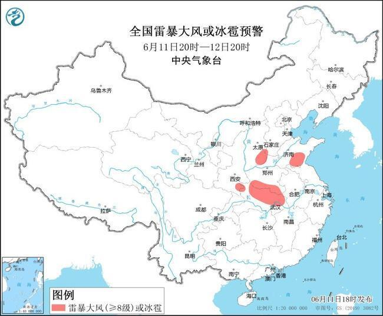
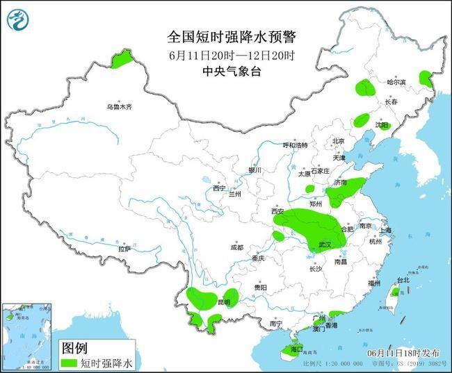
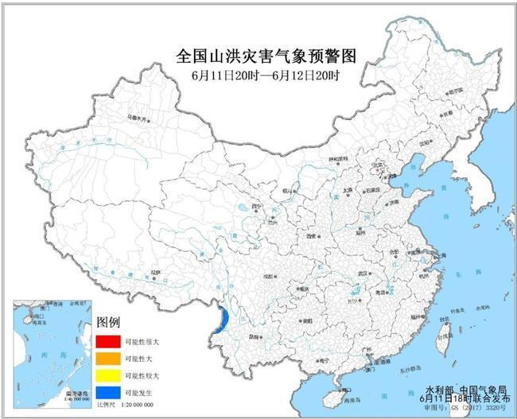
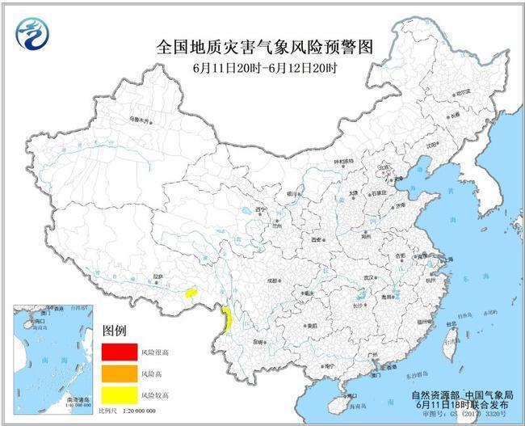

# 黄色预警！5省部分地区有雷暴大风或冰雹 云南局地或发生山洪灾害

6月11日18时，中央气象台继续发布强对流天气黄色预警，河南湖北等5省部分地区有雷暴大风或冰雹。同时发布的还有山洪灾害气象预警和地质灾害气象风险预警，其中云南局地可能发生山洪灾害。

**强对流天气黄色预警：河南湖北等5省部分地区有雷暴大风或冰雹**

中央气象台6月11日18时继续发布强对流天气黄色预警：预计6月11日20时至12日20时，陕西东南部、山西东南部、山东中南部、河南南部、湖北北部和东部等地的部分地区将有8-10级雷暴大风或冰雹天气，局地风力可达11级；黑龙江东南部、吉林西部、辽宁东部和西部、新疆北部、陕西东南部、山西东南部、山东中南部、河南南部、安徽西部和北部、湖北北部和东部、重庆东北部、云南中南部、广东南部沿海、海南岛中北部、台湾岛东北部等地的部分地区将有短时强降水天气，小时雨量20-40毫米，局地可达60毫米以上。

预计，强对流的主要影响时段为今天夜间和明天午后。

**山洪灾害气象预警+地质灾害气象风险预警！这些地方风险较高**

水利部和中国气象局6月11日18时联合发布蓝色山洪灾害气象预警：预计，6月11日20时至6月12日20时，云南西部等地局地可能发生山洪灾害（蓝色预警）。请各地注意做好实时监测、防汛预警和转移避险等防范工作。

自然资源部与中国气象局6月11日18时联合发布地质灾害气象风险预警：预计，6月11日20时至6月12日20时，云南西北部、西藏东南部局部发生地质灾害的气象风险较高（黄色预警）。请当地居民注意防范强降水引发的地质灾害，尤其是地质灾害隐患点附近区域。

消息来源：@中央气象台、中国天气网

编辑：唐文培

责编：周尚斗

审核：冯飞

