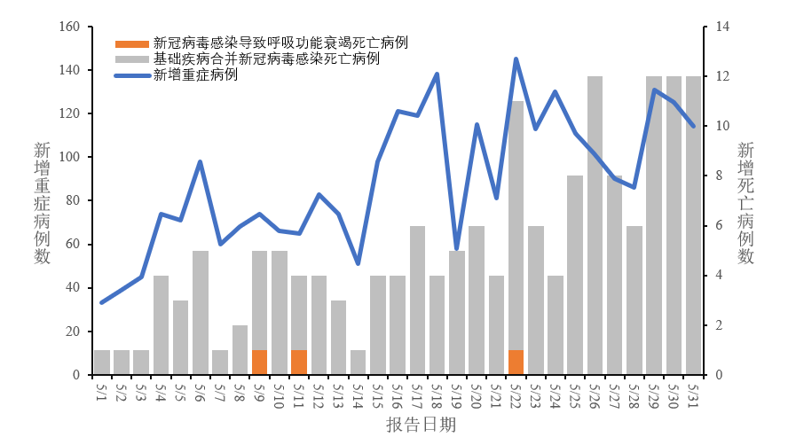
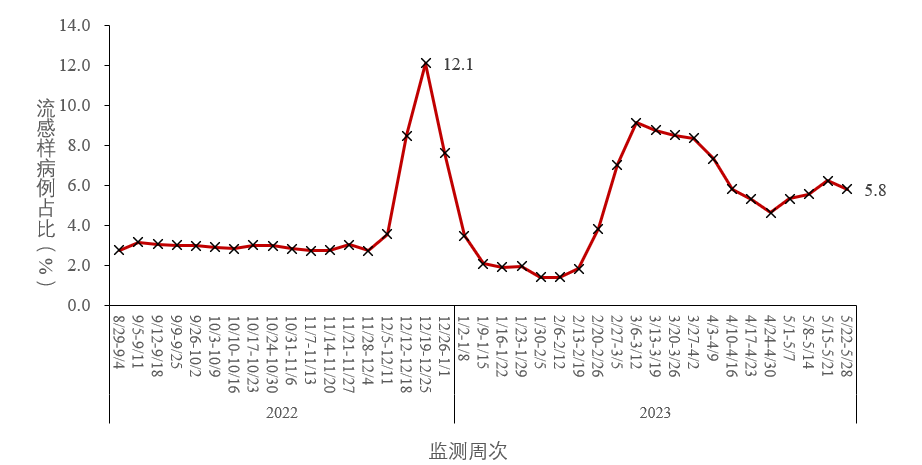
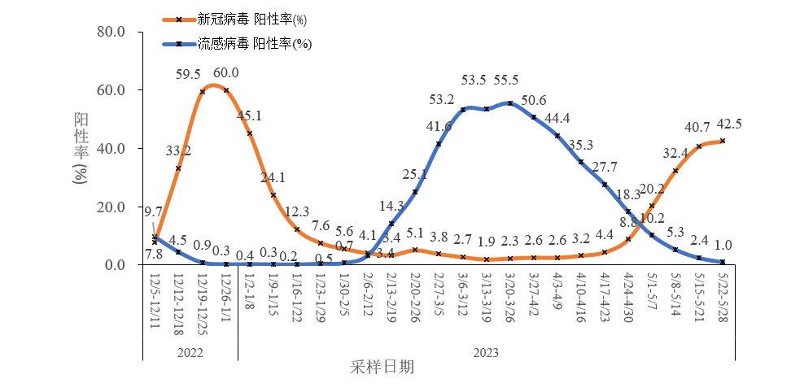
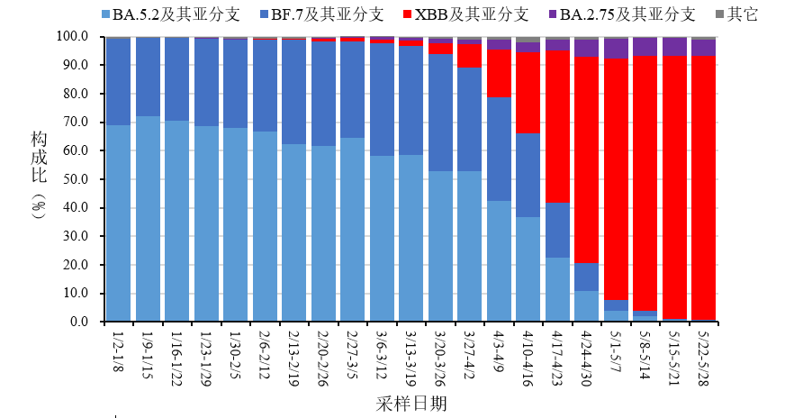

# 中疾控：5月报告新增新冠死亡病例164例，XBB及其亚分支占比逐渐增加

6月11日晚，中疾控通报全国新型冠状病毒感染疫情情况如下：

**一、全国新冠病毒感染重症和死亡病例报告情况**

2023年5月1日-5月31日，全国31个省（自治区、直辖市）及新疆生产建设兵团报告新增重症病例2777例、死亡病例164例（其中新冠病毒感染导致呼吸功能衰竭死亡病例3例、基础疾病合并新冠病毒感染死亡病例161例）。见图1。

_图1
全国新冠病毒感染新增重症和死亡病例报告情况_

**二、全国发热门诊（诊室）诊疗情况**

全国31个省（自治区、直辖市）及新疆生产建设兵团发热门诊（诊室）诊疗量从2023年5月1日的18.3万上升至5月16日的36.0万，之后波动下降至5月31日的29.4万。见图2。

_图2
全国发热门诊（诊室）诊疗人数变化趋势_

**三、哨点医院监测情况**

全国哨点医院流感样病例占门（急）诊就诊人数比例从2023年第17周（5月1日-5月7日）的4.6%上升至第20周（5月15日-5月21日）的6.2%，第21周（5月22日-5月28日）回落至5.8%。见图3-1。

_图3-1 全国哨点医院报告的流感样病例占比变化趋势_

流感样病例新冠病毒阳性率从第17周的8.8%快速上升至第20周的40.7%，之后缓慢上升至21周的42.5%。见图3-2。

_图3-2
全国哨点医院流感样病例新冠和流感病毒阳性率变化趋势_

**四、本土病例病毒变异监测情况**

2023年5月1日-5月31日，全国31个省（自治区、直辖市）及新疆生产建设兵团共报送14732例本土病例新冠病毒基因组有效序列，均为奥密克戎变异株，涵盖160个进化分支，主要流行株为XBB系列变异株，占比前三位的分别为XBB.1.9及其亚分支、XBB.1.16及其亚分支、XBB.1.5及其亚分支。

根据采样日期， XBB及其亚分支的占比逐渐增加，从5月1日-5月7日的84.6%，增长到5月22日-5月28日的92.4%。见图4。

_图4
全国新型冠状病毒感染本土病例变异株变化趋势_

注：世界卫生组织5月5日宣布新冠病毒感染疫情不再构成“国际关注的突发公共卫生事件”。新冠病毒感染在我国属于
“乙类乙管”传染病，按照法定传染病疫情信息公布要求每月公布一次。

综合监测数据显示，今年2月至4月上旬全国新冠病毒感染疫情局部零星散发，4月下旬开始逐步上升，5月下旬上升趋势减缓，目前呈下降趋势。与4月相比，5月发热门诊就诊量、重症和死亡病例有所增加，但总体水平较低，远低于去年年底疫情高峰时情况，重症和死亡病例以老年人群、患有基础性疾病人群为主，死亡病例平均年龄79.3岁，其中90%以上为基础性疾病合并新冠病毒感染。

