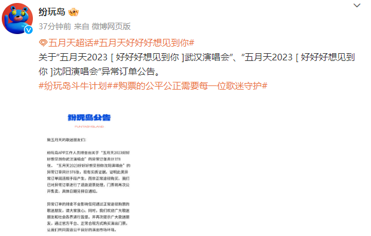
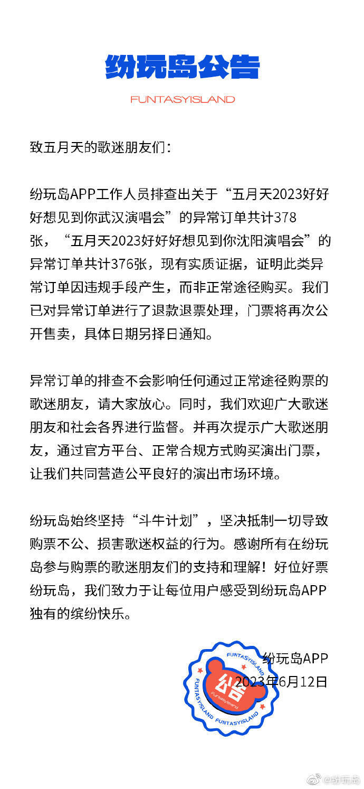
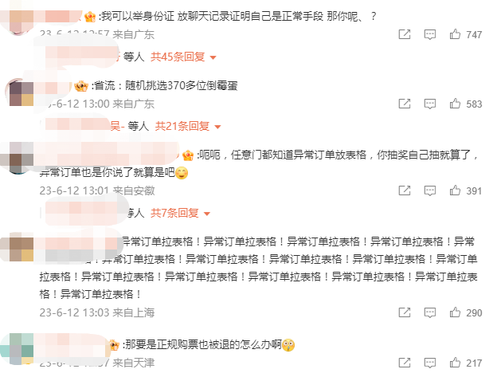

# 五月天演唱会部分门票被退票，官方回应后，网友要求晒证据

今（12）日，多名网友在网上发博称自己好不容易抢到的《五月天》演唱会门票被主办方退票。

对于网友反映出来的退票问题，演唱会主办方纷玩岛在官微做出了回应，发布了关于“五月天2023[好好好想见到你]武汉演唱会”“五月天2023[好好好想见到你]沈阳演唱会”异常订单的公告。

公告中表示，“工作人员排查出五月天2023武汉和沈阳两场演唱会的异常订单共计700多张，并且有实质证据，证明此类异常订单因违规手段产生，而非正常途径购买。现已对异常订单进行退款退票处理，门票将再次公开售卖，具体日期另择日通知。”同时表示，“异常订单的排查不会影响任何通过正常途径购票的歌迷朋友。”

最后还说道，“坚持‘斗牛计划’，坚决抵制一切导致购票不公、损害歌迷权益的行为。”

不过对于此次官方的回应，网友却并不认可，在留言区称自己是通过正规途径购票，并能拿出身份证和聊天记录来证明。喊话官方放出异常订单的证据，并拉出异常订单的表格，用事实来说明。

编辑 苏静

