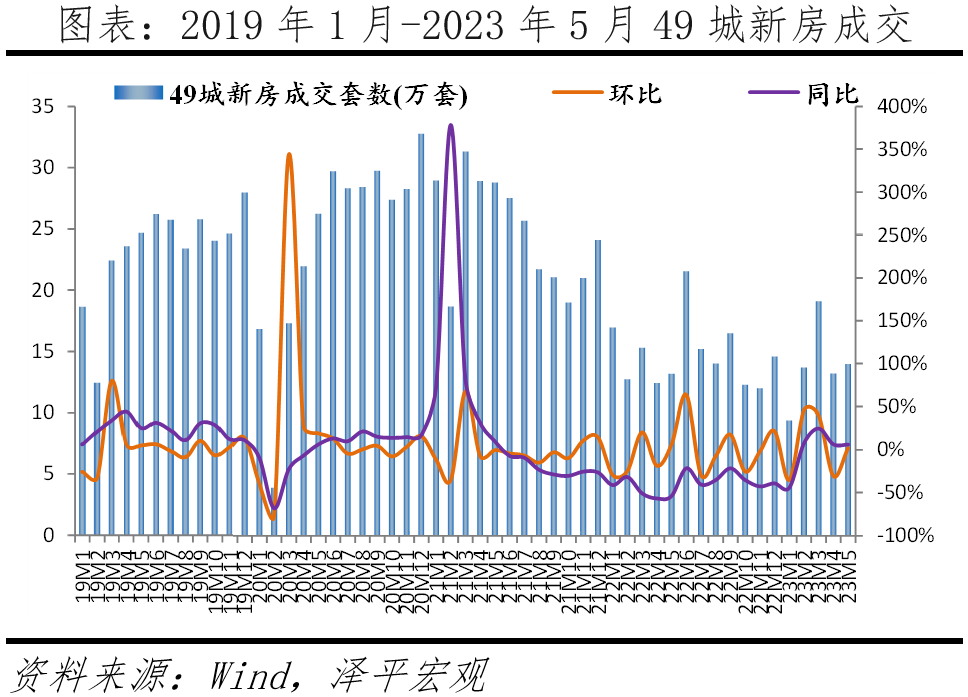
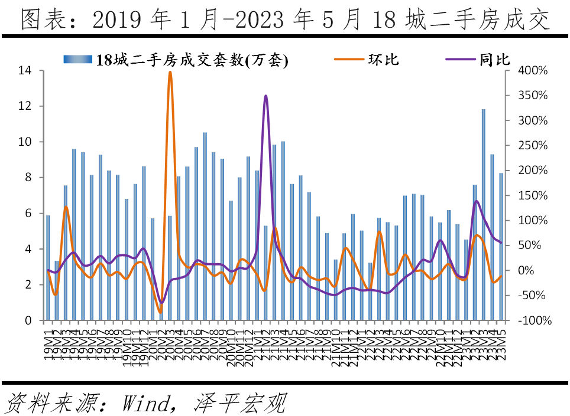
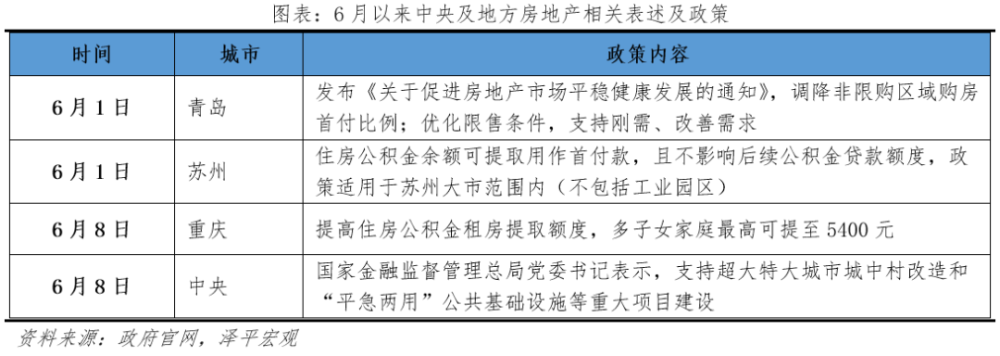
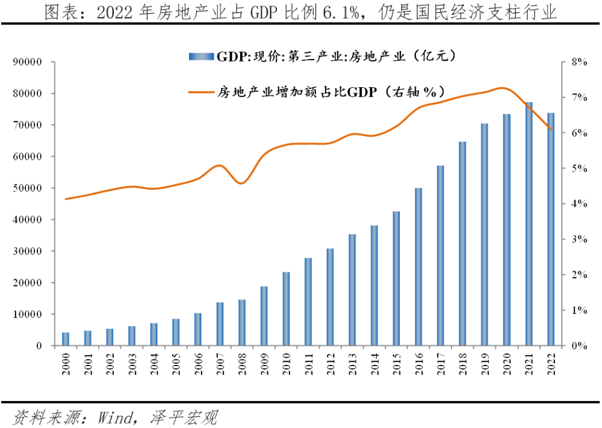
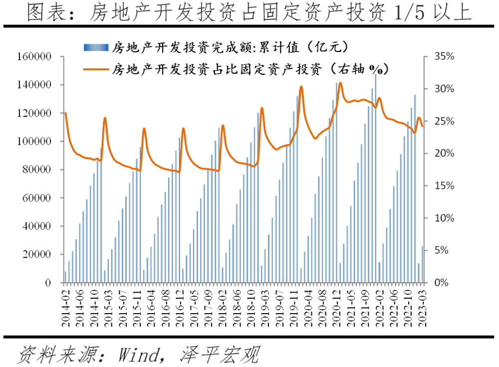
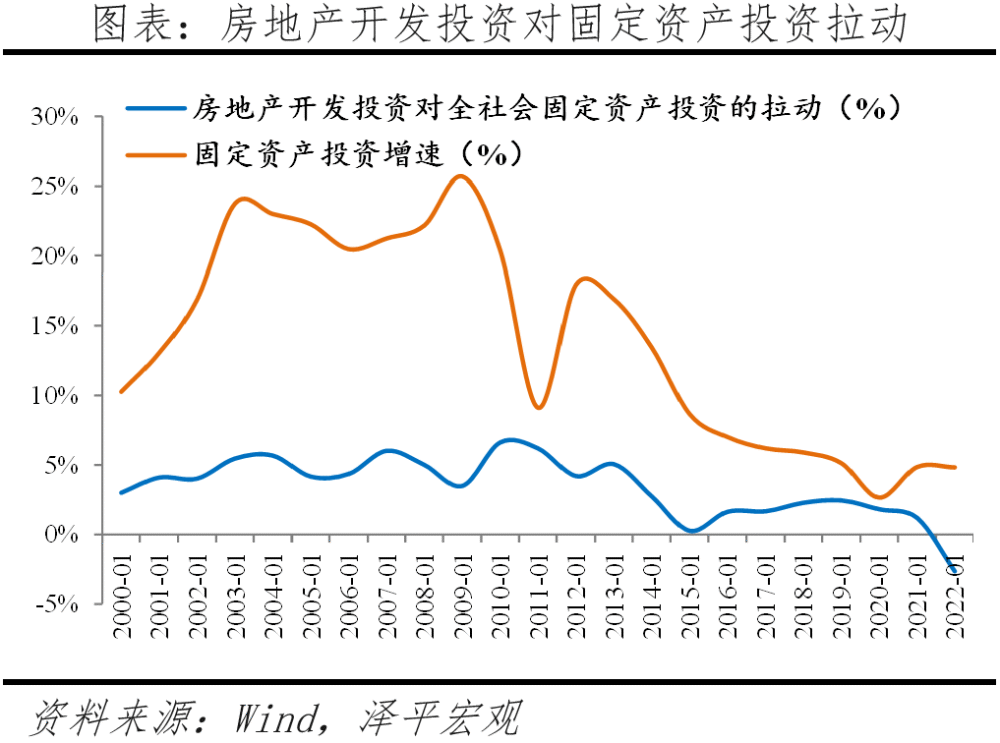
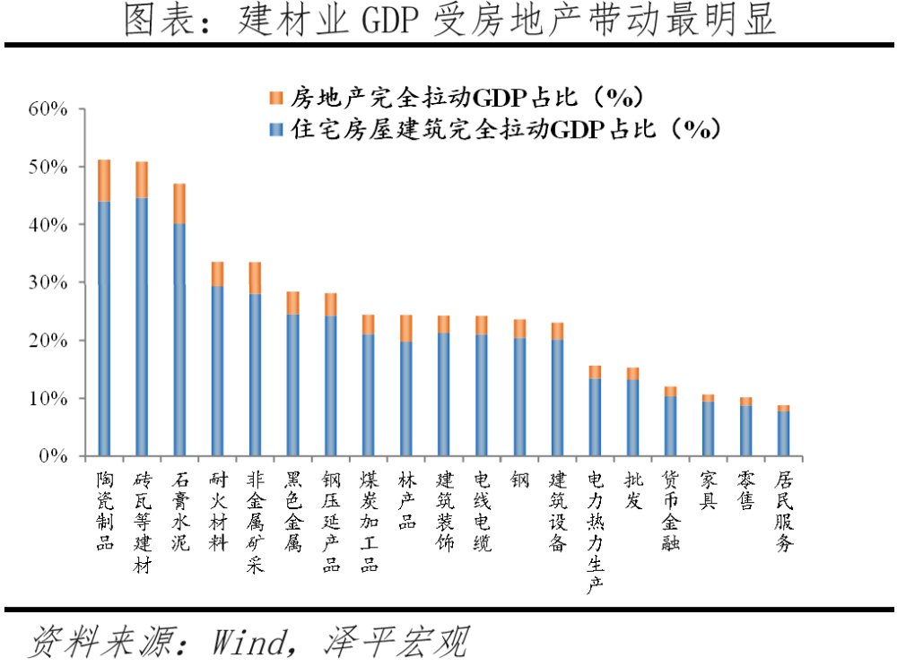

# 任泽平：现在不是要不要救楼市经济，而是怎么救来防止硬着陆风险

文：任泽平团队

**导读**

随着近期经济和楼市放缓，该不该救楼市，引发市场热议。

2023年4-5月，房地产销售快速下滑，拖累经济二次探底，政策暂时观望。

6月以来，青岛、苏州等地开展自救，青岛推出限售放松、非限购区域首付比例调整、棚改货币化安置和房票政策等稳楼市组合拳，苏州公积金账户余额可提取用于支付首付。

**该不该救楼市？我们认为，现在已经不是要不要救楼市、救经济了，而是怎么救，怎么尽快、大力度救，防止硬着陆风险。那些建议不救经济的观点，缺少基本的人文关怀，你看看现在的青年失业率达到20.4%，4-5月份经济数据大幅回落，居民不敢消费，预防式储蓄，企业不敢投资，1-4月民间投资只有0.4%。是该全力拼经济了，把发展放在首要任务，发展的目的是什么，就是解决就业和收入，这是最朴素的，这是根本，任何与此违背都是错的，无论是什么理由或者高大上的理论。**

**是该出手稳楼市了，稳楼市是为了稳经济、稳就业。房地产是国民经济第一大支柱行业，2022年房地产业增加值为7.3万亿元,占GDP的6.1%，房地产关系土地财政、关系60多个行业、关系几千万人就业，稳楼市有助于稳经济、稳就业、防风险。**

**怎么救？**
当前房地产有三大关键任务：稳楼市、保交楼和房企重组。楼市复苏持续的关键在于市场信心恢复、供给出清和销售回款。解决房地产问题宜早不宜迟，当前房地产市场尚未走出困境，风险尚未解除，建议在坚持“房住不炒”的前提下，按市场经济规律办事，尽快化解房地产行业困境。
**此前限购、限贷、限价等七限八限政策，是两三年前房地产过热时出台的，世易时移，形势已变，这些限制性措施应该适时退出，防止房地产硬着陆风险。**

**可以考虑七大措施，支持刚需和改善型需求，促进软着陆：下调二套房首付比以支持改善型需求，下调首套房贷款利率以支持首套刚需，对低收入家庭和应届毕业生的租房支出给予适当补贴，放开二线城市外地首套购房限制，降低交易税费，改变过严的限购限贷限价措施、恢复到正常市场状况，支持银行降低存量房贷利率、“带押过户”等便民善政。同时，通过“城市群战略、人地挂钩、金融稳定、租购并举”等构建新模式。**

相信经过一系列实质有力的措施，一定能够提振楼市信心，促进房地产长期平稳健康发展，为中国经济复苏贡献重要力量。

**正文**

**一、房地产销售下滑，土地市场偏冷，政策暂时观望**

**2023年4-5月，房地产市场热度较一季度下降，楼市增长动能持续放缓，复苏趋势不稳固。**

**销售端，2023年4-5月，市场成交明显放缓，环比放缓幅度高于2019-2022年同期，同比涨幅较3月越明显收窄，市场整体呈降温趋势。**

从新房销售看，4月成交环比回落幅度高于往年同期水平，5月环比略有回升，但回升程度不及往年；4、5月同比均有上涨，但较3月涨幅明显收窄。2023年4、5月，49个样本城市新房分别成交13.7、14.0万套，基本持平，环比分别变化-28.7%、+2.0%，较2、3月环比涨幅明显下滑，较往年同期成交乏力；同比分别变化10.2%、6.1%，低于3月25.5%的同比涨幅。其中，一线城市4、5月环比持续下滑，同比保持高增，主因去年低基数；二线城市环比4月明显下滑、5月略有回升，同比涨幅大幅收窄；三四线城市环比与二线城市类似，同比连续25个月下降。

从二手房销售看，4、5月成交环比由正转负、连续两个月下降，下降幅度高于2019-2022年平均水平；同比延续增长态势，但涨幅较3月大幅收窄。2023年4、5月，18个样本城市二手房分别成交9.3、8.3万套，环比持续下滑，不及2019-2022年二手房成交表现；同比延续之前的增长态势，但较3月涨幅明显收窄。其中，一线、二线、三四线城市环比增速均由正转负、连续下降；各线城市同比均保持正增长，但涨幅较3月都有明显收窄。

从房企销售看，百强房企整体销售放缓，企业业绩下滑，仅头部房企门槛值修复，城市分化加剧。环比方面，4月销售环比由正转负，5月环比4月出现近年来首度下滑；同比方面，受低基数影响，4、5月同比均保持正增长，但显著低于前两月涨幅。梯队方面，只有TOP10房企门槛值同比增长，TOP30、TOP50房企门槛同比均下降。城市方面，区域分化继续加剧，布局核心城市核心区域的房企销售表现相对较好。

**政策端，2023年以来，已有百余城出台房地产调控政策250余次。但4-5月地方政策放松频次边际放缓**
，其中，一线城市、强二线城市没有出现明显放松的政策。一线城市的边际放松以人才新政为主，二线城市、强三线城市以公积金、补贴政策为主。

**6月以来，事情正在起变化。**
青岛、苏州、重庆对楼市政策进行调整，6月1日，青岛打出楼市新政组合拳，涉及限售放松、非限购区域首付比例调整、棚改货币化安置和房票政策等内容；苏州公积金账户余额可提取用于支付首付，同时提取余额以后并不影响公积金贷款额度等。

**土地端，近期土地市场局部热度高、整体偏冷，核心城市核心地块供不应求。**
城市方面，热点城市市场火爆、城市间分化明显。5月，多个热点二线城市集中土拍，带动整体土地成交规模增速由负转正，土地出让金环同比双增。其中，南京、苏州、合肥等城市土地市场热度较去年显著提高，而济南、郑州、长春等城市以底价成交。企业方面，以央国企拿地为主，但民营房企也正在逐步回归土地市场，4-5月，部分经营稳健的民营房企积极参与拿地，在佛山、杭州、成都、宁波等城市参与土拍，反映民营房企拿地信心有所恢复。

**二、房地产该不该救：该出手了**

**（一）房地产是国民经济的第一大支柱，2022年房地产业增加值为7.3万亿元,占GDP的6.1%**

自2003年以来，国务院18号文将房地产定位为支柱性产业。20年来，房地产成为我国经济发展火车头之一。从房地产业GDP增加值看，2000-2021年我国房地产业增加值由4141亿元增加到7.7万亿元，
**房地产业占GDP比例由4.13%增加到6.7%，一般而言，在经济中占比超5%的行业可以成为经济的支柱产业。**
2022年，受房地产行业调整及疫情影响，房地产行业占GDP比例下调至6.1%，但仍与2015年水平持平。

**（二）房地产占固定资产投资比重五分之一以上**

**从房地产开发投资看，2022年房地产开发投资13.3万亿元，受疫情及房地产周期影响，比上年下降10%，但仍占固定资产投资的22.93%。**
房地产开发指房地产开发企业本年完成的全部用于房屋建设工程、土地开发工程的投资额以及土地购置费等的投资，属于固定资产投资的统计范畴，进而构成GDP固定资本形成，说房地产是国民经济的重要支柱毫不为过。

1998年住房制度全面市场化以来，房地产业固定资产投资大幅增长。2000-2022年间，房地产开发投资从4902亿元到13.3万亿元，年均复合增长率为16.2%。
**房地产开发投资占固定资产投资的比重从14.9%到22.9%，意味着每年全国进行固定资产投资的资金中，1/5以上投入了房地产业。**

**（三）房地产带动几十个上下游行业链**

**房地产通过投资、消费既直接带动与住房有关的建材、家具、批发等制造业部门，也明显带动金融、商务服务等第三产业。**

根据国家统计局最新的2020年投入产出表，我们估算出广义的房地产业完全拉动上下游GDP
10.02万亿元、直接拉动上下游GDP2.35万亿元。分行业看，货币金融、零售、钢压延、石膏水泥由广义房地产行业拉动的GDP增加值居前列，分别为8107亿元、4230亿元、3527亿元、2820亿元。陶瓷制品、砖瓦等建材、石膏水泥由房地产完全拉动的GDP占该行业总GDP占比最高，高达51.2%、50.9%、47.1%。

**（四 ）城镇化尚有一定空间，改善型需求支撑房地产市场**

**我们连续5年在《中国住房存量报告》系列中跟踪研究发现，综合考虑城镇化进程、改善性需求、城市更新等，中国房地产市场未来仍有发展空间。**
根据我们测算，2023-2032年年均新增城镇居住需求约10.9亿平。

2023年我国每年新增城镇居住需求约12亿平方米，城镇常住人口增加（剔除行政区划变动，后同）、居住条件改善、城市更新需求分别占总需求的31.5%、
32.7% 、35.8%。2032年总需求波动降至10亿平方米，城镇常住人口增加、居住条件改善、城市更新需求分别占总需求的15.4% 、37.4%
、47.2%。 **改善性需求总量、占比均呈现逐年增长趋势，2023年后有望超越城镇常住人口增长带来的需求成为最大的需求。**

**四、怎么救？**

**房地产是国民经济第一大支柱行业，稳楼市有助于稳经济、稳就业、防风险。房地产问题解决宜早不宜迟，建议尽快化解地产困境，这样有利于稳经济，也能通过短期措施促进房地产市场稳定，又能通过新模式建设促进房地产市场健康发展。**

**当前房地产有三大关键任务：稳楼市、保交楼和房企重组。在坚持“房住不炒”的前提下，要按照市场经济规律办事，发挥房地产实体经济属性，避免其金融属性死灰复燃。**

**1、短期稳楼市：因城施策、适度松绑，促进软着陆。**

**1）坚持房住不炒，因城施策适度松绑，促进房地产软着陆** 。
**此前的限购限贷限价等七限八限政策，是两三年前房地产还处于过热状态时候出台的，世易时移，形势已变，此前过严的限制性措施可以适时推出。通过放松前期偏紧的调控政策支持刚需和改善型需求，比如适当降低人口流入地区限购门槛、下调首套和改善型二套首付比、下调首套和改善型房贷利率、提高公积金贷款限额或允许提取未纳入贷款额度计算的公积金余额付首付、降低落户和购房门槛等。**

**2）通过贷款展期、债务重组、并购等方式化解房企风险。**
通过压实地方主体责任建立房地产纾困基金并配套金融工具支持保交楼保稳定，通过支持优质房企尤其民营房企并配套AMC等进行行业内并购重组。

**2、长期：以城市群战略、人地挂钩、金融稳定、房地产税、租购并举为核心加快构建房地产新模式**

根据我们对发达经济体住房制度和房地产市场的研究，结合中国住房制度现状和发展阶段特点，
**建议以城市群战略、人地挂钩、金融稳定、房地产税、租购并举为核心加快构建房地产新模式。**

**1）推动都市圈城市群战略** 。人随产业走，人往高处走。二十大报告指出，深入实施区域协调发展战略、区域重大战略、主体功能区战略、新型城镇化战略。

**2）以常住人口增量为核心改革“人地挂钩”，优化土地供应。**
推行新增常住人口与土地供应挂钩、跨省耕地占补平衡与城乡用地增减挂钩，严格执行“库存去化周期与供地挂钩”原则，优化当前土地供应模式。

**3）保持货币政策和房地产金融政策长期稳定。**
稳定购房者预期，支持刚需和改善型购房需求。规范房企融资用途，支持房企合理融资需求，提供一定时间窗口让存在问题的房地产企业有自救机会。

**4）稳步推动房地产税试点。**
房地产税替代土地财政是大势所趋，2021年，中央提出开展房地产税改革试点工作。未来有必要建立科学的经济模型评估房地产税对各方影响。

5）二十大报告强调， **“加快建立多主体供给、多渠道保障、租购并举的住房制度”。**

