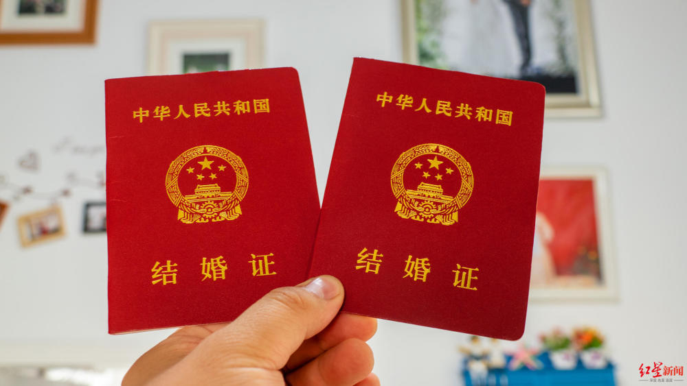
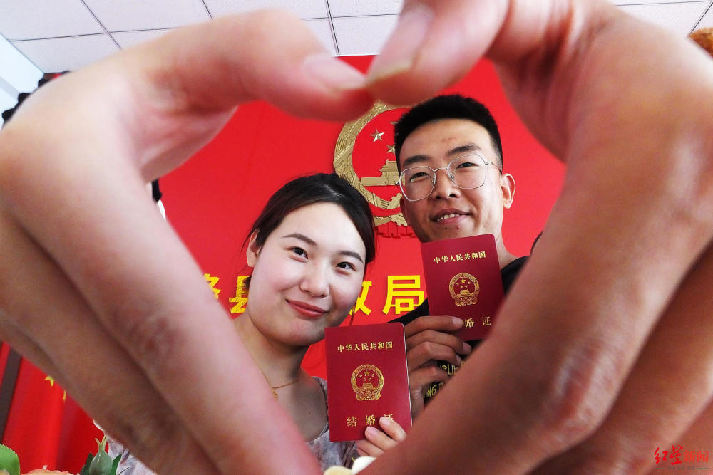

# 全国结婚登记创新低背后：多地结婚年龄上涨，专家称年轻人婚育正推迟

民政部最新发布的统计季报数据显示，去年全国结婚登记量为683.3万对，再次创下民政部自1986年以来公布结婚数据的历史新低。

从民政部历史数据来看，结婚数自2013年达到1346.9万对的最高峰后，几乎以每年减少80万对的速度下降。2019年，我国结婚人数跌破1000万对大关；疫情肇始的2020年直降100多万对，跌破900万对；2021年跌破800万对，创下有记录以来最低点；去年则跌破700万对。与2013年最高峰相比，结婚数9年来下降近一半。

_↑资料配图
据ICphoto_

6月12日，西安交通大学人口与发展研究所教授姜全保和中国人民大学人口与发展研究中心副主任宋健接受红星新闻记者采访时均表示，去年的结婚数字，最直接的影响因素是疫情和低出生队列。基数降低的影响或将持续一段时间。婚育推迟和结婚意愿的变化，短期内也难扭转。

短期还是长期？

专家称年轻人婚育在推迟

据国家统计局编著出版的《中国统计年鉴2022》，2021年我国初婚人数为1157.8万人，比上一年减少70.8万人，为1985年以来的新低，2010年初婚人数多达2200.9万人。

姜全保和宋健都认为，去年的结婚数字，最直接的影响因素是疫情和低出生队列。我国年出生人口数在上世纪末本世纪初经历了一波下降，从1998年开始低于2000万，从2003年开始维持在1600万左右，这些低出生队列的人现在开始进入到婚育年龄，适婚年龄人口基数的下降造成结婚数的下降。

那么，疫情影响因素的消除，会不会让结婚数回升？宋健指出，低出生队列的影响还会持续一段时间，这样可能未来会在现有水平上略有回升，但回升幅度应该不会太大。

不过，姜全保认为，回升的可能性不大，结婚率的总体趋势也是下降的，受生活压力和观念变化影响，年轻人的结婚意愿比较低，同时婚育也在推迟。

宋健也指出了婚育推迟的影响，以及在年轻的队列里终身不婚不育比例在提升。

中国人口学会副会长、南开大学经济学院人口与发展研究所教授原新此前告诉红星新闻记者，性别结构失衡问题对初婚人数降低亦有影响。据国家统计局数据，我国80后、90后、00后人口分别为2.23亿人、2.1亿和1.63亿，整体呈不断下降趋势。与此同时，适婚人口呈现男多女少的特征。2020年第七次全国人口普查数据显示，20-40岁男性人口比女性多1752万人。

_↑2023年5月20日，山西运城，新人在民政局领证结婚
据视觉中国_

那么，今年的数据是否乐观？婚姻登记“跨省通办”试点刚刚宣布全国铺开，而前不久正是全年结婚登记高峰日“5·20”，恰逢周六休息，多地民政局为“爱”加班，但叠加黄历等因素，多地公布的“5·20”婚姻登记数据相较去年仍大幅降低。

据各省民政厅消息，广东省今年“5·20”当天登记12450对，去年为20892对；江苏省今年“5·20”当天登记11156对，去年为15003对；四川省今年“5·20”当天登记1.6万余对，去年为2.5万余对；福建省今年“5·20”当天登记6270对，去年为10159对。

贵州省婚姻登记人数腰斩，今年“5·20”当天登记6873对，去年为14876对，下降53.8%；湖南省更是下降74%，去年“5·20”当天登记结婚人数为17595对，今年仅为4576对。

结婚年龄上涨？

多地结婚登记平均年龄超30岁

据《中国人口普查年鉴-2020》，2020年，中国人平均初婚年龄涨到了28.67岁，与2010年相比，平均初婚年龄推后了近4岁。其中，男性平均初婚年龄推后了3.63岁，女性平均初婚年龄推后了3.95岁。

今年2月，多省公布了2022年婚姻登记大数据，除了近年结婚登记量呈逐年下降趋势外，多地结婚登记平均年龄超30岁，各地初婚平均年龄也基本接近或超过30岁。

数据显示，2022年，江苏省结婚登记平均年龄为31.04岁，其中男性31.68岁、女性30.4岁。按照类型分析，初婚平均年龄为27.49岁，其中男性28.19岁、女性26.74岁。而2020、2021年的江苏省初婚平均年龄则分别为27.3岁、27.29岁。湖北省民政厅的大数据则显示，湖北男性初婚的年龄是32.99岁，女性初婚的年龄是31.23岁。

连云港市公布的2022年结婚登记新人比2021年减少6423对，下降达22.2%之多。“连云港民政”相关文章罗列了可能的因素：一是年轻人数量下降，二是适婚人口男多女少，三是养育成本高，四是结婚成本高，五是社会竞争激烈、就业压力大，六是年轻一代的婚姻观念改变。

_↑资料配图
据ICphoto_

晚婚还是不婚？

专家预测1985年出生人员终身未婚比例或上升

2020年，中国人口学会会长、中国人民大学人口与发展研究中心教授翟振武曾在《中国人真的都不结婚了吗——从队列的视角看中国人的结婚和不婚》指出，利用某一年的婚姻指标对一个人口的婚姻状况进行分析是不准确的，会受到时期因素的影响。从队列，即同一批出生的人来看，我国真实的结婚水平仍旧很高，年轻群体中婚姻年龄在逐渐推迟，但最终绝大多数人还是会进入婚姻状态，同队列终身不婚者的比例长期处于极低水平。

针对中国女性推迟结婚、结婚率下降和初婚年龄的提高，姜全保和合作者在2020年发表的一篇文章中使用1990年、2000年和
2010年人口普查数据分析得出，1930~1980年出生队列终身未婚比例均很低，女性一生能达到普遍结婚的状态。虽然高等教育对女性的婚姻具有推迟效应，但大多数女性还是会进入婚姻，她们只是推迟结婚而不是不结婚。

但是，1985年出生队列补偿指数比之前的出生队列明显降低，姜全保和合作者预测，该队列49岁时的曾婚（注：曾结婚）比例明显下降，终身未婚比例大幅度上升，晚婚转变为不婚的可能性增加，对生育和人口发展产生影响。中国女性普遍结婚的传统模式有可能被改变。

红星新闻记者 胡伊文 吴阳 北京报道

编辑 何先锋 责任编辑 魏孔明

