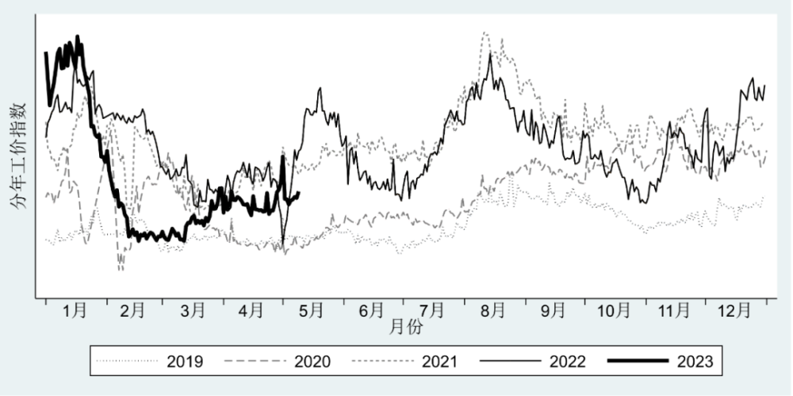

# 农民工赚不到钱，今年还进厂吗？

制造业工价有所恢复，但外来务工者的实际收入却并不理想。比如昆山，
2020年进厂从事流水线工作，月均收入6000元以上，2021年由于外贸订单增加还有所提升。但今年收入下降，很多人开始转向其他工作岗位。

**文 | 向宽虎 顾婷**

**编辑 | 王延春**

从2022年12月初算起，疫情管控优化已经过去六个月。今年2月以来，出行的恢复使得服务业进入快速复苏通道，非制造业商务活动PMI连续位于50以上；“五一”期间各个车站和景区“一票难求”的盛景似乎也昭示着消费的全面复苏。

但另一方面，制造业的恢复情况却并不明朗。往年，开年过后，电子制造业总会出现“用工荒”的难题，年后订单的增加和春节前的员工离职，使得企业为了满足生产需求要加大招聘力度。但今年却是另一番景象，很多外来务工者春节后满心欢喜地进城找工作，却处处碰壁。

今年春节后，制造业灵活用工经历了很长一段时间的价格低迷，直至3月中下旬才有所回暖，触达前两年同期工价水平；4月工价延续了3月中下旬的水平，工价指数连续两个月回升。从趋势来看，不管是我们根据灵活用工的招聘时薪和面试人数计算出来的LIMP指数还是国家统计局公布的PMI数据，都表明制造业整体仍保持着一定的恢复节奏。

但是从景气度水平来看，制造业的情况和之前年份的同期相比，仍存在一定差距。我们在昆山灵活就业集散中心了解到的外来务工者的具体情况，和这一宏观形势比较吻合：制造业工价有所恢复，但是外来务工者的实际收入却依旧不太理想。

_图
1：分年工价指数_

外卖员、网约车司机成为备选项

在制造业从事灵活就业的外来务工者，和往年相比，今年的收入明显下降。在昆山，2020年的时候，进厂从事流水线的工作，月均到手收入能达到6000元以上，2021年由于外贸订单大幅增加，月均收入水平还有一定的提升。但今年由于制造业仍然处在恢复期，制造业的就业和收入状况不太乐观，很多人开始转向其他的工作岗位。

我们赶到昆山利得集散中心的时候，钱启程（化名）穿着美团外卖的衣服正在大厅里和经纪人闲聊。他年纪不大，
99年生人，在昆山呆了两三年了，大部分时候都选择进厂，有时候也会干一些其他的工作。

钱启程受访时说；“我今年2月就来昆山了，来了之后进过一次厂，干了整整一个月，扣除五险一金，到手工资只有3300多，后来就不干了。”

“现在（小时）工价看着还可以，但是工作时间不长，基本上没有多少加班，到手工资很少，还分不到好的工种。如果工资高，工种不太好，其实还可以干，但是现在工资这么低，就不愿意干了。”

“最近很多人都来送外卖了，送外卖比工厂赚的稍微多一点，但其实差不太多，主要是送外卖比较自由。”

谈及未来的打算，他表示还是更愿意进厂，进厂更稳定一点。他打算一边跑外卖一边等高工价，他相信和往年一样，今年6、7月工价就会好起来的。近期，我们在媒体上也看到很多关于外卖员的报道，大部分报道中都表示外卖员工资有所下降，不再是之前大家以为的高薪职业了，但是对于像钱启程这样的人来说，送外卖却是他当下的最佳选择。

虽然外卖员总体薪资水平不太高，尤其是对于新入行者，但是相比较进厂的约束，送外卖时间上更宽裕、更自由，所以在工资差不多，甚至略高于进厂的情况下，更多的外来务工者投入到外卖大军当中。

《第九次全国职工队伍状况调查》中有数据显示：目前全国职工总数在4.02亿人左右，其中新就业形态劳动者达8400万人，占职工总数的21%。而新就业形态劳动者主要是指货车司机、网约车司机、快递员、外卖配送员等群体。简而言之，如今的外卖员、快递员和网约车司机，已经超过8400万了。这个群体，还在进一步增大。当这些“新就业形态劳动者”越来越多的时候，这些行业的收入也会越来越低。

我们在和求职者的“经纪人”交流的时候，了解到除了外卖员，网约车司机也是另一个从工厂出来的首选行业。在和经纪人蓉姐交流中，她表示去年带的会员，有5、6个都去跑滴滴了，有在昆山的，也有在老家的。跑滴滴的时间相对自由，到手收入也相对高一点。昆山南站附近的出租车师傅，有一些也是今年才开始跑出租的。他们表示，之前刷抖音、小视频的时候看别人跑出租能赚到钱，今年找不到工作就出来试试，但是现在跑出租的人太多了，也只能赚个生活费。

不考虑在城市定居

在一众男生当中，胡丽丽（化名）一个人坐在角落里玩着手机，看笔者过去便主动交谈。她今年26岁，老家是贵州的，家里还有一个2岁的小孩子，现在小孩在老家由爷爷奶奶来带。胡丽丽和老公今年2月来到昆山，但是两个人不在一个厂上班。

“今年外面工资也不太高，有没有考虑回老家找工作，离家近，还可以照顾小朋友？”

“没有考虑过。今年昆山电子厂的工资是比去年要低很多，老家确实也能找到三四千的工资，但是一方面三四千工资的工作在我们老家也比较少，另一方面我们其实不太想回老家，（我们）总感觉外面机会更多一点。”

“那在这边会不会想小朋友？”

“其实还好。孩子的话，想的时候可以打电话啊，现在都有手机，都可以视频，而且我们过年也会回去的。”

“你和老公考虑过将来在哪定居？小朋友很快就可以上幼儿园了，你们会不会回去呢？”

“其实没怎么想过。我们应该不会在城市定居，但暂时也不想回老家，先在昆山干个几年。不过，估计最后还是会回老家。”

据经纪人透露，现在电子厂到手工资只有4000-5000元，和2月相比并没有太大起色，而往年这时候到手工资都有6000-7000元。低收入不仅影响了他们的消费，更冲击了他们留在城市生活的信心。

农民工就业环境仍需谨慎乐观

根据国家统计局公布的数据，2023年4月，全国城镇调查失业率为5.2%，为2022年以来最低水平；同时16-24岁青年调查失业率达到20.4%，创2018年有统计以来最高。由于传统制造业是外来务工者和年轻人主要的就业去向之一，制造业不景气对年轻人的冲击很大。劳动力市场的不景气可能会抑制消费潜力。近两月我们计算的制造业景气先行指数虽有所回升，但制造业用工需求尚未全面恢复，外来务工者，尤其是过去主要在制造业中求职的年轻人，其就业状况仍要加强关注。

三年疫情过后，中国经济社会正回归正轨，制造业整体仍维持着稳定复苏的态势。但不可否认，越南、印度等东南亚国家制造行业的兴起，一定程度上也造成我国电子制造业订单的分流，尤其影响到了长三角地区。

据《新闻周刊》的报道，3月以来，我国外贸订单加速外迁，尤其转向东南亚地区，印尼、越南等国的出口订单同比涨幅达30%-40%。长三角大部分电子厂主要依赖于国际订单，电子制造业出口订单的减少直接导致就业机会减少和薪资下降。这给外来务工者的生活和经济状态带来了一定的挑战。就业机会和薪资下降使得外来务工者难以满足生活需求，增加了他们的经济压力，让他们更难在城市定居。

据经纪人反映，很多去年来找工作的人今年都留在老家了，还有一部分年后来找工作的人，进厂干了一段时间之后也选择了回去。

外来务工者留在城市本身就要面对种种困难与压力，近三年来，接连遭受消费需求下降、国际市场需求转向等问题，更是让他们赖以生存的收入大打折扣，外来务工者在城市的收入不足以支持他们在城市很好的生活，这直接冲击了他们在城市定居的信心。另一方面，在地方政府的扶持下，中西部地区也产生了一些就业机会，农村基础设施进一步得到改善，这又会加强他们留在老家的信念。对他们而言，老家虽然收入低，消费相对也比较低，同时熟悉的环境也能提供安全感。回老家信念的强化也减缓了他们融入城市的步伐。

当前中国经济在不断恢复，制造业的需求也在改善，但是修复需要一定的过程和时间。外来务工者作为一个城乡间的特殊社会群体，在城市天然处于弱势地位。在这样的情况下，如何让他们在城市安居乐业变得更加困难。

对政府而言，一方面要稳定预期和信心，继续提振消费。制造业恢复缓慢，保增长、稳就业需要依靠服务业的持续恢复，而服务业的持续恢复更加需要提振信心。另一方面，中央及地方需要更大力度推动外贸规模稳定，为企业创造更多的订单。同时，社会层面对农民工的困境也要多一些关注。

（作者向宽虎为上海大学经济学院讲师，新市民产业与创新研究院院长；顾婷为新市民产业与创新研究院成员）

