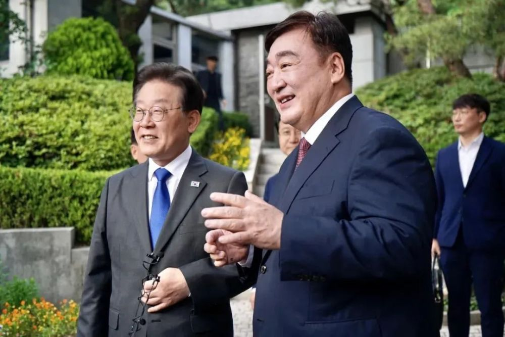

# 外交部部长助理农融周末约见韩驻华大使，美媒分析原因

中国外交部这个周末加班了。周日外交部网站发出消息说，周六，外交部部长助理农融约见了韩国驻华大使郑在浩。

必须在休息天办的公事，一定是要紧事。为什么咱们要紧急约见韩国大使？

“这是以牙还牙。”美联社周日发表报道称，中国外交部约见韩国驻华大使，是为了抗议此前中国驻韩国大使因发表“指责首尔向美国倾斜”的言论而被韩国外交部召见。

8日，中国驻韩大使邢海明在官邸会见韩国最大在野党共同民主党党首李在明，对尹锡悦政府向美国一边倒的“价值外交”提出了批评。

邢海明表示，中韩是搬不走的邻居、分不开的伙伴。美国正竭力打压中国，有的人赌美国赢、中国输，这显然是误判，没看清历史大势。他还说，“现在赌中国输的人今后一定会后悔”。这句话被韩媒广泛引用，《韩民族日报》称，这是对尹锡悦政府偏向美国的外交政策的指责，“中国驻韩大使会见韩国在野党党首，毫无保留地表达对韩国政府的不满，实属罕见”。

在谈到日本福岛核电站污水排海问题时，邢海明对李在明说，日方出于经济等利益考虑，“把太平洋当作自家下水道”，是极其不负责任的行为。他表示中韩应携手竭力劝阻日方贸然排海。

谈到近期韩方高度关注的对华贸易逆差扩大问题，邢海明坦言，这一方面有全球经济形势不佳、半导体进入下行周期因素等客观原因，更主要的是有些人试图推动“去中国化”所导致。

邢海明大使的话可谓坦诚犀利，中国驻韩大使馆当天也将邢海明同李在明会谈的重点发布在官网。下图为中国驻韩大使馆公布的邢海明大使（右）8日在官邸会见李在明的照片。

韩国政府坐不住了，9日，韩国外交部第一次官（副部长）张虎镇召见邢海明，指责邢大使发表了“有违外交惯例、罔顾常识的挑衅言行”，还指责邢大使“当着众多媒体的面以令人无法坐视不理的措辞和与事实相悖的内容”谴责韩方政策，甚至说中国大使“违背了《维也纳外交关系公约》”。

同一天，9日，在中国外交部例行记者会上，有记者问及邢大使相关言论引发韩国外交部及舆论关注的问题，发言人汪文斌答道：当前中韩关系面临困难和挑战，责任不在中方。邢海明大使同韩国政府、政党和社会各界广泛接触，就双边关系和共同关心的问题交换意见，介绍中方立场关切，“是其职责所在”。希望韩国有关方面“正确看待”。

来而不往非礼也。既然韩国召见了我们的大使，中国外交部也不怕加班，周六（10日），中国外交部部长助理农融约见韩国驻华大使郑在浩，就韩方针对邢大使同李在明会见交流所作“不当反应”提出交涉，表明严重关切和不满。

农融重申邢海明大使同韩国各界人士广泛接触交流“是其职责所在”，希望韩方“深刻反思”当前中韩关系的问题所在并予以认真对待，切实遵守中韩建交联合公报精神，同中方相向而行，共同为推动两国关系健康稳定发展作出积极努力。

作为一个经济在很大程度上依赖于计算机存储芯片和其他技术产品出口的国家，频频得罪其出口商品最大买家中国，这对韩国政府而言显然不是什么明智的选择。

《韩民族日报》发表评论称，美国虽然与韩国一起追求所谓“价值外交”，但多家外媒报道美国国务卿布林肯将在数周内访问中国，美中两国正在为陷入僵局的双边关系寻求对话，“而韩中关系却毫无恢复迹象”。报道称，韩国政府曾自信地表示今年内能召开中日韩首脑会谈，但现在连工作磋商日期等对话头绪都还没找到。

韩国庆南大学远东问题研究所教授李相万（音）对《韩民族日报》表示，由于集中进行韩美日合作，韩国“接连收到外交账单”，为了将外交风险最小化并取得实际利益，韩国更应该主动寻求与中国对话。

