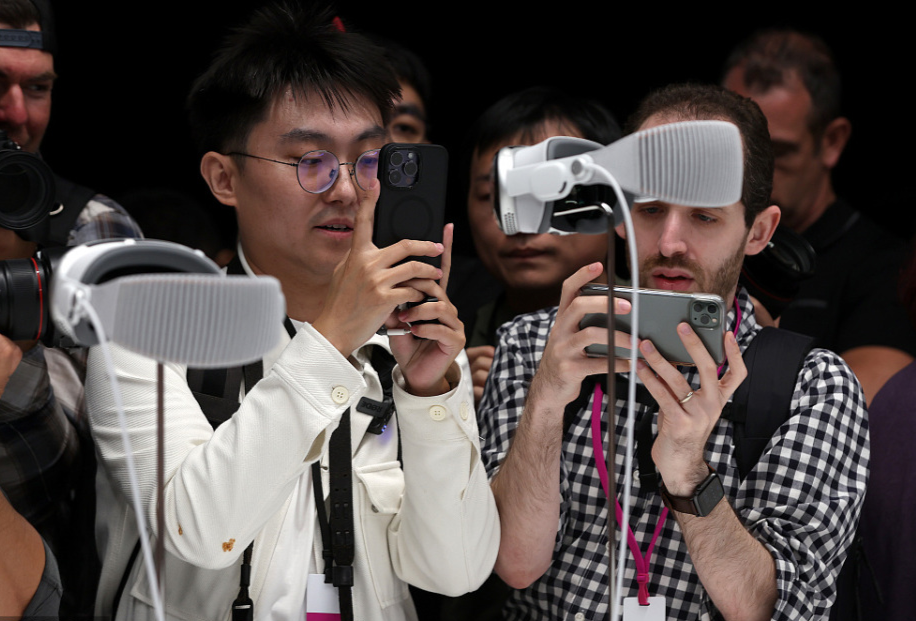

# 对话唱吧CEO：苹果头显会消灭电视和投影仪，价格降到1万才合理

作者 | 张睿

编辑 | 康晓

出品｜深网.小满工作室

通过两副传感眼镜链接，被永远滞留地核六千八百公里深处的“落日六号”地航员可以身临其境的感受地球的微风旭日、鸟语花香、大漠孤烟....这是刘慈欣短篇科幻小说《带上她的眼睛》里描述的情节。

在唱吧创始人兼CEO陈华眼里，这种只有在科幻电影中才能呈现的景象和体验将在1～2年后出现在现实世界中。

“Apple Vision
Pro的推出将AR/VR技术推向主流，为后续MR头显的发展指明了方向，原来XR应该这样和现实世界互动。随着体积变小、成本变低这两大问题的解决，未来几年苹果头显的价格或将降到1万元。此时，XR领域将进入一个新时代，人跟世界的交互方式将发生根本性的改变。”陈华判断。

在苹果头显推出之前，VR/AR领域创业者和开发者曾经历过一段漫长的低迷期。

2014年，Meta完成了对VR头显制造商Oculus的收购，发力虚拟现实领域。截至目前，Quest系列头显的累计销量接近2千万台。2021年字节跳动收购Pico，有数据统计Pico
去年的销量达到70万。

虽然Meta等互联网巨头布局VR头显已久，但与智能手机每年10多亿的出货量相比，不到3000万台的全球销量让VR头显沦落为发烧友和游戏玩家的娱乐工具。游戏之外，语音通话、观看电影、工作等应用在XR领域还是一片蛮荒之地。

“苹果头显的问世给VR行业最少续命10年。”多位VR行业创业者激动表示。

不过，推出MR头显和VisionOS系统仅是苹果进军元宇宙世界的第一步，要吸引更多用户使用MR头显需要丰富应用的加持。“前期VisionOS已对部分开发者开放。”苹果MR头显相关负责人表示。

未来几年，伴随着MR头显的普及和VisionOS生态的建立，苹果现有的3000多万开发者有可能向VisionOS上迁移。

在陈华看来，移动互联网的红利期已经结束，2012年左右成长起来的第一批移动互联网创业者及APP已经摸到了增长的天花板，XR赛道才是未来和增量。“VR创业的机会不只是模仿苹果推出MR头显，还能做内容和周边（类似现在的APP），成为Vision
Pro及Quest生态里的爆款应用。”

**以下是腾讯新闻《深网》专访唱吧CEO陈华采访实录，在不改变原意的情况下有所删节：**

**苹果头显取代手机需要解决两个关键问题**

**《深网》：为何会觉得Apple Vision Pro是一个伟大的产品？**

**陈华：** 苹果Vision
Pro最大的价值是指明方向：我们在一个XR的世界里应该如何互动。以前Quest、Pico是从游戏出发，至于怎么办公、跟现实世界互动、让网友舒服地使用它，这些问题都没有讲清楚。

苹果眼镜最大的突破是，告诉大家VST（Video See-
Through）技术的存在，使得AR（增强现实）和VR（虚拟现实）合并，变成MR（混合现实）。在现实世界里，有了空间计算之后，可以叠加想叠加的内容。用户戴上眼镜就可以跟外界强互动。

其次，用户可以通过手势、眼球运动等来控制设备，不用像其他 VR 设备那样使用手柄操作。

**《深网》：与外界强互动要突破哪些关键因素？**

**陈华：**
一是视网膜屏，苹果眼镜是第一个达到视网膜清晰度的MR眼镜。VR领域有一个专业术语叫每度像素数（PPD），PPD超过30以上，普通人无法区分像素和像素的间隙；60以上，任何人都看不到像素间隙。苹果头显单目4K，视场角大概100度，PPD大约是40。这就意味着用户戴上苹果头显后很难分清虚拟和现实，不会认为眼前是一个块屏幕。当屏幕不再是屏幕的时候，就是另外一个世界。

二是强大的计算能力。Vision
Pro采用双芯片设计，初始为Mac级别的M2芯片，同时配置实时传感器处理芯片R1。强大的计算能力，可以保证开发者在空间中贴任何的东西，且没有延时感。

**《深网》：MR头显何时能取代手机和电脑？**

**陈华：**
苹果头显目前有两个弊端，一是成本太高，二是体积大。成本和规模及出货量相关，体积会随着版本迭代有所变化，等苹果头显开始大规模销售时，这两个问题会慢慢解决。如果苹果头显价格降到1万，相信这个价格会被大众接受，毕竟苹果手机刚发布时高配版的价格也要1万。

此时，先被替代的可能是电视和投影仪。

**短视频依然是XR时代杀手级应用**

**《深网》：当人与世界的交互方式发生改变，固有的生产关系和体系也会发生改变，全新的商业模式就会产生。对比IOS生态，VisionOS会不会产生杀手级的应用？**

**陈华：**
在移动互联网时代，从用户的日活及停留时长看，短视频已经成了终极杀手级应用。在XR时代，最可能先成为爆款应用的还会是短视频。因为刷短视频和直播的需求不会在XR时代被替代，仅是屏幕变成了全景屏幕。

不同的是，在元宇宙世界里，生产短视频的工具及APP发生了变化。因为用VR眼镜看手机拍的视频，清晰度不够，无法满足沉浸式观看的需求。

在XR时代，视频内容生产有三种方式。

一是Meta的做法，计算机程序加设计师模式。例如，一个程序设计了一个沙发结构，然后设计师在上面贴各种纹理，就会贴出一个沙发。这种做法速度极慢，效果奇差，所以扎克伯格在元宇宙的自拍会被疯狂吐槽。

二是利用AI。AIGC大幅度提高创造虚拟世界的速度，但AI创造的东西，用户能分辨出这是虚拟的。例如Midjourney画的图看起来很逼真，但认真观察，能看出它还是假的。

三是用照相机的方式，用3D照相机把现实世界拍到元宇宙里面去，真实且充满细节。所以用3D相机拍内容，是XR时代非常高效生产内容的方式。

所以，我们从前年就开始筹备3D相机项目开飞（CALF） 3D VR180
相机，6月20日左右会在美国Kickstarter启动众筹，8月份众筹结束，9月份发货。现在在Kickstarter上搜索“Calf”就能看到我们众筹页面了。开飞相机支持8K
VR180拍照，6K
50fps的录像和直播，以及1080p的3D平面拍照和录像，还能一键上传和一键直播，功能非常强大，清晰度也非常高，能够在VR眼镜里面看清楚被拍对象的头发丝、衣服质感、皮肤纹理，这样我们就能在元宇宙里面看到一个清晰的现实世界了。

_图为开飞3D
VR180相机_

**陈华：** VR 360未来也会推，但目前我觉得VR180是最好的。VR
360相机是360度拍摄，摄影师也会出现在视频中。而VR180是导演视角，导演可以对场景和构图等更专业，可以布置灯光等各种设备，能够产生更优质的内容。

**《深网》：目前市面上已经有了VR180相机，例如FM DUO等，我们再推出的开飞3D VR180的竞争力在哪？**

**陈华：** 市面上的VR180相机一台的价格大约在16万上下，开飞3D VR180相机的众筹早鸟价格为1399美金，换算成人民币还不到一万。

**《深网》：开飞3D VR180相机最低定价1399美金能赚钱吗？**

**陈华：** 现在是早期，不赚钱，生产规模起来之后就好了。

**VR创业者需要信仰**

**《深网》：公司在XR时代的投入主要是硬件？**

**陈华：** 硬件是基础，内容平台即APP才是重点。我们的开飞（Calf ）APP已经在Quest
Store上架，我们也在跟苹果谈，会成为VisionOS第一批应用。开飞
app上已经有数千条内容和上百位创作者，打开开飞就能瞬间穿越各个不同的世界，用户可以站在创作者的视角3D立体地查看创作者所在的世界。

**《深网》：公司既做硬件又做内容平台，会不会很吃力？**

**陈华：** 我们做唱吧APP十几年了，又从2015年开始做麦克风等硬件，有综合做有硬件、软件的能力。

**《深网》：前期Meta推Quest和Horizon Worlds已经亏损了上百亿美元了，怎么看待未来可能面临的亏损？**

**陈华：** VR这个赛道非常艰难，是一个长赛道，不是短赛道，在XR领域创业需要信仰。

首先，不能太着急，也不能投入太大，在有限投入下去认认真真做，这样也更容易实现盈利。其次，我希望一些有梦想的人加入到我们的团队，他们相信能让人看到别人的世界、用3D
VR的形式记录美好生活是一个非常有趣且很有价值的事情。唱吧的开飞相机和开飞app业务已经组建公司，近期会启动独立融资。

