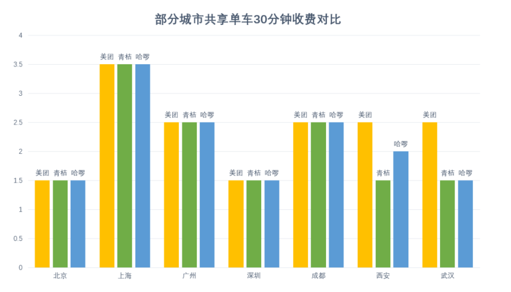
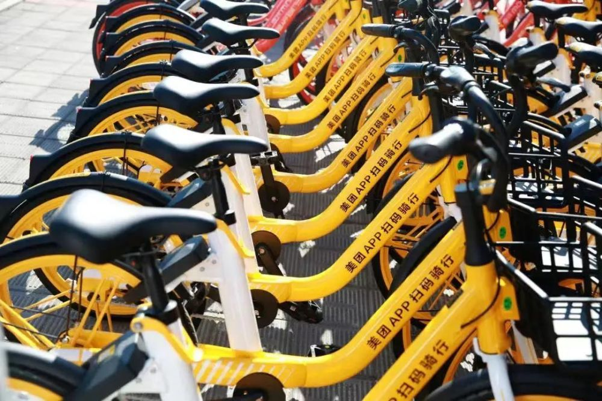

# 涨价，是大厂给共享单车亮出的一张“黄牌”

降本增效的大刀紧随其后。

撰文 | 刘星志

编辑 | 彦飞

来源 | 盒饭财经（ID：daxiongfan）

以前骑一次一块钱、五毛钱甚至不要钱的共享单车，现在要多少钱？

对于部分城市的用户而言，新的收费标准是：每小时六块五。

2023年以来，主要共享单车品牌相继在成都、厦门等城市调价。有用户抱怨，如今的共享单车价格已贵过公交，直追地铁。

去年上半年，共享单车企业已经历过一轮涨价潮。那轮涨价过后，不购买套餐卡情况下，部分城市共享单车价格已高达6.5元1小时。

自2015年共享单车诞生至今，8年时间里，行业数次洗牌，形成如今美团单车、哈啰单车、滴滴青桔“三国杀”的竞争态势。

与市场格局稳定一同到来的，是补贴的退潮。2021年起，共享单车涨价的话题不时引发讨论，5毛一次和免费骑逐渐销声匿迹。如今，1.5元几乎成了扫一次共享单车的“起步价”。作为打工人们“最后一公里”几乎唯一的解决方案，共享单车依旧方便，但不再实惠。

**涨价的直接原因是，共享单车融不到钱了。**

风险投资是共享单车企业最重要的现金流。摩拜和ofo之所以能够大把烧钱，除了挪用用户押金外，更关键的是腾讯、阿里及其他投资人提供的资金弹药。然而，共享经济热潮早已退烧，活下来的单车们自然也不再是投资者的宠儿。

2021年初，青桔单车完成6亿美元B轮融资，几乎同时，哈啰出行传出赴美IPO消息。然而，青桔融资止步B轮；哈啰在2021年底完成一笔2.8亿美元的战略融资后，也没了下文。此后的共享单车市场，除了涨价，再无新闻。

另一方面，在同一时期，“降本增效”成为互联网公司的主旋律，“毕业”、“优化”等词语开始被频繁提起。只能创造订单却换不来利润的共享单车，自然首当其冲。

**在当下市场环境下，新业务基本等同于边缘业务、亏损业务。**
2022年，美团营收约为2200亿元，而共享单车业务所在的“新业务”板块经营亏损高达284亿元，相当于美团全年经调整净利润的10倍。如果不能把亏损降下来，美团的盈利表现将受到严重拖累。

滴滴在更早时候已经意识到了这一巨坑。2021年，青桔单车也被滴滴划归300亿元“其他业务”的亏损中。目前，滴滴在完成整改后，正在朝着赴港上市迈进；将青桔与网约车等核心业务剥离，有助于滴滴扫除上市障碍，并在二级市场上获得更好的估值。

目前，仍在牌桌上的品牌分别背靠美团、滴滴、蚂蚁三大平台，而三家平台无一例外是交易平台，仍需要共享单车这个高频业务提升产品的打开频次和用户粘性，但不可否认的是，平台的态度正在悄然转变。
**随着互联网大公司的主旋律从烧钱扩张转向降本增效，降本的刀已然悬在共享单车头上。**

共享单车纷纷涨价，是其增强自身造血能力、避免被集团断奶后“猝死”的救急手段。同时，三个主要玩家不约而同把价格提起来，表明在目前的市场态势下，价格战谁都打不起，宁可少拿一些订单和市场份额，也要尽可能把盈亏打平。

在“降本增效”主宰互联网行业风向的当下，共享单车要先跟上其他业务减亏的步伐，再谈对平台生态的价值。只有这样，共享单车才有可能避免被大公司彻底放弃的命运。

但共享单车的最大卖点就是“便宜”；在价格堪比公交车之后，共享单车势必将损失不少用户和订单，进而导致盈亏平衡价格点进一步被推高。怎样在价格、亏损和订单量之间建立新的平衡，将是共享单车全行业下一阶段的最大难题。

与2022年大范围调价相比，今年以来共享单车涨价，是个别城市的个别现象。但把时间拉长，总体而言，共享单车正在越来越贵，用户解决“最后一公里”问题的代价愈发高昂。

据红星新闻报道，目前在上海，单次骑行1小时最高需要6.5元，已经超过公交、地铁等常见公交出行方式。

不过，在一线城市中，上海共享单车价格也是独一档的存在，并不能代表共享单车市场整体的价格。在部分主要城市中，半小时以内收费普遍在1.5-2.5元之间。

但另一方面，看似温和上涨的共享单车价格，已经刺激到部分价格敏感型用户脆弱的神经。“除非办个卡天天骑或者真有急事，不然不敢扫。”一位上海用户表示。

而在东北部分城市，受季节、需求等因素影响，共享单车起步价达到1.8元。“我们这公交1元，它快和出租车一个价了。”一位用户表示。该用户所在城市出租车在2.5公里基础里程后，基本运价为1.8元/公里。

虽然每次开卡时，平台都会给予不同程度的优惠，抹平涨价带来的影响，但优惠的力度、持续时间等决定权都在平台手上，可以随时调整，类似的套路在电商、外卖、网约车上已经屡见不鲜，平台在提价与优惠的反复拉扯中，不断试探用户的底线。

共享单车价格节节攀升，直接原因是成本高企、入不敷出。

去年8月，美团在上调骑行卡价格的公告中表示，涨价的原因是“硬件和运维成本的增加”。

事实上，从共享单车诞生以来，行业从未真正实现盈利。行业野蛮生长时期自不必说，即便是ofo暴雷后，行业逐渐稳定、规范，亏损也仅仅是有所收窄。

哈啰出行招股书显示，2018年、2019年、2020年营收分别为21.14亿元、48.23亿元、60.44亿元；净亏损分别为22.08亿元、15.05亿元、11.34亿元。

2018年，美团斥资27亿美元收购摩拜单车，而摩拜并表第一年，便给美团贡献了45.4亿元亏损。被滴滴划归“其他业务”的青桔，境况恐怕也不会比其他两家好到哪里去。

坐拥3亿用户的共享单车却连年亏损，背后是成本——收益天平两端的失衡。

**在成本端，造车、修车、调度，处处是成本；而收入端，失去了押金这一融资杠杆，平台只能依靠用户付费以及有限的广告创收。**

实际上，随着“单车大战”偃旗息鼓，平台也不愿在这块业务上过多投入。在财报上，各大平台都着重提及新业务在减亏上的成果，对共享单车业务则鲜有提及。

2015年前后，“共享经济”成为风口，市场上涌现出共享单车、充电宝、汽车、办公等赛道，每个赛道上又都盘踞着数家投资机构、数十家创业公司。

这轮风潮中，每个赛道都经历了多次洗牌，一轮轮洗牌中，曾被寄予厚望的共享汽车等赛道被证伪，逐渐消亡。用户基数大、频次高的共享单车几乎是充电宝以外，共享经济风潮仅存的硕果。

八年前，投资人创业者涌入是共同看中了共享单车的潜力；如今，平台还愿意持续给不赚钱的单车业务输血，背后就各有各的打算了。

哈啰的算盘是，以共享单车业务为支点，向出行平台和本地生活服务平台拓展；而多次参与哈啰融资的蚂蚁，当初看中的则是哈啰在支付宝平台上提供流量、丰富平台生态方面的价值。

美团在收购摩拜后，第一件事就是将其接入美团，并更名为“美团单车”，这块业务除了用来完善美团在本地生活服务体系以外，更重要的作用是提升APP的打开频次。

作为出行公司，滴滴则用青桔补齐了平台的出行版图，共享单车用户既提高了用户粘性，同时为客单价更高的打车等业务提供了潜在的客户。

总的来说，如今还在共享单车牌桌上的平台，都是交易平台而非内容平台，它们一方面需要共享单车完善自身业务体系，另一方面也要依靠这块高频业务为平台其他业务贡献流量。
**业务本身的生态价值和流量价值是平台愿意持续烧钱的根本原因。**

但如今，情况正在发生变化，大厂的主要目标从扩张转向了减亏。围绕这个目标，过去几年里，除了共享单车，网约车、长视频等诸多服务的价格都经历了多次调整。

受疫情影响，整个出行市场在2022年明显萎缩，据交通部数据，2022年国内网约车全网订单跌幅16%，作为市场绝对头部的滴滴，订单量同比萎缩更高达23%。然而在市场低迷的情况下，滴滴毛利率从去年的9.76%提高到17.75%。

另一个烧钱的行业长视频，也开始回归理性。2022年一季度，爱奇艺通过缩减业务、降低运营成本，首次实现季度盈利，而在此之前，外界对长视频平台自负盈亏根本不抱希望。

**网约车、长视频等行业的盈利表现有所好转，涨价是重要原因。** 共享单车在面临生存难题后，也第一时间把价格提了上来。这其实是符合商业规律的常规操作。

同样是长期亏损，网约车、长视频都看到了盈利的希望，看似模式更简单的共享单车却看不到扭亏为盈的希望。

滴滴盈利状况能在逆境中快速改善，一方面得益于其主动开源节流，销售费用率等指标降低，另一方面也与其市场地位有关。在打车大战中吞并了Uber与快的后，掌握市场优势地位的滴滴在一定程度上掌握了定价权，并削减了补贴。

相比之下，共享单车市场没有一个绝对的头羊，它与“三足鼎立”的长视频行业更加相似。

长视频的三强是烧钱烧出来的，而盈利则是逼出来的，市场不景气、用户增长见顶之下，烧钱换增长的模式难以为继。2021年3季度，爱奇艺率先上调了用户资费，腾讯、优酷在舆论压力下也选择跟进，这说明博弈各方对亏损的忍耐已接近极限。

共享单车又何尝不是如此？不论哪个平台率先涨价，其他两家大都会默默跟进。

值得注意的是，长视频的盈利，也不全靠涨价。实际上，2021年三季度，爱奇艺上调了用户资费，承担了社会舆论压力的同时，亏损缺口反而扩张。到了四季度，通过缩减边缘业务、精简人员，扭亏为盈的拼图才算补齐。

**但共享单车本身已经沦为平台砍无可砍的一项边缘业务，且模式更重，成本控制难度更大。**
“车辆调度、干预、折旧这些费用始终居高不下，”有业内人士对字母榜表示，“单次骑行价格要到2元左右（平台）才能盈利。”

成本居高不下，加上盈利模式单一，共享单车想要活下去，只有涨价和平台输血两个选项。如今的共享单车陷入了一种两难境地：继续涨价，挑战的是用户的容忍度；不涨价，平台则会持续失血。

坏消息是，互联网人口红利的消退加上短视频等内容形式带来的冲击，正在稀释共享单车对平台的战略价值。

去年7月，支付宝生活号向个人开放，今年初，支付宝又与NBA达成合作，这些举措被外界视为支付宝重启内容化进程的信号；另一边，随着抖音切入本地生活，美团也在短视频、直播领域加码。

交易平台在内容上加大投入，固然是为了应对内容平台的步步紧逼，但同时也证明了共享单车这一行业现状的尴尬。

今年上半年，国内经济，尤其是服务业复苏明显，多数互联网大厂业绩明显回暖。但报表以外，降本增效的主旋律仍未改变，业内仍不时传出业务裁撤、人员优化的消息。

短期来看，共享单车业务需要将亏损缩窄到平台能够忍受的范围内；而在长期，随着互联网行业回归理性，各家企业、各个业务终归要实现盈利，共享单车也不例外。

这样看来，共享单车涨价仍旧是长期趋势，毕竟平台已经做好了开源节流过苦日子的打算，共享单车也得跟上脚步， **降本的刀不砍到用户身上，就会落在自己头上。**

参考资料：

《涨至1小时4.5元 部分城市共享单车已贵过公交地铁》成都商报

《爱奇艺盈利，长视频有救？》BT财经

《4年涨价8倍，共享充电宝为何还不赚钱？》市界

《滴滴：捏扁搓圆从头过？总算活过来了》海豚投研

《共享单车涨价得有个度》广州日报

