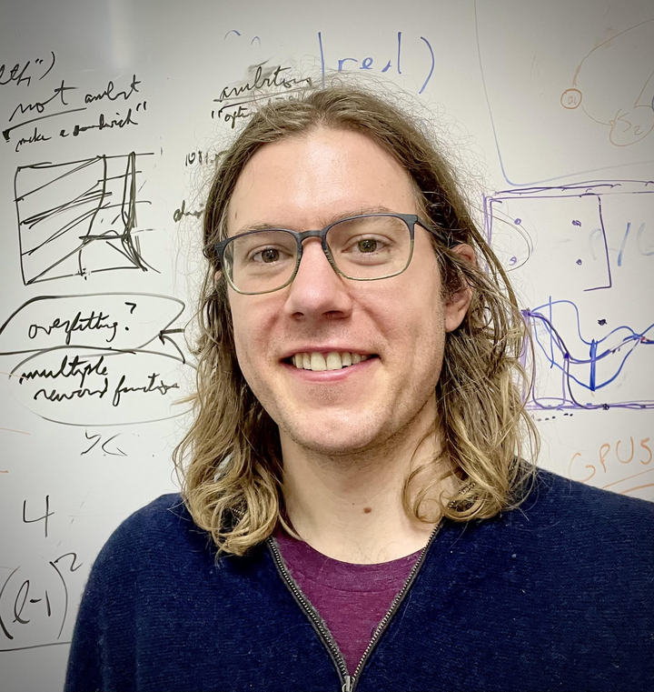

# 联名预警信发起人：一旦获得通用人工智能，人类就可能会灭绝

_图片由AI生成_

腾讯新闻《潜望》作者 张小珺 发自北京

半个月前，包括OpenAI CEO Sam Altman、图灵奖得主Geoffrey
Hinton在内的数百名人工智能顶尖人士，联名签署了一封关于AI对人类灭绝存在威胁的简短声明。

这声明只有一句话——“减轻人工智能的灭绝风险应该与流行病和核战争等其他社会规模风险一起成为全球优先事项。”

剑桥大学人工智能研究助理教授David Krueger是这封信最早的发起人之一，也是签名者。

6月9日，Krueger在出席2023北京智源大会上期间，与腾讯新闻《潜望》进行了一次深度对话。他长期关注AI对齐与安全问题，从2012年起就开始忧虑人工智能对于人类灭绝的潜在风险，业界将此称为“X-Risk”（An
existential risk）。

针对AI风险，一种观点反驳称，这种强烈的担忧可能与几百年前蒸汽机出现时人类的过度惊慌有相似之处。但Krueger称，两者最大不同是，蒸汽机不会让人类灭绝，但AI会。

Krueger认为，AI比人类更聪明，无序的竞争，以及构建对世界产生更直接影响的AI系统——这三重因素都会极大增加人工智能系统失控的风险系数。“系统越是开放、越是自主、越是智能，并且越是旨在实现长期目标，系统失控的风险就越大。”他说。

在他看来，人工智能的安全问题就像全球气候变化问题一样，各方有各自的利益，会有诸多冲突与分歧，最终使之成为复杂的全球协调问题。因此必须尽早开始，通过各方努力，才能让人类不至于沦落至被AI接管的命运。

只有这样，人类才能活下去。

_David Krueger_

**以下为David Krueger的谈话精要。**

**《AI风险声明》联名信仅一句话，是精心设计的**

**腾讯新闻《潜望》：你是《AI风险声明》（Statement on AI Risk）签署者之一，能不能告诉我们，这封声明是怎样诞生的？**

**David Krueger：**
我一年多前就有了这样的想法，原因是人们对AI的风险，特别是AI可能会导致人类灭绝的风险越来越关注。与此同时，很多人并没有公开讨论这个问题。

一个重要原因是历史缘故，这个观点曾被视为边缘想法，人们担心公开讨论会给他们带来负面影响，甚至影响职业前景。

几个月前，好时机来了。自从ChatGPT和GPT-4发布，人们对AI的关注达到空前。很长一段时间，人们承认这可能是假设性的未来问题，但现在为时过早。

至于这个声明是如何产生的，我联系了一些同事，包括人工智能安全中心的负责人Dan
Hendrycks。我告诉他我们应该做这样一份声明，而且我打算尽快做。但我不确定自己是否有足够的能力完成。它十分紧急。于是，Dan接过这个话题，推动了声明发表。

**腾讯新闻《潜望》：你对这封信的措辞提供了什么意见？**

**David Krueger：** 我提议只使用一句话来表达。原因有几个。

首先，当你有较长陈述，很可能会有人对其中某些内容持不同意见。

我们在几个月前看到，生命未来研究所（Future of Life
Institute）发表呼吁：所有人工智能实验室立即暂停训练比GPT-4更强大的人工智能系统至少6个月。很多人对此的反应是，听起来不错，但我认为我们无法暂停人工智能的发展。

当然他们发表这个声明仍然很有效，因为一旦人们说我们无法暂停，就是我们需要采取行动的迹象。我们确实需要有能力暂停一项过于危险而不应该开发的技术。

我使用这个例子是为了说明，当你说得越多，人们就越有不同意见。在这种情况下，我们没有提如何处理这个风险，因为人们对正确方法有不同看法；我们也没有说为什么它可能导致人类灭绝，因为不同的人对此有不同看法——有些人更担心技术被滥用，另一些人更担心技术失控，而这不是某个恶意行为者故意造成的结果。

无论哪种方式，只要有很多人认同这是巨大风险，我们需要采取行动，那就可以了。

**AI风险与蒸汽机有本质差异**

**腾讯新闻《潜望》：人们对于人工智能威胁的担忧，与两三百年前人们对蒸汽机的恐惧，最大差别是什么？**

**David Krueger：**
对于那段历史，我了解不多。我不确定当时是否有人说过会导致人类灭绝。如果有人这样说过，我也不确定他们会使用什么样的论点，对我来说，似乎不太可能。

关键区别在于我们讨论的是灭绝。我们讨论的是一种可能比人类在各种相关能力上更聪明、更强大的技术。

蒸汽机使我们能创造比人类更强大、更快速的物理力量。但蒸汽机并不具备智能，相对容易控制。即使其中一个失控，最糟糕的情况也只是它出故障，上面的人可能会死亡或受伤。但是，如果一个智能系统或者一个能够自我复制的系统失控了，很多人可能会死亡，因为它可以成长并获得更多力量，这是关键区别。

**腾讯新闻《潜望》：有些人认为公开声明只能阻止好人，试图让好人加强对安全问题的关注、减缓研发速度，但却无法阻止坏人的行动。我们如何预防坏人呢？**

**David Krueger：** 通过监管和国际合作来规范行为。

我不太喜欢用“好人”和“坏人”来谈论这个问题，因为每个人总是认为自己是好人。我担心的主要风险不是一些坏人或恶意行为者对人工智能系统进行恶意操作，而是类似气候变化的问题——个人可能会从燃烧更多化石燃料或制造更难控制的更强大系统中获得更多利益，但每个人都要承担一些代价。在气候变化的情况下，这会对环境造成损害。在人工智能的情况下，风险是系统失控并导致灭顶之灾。

这更多是一个激励问题。事实上，人类更关心自己、朋友、亲人和社区，而不是世界另一边的某个陌生人。因此，并不需要恶意意图，只需要自私本能。这就是为什么需要监管，这是解决这类人类共同利益问题的方式。

**AI对齐工作有大量未解之谜**

**腾讯新闻《潜望》：你的研究兴趣是深度学习、AI对齐和安全，能不能用普通人能听懂的语言解释什么是对齐（Alignment）？你说过“对齐将是AI发展的关键驱动力之一”，为什么它如此重要？**

**David Krueger：**
我喜欢说人们对此有三种不同理解。一种是使AI系统按照我们的意愿行动。但我不认为这是一个好定义，它太宽泛了，每个工程师都在尝试让AI系统按照他们的意愿行动。

还有一个更具体的定义，即“意图对齐”。在我看来这是正确定义，是指让系统试图按照我们的意愿行动。在设计系统时，你希望它具有正确的意图、动机和目标。它仍然可能无法按照你的意愿行动，因为它可能缺乏能力，也可能不够聪明，不知道如何实现你的意愿。但如果它具有正确的意图，你可以说它是对齐的。

人们对对齐的最后一种含义是任何减少人类灭绝风险的技术努力。有时，也指像我这样专注于对齐与安全这个领域的人所在的社区。这也不是我喜欢的定义。这只是人们针对如何解决这个问题的一个想法。但最终，在治理、监管和国际合作方面还需要进行更多工作，例如缔结条约，这是缓解这一风险所必需的。

**腾讯新闻《潜望》：科技公司和科研机构在对齐技术上最近取得了哪些新进展？面临最迫切的挑战和难题是什么？**

**David Krueger：**
最重要的是针对大型语言模型的微调技术，他们已经做了很多工作改变模型的行为。比如，GPT-3和GPT-4的区别在于，对系统进行了对齐，能更多地按照设计者的意图行动。主要是通过强化学习和人类反馈实现，尽管具体细节并不公开。这在很大程度上取得了成功，但它并没有完全消除这些模型存在的问题。

我担心这种技术对于更强大的系统可能不足够，因为它对行为的改变可能相对表面。随着系统更强大，这个问题可能变得更严重。

这有点像训练动物的比喻，就像你训练一只狗不上家具。也许当你在场时，它在这方面表现得非常好，但如果你离开房间，它仍然上家具。类似情况可能会发生在这些模型中。它们看起来可能是对齐的，但如果它们认为我们不会注意到它们的不当行为，它们仍然会表现不良。

**腾讯新闻《潜望》：当AI智能比人类聪明很多时，人类怎么在一个超级智能体上完成对齐工作?**

**David Krueger：** 这是一个开放性研究问题。因此，进行AI对齐的研究很重要，就是为了找到这个问题的答案。

**腾讯新闻《潜望》：我们如何通过对齐，使AI爱护人类而不是伤害人类？**

**David Krueger：** 这与前一个问题是一样的。我希望我有一个答案，但目前还不知道。

**这三大诱因能增加AI失控风险**

**腾讯新闻《潜望》：你认为，如今这个时间点处于AI历史上的什么时刻？**

**David Krueger：** 我们已经到了世界都开始意识到风险的时刻。我等待这个时刻到来已经很久了。

**腾讯新闻《潜望》：你从十年前听Geoffrey Hinton教授的深度学习课程后，就开始担心AI可能导致人类灭绝。你为什么在这么早的阶段开始忧虑？**

**David Krueger：**
我从原则上就担心在某个时候会发生这种情况，因为总有一天它会比人类更聪明，但当我看到Hinton的课程时，我的担忧发生了变化。深度学习的潜力比我之前听说的其他方法更大，可以产生真正的智能。

**腾讯新闻《潜望》：在什么情况下，人工智能系统会失控？**

**David Krueger：** 第一，如果它们比我们更聪明，你开始担心它们在细节上失控的时候，但很难准确预测这种情况会如何发生。

第二个增加风险的因素是，存在大量竞争，希望尽快开发和部署强大的AI系统。目前我们在谷歌和微软之间看到了这种竞争存在。人们也担心国际竞争，这可能是经济竞争，也可能是地缘政治竞争，甚至可能是军事竞争。

第三个因素是，如果你正在构建对世界产生更直接影响的AI系统。目前我们看到的系统只是语言模型，它们只是生成文本。但也有很多人在研究将它们与其他系统结合，例如使用它们编写代码，使用它们控制不同的事物，无论是在线上还是利用它们来控制现实世界中的事物。给予这些系统更多的控制权和自主权会增加风险。

再比较一下我们现在拥有的系统，这些系统主要只是训练来预测文本，这是一种相对安全的构建系统的方式——与要求系统在某个环境中实现目标相比，特别是与系统在和现实世界、物理世界频繁互动的环境中实现目标相比，这更安全。当系统试图在现实世界中实现目标，它们可能自然而然地尝试获取更多资源和权力，因为这些对于实现长期目标是有帮助的。

因此，系统越是开放、越是自主、越是智能，并且越是旨在实现长期目标，系统失控的风险就越大。

**腾讯新闻《潜望》：如果你认为应该制定全球协作的框架，以确保各国在AI发展方面遵循共同的原则和标准，那么这些具体的原则和标准应该有哪些？**

**David Krueger：**
我们绝对需要这样做，而且需要紧急着手去做。因为这将是困难的，将需要大量的讨论和谈判，因为不同国家之间存在许多冲突和分歧。

关于具体细节，这是我仍在思考的问题。我们希望确保我们拥有一些非常合法的治理机构或治理体系，如果在未来的某个时候我们觉得有必要，能够推动暂停。这是其中一个重要部分。

在我们正在开发和部署的系统方面，情况变得更复杂。我们希望有一些测试、评估和审计机制。我们可能还需要考虑某种形式的许可证，但还有很多细节需要解决。目前，我脑海中没有完整的方案。这就是为什么我希望我们能激励更多从事政策制定、拥有政策和国际关系等方面专业知识的人们去思考这个问题。

**腾讯新闻《潜望》：在当前的人工智能系统中，哪些方面需要尽快改进，以应对潜在的风险和威胁？**

**David Krueger：**
一是鲁棒性（注：鲁棒性是指在异常和危险情况下系统生存的能力）。我们当前的系统在鲁棒性方面存在重大问题，其中最引人注目的是对抗性鲁棒性问题，即对输入进行微小改变（甚至对人类来说难以察觉）可能对系统的行为产生巨大影响。这个问题已经是众所周知的问题大约有10年了，但似乎仍然没有解决方案。如果我们考虑那些追求某个目标并试图优化它们对目标的理解的系统，这是非常大的问题。因为根据它们对目标的理解，最优的结果可能与我们所想象或意图的目标有很大不同。而我们目前进行的评估很难发现。

另一个是，我们对这些系统工作方式缺乏理解。我们真的希望能够理解这些系统的工作方式，这是我们能够预测它们行为的最佳方式之一。我们希望确保它们不会在新情况下以意外和危险的方式行事。这与鲁棒性问题有关。

**人类灭绝距离现在遥远吗？**

**腾讯新闻《潜望》：现在来看，人类距离灭绝的距离遥远吗？预计会多少年？**

**David Krueger：** Jeffrey
Hinton一直在说我们要花20年或更短时间才能获得通用人工智能（AGI），这是合理的时间范围。这与我的观点相当相似。

我认为在那之后不久，人类可能会灭绝，但也可能需要更长的时间，我猜这也是我想强调的，即使这还有几十年，我们也需要尽快开始解决。

再次回到气候变化的类比。我们花了几十年时间才开始真正采取有效的行动，但仍然没有做足够的工作来防止气候变化带来的严重后果。这是因为它是一种复杂的全球协调问题。人工智能也会面临类似的情况。我们应该尽早开始。

**腾讯新闻《潜望》：大语言模型能带来AGI吗？**

**David Krueger：**
很多人现在都在问这个问题。我的观点比较复杂。我会说这是有可能的，但更有可能的是需要将其与其他技术相结合，甚至可能需要开发一些新技术。

**腾讯新闻《潜望》：怎么看待人类与人工智能的关系？人类会是智能的过渡吗？**

**David Krueger：**
只有时间能告诉我们答案。我希望不会这样。不过现在，这是一个我们还有一些主动权和能力去引导、决定未来将如何发展的问题。如果我们能够以智慧和协调的方式行动，如果我们能够走运，那么作为人类，AI是否在某个时刻接管，将取决于我们自己的决定。

**腾讯新闻《潜望》：Hinton有一个非常有趣的观点。他说：毛毛虫会提取养分，然后转化为蝴蝶，人们已经提取了数十亿认知的养分，GPT-4就是人类的蝴蝶。你同意这个观点吗？**

**David Krueger：**
非常富有诗意，我不认为完全准确，但也许它触及了某种本质上的真理，即AI系统不一定需要从头开始、经历艰苦的方式学习一切。人类需要通过漫长的进化才达到人类智能的水平，但现在人类产生了所有这些文化产品，包括互联网上的所有文本，这对于AI系统是非常有启发。因此，它们不一定需要重新经历所有的进化来达到类似的智能水平。

**腾讯新闻《潜望》：你是第一次来中国吗？对来中国的印象怎么样？对中国的人工智能和大模型发展，是否有一些建议？**

**David Krueger：**
这是我第一次来到中国。我昨天早晨刚到。整个访问时间都是在与人会面和交谈，人们很友好，我在这里有良好体验。但我不觉得我已经真正体验到中国。我只是与研究人员会面，不幸的是，对我来说这将是一个短暂的旅行，但我希望在离开前的最后一天至少能好好看看北京。

（对中国的建议）我想，重要的是思考和理解安全性和对齐性。从我进行的对话中可以看出，人们至少在某种程度上已经在做这方面的工作。

**腾讯新闻《潜望》：电影《Her》中许多场景已经逐渐在我们的真实世界里出现。人类会对人工智能会产生情感吗？你对你所开发的AI模型是否有情感上的依恋？**

**David Krueger：** 我没有，但据我所知，有人有。

确实存在类似的人工智能女友聊天机器人，有人已经对这种关系产生了情感依赖。这是这项技术的一个悲哀的后果。

