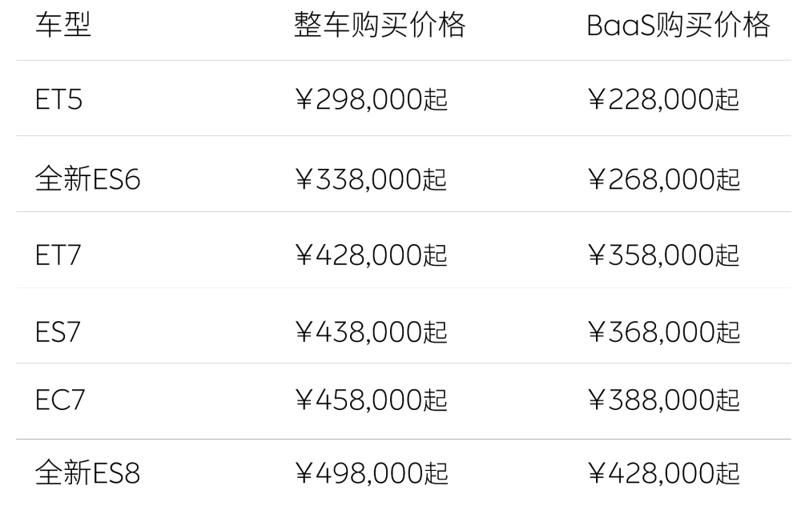
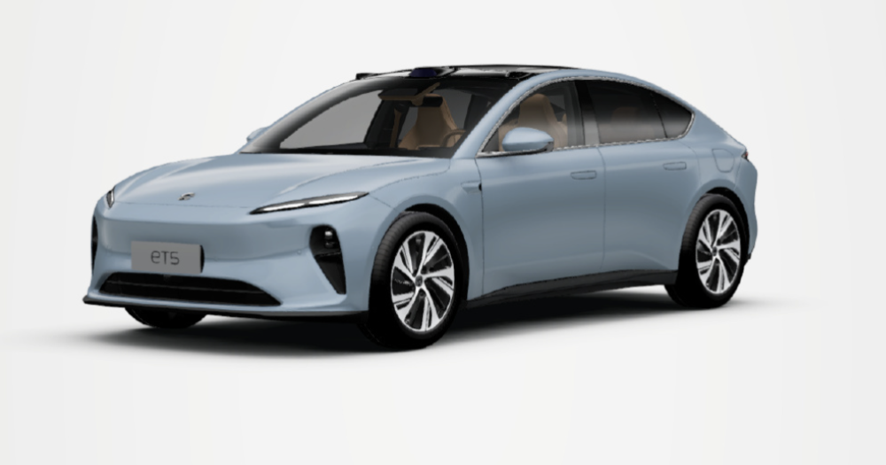
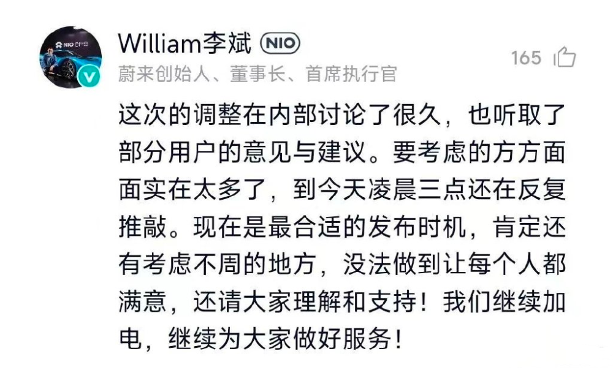

# 蔚来取消免费换电，全系降价3万元！李斌：到凌晨3点还在反复推敲

腾讯汽车讯，6月12日，蔚来汽车宣布全系车型起售价减3万元；新购车首任车主用车权益调整为整车6年或15万公里质保等；免费换电补能不再作为标准用车权益，新用户可灵活选择在家充电或到充换电站付费补能，蔚来此后将推出灵活的充换电服务套餐。

已经提车的用户，包括终身免费换电在内的首任车主用车权益保持不变；在购买蔚来新车时，用户可选择将原车的用车权益转移至新车，或者选择放弃其用车权益从而抵扣3万元-5万元的购车款。

关于这次蔚来宣布全系降价3万元，李斌表示：这次调整内部讨论了很久，听取了部分用户的意见和建议。要考虑的方方面面实在是太多了，到今天三点还在反复推敲。现在是最合适的发布时机，肯定还有考虑不周的地方，没法做到每个人都满意。

