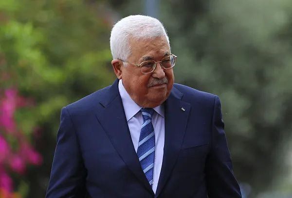
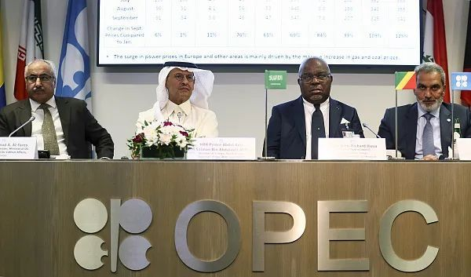

# 一位老朋友，今起访华

今日起，巴勒斯坦国总统马哈茂德·阿巴斯将对中国展开为期4天的国事访问。

在此前的例行记者会上，中国外交部发言人汪文斌将阿巴斯称为“中国人民的老朋友、好朋友”，其作为今年中方接待的首位阿拉伯国家元首，充分体现了中巴友好关系的高水平。

_巴勒斯坦国总统马哈茂德·阿巴斯_

阿巴斯访华，恰逢两国建交35周年。据新华社12日报道，巴勒斯坦民族解放运动（法塔赫）中央委员、阿拉伯关系和中国事务部部长扎基表示，阿巴斯此访将聚焦“阿拉伯和平倡议”，期待中国在巴以问题上继续发挥更大作用。

**考虑大局，着眼大处**

宁夏大学中国阿拉伯国家研究院院长李绍先在接受长安街知事（微信ID：Capitalnews）采访时表示，阿巴斯此次受邀访问，是中国从大局考虑，大处着眼之举。

李绍先指出，巴勒斯坦问题始终是中东问题的核心，而近年来巴勒斯坦问题被严重边缘化，巴以之间的冲突循环往复，不断威胁着中东地区的和平与稳定。

以色列新政府上台后，大力推行挤压巴勒斯坦生存空间的多项政策，虽然巴以没有爆发更大规模的冲突，但不间断的摩擦，使得巴以之间的和谈前景越来越趋于暗淡。

同时，美国一直试图单方面推动以色列与阿拉伯国家之间实现和解。

本月初，美国国务卿布林肯前往沙特阿拉伯进行访问。此前有分析认为，布林肯此行将向沙特施压，推动后者实现与以色列关系正常化。而现实情况是，沙特没有照办。

据报道，沙特外交大臣阿勒沙特8日表示，沙以关系正常化将为地区带来重大利益，但如果不为巴勒斯坦人找到通往和平的途径，沙特与以色列实现关系正常化带来的好处则“有限”。

李绍先认为，在这样的背景下，我国的一系列举动，显示出中国在巴以和谈方面，扮演积极劝和促谈角色的极大意愿。

**时隔六年，境况大为不同**

阿巴斯今年88岁，上世纪50年代参与创建巴勒斯坦民族解放运动，90年代作为巴方首席谈判代表主持同以色列谈判并达成“奥斯陆协议”。2008年11月，当选巴勒斯坦国总统，连任至今。

在任期间，他曾四次访华，上一次是在2017年。

在李绍先看来，相比6年前，眼下中东局势进入了多极化的时代，“这也是6年来中东形势一个巨大的变化。”而这个变化，主要是由内外两方面力量共同推动的。

6年前的中东，仍处于美国“一手遮天”之下。自1991年苏联解体，美国成为世界唯一的超级大国之后，中东就进入了美国单极主导的局面。而这个维持了30多年的局面，正在发生改变。

一方面，以伊朗、沙特阿拉伯为代表的阿拉伯国家，近年来所表现出的独立自主意识明显增强。

另一方面，中国近年来倡导共建“一带一路”，为该地区经济发展带来更多可能性。

_当地时间2022年10月5日，“欧佩克+”部长级会议，讨论下调石油产量_

李绍先表示，过去很长一段时间里，一个由联合国、美国、俄罗斯及欧盟组成的“四方机制”，在巴以和平进程中扮演着斡旋者的角色，而最近几年来，这“四方机制”已经形同虚设。

2020年1月，时任美国总统特朗普公布了“中东和平新计划”政治部分的内容，并称可以为巴以带来“双赢”。而事实是，该计划完全偏袒以色列，等同于推翻“两国方案”，即巴勒斯坦国与以色列实现持久和平共处的方案，也是国际社会所公认的解决巴以冲突的唯一途径。2021年，美国更是多次阻拦安理会发表声明调停巴以冲突。

与美方一味偏袒以色列，没有在推动巴以和平进程上起到实质性作用形成鲜明对比的是，中国在解决中东问题上不断奔走。

今年3月，在中方的斡旋之下，伊朗和沙特这对多年的“宿敌”在北京宣布恢复外交关系。与此同时，中国政府中东问题特使翟隽正访问以色列，与该国外长举行会晤，就巴勒斯坦问题交换了意见。随后，又赶往巴勒斯坦，阿巴斯在总统府会见了翟隽一行。

长安街知事（微信ID：Capitalnews）注意到，这是翟隽两年内第三次访问巴以两国，而巴勒斯坦问题始终是双方谈论的核心。近期沙伊关系的改善，也带动整个中东出现了“和解潮”的局面。

沙特《阿拉伯新闻》网站最近公布的一项调查显示，在北京于3月成功促成沙特与伊朗的外交协议后，80%的受访者表示支持中国在以色列与巴勒斯坦的和平谈判中发挥作用。

**推动和平进程，加强贸易合作**

李绍先认为，阿巴斯此访将主要聚焦两个方面，一个是推动和平进程，另一个是帮助巴勒斯坦摆脱经济困境。

受制于犹太人定居点等问题，巴以和谈自2014年起陷入停滞状态。李绍先表示，如何重启巴以和平进程，推动两国谈判，将成为重中之重。

“成为难民不是500多万巴勒斯坦人的选择，更不应该成为一代又一代巴勒斯坦人的命运。”中国常驻联合国副代表耿爽在发言中强调，国际社会必须始终把巴勒斯坦问题置于国际议程的优先位置，必须以更强的紧迫感推进“两国方案”。

经贸合作方面，中国和巴勒斯坦自由贸易区协定也在谈判进程中。2019年，中巴启动自贸区首轮谈判，就谈判职责范围文件达成一致。中巴双方都认为，签署自贸协定将进一步密切双边经贸关系，为两国企业和人民带来更多利益。数据显示，2022年中巴双边贸易额为1.58亿美元，同比增长23.2%。

“中国同以色列是创新全面伙伴关系，两国也在推动自贸协定谈判。作为巴以共同的朋友，中国对双方都能产生影响，但又不偏不倚，能在其中发挥一种优势。”李绍先认为，沙特与伊朗在北京实现历史性和解，一定程度上也引发了国际社会对中国在劝和促谈、解决世界难题热点方面发挥积极作用的期待，而北京或将成为巴以两国关系迈向未来的新起点。

（除标注外，图片均源自视觉中国）

