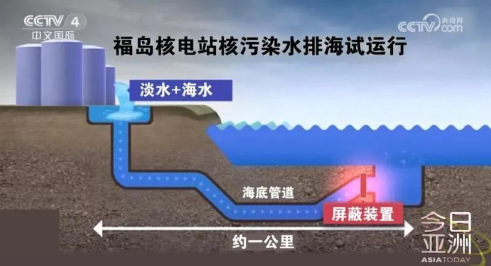

# 五问“核废水排海”：日本欠全世界一个交代

核废水排海是唯一出路吗？

**文 | 竹里**

毫无意外，在全世界的反对声中，日本开始加速推进核废水排海了。

据日本TBS电视台报道，东京电力公司于日本当地时间6月12日上午8时40分试运行福岛核污染水排海设施。为期2周的试运行将测试能否将固定量的水排入海中，并确认能否在紧急情况下暂停排海作业。

试运行意味着核污染水排放已进入倒计时。日本政府及东电给出的时间表显示，“排污入海”工程一旦开启将持续30年左右。而此前，日本一直对外宣称核污水无害，甚至可以饮用。

那么，日方声称的核污染水“达标” 站得住脚吗？真的安全无害可以饮用？日本的核污染水真的“无处可存”，排海是唯一出路吗？

**一问：福岛核污染水有多少？**

2011年3月，日本东北太平洋地区发生里氏9级地震，福岛第一核电站因海水灌入发生断电，多个核反应堆爆炸、堆芯熔毁。此后的10年，如何“消化”核废水，成了福岛核事故善后处理中的重大难题。

东京电力公司此前曾设置事故放射性废水净化处理装置，其中包括锶铯吸附装置、反渗透膜除盐装置、多核素去除装置，用以去除核废水中的大部分放射性核素，并设置大量贮罐用以贮存经过净化的废水。

有关贮罐于2022年秋达到贮存上限。据统计，截至今年5月，已达到约133万吨，储存在核电站内上千个储水罐中。目前，核污水已占总体储存容积的97%，其中已通过ALPS方式处理的核污水约占30%，待处理的核污水约占70%。

**二问：排海是唯一可行方案？**

有日方人士表态，处理核废水并非仅有一条路，“在陆地上继续建设大型贮罐”或“用灰浆凝固处理”都是现行技术条件下的可行方式。就连日本此前的专家组也曾提出过五种核污染水的处理方案，分别是：将其固态化埋入地底、沿着地下管道排入地底深处、变成水蒸气排入大气、电解处理以及直接排放入海。

不过，若出于经济、时间成本考虑，将核废水往大海“一倒了之”，倒是更“省钱、快捷”的选择。但在历史上发生的核事故，如切尔诺贝利和三哩岛核事故，采用的排污方式都是“大气释放”，向海洋排放核事故污染水在全球没有先例。

_福岛第一核电站用于储存核废水的贮罐。图源：中新网_

那么，就目前情况分析，核废水是否必须处理，已经“无处可存”了呢？此前，曾有国际环境组织指出，在福岛核电站的第七、八号机组建设预定地、埋土场及周边有一块约800×800㎡的短期内不可能用于它途的土地可以用于建造污水罐。如果建造类似于储油罐的20个大型污水罐，大约可以存储48年的污水量。

但由于日本政府和东电称需要时间与福岛地方政府和土地所有者协商。与新建存储罐比，日方仍然认为核污染水排海最“划算”。这也是日本一意孤行执行排海计划的原因所在。

**三问：日方称核污染水能饮用，站得住脚吗？**

日本政府和东电公司一直宣称排放的是处理水，是安全的，事实的确如此吗？

近日，太平洋岛国专家建议用核污水搞混凝土干基建。日本反对这一提议，称核污水或导致放射性物质氚蒸发，对人体有害。结合此前“核废水可饮用”的说法，两种说法，前后矛盾。网友评论“想排就说能喝，要用了却说有毒”“脸都被自己打肿了”。

多位日本学者也曾进行了针锋相对的批驳。日本福岛大学教授柴崎直明表示，就算是处理过的水，还是含有超出标准的放射性物质，有些只超标一点，有些可能含有超标百倍以上的高浓度放射性物质。

_2017年10月，工作人员在核废料储存场工作。图源：人民日报_

核污染水中的放射性元素，半衰期短则十几年，最长的能达到5000多年。

比如，过滤后废水中的主要放射性物质——氚。其半衰期为12.5年，虽然辐射危害相对较轻，但氚的同位素氢是生命细胞中普遍存在的一类元素，很容易被生物吸收并参与其新陈代谢过程，影响力不容小觑。

在氚之外，铯137、锶90、碘129等放射性元素也可能在入海核废水中同时超标。其中，碘129的半衰期长达1570万年，可引起甲状腺癌。核污染水中钴60的半衰期大约是5.27年，其在衰变的过程中会释放出伽马射线。人如果长期暴露于伽马射线中，将引起血液系统疾病。

今年5月，福岛第一核电站港湾内捕获的海鱼许氏平鲉，其体内检测出放射性元素铯含量严重超标，达到每千克18000贝克勒尔。这一数值已达到规定标准的180倍。

日方所谓“经过大量稀释后实现污染物浓度达标”，只意味着有关元素产生即时毒性的概率降低，而随着大量核废水持续流入太平洋，放射性物质总量并不会减少。

时任斐济代总理卡米卡米加曾发出“灵魂之问”：如果经过ALPS处理过的核污染水如此安全，那日本为何不将其再利用？比如用在日本本国的制造业和农业生产中。如此简单的逻辑，日本政府和运营福岛第一核电站的东京电力公司是真的想不明白，还是揣着明白装糊涂呢？

**四问：核污染水排海将产生什么影响？**

核废水入海后，大部分放射性元素会被海洋微生物吸收，经过食物链循环，它们中的一部分将随水产品进入陆地、出现在人类餐桌；剩下的会逐渐沉积在海洋之中，甚至可能通过自然循环、在特定区域形成高浓度聚集，最终成为长期隐患。

此外，大气循环有可能将核污染水蒸发到云层，再化作雨水洒遍地球每个角落，潜在的危害难以估量。

有日本学者指出，福岛周边的海洋不仅是当地渔民赖以生存的渔场，也是太平洋乃至全球海洋的一部分。福岛沿岸拥有世界上最强的洋流，从核废水排放之日起57天内，放射性物质将扩散至太平洋大半区域，10年后蔓延至全球海域。

_从福岛泄漏到海洋的放射性铯元素卫星图像_

从这个意义上讲，核废水入海不仅仅是重创东北亚地区和北太平洋地区渔业品牌的商业问题，更是影响到全球鱼类迁徙、人类健康、生态安全等方方面面的“存亡之问”。

当年水俣病发生后，日本氮肥公司一直不愿承认疾病系由自身排污造成。受害者和相关公司的官司打了数十年，一些病人直到去世后才等来经济赔偿。1977年，水俣病首例病例发病20余年后，日本政府才开始封锁并填平汞污染严重海域。

这是环境污染最大的问题：总是由更多人的生命健康去分担少部分人不愿承担的责任。

**五问：“排污入海”计划势在必行吗？**

事实上，排海计划自2021年4月13日推出后，一直遭到渔业团体等日本国内民间团体的反对，此后该计划几经推迟。此次完工的陆上排污设施于2022年8月开始动工。当时，东电表示，将挖掘适用于核污水排放的海底隧道，预计长约1公里。

6月初，国际原子能机构（IAEA）到访福岛第一核电站，就ALPS处理水排放计划开展全面安全审查。预计IAEA最快能在今年6月底前公布对日本核废水排海计划评估的全面报告。日媒称，日本政府将等待这份报告公布后开始排海，本月底之前可能完成所有排海准备。

值得一提的是，由于担忧福岛核污染水排海，韩国人开始囤积海盐、海产品。在新安郡新义岛经营盐田的姜善洪此前每天只有约100个订单，现在增加到500至600个。韩国纽西斯通讯社报道称，从上个月初批发商就开始储备海盐，储备规模不是几包，而是整个盐仓。

这种不安可能会进一步推高价格。韩国海洋水产部发布的数据显示，6月初的海盐价格比4月初上涨26.8%。同时，海洋水产部表示，他们从4月开始，每月对10多个生产海盐的盐田进行放射性物质检查。

_3月11日民众集体抗议。来源：央视新闻_

其他国家和地区的民众也对日本核污染水排海充满担忧。目前，有12个国家和地区对福岛食品采取进口限制。东京大学调查了亚洲和欧美10个国家的3000名居民，调查结果显示，各国民众普遍对福岛食品的安全性表示忧虑。日本之外的居民中，回答“很危险”和“有点危险”的居民超过六成，其中韩国达93%，中国为87%。

太平洋岛国论坛负责人说，日本采取如此简单粗暴的方案很可能会打开“潘多拉魔盒”，导致广泛的海洋倾倒行为，沿海小岛社区的关切与生计将被忽视。

资料来源：侠客岛、国际金融报、第一财经、上观新闻、话匣子

