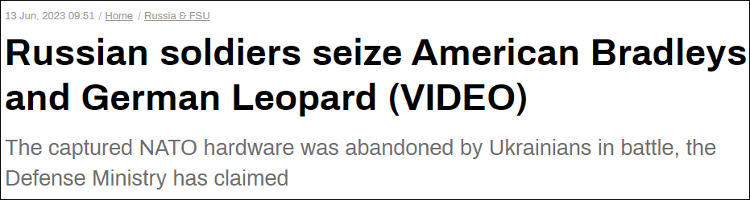
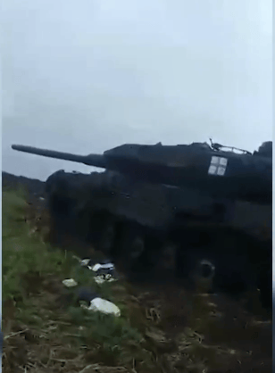
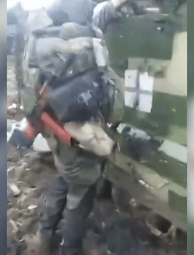
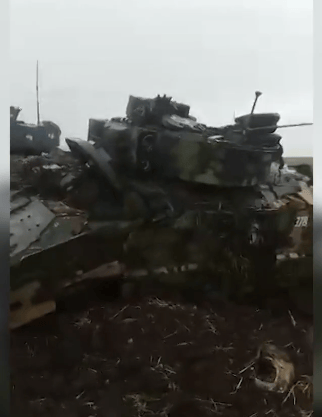
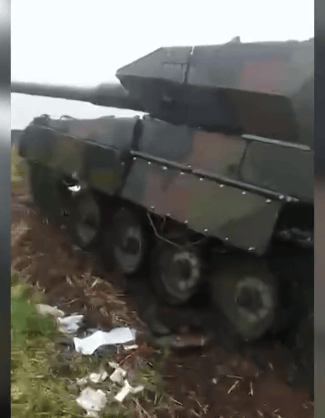
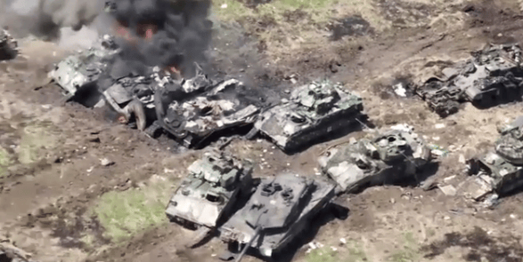
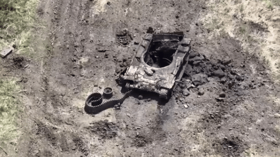
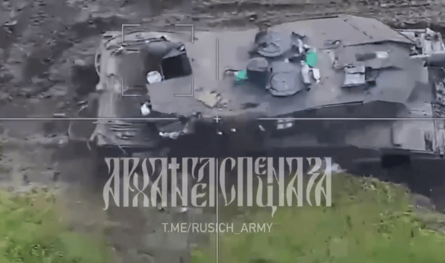
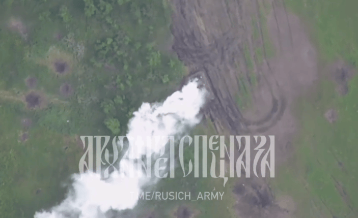
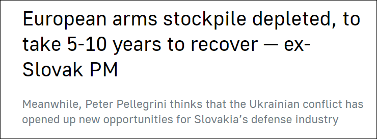

# 俄国防部称缴获多辆德制“豹”2坦克、美制“布莱德利”步战车

【文/观察者网
刘程辉】据“今日俄罗斯”13日报道，俄罗斯国防部12日发布的一段视频显示，俄军在扎波罗热地区缴获了数辆西方援乌装甲车辆，包括德制“豹”2A6坦克和美制M2“布莱德利”步兵战车。

_“今日俄罗斯”：俄军士兵缴获美国战车和德国“豹”_

视频中，一名激动的俄罗斯士兵在几辆装甲车辆残骸旁走动，这名士兵说部分车辆的发动机甚至还没有熄火。画面中“豹”2A6坦克楔形炮塔特征十分明显。

“这（装备）明显没有看上去的那么可怕。”俄军士兵还边走边欢呼，“‘布莱德利’！……这是德国吹捧的豹式坦克......光荣属于俄罗斯！”

俄国防部表示，这段视频是在扎波罗热前线地区拍摄的，展示了“东方”集群部队士兵检查缴获的敌方坦克和步兵战车的画面。“缴获的全部是西方生产的装备，包括德国‘豹’式坦克和美制‘布莱德利’步兵战车。部分战车的发动机还在运转，这表明战斗是在极短时间内结束的，乌军乘员放弃尚能作战的装备仓皇而逃。”

随着近期俄乌战场烈度加剧，越来越多西方军援装备遭摧毁的画面在社交媒体上流传。

俄罗斯国防部10日公布了在南顿涅茨克方向被摧毁的乌军装甲车辆的画面，其中就包括德国“豹”2坦克和美制“布莱德利”战车。

_俄国防部10日公布的乌军被毁装甲车辆残骸画面_

法新社12日报道称，乌军一支装甲部队在扎波罗热地区奥列霍沃（Orekhovo）进攻时遭受重创，损失了大部分“布莱德利”步战车，9辆装甲车中有6辆被摧毁，3辆受损但尚可修复。

俄罗斯总统普京6月9日发表讲话指出，“乌克兰的进攻已经开始，这一点从其战略预备队的使用中可以看出”。普京说，近日乌军损失重大，乌俄战损比为3：1，远远超过“传统标准”。

与此同时，有美方高级官员向美国有线电视新闻网（CNN）证实，乌军队在对俄军发动反攻的过程中遭遇“重大”伤亡，俄军利用反坦克导弹和迫击炮“顽强抵抗”，乌方在穿越地雷区时遇到了麻烦。

_社交媒体上据称是俄军“柳叶刀”巡飞弹摧毁“豹”2A6画面_

《纽约时报》13日援引分析人士的话称，尽管乌军没有透露损失情况，但西方盟友提供的先进武器的损失已经得到证实，即便如此乌克兰并没有声称取得任何重大突破。

据乌通社12日报道，乌克兰外交部副部长梅尔尼克接受德媒采访时，要求获得更多的德制坦克。“乌克兰军队迫切需要更多的西方主战坦克、步兵战车和其他装甲车。每一辆豹2在决定性的进攻中都发挥着作用。”

梅尔尼克认为，德国只向乌克兰提供了18辆“豹”式坦克，但德国完全能够从300辆库存中提供更多。他还要求获得60辆“黄鼠狼”步兵战车。

_塔斯社：斯洛伐克前总理称欧洲武器库已耗尽_

另据塔斯社12日报道，斯洛伐克前总理彼得·佩莱格里尼表示，整个欧洲的武器仓库已经被搬空，所有军队都需要补充物资，这将是5到10年的工作量。佩莱格里尼还表示，由于缺乏资源，斯洛伐克将无法再向他国提供大量军事援助。

本文系观察者网独家稿件，未经授权，不得转载。

