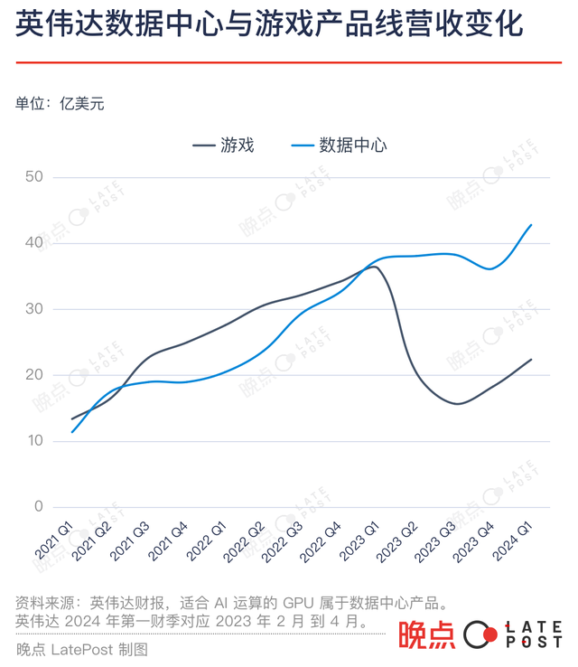
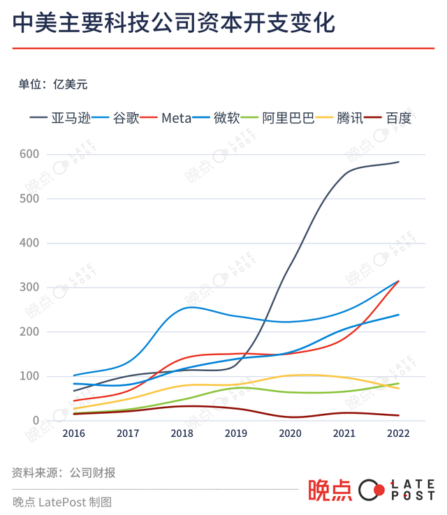
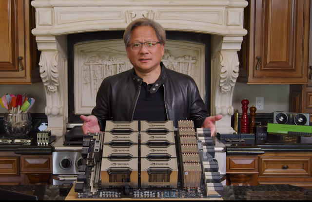

# 国内大厂争夺AI入场券！传字节向英伟达订购超过10亿美元GPU

全世界都在抢算力，中国大公司更急迫。

**文丨张家豪**

**编辑丨程曼祺 黄俊杰**

2022 年下半年，ChatGPT 爆火的同时，硅谷著名风险资本 a16z 走访了数十家 AI 创业公司和大科技公司。他们发现，创业公司转手就把
80%-90% 的早期融资款送给了云计算平台，以训练自己的模型。他们估算，即便这些公司的产品成熟了，每年也得把 10%-20%
的营收送给云计算公司。相当于一笔 “AI 税”。

这带来了在云上提供模型能力和训练服务，把算力租给其它客户和创业公司的大市场。仅在国内，现在就至少有数十家创业公司和中小公司在自制复杂大语言模型，他们都得从云计算平台租
GPU。据 a16z 测算，一个公司一年的 AI 运算开支只有超过 5000 万美元，才有足够的规模效应支撑自己批量采购 GPU。

据《晚点 LatePost》了解，今年春节后，拥有云计算业务的中国各互联网大公司都向英伟达下了大单。字节今年向英伟达订购了超过 10 亿美元的
GPU，另一家大公司的订单也至少超过 10 亿元人民币。

仅字节一家公司今年的订单可能已接近英伟达去年在中国销售的商用 GPU 总和。去年 9 月，美国政府发布对 A100、H100（英伟达最新两代数据中心商用
GPU） 的出口管制时，英伟达曾回应称这可能影响去年四季度它在中国市场的 4 亿美元（约合 28 亿元人民币）潜在销售。以此推算，2022
年全年英伟达数据中心 GPU 在中国的销售额约为 100 亿元人民币。

相比海外巨头，中国大科技公司采购 GPU 更为急迫。过去两年的降本增效中，一些云计算平台减少了 GPU 采购，储备不足。此外，谁也不敢保证，今天能买的高性能
GPU，明天会不会就受到新的限制。

01 从砍单到加购，同时内部腾挪

今年初之前，中国大型科技公司对 GPU 的需求还不温不火。

GPU 在中国大型互联网科技公司中主要有两个用途：一是对内支持业务和做一些前沿 AI 研究，二是把 GPU 放到云计算平台上对外售卖。

一名字节人士告诉《晚点 LatePost》，2020 年 6 月 OpenAI 发布 GPT-3
后，字节就曾训练了一个数十亿参数的生成式语言大模型，当时主要使用的 GPU 是 A100 前代产品
V100。由于参数规模有限，这个模型生成能力一般，字节当时看不到它的商业化可能性，“ROI（投资回报率） 算不过来”，这次尝试不了了之。

阿里也曾在 2018-2019 年积极采购 GPU。一位阿里云人士称，当时阿里的采购量至少达到上万块规模，购买的型号主要是 V100 和英伟达更早前发布的
T4。不过这批 GPU 中只有约十分之一给到了达摩院用作 AI 技术研发。2021 年发布万亿参数大模型 M6 后，达摩院曾披露训练 M6 使用了 480
块 V100。

阿里当时购买的 GPU，更多给到了阿里云用于对外租赁。但包括阿里云在内，一批中国云计算公司都高估了中国市场的 AI
需求。一位科技投资人称，大模型热潮之前，国内主要云厂商上的 GPU 算力不是紧缺，而是愁卖，云厂商甚至得降价卖资源。去年阿里云先后降价 6 次，GPU
租用价下降超两成。

在降本增效，追求 “有质量的增长” 与利润的背景下，据了解，阿里在 2020 年之后收缩了 GPU 采购规模，腾讯也在去年底砍单一批英伟达 GPU。

然而没过多久后的 2022 年初，ChatGPT 改变了所有人的看法，共识很快达成：大模型是不容错过的大机会。

各公司创始人亲自关注大模型进展：字节跳动创始人张一鸣开始看人工智能论文；阿里巴巴董事局主席张勇接手阿里云，在阿里云峰会发布阿里大模型进展时称，“所有行业、应用、软件、服务，都值得基于大模型能力重做一遍”。

一名字节人士称，过去在字节内部申请采购 GPU 时，要说明投入产出比、业务优先级和重要性。而现在大模型业务是公司战略级别新业务，暂时算不清 ROI
也必须投入。

研发自己的通用大模型只是第一步，各公司的更大目标是推出提供大模型能力的云服务，这是真正可以匹配投入的大市场。

微软的云服务 Azure 在中国云计算市场本没有太强存在感，入华十年来主要服务跨国公司的中国业务。但现在客户得排队等待，因为它是 OpenAI
商业化的唯一云代理商。

阿里在 4 月的云峰会上，再次强调 MaaS（模型即服务）是未来云计算趋势，在开放自研的通用基础模型 “通义千问”
测试之外，还发布了一系列帮助客户在云上训练、使用大模型的工具。不久后腾讯和字节火山引擎也先后发布自己的新版训练集群服务。腾讯称用新一代集群训练万亿参数的混元大模型，时间可被压缩到
4 天；字节称它们的新集群支持万卡级大模型训练，国内数十家做大模型的企业，多数已在使用火山引擎。

所有这些平台使用的要么是英伟达 A100、H100 GPU，要么是去年禁令后英伟达专门推出的减配版 A800、H800，这两款处理器带宽分别是原版的约
3/4 和约一半，避开了高性能 GPU 的管制标准。

围绕 H800 和 A800，中国科技大公司开始了新一轮下单竞争。

一名云厂商人士称，字节、阿里等大公司主要是和英伟达原厂直接谈采购，代理商和二手市场难以满足他们的庞大需求。

英伟达会按目录价，根据采购规模谈一个折扣。据英伟达官网，A100 售价为 1 万美元 / 枚（约 7.1 万元人民币），H100 售价为 3.6 万美元 /
枚（约 25.7 万元人民币）；据了解，A800 和 H800 售价略低于原版。

中国公司能否抢到卡，更多是看商业关系，比如以往是不是英伟达的大客户。“你是和中国英伟达谈，还是去美国找老黄（黄仁勋，英伟达创始人、CEO）直接谈，都有差别。”
一位云厂商人士说。

部分公司也会和英伟达进行 “业务合作”，在购买抢手的数据中心 GPU
时，也购买其它产品，以争取优先供应。这就像爱马仕的配货，如果你想买到热门的包，往往也得搭配几万元的衣服、鞋履。

综合我们获得的行业信息，字节今年的新下单动作相对激进，超过 10 亿美元级别。

一位接近英伟达的人士称，字节到货和没到货的 A100 与 H800 总计有 10 万块。其中 H800 今年 3
月才开始投产，这部分芯片应来自今年的加购。据了解，以现在的排产进度，部分 H800 要到今年底才能交货。

字节跳动 2017 年开始建设自己的数据中心。曾经的数据中心更依赖适应所有计算的 CPU，直到 2020 年，字节采购英特尔 CPU 的金额还高于英伟达
GPU。字节采购量的变化，也反映了如今大型科技公司的计算需求中，智能计算对通用计算的赶超。

据了解，某互联网大厂今年至少已给英伟达下了万卡级别订单，按目录价估算价值超 10 亿元人民币。

腾讯则率先宣布已用上 H800，腾讯云在今年 3 月发布的新版高性能计算服务中已使用了
H800，并称这是国内首发。目前这一服务已对企业客户开放测试申请，这快于大部分中国公司的进度。

据了解，阿里云也在今年 5 月对内提出把 “智算战役” 作为今年的头号战役，并设立三大目标：机器规模、客户规模和营收规模；其中机器规模的重要指标就是 GPU
数量。

新的 GPU 到货前，各公司也在通过内部腾挪，优先支持大模型研发。

能一次释放较多资源的做法是砍掉一些没那么重要，或短期看不到明确前景的方向。“大公司有好多半死不活的业务占着资源。” 一位互联网大公司 AI 从业者说。

今年 5 月，阿里达摩院裁撤自动驾驶实验室：300 多名员工中，约 1/3
划归菜鸟技术团队，其余被裁，达摩院不再保留自动驾驶业务。研发自动驾驶也需要用高性能 GPU 做训练。这一调整可能与大模型无直接关系，但确实让阿里获得了一批
“自由 GPU”。

字节和美团，则直接从给公司带来广告收入的商业化技术团队那里匀 GPU。

据《晚点 LatePost》了解，今年春节后不久，字节把一批原计划新增给字节商业化技术团队的 A100 匀给了 TikTok
产品技术负责人朱文佳。朱文佳正在领导字节大模型研发。而商业化技术团队是支持抖音广告推荐算法的核心业务部门。

美团在今年一季度左右开始开发大模型。据了解，美团不久前从多个部门调走了一批 80G 显存顶配版 A100，优先供给大模型，让这些部门改用配置更低的 GPU。

财力远不如大平台充裕的 B 站对大模型也有规划。据了解，B 站此前已储备了数百块 GPU。今年，B 站一方面持续加购
GPU，一方面也在协调各部门匀卡给大模型。“有的部门给 10 张，有的部门给 20 张。” 一位接近 B 站的人士称。

字节、美团、B 站等互联网公司，原本支持搜索、推荐的技术部门一般会有一些 GPU 资源冗余，在不伤害原有业务的前提下，他们现在都在 “把算力水份挤出来”。

不过这种拆东补西的做法能获得的 GPU 数量有限，训练大模型所需的大头 GPU 还是得靠各公司过去的积累和等待新 GPU 到货。

02 全世界都在抢算力

对英伟达数据中心 GPU 的竞赛也发生在全球范围。不过海外巨头大量购买 GPU 更早，采购量更大，近年的投资相对连续。

2022 年，Meta 和甲骨文就已有对 A100 的大投入。Meta 在去年 1 月与英伟达合作建成 RSC 超级计算集群，它包含 1.6 万块
A100。同年 11 月，甲骨文宣布购买数万块 A100 和 H100 搭建新计算中心。现在该计算中心已部署了超 3.27 万块 A100，并陆续上线新的
H100。

微软自从 2019 年第一次投资 OpenAI 以来，已为 OpenAI 提供数万块 GPU。今年 3 月，微软又宣布已帮助 OpenAI
建设了一个新计算中心，其中包括数万块 A100。Google 在今年 5 月推出了一个拥有 2.6 万块 H100 的计算集群 Compute Engine
A3，服务想自己训练大模型的公司。

中国大公司现在的动作和心态都比海外巨头更急迫。以百度为例，它今年向英伟达新下的 GPU 订单高达上万块。数量级与 Google
等公司相当，虽然百度的体量小得多，其去年营收为 1236 亿元人民币，只有 Google 的 6%。

据了解，字节、腾讯、阿里、百度这四家中国投入 AI 和云计算最多的科技公司，过去 A100 的积累都达到上万块。其中字节的 A100
绝对数最多。不算今年的新增订单，字节 A100 和前代产品 V100 总数接近 10 万块。

成长期公司中，商汤今年也宣称，其 “AI 大装置” 计算集群中已总共部署了 2.7 万块 GPU，其中有 1 万块 A100。连看似和 AI
不搭边的量化投资公司幻方之前也购买了 1 万块 A100。

仅看总数，这些 GPU 供各公司训练大模型似乎绰绰有余——据英伟达官网案例，OpenAI 训练 1750 亿参数的 GPT-3 时用了 1 万块 V100
，训练时长未公开；英伟达测算，如果用 A100 来训练 GPT-3 ，需要 1024 块 A100 训练 1 个月，A100 相比 V100 有 4.3
倍性能提升。但中国大公司过去采购的大量 GPU 要支撑现有业务，或放在云计算平台上售卖，并不能自由地用于大模型开发和对外支持客户的大模型需求。

这也解释了中国 AI 从业者对算力资源估算的巨大差别。清华智能产业研究院院长张亚勤 4 月底参加清华论坛时说，“如果把中国的算力加一块，相当于 50 万块
A100，训练五个模型没问题。”AI 公司旷视科技 CEO 印奇接受《财新》采访时则说：中国目前可用作大模型训练的 A100 总共只有约 4 万块。

主要反映对芯片、服务器和数据中心等固定资产投资的资本开支，可以直观说明中外大公司计算资源的数量级差距。

最早开始测试类 ChatGPT 产品的百度，2020 年以来的年资本开支在 8 亿到 20 亿美元之间，阿里在 60-80 亿美元之间，腾讯在 70-110
亿美元之间。同期，亚马逊、Meta、Google、微软这四家自建数据中心的美国科技公司的年资本开支最少均超过 150 亿美元。

疫情三年中，海外公司资本开支继续上涨。亚马逊去年的资本开支已来到 580 亿美元，Meta、Google 均为 314 亿美元，微软接近 240
亿美元。中国公司的投资在 2021 年之后则在收缩。腾讯、百度去年的资本开支均同比下滑超 25%。

训练大模型的 GPU 已不算充足，各家中国公司如果真的要长期投入大模型，并赚到给其它模型需求 “卖铲子” 的钱，未来还需要持续增加 GPU 资源。

走得更快 OpenAI 已遇到了这一挑战。5 月中旬，OpenAI CEO SamAltman 在与一群开发者的小范围交流中说，由于 GPU
不够，OpenAI 现在的 API 服务不够稳定，速度也不够快，在有更多 GPU 前，GPT-4
的多模态能力还无法拓展给每个用户，他们近期也不准备发布新的消费级产品。技术咨询机构 TrendForce 今年 6 月发布报告称，OpenAI 需要约 3
万块 A100 来持续优化和商业化 ChatGPT。

与 OpenAI 合作颇深的微软也面临类似情境：今年 5 月，有用户吐槽 New Bing 回答速度变慢，微软回应，这是因为 GPU
补充速度跟不上用户增长速度。嵌入了大模型能力的微软 Office 365 Copilot 目前也没有大规模开放，最新数字是有 600
多家企业在试用——Office 365 的全球总用户数接近 3 亿。

中国大公司如果不是仅把训练并发布一个大模型作为目标，而是真想用大模型创造服务更多用户的产品，并进一步支持其它客户在云上训练更多大模型，就需要提前储备更多
GPU。

03 为什么只能是那四款卡？

在 AI 大模型训练上，现在 A100、H100 及其特供中国的减配版 A800、H800 找不到替代品。据量化对冲基金 Khaveen
Investments 测算，英伟达数据中心 GPU 2022 年市占率达 88%，AMD 和英特尔瓜分剩下的部分。

2020 年的 GTC 大会上，黄仁勋携 A100 第一次亮相。

英伟达 GPU 目前的不可替代性，源自大模型的训练机制，其核心步骤是预训练（pre-training）和微调（fine-
tuning），前者是打基座，相当于接受通识教育至大学毕业；后者则是针对具体场景和任务做优化，以提升工作表现。

预训练环节尤其消耗算力，它对单个 GPU 的性能和多卡间的数据传输能力有极高要求。

现在只有 A100、H100 能提供预训练所需的计算效率，它们看起来昂贵，反倒是最低廉的选择。今天 AI 还在商用早期，成本直接影响一个服务是否可用。

过去的一些模型，如能识别猫是猫的 VGG16，参数量只有 1.3 亿，当时一些公司会用玩游戏的 RTX 系列消费级显卡来跑 AI 模型。而两年多前发布的
GPT-3 的参数规模已达到 1750 亿。

大模型的庞大计算需求下，用更多低性能 GPU 共同组成算力已行不通了。因为使用多个 GPU 训练时，需要在芯片与芯片间传输数据、同步参数信息，这时部分
GPU 会闲置，无法一直饱和工作。所以单卡性能越低，使用的卡越多，算力损耗就越大。OpenAI 用 1 万块 V100 训练 GPT-3 时的算力利用率不到
50%。

A100 、H100 则既有单卡高算力，又有提升卡间数据传输的高带宽。A100 的 FP32（指用 4 字节进行编码存储的计算）算力达到 19.5
TFLOPS（1 TFLOPS 即每秒进行一万亿次浮点运算），H100 的 FP32 算力更高达 134 TFLOPS，是竞品 AMD MI250 的约 4
倍。

A100、H100 还提供高效数据传输能力，尽可能减少算力闲置。英伟达的独家秘籍是自 2014 年起陆续推出的 NVLink、NVSwitch
等通信协议技术。用在 H100 上的第四代 NVLink 可将同一服务器内的 GPU 双向通信带宽提升至 900 GB/s（每秒传输 900GB
数据），是最新一代 PCle（一种点对点高速串行传输标准）的 7 倍多。

去年美国商务部对 GPU 的出口规定也正是卡在算力和带宽这两条线上：算力上线为 4800 TOPS，带宽上线为 600 GB/s。

A800 和 H800 算力和原版相当，但带宽打折。A800 的带宽从 A100 的 600GB/s 降为 400GB/s，H800
的具体参数尚未公开，据彭博社报道，它的带宽只有 H100（900 GB/s） 的约一半，执行同样的 AI 任务时，H800 会比 H100 多花 10%
-30% 的时间。一名 AI 工程师推测，H800 的训练效果可能还不如 A100，但更贵。

即使如此，A800 和 H800 的性能依然超过其他大公司和创业公司的同类产品。受限于性能和更专用的架构，各公司推出的 AI 芯片或 GPU
芯片，现在主要用来做 AI 推理，难以胜任大模型预训练。简单来说，AI 训练是做出模型，AI 推理是使用模型，训练对芯片性能要求更高。

性能差距外，英伟达的更深护城河是软件生态。

早在 2006 年，英伟达就推出计算平台 CUDA，它是一个并行计算软件引擎，开发者可使用 CUDA 更高效地进行 AI 训练和推理，用好 GPU
算力。CUDA 今天已成为 AI 基础设施，主流的 AI 框架、库、工具都以 CUDA 为基础进行开发。

英伟达之外的 GPU 和 AI 芯片如要接入 CUDA，需要自己提供适配软件，但只有 CUDA 部分性能，更新迭代也更慢。PyTorch 等 AI
框架正试图打破 CUDA 的软件生态垄断，提供更多软件能力以支持其它厂商的 GPU，但这对开发者吸引力有限。

一位 AI 从业者称，他所在的公司曾接触一家非英伟达 GPU 厂商，对方的芯片和服务报价比英伟达更低，也承诺提供更及时的服务，但他们判断，使用其它 GPU
的整体训练和开发成本会高于英伟达，还得承担结果的不确定性和花更多时间。

“虽然 A100 价格贵，但其实用起来是最便宜的。” 他说。对有意抓住大模型机会的大型科技公司和头部创业公司来说，钱往往不是问题，时间才是更宝贵的资源。

短期内，唯一影响英伟达数据中心 GPU 销量的可能只有台积电的产能。

H100/800 为 4 nm 制程，A100/800 为 7 nm 制程，这四款芯片均由台积电代工生产。据中国台湾媒体报道，英伟达今年向台积电新增了 1
万片数据中心 GPU 订单，并下了超急件 ，生产时间最多可缩短 50%。正常情况下，台积电生产 A100
需要数月。目前的生产瓶颈主要在先进封装产能不够，缺口达一至两成，需要 3-6 个月逐步提升。

自从适用于并行计算的 GPU 被引入深度学习，十多年来，AI 发展的动力就是硬件与软件，GPU
算力与模型和算法的交叠向前：模型发展拉动算力需求；算力增长，又使原本难以企及的更大规模训练成为可能。

在上一波以图像识别为代表的深度学习热潮中，中国 AI
软件能力比肩全球最前沿水平；算力是目前的难点——设计与制造芯片需要更长的积累，涉及漫长供应链和浩繁专利壁垒。

大模型是模型与算法层的又一次大进展，没时间慢慢来了，想做大模型，或提供大模型云计算能力的公司必须尽快获得足够多的先进算力。在这轮热潮使第一批公司振奋或失望前，围绕
GPU 的抢夺不会停止。

