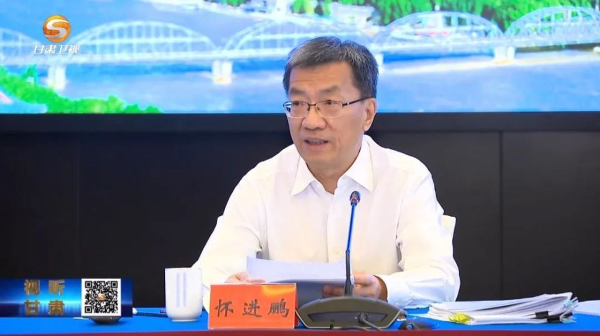
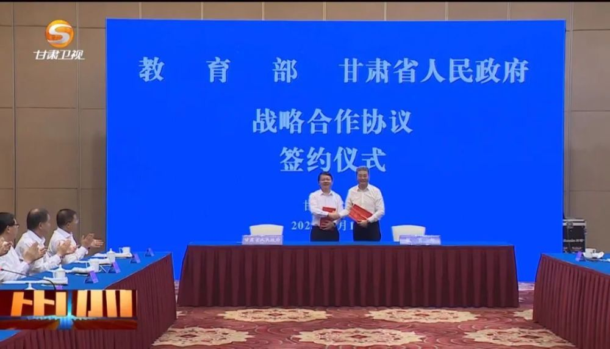
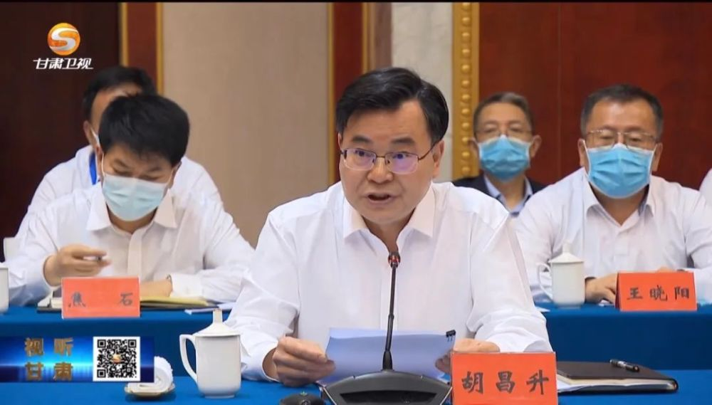
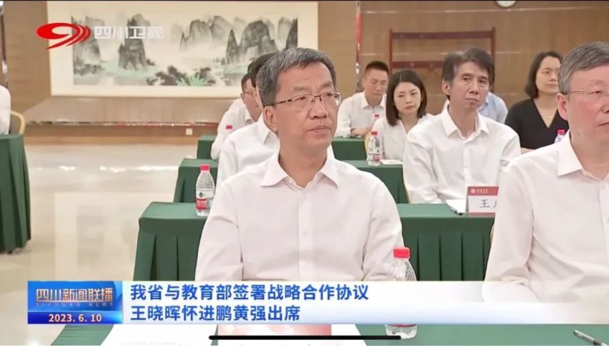

# 地位特殊、使命重大！部长离京赴西部，和省委书记、省长一同现身重要会议

**撰文 | 蔡迩一**

政知君注意到，最近，教育部党组书记、部长怀进鹏离京赴甘肃。

6月12日，“新时代振兴中西部高等教育工作会暨教育强国战略咨询会”在兰州召开。怀进鹏以及甘肃省委书记胡昌升、省长任振鹤等都去了现场。

在赴甘肃之前，6月10日，怀进鹏还在北京和四川省委书记王晓晖、省长黄强共同出席了教育部与四川省人民政府在京签署战略合作协议。

这两次活动的背后，都有一个共同的关键词——建设教育强国。

**中央关注的大事**

“建设教育强国”是中央关注的大事。

5月29日下午，中共中央政治局就“建设教育强国”进行了第五次集体学习。

习近平在主持学习时强调，教育兴则国家兴，教育强则国家强。

习近平还强调， **建设教育强国，龙头是高等教育** 。要把加快建设中国特色、世界一流的大学和优势学科作为重中之重。

把促进教育公平融入到深化教育领域综合改革的各方面各环节， **缩小教育的城乡、区域、校际、群体差距。**

官方报道称，6月12日在甘肃召开的新时代振兴中西部高等教育工作会暨教育强国战略咨询会，就是
**“贯彻落实习近平总书记在中央政治局第五次集体学习时的重要讲话精神和关于建设教育强国重要论述的实际行动”** 。

出席这次会议的有教育部党组书记、部长怀进鹏，甘肃省委书记胡昌升、省长任振鹤，教育部副部长吴岩，甘肃省副省长李刚等。

此外，中国科学院院士、清华大学党委书记邱勇等14位与会代表作战略咨询发言。

邱勇曾任清华大学校长，2022年2月任校党委书记，他主要研究方向为有机光电材料与器件研究。
**今年5月29日，中央政治局第五次集体学习时，邱勇曾在现场进行讲解，提出工作建议。**

在战略咨询会现场，怀进鹏强调，教育系统要“ **从国家利益的大政治上看教育，从经济社会发展的大民生上抓教育**
，从教育科技人才成长的大规律上办教育，加快编制教育强国规划纲要”。

**“影响中西部全面振兴大局”**

发展中西部高等教育也有特殊的意义。

中西部发展事关国家发展整体水平，事关我国社会主义现代化总体进程。中西部高等教育是中西部发展的战略内生力量，
**相当程度上影响着中西部全面振兴大局，影响着我国高质量发展全局。**

党中央高度重视中西部高等教育发展。

2020年9月1日，十九届中央深改委第十五次会议审议通过了《关于新时代振兴中西部高等教育的意见》。

不过，从现实情况来看，西部高等教育仍存在一些困境。

2022年8月，《光明日报》撰文提到，在取得重大成就的同时，西部高等教育发展仍面临 **区域间差异凸显、人才流失严重** 等现实困境。

在6月12日的新时代振兴中西部高等教育工作会暨教育强国战略咨询会上，怀进鹏强调了发展中西部教育的重要性。

他说，要“深刻认识中西部教育在教育强国建设中的重要地位，在以中国式现代化推进中华民族伟大复兴进程中统筹谋划中西部教育高质量发展”。

怀进鹏提到，要持续优化资源配置，改善办学条件，更好地利用数字化技术手段 **加强教育公平** ，办好人民满意的教育。

“要继续把振兴中西部高等教育作为 **斩断贫穷代际传递** 、夯实中西部发展基础、积蓄中西部发展动能的战略抓手，加强东中西部教育合作和交流。”

他还提到，实施 **中西部人才培育行动计划** ，抓好有组织的科研创新。

**“改革先行区”**

这次战略咨询会还发布了《全面振兴中西部高等教育“兰州倡议”》。

倡议中提到， **中西部高等教育地位特殊、使命重大，前景广阔、未来可期** 。要转变发展观念、创新发展模式，从自身发展的小逻辑向服务经济社会发展大逻辑转变，
**从被动接受“输血”向主动自我“造血”转变** 。

6月12日下午，教育部与甘肃省人民政府举行了“部省会商暨战略合作协议签署仪式”。

根据协议，双方将以建设高质量教育体系为目标，部省 **共同推动中央决策部署落实落地** 。

教育部支持甘肃 **建设新时代振兴中西部高等教育改革先行区**
、基础教育优质均衡发展示范区、教育数字化战略行动助推教育现代化实验区，打造一批教育支撑经济社会发展产业研究院，
**在支撑国家重大战略、推动高质量发展方面先行先试。**

甘肃省委书记胡昌升提到，甘肃将与教育部同向发力、同题共答，在推动各级各类教育发展、强化科技创新、促进产教融合、加强人才培养等方面加强合作，加快构建教育、科技、人才“三位一体”统筹发展的现代化教育体系，扎实推进教育强国建设的甘肃实践，更好服务国家重大战略和区域经济社会发展。

**离京前，和四川省委书记、省长出席签约仪式**

就在怀进鹏赴甘肃之前，6月10日，在北京，四川省人民政府与教育部签署战略合作协议。

据报道，四川省委书记王晓晖，教育部部长怀进鹏，四川省省长黄强出席签约仪式。

参加活动的还有：

教育部党组成员、副部长王嘉毅，四川省副省长郑备，四川省委常委、成都市委书记施小琳，四川省委常委、组织部长于立军，四川省委常委、省委秘书长陈炜，成都市市长王凤朝等。

需要说明的是， **四川、陕西和重庆三地，是西部高等教育发展领头羊。**

《教育部高等教育司2023年工作要点》提到，推进新时代振兴中西部高等教育改革先行区建设，强化 **西安、兰州、重庆、成都** 战略支点作用，
**打造中西部高等教育“西三角”。**

根据6月10日四川和教育部签署的协议，双方建立“部省战略合作机制”。

协议显示，教育部将支持四川“加大各类人才培养力度，加强重点领域技术攻关和科技成果转化，积极推进教育领域改革创新，
**以教育强省建设辐射带动西南地区教育高质量发展，有力支撑教育强国建设** 。”

**资料｜新华社 人民网 教育部官网 甘肃日报等**

**【版权声明】本文著作权归政知新媒体独家所有，未经授权，不得转载。**

