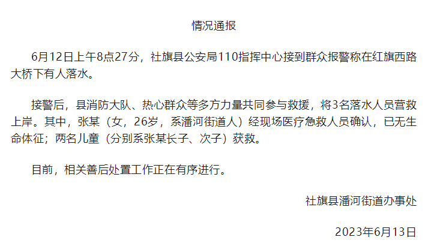

# 女子带两娃跳河，河南社旗：女子已无生命体征，两名儿童获救

**情况通报**

6月12日上午8点27分，社旗县公安局110指挥中心接到群众报警称在红旗西路大桥下有人落水。

接警后，县消防大队、热心群众等多方力量共同参与救援，将3名落水人员营救上岸。其中，张某（女，26岁，系潘河街道人）经现场医疗急救人员确认，已无生命体征；两名儿童（分别系张某长子、次子）获救。

目前，相关善后处置工作正在有序进行。

社旗县潘河街道办事处

2023年6月13日

来源：社旗发布

