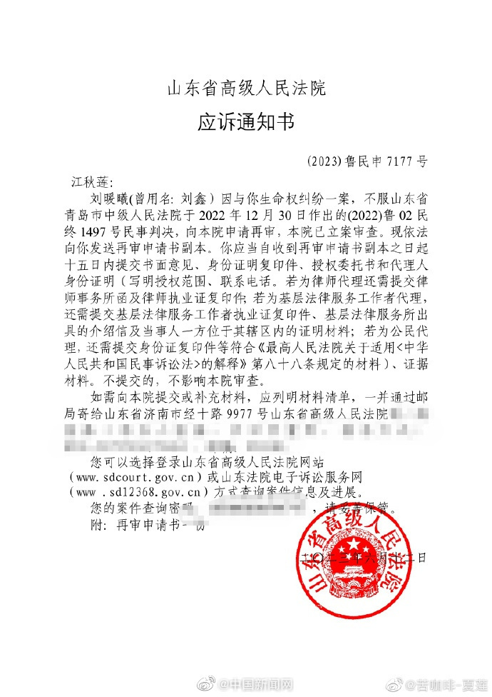

# 江歌母亲：刘鑫不服二审判决申请再审

13日，江歌母亲江秋莲@苦咖啡-夏莲 微博发文称，其收到山东省高级人民法院应诉通知书：刘暖曦（曾用名：
刘鑫）因与你生命权纠纷一案，不服山东省青岛市中级人民法院于2022年12月30日作出的（2022）鲁02民终1497号民事判决，向本院申请再审，本院已立案审查。2022年12月30日，江歌母亲江秋莲诉刘暖曦（原名刘鑫）生命纠纷权案二审宣判，刘暖曦被判赔偿江秋莲各项损失近70万元。

（来源：中国新闻网）

