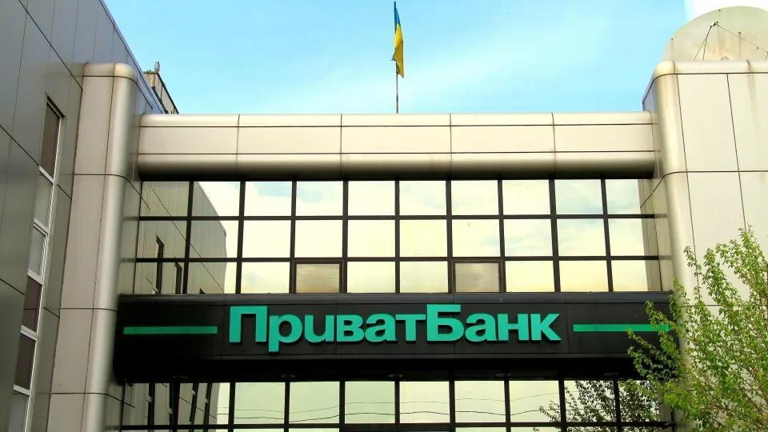
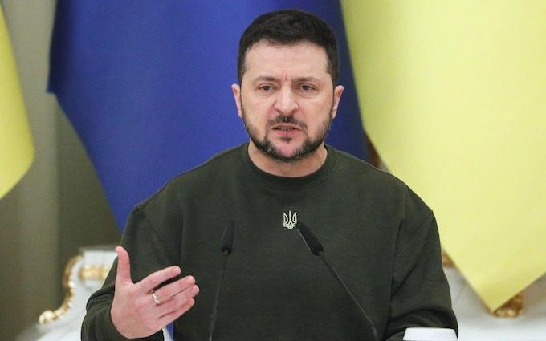

# 泽连斯基“前金主”伦敦受审：被控挪用20亿美元，利息需付42亿美元

当地时间本周一（12日），一场备受瞩目的“乌克兰寡头”审判在英国伦敦一高等法院正式开启。

据报道，乌克兰最大商业银行之一私人银行（Privatbank）指控其前任所有者、乌克兰寡头伊戈尔·科洛莫伊斯基和根纳迪·波戈留博夫利用“绝对权力”，通过虚假贷款和空壳公司洗钱挪走了近20亿美元。据悉，这是欧洲有史以来最大的银行欺诈案之一。

_↑私人银行（Privatbank）是乌克兰最大的商业银行之一_

西方各国人士正密切关注这场审判，因为对乌克兰总统泽连斯基来说这也是一块“关键试金石”：一方面这场审判的胜利可能会给资金紧张的乌克兰带来“丰厚的收入”，另一方面也是对泽连斯基推行改革和解决该国长期腐败问题的一场意愿考验。

**欧洲有史以来最大的银行欺诈案之一：**

**审判将持续四个月**

据报道，乌克兰私人银行指控科洛莫伊斯基和波戈留博夫在2013年至2014年期间，策划虚假贷款和供应协议对该银行进行了大规模洗钱活动。此案还涉及三家在英国注册的供应商，两人据称利用这几家空壳公司通过“奇怪的供应协议获取资金”，其中包括12.6万吨浓缩苹果汁和240万吨澳大利亚锰矿石。

私人银行的代理律师安德鲁·亨特周一在法庭上表示，“这种欺诈行为在这些诉讼中被称为‘挪用’——涉及使用复杂的工具网络从银行提取超过19亿美元。”而这场“规模空前的欺诈行为”导致了私人银行在2016年倒闭，并于当年12月被国有化。据悉，乌克兰国家银行此前在这家商业银行的资产负债表上发现了高达55亿美元的漏洞。

不过，科洛莫伊斯基和波戈留博夫都否认有任何不当行为。他们表示，私人银行没有任何直接证据表明他们知道或参与了所谓的欺诈行为。科洛莫伊斯基在伦敦的代理律师提供了一份声明称：“这一指控是针对他的一场政治运动的一部分，乌克兰私人银行的指控是基于毫无根据的推断，在法律上和事实上都是错误的。”

据悉，这场“备受期待”审判因俄乌冲突爆发推迟了审判程序，比原计划晚了一年才开始，将持续长达四个月之久。报道称，这起案件预计将是英国今年最大、最复杂的民事审判。

_↑乌克兰寡头伊戈尔·科洛莫伊斯基_

**“前金主”受审：**

**考验泽连斯基反腐决心**

鉴于乌总统泽连斯基与科洛莫伊斯基的私人关系，西方国家对泽连斯基本人也施加了特别的压力，要求他起诉科洛莫伊斯基。众所周知，伊戈尔·科洛莫伊斯基曾被称为泽连斯基的“前金主”，后者在其大力支持下从一名演员成功当选为乌克兰总统。不过，泽连斯基一直否认当选总统是得到了科洛莫伊斯基的支持。

报道称，泽连斯基上台后开始试图履行有关反腐败问题的竞选宣言，企图废除乌克兰自1991年独立以来盛行的寡头体制，包括收回对关键工业和战略资产的控制权。他表示，这些资产让少数未经选举的乌克兰寡头得以在幕后施加巨大的政治影响。

2020年，乌克兰政府出台了“反科洛莫伊斯基”银行法，禁止国有银行“回归”其前所有者。这也阻止了科洛莫伊斯基和波戈留博夫收回对乌克兰私人银行的控制权，两人声称私人银行是“被非法国有化的”。

就在本次审判前，乌克兰安全部门于今年2月突袭搜查了科洛莫伊斯基的豪宅。根据乌克兰官方的说法，此次突袭与乌克兰最大的两家石油公司Ukrnafta和Ukrtatnafta高层挪用公款调查有关。这两家公司此前由科洛莫伊斯基控制，是去年11月乌克兰政府接管的5家战略企业之一。

据乌官方调查，Ukrnafta和Ukrtatnafta两家公司前管理层涉及大规模贪腐案，涉案金额约400亿格里夫纳（约合10亿美元），以科洛莫伊斯基为首的管理层难辞其咎。

**60多亿美元的官司**

**或将最终帮助乌克兰重建**

报道称，由于种种原因，西方政界人士和投资者正密切关注此案，将其视为一场对乌克兰总统泽连斯基推行改革和解决该国腐败问题的意愿考验。

_↑乌克兰总统泽连斯基_

乌克兰私人银行正寻求追回近20亿美元的损失，外加高达42亿美元的利息。这意味着，追回的这一大笔资金或将最终帮助重建这个深陷冲突的国家。

根据世界银行、联合国、欧盟委员会和乌克兰政府此前进行的联合评估，乌克兰战后重建和恢复的成本估计已增至4110亿美元。仅在2023年，乌克兰就至少需要140亿美元的关键投资，这比乌克兰政府本年度预算多出了110亿美元。

与此同时，尽管战火不断，但在俄乌冲突持续期间，多年来困扰乌克兰的腐败问题仍受到了西方的高度关注。报道称，这场审判开启之际，正值泽连斯基面临着来自西方国家的巨大压力，要求其打击腐败，以换取广泛的财政和军事援助。据悉，国际货币基金组织（IMF）对乌克兰政府提出的贷款条件中，金融改革，包括保护乌克兰央行的独立性都是主要内容。

不仅如此，持续打击腐败，对乌克兰获得欧盟成员国身份的目标也至关重要。今年早些时候，乌克兰总理丹尼斯·什米哈尔宣布了一个“雄心勃勃的时间表”，希望乌克兰能在两年内加入欧盟。2022年6月，乌克兰因在打击腐败方面取得的进展而获得了欧盟候任成员国资格。

红星新闻记者 徐缓

编辑 何先锋 责编 官莉

