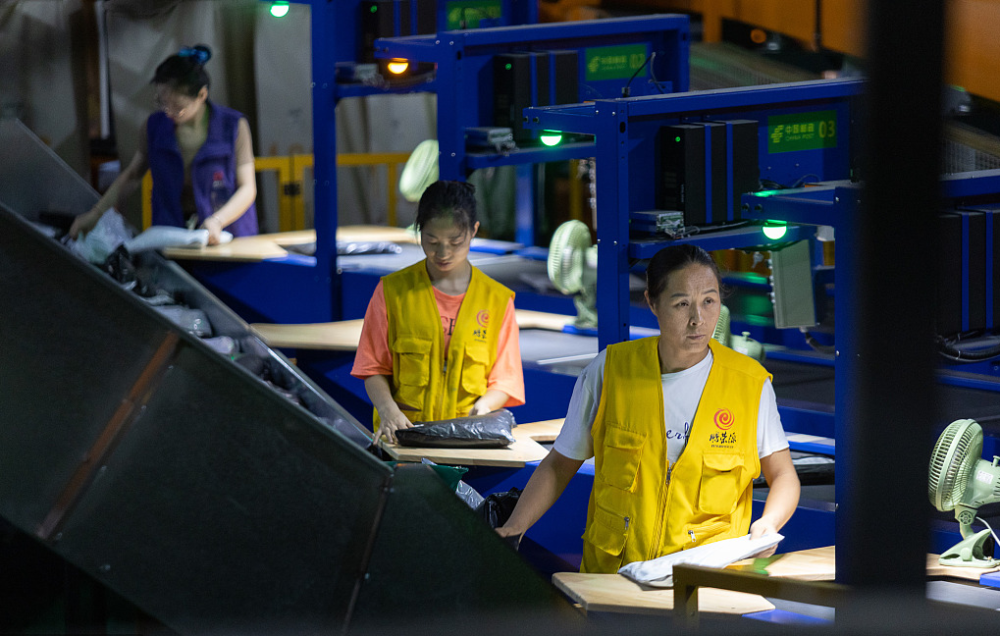
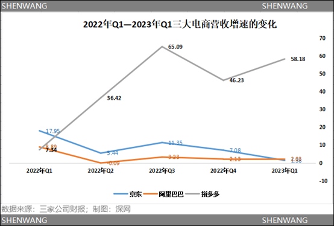
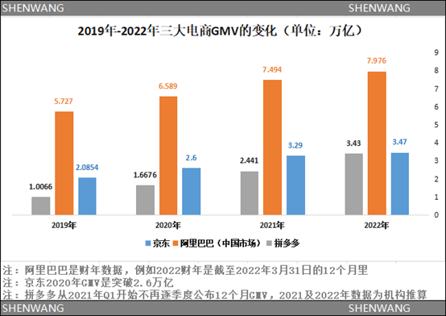
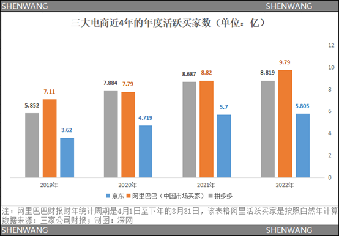

# 电商巨头开打618最惨烈价格战：中小商家再次成为香饽饽

_来源：视觉中国_

作者 | 张睿

编辑 | 康晓

出品｜深网.小满工作室

作为疫情后的第一个618大促，各大电商的炮火都集中在补贴和低价上。

在自己的主场，京东开始真正发力“百亿补贴”策略，并推出“买贵双倍赔”服务；独立后的淘宝天猫商业集团把“价格力”、“好货好价”定为618的核心战略；拼多多在延续“天天都是618”理念的基础上，投入50亿补贴4天。

**通过低价和补贴来争夺用户和流量已经成为平台大促时节的常规手段，但今年淘天、京东对给自己贴上“低价”标签的意愿尤为强烈。**

为了凸显“补贴力度”，淘天和京东负责人纷纷出来站台。淘天CEO戴珊表示：“淘宝天猫会在用户规模上进行历史性的巨大投入。”京东零售CEO辛利军也喊话：“今年的京东618会是全行业投入力度最大的一次618。”

虽然这次618，拼多多也声称拿出了50亿，但相比淘天和京东，拼多多的声量小很多。“618一直都不是拼多多的主场，日常的百亿补贴才是。拼多多参加补贴仅是为了不缺席。拼多多‘天天都是618’的策略，弱化了各类购物节的影响力。因为平时就能买到最低价，用户没必要等到大促节点，这对京东和淘天都是挑战。”点金手创始人丰年对《深网》分析。

**在供给上，通过吸引大量渠道商和中小商家入驻，提供便宜、好用、丰富的商品；在服务上，极力讨好消费者，从今年电商平台的重要战略上看，京东、淘天正在向拼多多看齐。这并不令人意外，2023年第一季度，在淘天和京东电商收入增长完全停滞的情况下，拼多多营收却同比增长58%。**

**拼多多的增长，早已不再仅仅是在四五线城市和村镇等下沉市场的增长，也是一二线城市用户的消费需求降级带来的增长。**

**争夺渠道商和中小商家**

淘天和京东下场推“低价战略”的关键点在哪里？

拼多多的商家构成已经给淘天和京东打个样板，即吸引和扶持更多的零售渠道商和中小商家。

有知情人士对《深网》透露，“拼多多上的商品之所以足够丰富且有价格优势，是因为拼多多上的渠道商及中小商家多于品牌方。与品牌方坚持‘不破价’相比，渠道商更看重库存和现金周转率。为了减少资金占有率，不少渠道商选择薄利多销。”

拼多多上的商品价格能有多低？石家庄某社区烟酒店店主对《深网》反馈，“自己现在会从拼多多进货。拼多多和天之蓝等白酒联合补贴时，从拼多多进货比从上游渠道商拿货的价格还要低。”

**从京东和淘天近半年的主要战略变化可以看出，二者的战略重点已经开始向渠道商和中小商家倾斜。**

京东方面，2023年4月，京东零售宣布全面打通自营和POP商家（第三方商家），由统一的品类负责人管理，实现流量“平权”。这是京东涉足POP业务以来，第一次在内部打通自营和POP商家。

换成通俗的说法，京东希望通过吸引和扶持更多的第三方商家入驻，来提升商品丰富度，并撬动低价策略的实施。

京东以自营家电起家，并以“高效物流+正品保障”占领用户心智，不少用户去京东下单就是冲着自营品质保证和24小时物流送达来的。不过用户在京东的这两个核心体验，是靠钱堆出来的，背后是京东高昂的运营成本。

据京东财报显示，去年京东营业成本8992亿元，同比增长9.3%，其中履约开支（主要包括采购、仓储、配送、客户服务及支付处理开支）630亿元，占收入的比例为6.0%。

运营成本高仅是京东上的商品价格难以下探的原因之一，另外一个隐秘的原因是，由于京东自营商品主要从品牌方进货，降价受品牌方制约。“大品牌出于对品牌价值及整体价格体系的保护，对京东自营商品降价幅度有严格的要求。”有知情人士对《深网》透露。

**品牌方“限价”，大量吸引和扶持渠道商就成为京东推进“低价”策略的关键。有知情人士对《深网》透露，“部分京东第三方商家货源也来自拼多多，所以部分用户在京东下单后，会收到该订单由拼多多发货的消息提醒。”**

**京东之外，淘天也在加强对中小商家的扶持。**

“淘天体系后期的流量是靠巨额投资堆出来的。阿里巴巴围绕流量入口曾投资或收购陌陌、微博、优酷、高德地图等相关产品，这些巨额投资带来的流量后来只有品牌方才能玩的起，所以才造成2019年前后一批淘宝中小商家转战拼多多。”一位电商行业人士对《深网》分析。

5月10日，淘天集团CEO戴珊提出“用户为先、生态繁荣、科技驱动”三个战略关键词，并表示淘宝将“以历史级的巨大投入，为商家做大用户规模。”

“生态繁荣”可以理解为，淘宝天猫不仅要扶持品牌方，也要让中小商家回流到淘天体系，提高商品的丰富度。这一目标首先被落实到了618大促中。

与往年大促集中于品牌满减不同，淘宝在今年618明显加强了对中小商家的扶持。据了解，6月4日到6月13日期间，淘天首次上线中小商家专属618营销通道：淘宝好价节。这是电商史上第一次为中小卖家定制的营销IP。

对于淘天在618给中小商家开通的“福利”，有小商家表示担忧。“参加活动，担心做直通车的ROI打不平，不参加活动整个6月份就没有自然流量。现在愿意被薅羊毛的中小商家越来越少了。”

无论渠道商、中小商家是否对京东、淘天“迟到的偏爱”买账，两位公司“一号位”的表态已经释放了一个信号，未来一段时间，“低价”会成为电商江湖的关键词。

不过，作为电商生态闭环的核心环节，消费者是否愿意买单和“陪跑”则是另一个叙事。在每年数不清的电商节日和大促中，用户冲动消费的意念逐渐被磨灭。

《深网》分别采访了几位90后、95后、00后对今年618大促的感受，多位受访者都表达了不感兴趣的观点：一是在电商热衷“造节”的裹挟下，618等大促已经逐渐失去魔力，单纯的折扣和低价已经无法激发消费欲；二是随着裁员等不确定因素的增加，减少不必要的支出成为主流。

从宏观数据看，居民对存钱的热情明显高于花钱。据央行数据显示，2023年一季度人民币存款增加15.39万亿元 同比多增 4.54 万亿元。

触摸到10亿活跃买家瓶颈的电商平台运营重点已经从寻找新用户转变成留住老用户，通过极致的购物体验保住基本盘，用服务撬动“不愿花钱”的消费者。

无论是京东要求第三方商家须在消费者下单后48小时内发货，还是“买贵双倍赔”服务，这都是打造用户极致购物体验、提升售后服务质量的一环。

拼多多偏向消费者的购物政策，今年也一度引发平台中小商家极大不满。有商家对《深网》抱怨，“平台售后服务质量的提升，是拿商家的钱在讨论好消费者，退货的物流成本也大多由商家承担。”

**低价背后的较量**

今年618大促表面上看是各家在补贴和价格上的较量，本质上是商品供给侧的流动及消费者对价格、服务认知的变化造成电商格局的重构。

在商品供给侧相当于“淘宝+咸鱼+6188”的拼多多，在廉价日用品等领域，有淘天和京东难以比拟的商品丰富度；在消费者感知方面，拼多多“仅退货”及包邮退货等体验，大幅降低了用户使用拼多多的决策成本。

**关键点在于，丰富供给叠加超低价格确实给拼多多带来了逆势增长。自2022年第2季度开始，拼多多的单季增速明显高于京东和淘天。**

2023年第一季度，拼多多营收376.37亿元，同比增长58%，净利润81.01亿元，同比增长211.64%；阿里巴巴（对应2023财年第四季度）中国商业营收1320.62亿元，同比下滑
3%，经调整EBITA为384.87亿元，同比增长19%。京东集团实现营收2430亿元，同比增长1.4%，净利润61.99亿元，同比增长276.21%。

从GMV规模上看，拼多多正在追上京东。虽然拼多多的营收与阿里和京东还不在一个量级，却在增速上将二者甩出一大截。这也成为淘天把“价格力”定为了重大战略、京东带着“百亿补贴”火速下场的催化剂。

很长一段时间内，低价和“百亿补贴”都是拼多多特有的标签。

前期依靠和工厂合作、缩减供应链中间环节，拼多多通过低价白牌商品迅速抢占下沉市场用户。2019年上半年，拼多多赖以起家的“五环外”市场逐渐饱和，当年第一季度其新增用户只有2480万，创下了上市以来新低。

为了上探市场、拿到了进入中高线城市的入场券，拼多多于2019年6月1日推出了百亿补贴，并将百亿补贴常态化。时至今日，百亿补贴依然是拼多多流量最高的频道。

从拼多多此后的活跃买家增长情况看，百亿补贴确实成为拼多多转型的关键战役。在此后的6个月季度里，拼多多的单季新增用户一直维持在4000万到6000万之间。至此，百亿补贴成为低价之外拼多多用户增长的又一杀手锏。

转折点发生在2020年。2020年底，拼多多年活跃买家数达7.884亿，首次超过阿里巴巴（年度活跃消费者为7.79亿）。这意味着成立仅5年的拼多多就靠着低价和百亿补贴成为中国用户规模最大的电商平台。

眼见未来增量市场被拼多多抢走，阿里开始“点杀”拼多多，于2020年3月26日上线“淘特”。拼多多主打“百亿补贴”，淘特就打出“200亿补贴”的旗号；拼多多“9.9包邮”，淘特就推出“最高9.9”包邮的产品。

阿里重金推淘特很快见效。截至2022年底，阿里巴巴中国市场年度活跃买家数量为9.79亿，比拼多多（年度活跃买家8.819亿）多了近1亿。其中，淘特贡献了3亿多用户。

在下沉市场的争夺战中，京东也看到了“五环外用户”的价值。

2019年9月京东将此前上线的拼购更名为京喜，杀入下沉市场。2020年12月11日，京东组建
“京喜事业群”。不过京喜在下沉市场的尝试并不顺利，2022年6月京东裁撤京喜事业群。

没能靠京喜在下沉市场抢到用户，京东将火力转向百亿补贴。3月8日，京东上线百亿补贴，在预算层面不设上限，商品覆盖全品类。另据晚点报道，回归后的刘强东已经把“低价战略”定位京东零售未来三年最重要的战略。

