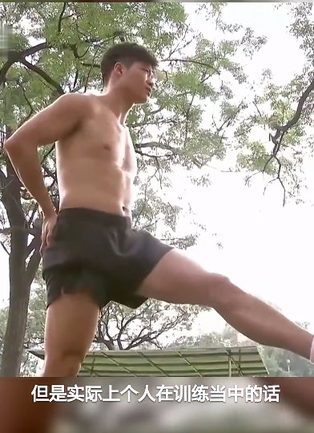
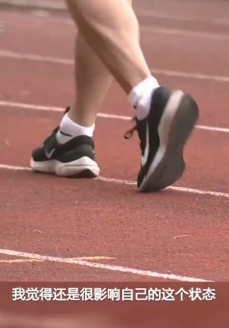
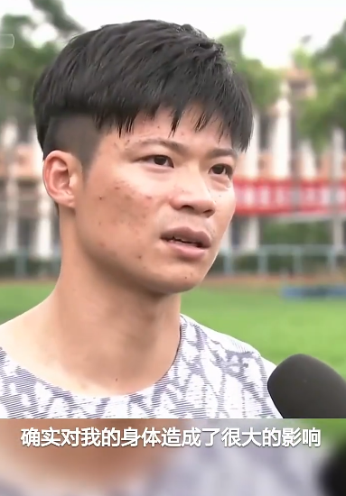
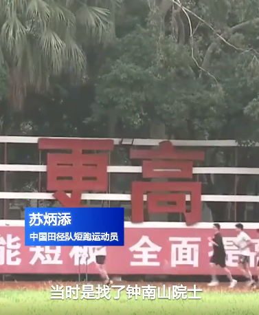

# 苏炳添团队释疑提前结束2023赛季：两次感染新冠，曾邀请钟南山检查

12日，中国短跑飞人苏炳添宣布，因身体原因提前结束2023赛季，不再参加田径世锦赛和亚运会的选拔赛。本赛季苏炳添只参加了瑞典一站田径室内赛，以6秒59的成绩夺冠。

在苏炳添宣布因伤病退出2023赛季随后比赛后，他在随后接受采访，具体谈到了身体的问题。苏炳添介绍，在参加今年初的瑞典哥德堡田径室内赛前，他已经有了身体不舒服的感觉。

苏炳添团队技术专家也发现，苏炳添一发力的时候，肌肉力量提不上来。受到影响，苏炳添团队最终取消了室内赛的参赛计划，回国进行调整。据介绍，苏炳添团队在回国后，邀请钟南山院士为苏炳添进行了检查。“钟南山院士对我进行了指标筛查。没有问题，比正常人还正常。但训练中不舒服的感觉还存在。”苏炳添说。

据介绍，苏炳添此前两次感染新冠。痊愈后出现了这些不适应的症状。另一方面，症状虽然影响到苏炳添的参赛计划，中国飞人依然坚持训练。虽然无法出战即将开始的世锦赛和亚运会选拔赛，苏炳添表示，他会继续为2024巴黎奥运会进行备战。

（据央视新闻客户端）

（来源：潮新闻）

