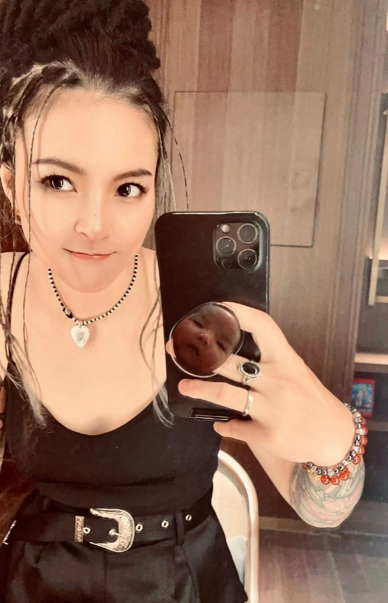
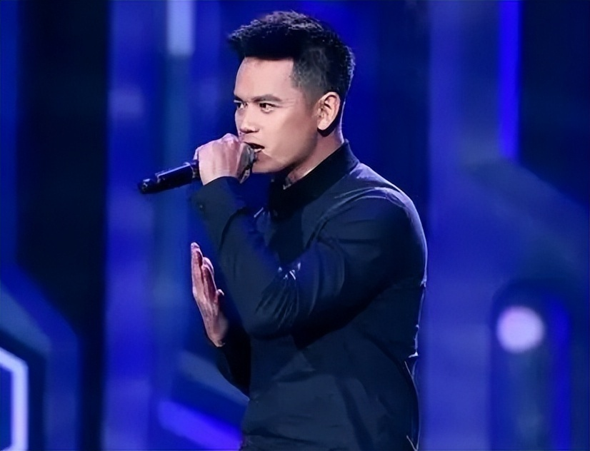

# “好声音”亚军张恒远疑因黑色素瘤病逝，年仅37岁，5月露面消瘦变样

6月13日晚，多方消息显示《中国好声音》第二季亚军张恒远病逝，出生于1986年10月的他，还没有满37岁。

有博主指张恒远离世的原因是癌症，他患有黑色素瘤：

也有网友发布朋友圈截图，指同乡获悉张恒远患的是喉癌：

但以上消息都没有被证实。

歌手唐磊直接在社交网公布了张恒远的讣告：

据悉，张恒远于6月13日晚上离世，家人已定于18日在家乡贵州为其设灵，同日安葬。

去年3月，张恒远迎娶相恋9年的歌手女友毕夏，二人儿子“小酒瓶”在同年8月出生，现在还没满一岁。

毕夏偶尔会在微博公开儿子的成长照，小孩长得非常可爱，比较像妈妈。

张恒远跟毕夏相识于《中国好声音》，两人都是汪峰战队的选手，张恒远最终成为汪峰队的冠军，毕夏则遗憾止步于汪峰队四强。

张恒远在比赛中曾演唱《无法逃脱》《夜空中最亮的星》《青春》《蓝莲花》等摇滚歌曲，赢得观众追捧。

两人完成比赛后，相继出道，毕夏拍摄过电影《匆匆那年》，发布多首歌曲，人气反比张恒远要高。

张恒远作为《中国好声音》第二季的亚军，于2014年发行个人首支单曲《卑微的荣耀》，2014年发布首张个人轻摇滚EP《继承者》，2016年12月27日推出专辑《黑色翅膀》。

他坚持做自己的音乐，跟朋友组乐队，天性低调的他，曝光率越来越低。

张恒远与毕夏结婚时，汪峰曾经担任两人的“导师”，婚礼上也给他们送去了视频祝福。

今年5月，汪峰与杨钰莹到汕头参加楼盘销售演出，便带上了张恒远毕夏夫妇。

众人在演出前录制了宣传视频，张恒远看着消瘦了许多，气质都变了，但精神还可以。

张恒远去年结婚以及当爸爸的时候，他显得精神奕奕：

张恒远本人的社交网，大约从去年11月至今年1月逐步停更，他仅在今年3月发文为朋友宣传新书。

微博最后一次上线是5月20日。

他的太太毕夏在微博的最近一次更新是5月25日。

过去半年，张恒远一直坚持演出，他除了跟汪峰到汕头之外，3月底在深圳也有演出。

当时，粉丝拍下张恒远在台上又唱又跳的模样，无论嗓音还是精神的状态都非常好。

不少网友推测，他的病应该来得比较突然，病情发展较快。

张恒远今年1月发布的最后一条动态，有朋友问他是否回了深圳演出，当时他的回答是“离开啦”。

该朋友获悉张恒远离世后，在该动态下再度留言，表示对方曾于今年3月底回深圳演出时，相约一众好友聚会，当时他就以自己的方式跟朋友告别。

一语成谶，他真的离开了。

张恒远成长于贵州省凯里市黄平县，父亲是教师，但他在学习上没能成为父母的荣耀。

据传，张恒远在小学一年级跟三年级都留过级，师范中专只读了一年就休学，曾让父母非常头疼。

张恒远热爱唱歌，他休学后考上了音乐学校，学习美声，在校期间，张恒远喜欢上摇滚乐，还为此留了长发，这一点曾让父母不满。

从音乐学校毕业，张恒远没有立即上班，他在家里组乐队，进行自己的音乐创作。

这样的生活过了两年，张恒远渐渐厌恶这样的自己，他不想上班，每天伸手问父母拿钱，生活不能自理，最后为了改变，他前往深圳唱歌赚钱。

一开始，张恒远的日子并不好过，他借住在朋友家里，身上没钱就去琴行教人弹吉他，还试过在地铁过道卖唱。

张恒远真正开始靠唱歌养活自己，是在本色酒吧打工之后。

刚进酒吧，他做的是灯光师，酒吧总监发现他唱歌不错，就帮他组了一个乐队，让他在酒吧驻唱。

慢慢的，张恒远开始有粉丝，每晚能够吸引三四桌特意来捧场的客人。

参加《中国好声音》之前，张恒远试过参与《快乐男声》的选拔，但可能没有准备充分，很快被淘汰了。

《好声音》是导演组去找张恒远，当时他在夜场已经小有名气，在导演组的游说下，张恒远决定再尝试一次。

一夜成名，张恒远终于成为了父母的骄傲，也让小12岁的妹妹封他为偶像。

如今，张恒远因病突然离世，不但妻儿失去了家庭支柱，其父母也饱受“白头人送黑头人”的痛苦，令人唏嘘。

