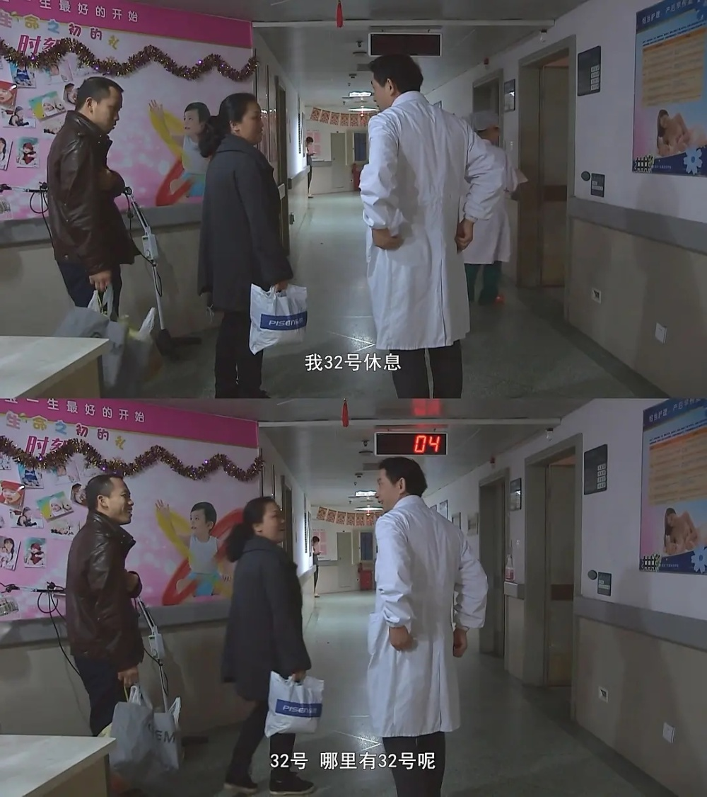
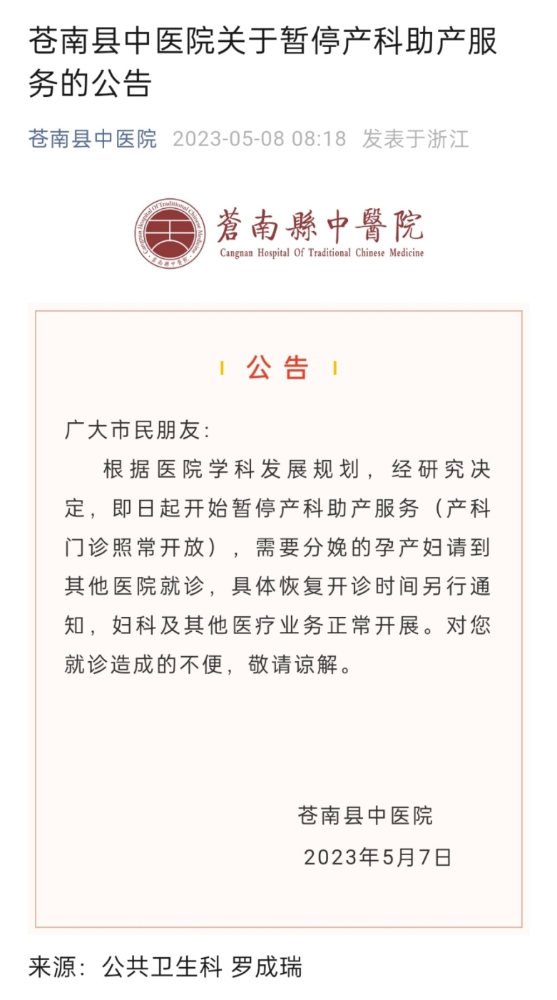
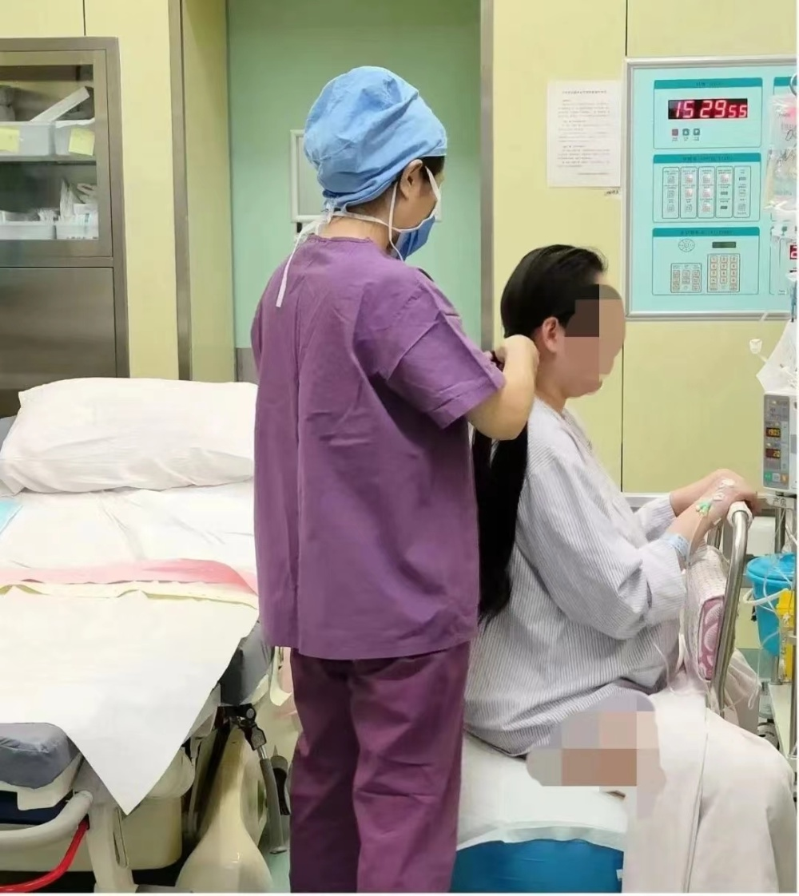
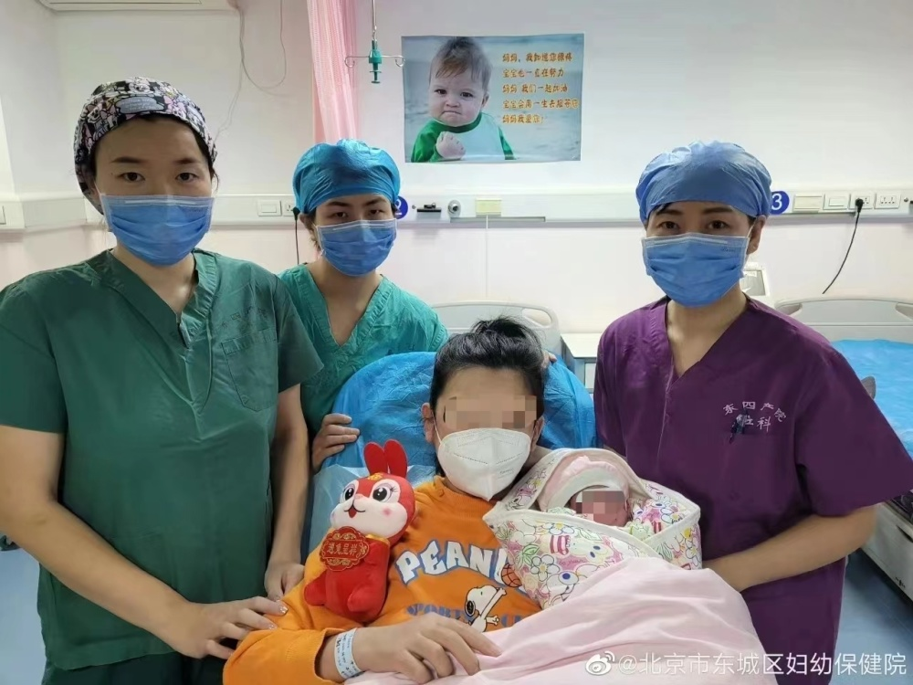

# 产科由热变冷：曾经床位“一号难求”，如今每月只有20名左右新生儿

一整个下午，记载着产房信息的大屏幕都未曾跳转。

页面仅有一条信息，“2023-5-23，7:00，李某某，床号待2，宫口扩张2，待产”。2023年5月23日17时，黄昏已至。这一天，北京市东城区妇幼保健院的产科仅有一人待产。

这是一家老牌的二级甲等妇幼保健机构，坐落在一个被老胡同包围着的中式建筑里，产科病房由3个四合院改造而建。这天，产科副主任王霞刚结束一场妇科手术，她穿过空荡荡的大厅和走廊，来到办公室休息片刻。

休息，是她在2016年不敢想的事情。那一年，产科每个月都会迎来200多名新生儿，最多时有280名左右新生儿。她的法定节假日全部在产科度过，加班成了每天的常态。而如今，产科每月只迎来20名左右新生儿。

国家统计局的数据显示，2022年末，全国人口为141175万人，比上一年末减少85万人，人口自然增长率为-0.6‰，这是我国人口自1962年以来首次出现负增长。

不只是北京市东城区妇幼保健院，新京报记者联系多家医院产科发现，受生育率下降影响，多地各级医院的产科都在变得安静。人口学者黄文政认为，生育率的下降，将逐渐影响到各行各业，而医院产科，只是影响抵达的第一站。

_2023年5月23日，北京市东城区妇幼保健院仅一人待产。新京报记者
汪畅 摄_

**曾经的“一号难求”**

产科的床位是渐渐空出来的。

王霞记得，先是大厅里加的六张床被陆续撤走，随后病房由八人间改成两人间。接着，两排病房往往只有一排会被使用。再然后，两人间也开始住不满了，现在产科38张病床空着大半，若是有孕妇前来生产，都能独占一间病房。每月新生儿人数在20人左右，“平均下来，一天不到一人”。

“这是一种断崖式的下跌。”王霞从事妇产科工作21年，自2013年调入东城区妇幼保健院妇产科之后，第一次见证分娩量在短期内锐减。高峰期时，北京市东城区妇幼保健院一年的分娩量能达到2000人次左右，到了去年这个数字下降到260人次。

那个不舍昼夜的2016年，让王霞至今难忘。2016年1月1日起，我国正式实施“全面二孩”政策，掀起一波生育热潮，“一床难求”“建档难”等现象出现。到了政策实施的第十个月，北京市东城区妇幼保健院迎来分娩量最高峰，将近300个婴儿在这里诞生。最忙的一天，王霞收治了7名待产妇，还做了4台剖宫产手术，几乎一整晚未合眼。

那是一个不可回望的生育高峰期。2017年3月11日，在十二届全国人大五次会议记者会上，时任国家卫计委副主任王培安介绍，截至2016年12月底，2016年全国住院分娩婴儿活产数为1846万，是2000年以来出生规模最大的一年，较“十二五”期间的年平均水平增加了200万人，妇女总和生育率达到1.7以上。

三甲医院的产科更是一号难求。李家福曾任武汉大学中南医院产科主任，因纪录片《生门》而被更多人熟知。纪录片中，武汉大学中南医院的产科人来人往，随处有医护人员被叫住，边走边看病人的单子。科室的电话铃随时响起，时时都有待产病人致电询问，医护们接起电话，“没有床了，你懂我意思吗？”“板凳都没有了，走廊都只能坐着。”

到了2016年，忙碌的程度加剧了。每一天，李家福都要在手术和门诊之间流转。病人挂不上号，就直接找上门来加号，为了能看更多病人，他甚至将语速练得越来越快。

_在纪录片《生门》里，产科医生李家福非常忙碌，说自己“32号休息”。纪录片截图_

就连浙江省某县城二甲医院的产科病房，也开始“一床难求”。护士林芳说，当时产妇来住院，都需要提前预约抢号。病床会优先供给临产症状严重的产妇，如果孕产妇只是出现微微腹痛、宫口未开等轻微症状，便很难在当日入住，她们往往需要在家等待“床位空出”的通知。

然而，从数据上看，“二孩政策”的红利并未持续很久。从2017年开始，我国出生人口数量便逐年递减，直到2022年，出生人口数量跌至956万人。七年内，出生人口骤减46%，出生人口数量首次跌破千万。

王霞就是在那时突然发现，病房空了，病床也陆续撤走。“不只是妇幼保健院这样的基层单位，一些三甲医院的产科也在由热转冷，原来建档很难的一些医院，现在随时可以建档。”北京市东城区妇幼保健院院长韩颖坦言，由于近年来分娩量锐减，造成产房闲置，产科的生存正面临着前所未有的压力。

这些年来，各地医院的产科医护都在科室里感受到了生育率的下降。

从前年开始，林芳明显感受到生育人数的下降，“前年分娩700多人，去年只有500多人，今年到目前为止只有200多人。”林芳表示，她所在的医院是县级综合性公立医院，分娩量变动不算太大，同县的妇幼保健院去年分娩量减少了整整一半。

达拉特旗人民医院位于鄂尔多斯市，是一家旗县的三级综合医院，产科主任许永霞则见证医院分娩量从2016年的3000多人次降到了去年的1000多人次。

**压力重重的基层医院**

然而直到现在，想要挂李家福的号，依然是一件难事。

对于这家知名的现代化综合三级甲等医院而言，产科的生存还不成问题。那个“32号休息”的李家福，依然忙得不可开交。很多外地孕产妇慕名而来，从周一到周四，李家福的时间都被门诊占满了。有时候加号的人多了，晚上八九点钟还看不完。周五则主要排了手术，闲暇时间还得查房、讲课、下乡诊治和开会。通常情况下，李家福只有等到晚上十点半之后，才能休息片刻，他感叹自己已经忙得处于亚健康的状态。

李家福透露，从数据上来看，去年中南医院的产科分娩量比前年还增加了10%，这种现象被他称之为大医院的“虹吸效应”——当各类医院的产科床位都变得宽松，人们更愿意选择三甲类综合医院进行分娩。

许永霞也发现，随着人们经济水平的提高，他们都愿意去更好的医院。由于她所在的医院的地理位置与包头市非常近，开车只要半个小时，相比这家旗县级的医院，当地人往往更愿意选择包头市人民医院的产科。

寒意悄悄地先抵达了基层，2023年5月7日，浙江省苍南县中医院的微信公众号发布一则公告。公告称，根据医院学科发展规划，经研究决定，即日起开始暂停产科助产服务（产科门诊照常开放）。

_2023年5月8日，苍南县中医院在微信公众号发布关于暂停产科助产服务的公告。网络截图_

分娩量下降，产科的绩效也随之降低，一些产科医护的工资受到了波及。32岁的李雪竹是福建一家省直医院的助产士。2021年，李雪竹入职医院没多久，工资就开始缩水。入职时承诺的工资是每个月一万元，实际每个月到手却只有八千元。

就在这两年，产科的人才开始难以留住。李雪竹说，她有两个同事已经辞职了，一个去了私人医院做临床护理，另一个选择了考编。在达拉特旗人民医院的产科，也有两三名较为年长、体力较弱的医护离开了科室。许永霞介绍，今年春节后，产科刚调出去的一个副主任医师，去了体检科。由于去体检的人流量往往相对稳定，调离之后，同事的平均奖金还从每月四千元升到了六千元。2021年是林芳进入医院工作的第七年，她也选择退出了产房，转而去医院的门诊开展工作，目前负责给孕妇产检和盆底修复。

“产科大夫是要在实践中成长起来的。”作为妇幼保健院的院长，韩颖对此担忧已久——随着分娩量下降，产科医护难以在大量的实践中成长，基层医院将更难培养和留住产科人才。事实上，人才难留已经是他们院当前面对的压力之一，她透露，有职工好不容易在大医院做完了规范化培训，刚准备正式来院上班，就有了想要往大医院跳槽的计划或意愿。

妇幼保健院还有另一层压力，即医院经济运营的压力。韩颖表示，妇幼保健院有一部分是自负盈亏的，产科分娩量下降，意味着营收正在缩减。

2017年，国家卫计委印发《孕产妇妊娠风险评估与管理工作规范》，全面推行妊娠风险五色管理，按照不同的健康标准，孕妇被划分为“五色”进行管理。按照文件要求，除“绿色”低风险人群外，均应建议孕产妇在二级以上医疗机构接受孕产期保健和住院分娩，二级医院无法收治“橙色”及以上风险的孕产妇，这在无形之中让更多孕产妇流向三甲医院。

与此同时，我国高危产妇的比重整体日渐上升。王霞发现，早年间产妇可能大多在二十多岁，而如今三四十岁的产妇比比皆是，这样的年纪在医学上被认为是高龄产妇，相较而言有一定的妊娠风险。这在数据上有所体现，2016年，国家卫计委公布的官方数据显示，以高危产妇人数与活产数之比来计算，从1996年的7.3%到2016年的24.7%，20年间增长到原先的3倍多。

高危产妇比重增多，也意味着产科对于人才的要求变得更高了。

相较基层医院难以留人，大医院的名医则更显抢手。李家福年过六十之后，更加成了一个“香饽饽”，大大小小的医院有不少朝他抛去橄榄枝，有的医院以更高的薪酬作为诱惑，但综合考虑之后，李家福仍然决定留在原单位。

**产科探索转型之路**

由于分娩量锐减，北京市东城区妇幼保健院在韩颖的指引下开始“微转型”，产科医护开始转型至妇科、儿科等科室，现在王霞等人除了固定的产科值班工作之外，大多数时间都在妇科忙碌。“产科生存正面临前所未有的压力。”韩颖说，随着出生人口数量下滑，基层单位的产科面对服务对象数量大幅减少的情况，有了转型的需求。

据多家媒体报道，山东济宁、贵州毕节、四川乐山、广东茂名等地妇幼保健院均已开始探索“医育结合”的托育服务新模式。

佛山、苏州等地多家医院还开设了产后专业月子服务。2023年5月24日，佛山市南海区第四人民医院公众号发文介绍，医院配备专业的母婴护理中心，产妇完成分娩后，可以与孩子一同入住院内的母婴护理中心，实现分娩、月子无缝对接。

林芳所在的县级二甲医院，自2016年便开设VIP单间订房，同时还与母婴公司合作，提供了配套的月嫂服务，未来还将提供“导乐服务”，为孕妇做分娩前的心理疏导，减少她们对分娩的恐惧。

作为东城区政府为辖区内孕产妇托底的单位，韩颖说，无论转型与否，产科始终是不可抛弃的。

当下，她们只能提供更加精细化的产科服务，让产妇以更好的状态平稳完成孕期的整个过程。除了产房的相关诊疗之外，他们还在生育咨询门诊下了功夫，包括提供免费的婚前体检等优生优育保障服务，还有了专门针对产妇的营养门诊，分娩后也有对产妇的心理筛查服务。这为东城妇幼吸引来了一些“老客户”，一些产妇生二胎时，便直接来了这里。

_2023年3月，北京市东城区妇幼保健院，助产士正为待产中的产妇梳理头发。受访者供图_

由于高危产妇比重增多，达拉特旗人民医院则在孕期管理上下了功夫。许永霞介绍，产科特意对高危孕产妇建立专门档案，盯住她们定期检查，并做相关记录，若是孕产妇没有及时复诊，则会打电话追踪，或是通过社区街道对该孕产妇进行复诊的催促，平时医院也会从孕期营养等方面对她们积极干预。

为了吸引更多孕产妇，她和同事的身影还频频出现在孕产妇课堂。现在，许永霞的一项工作就是走进各家单位，为女职工讲解妇科和产科的专业知识，以此增加大家对达拉特旗人民医院产科的信任和认可度。

三甲医院的产科也在提高核心竞争力。这两年，武汉大学中南医院面对孕产妇，格外重视多学科会诊。李家福说，随着合并症产妇增多，如今医院开始多专家、多学科合作，不再让产科医生孤军奋战。前不久，一位心脏病合并症的产妇住院时，就有心脏内科、心脏外科、麻醉科、产科的医生合作对其进行治疗。

对于产科医护的培训也在增多。以往，每个季度或者半年举行一次集中培训会，现在李雪竹每个月最少得参加一次。在北京市东城区妇幼保健院，每位职工也都有培训机会，若是产科主任参加了学习，回到院里之后，还得将知识传递给科室其他人。

**构建生育友好型社会**

“冰冻三尺，非一日之寒。”李家福从业40余年，在产科迎来了无数新生儿，也见证了无数孕产妇的无奈。“她们是又要上班，又要带孩子，这是非常累的，这种长期以来的社会文化不是一下子就能改变的。”

中国人口学学会会长、中国人民大学人口与发展研究中心主任翟振武指出，当前生育的机会成本大幅提升。随着经济社会的快速发展，职场女性数量不断增多。女性面临着兼顾平衡工作、家庭的巨大挑战，生育意味着女性需要花费更多的时间和精力在孩子身上，会对女性的职业发展、个人提升造成一定的阻碍，这对女性的生育意愿具有很大的抑制作用。

人口学者黄文政认为，产科由热到冷背后原因主要有两个方面，一是适婚适育年龄段的女性数量在减少，潜在妈妈的数量变少了。二是平均每个女性生育孩子的数量在减少。

2021年，我国开始开放三孩政策，允许一对夫妻生育三个子女。然而上述产科医护人员均认为，未来生育率并不乐观，下降的趋势可能要持续一段时间。

要化解产科当前的困境，关键还在于提升生育率。

孙伟是山东中医药大学第二附属医院的主任医师，2022年担任全国人大代表时，她围绕三孩生育政策提出了一些建议。彼时，她已经走访上海、山东等地，对城市和乡镇家庭均进行了相关调研，发现大家的生育意愿并未高涨，原因就在于育儿可能和他们的事业、生活产生巨大冲突。

她认为，要让大家想生育、敢生育，就应该出台一系列具体的配套措施。孙伟当时撰写了三份建议，包括推进生育保险制度立法，将快递员、外卖送餐员等人群纳入生育保险范畴；优化生育假政策，提倡男女共担育儿责任；依托社区，构建“家庭—社区—机构”一体化的育儿服务体系等。

_2023年，北京市东城区妇幼保健院的产科迎来第一个兔年宝宝。受访者供图_

“要让社会形成适合生育的氛围”，黄文政预估，未来出生人口会不断减少，生育率也可能会进一步下降。他认为，随着生育率的下降，将逐渐影响到各行各业，而医院产科，只是影响抵达的第一站。“国家的当务之急是提升生育率”，黄文政说，所有行业的正常运转，都离不开生产力中最基本的要素——人。

他认为，首先要认识到当前生育率问题的严重性，其次要加大政策力度，从宏观政策角度提升人们的生育意愿，并通过公益广告宣传等渠道在全社会广为传播。比如对孕检、产检和托育等服务进行普惠式发展，若是能免费则更好。对于生育孩子的家庭，国家可以给予一定的补贴，让生育三孩的家庭养得起孩子，至少在未来五年、十年的时间内没有后顾之忧。

翟振武也观察到育儿成本的问题，“中国家长的教育焦虑程度加深，也是造成生育率下降的原因之一”，他研究发现，从孩子小学至高中，除校内教育支出，学区房、择校费、补习班已然成为最大的教育支出。翟振武认为，除经济支出外，孩子教育过程中需要大量时间和精力，更令家长们筋疲力尽。

自2021年三孩生育政策实施以来，为了鼓励生育，地方政府陆续出台育儿补贴类型的政策。2021年7月，四川省攀枝花市成为国内首个用现金补贴二、三孩生育家庭的城市。2022年3月底前，第一笔育儿补贴金兑现，共计95万元，涉及攀枝花全市650个家庭。2022年11月，陕西省宁陕市成为首个覆盖所有生育家庭的地方，该市向生育一孩、二孩、三孩的家庭，分别一次性给予2000元、3000元、5000元的生育补助。

但黄文政觉得这还不够，要减轻育儿家庭的负担，应该落实到生活里的点点滴滴。黄文政说，就好比二孩、三孩家庭接送孩子上下学不方便的问题，“能不能在公共交通方面予以方便呢？”比如每家两三个孩子乘坐公共交通，只需支付一个孩子的乘车费用，又或者让二孩、三孩家庭的孩子能够优先入学，解决父母往返多地接送的问题。

而产科始终是迎接新生命的第一站。从业四十余年，李家福仍然喜欢新生命诞生的那一刻。他喜欢用武汉方言将新生儿称之为“毛毛”，“以前有‘毛毛’诞生，我们科室都是欢天喜地一起庆祝。”他依然会留在这里，为更多人打开“生门”。

（林芳、李雪竹为化名）

新京报记者 汪畅 实习生 邹冰倩

编辑 陈晓舒

校对 刘军

