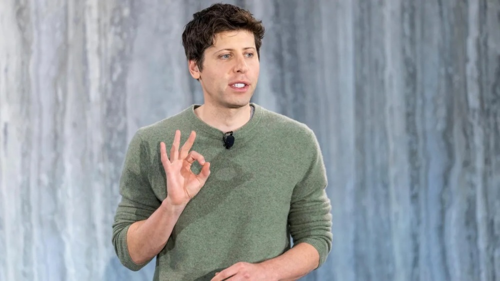
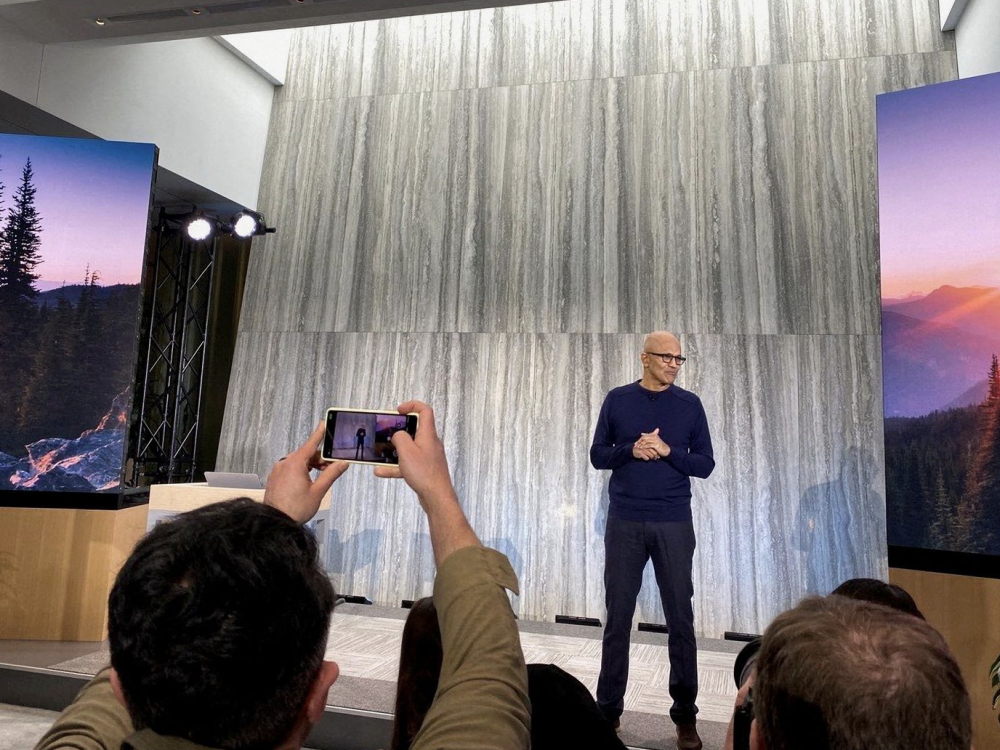

# 同床异梦？外媒爆料微软与OpenAI合作背后：都想利用对方给自己赚钱

据外媒报道，微软与OpenAI的联姻是目前科技行业最受关注的合作关系之一。援引知情人士说，这一关系暗中也有冲突和混乱的一面。

为了抢先使用规模小得多的OpenAI开发的生成式AI技术，微软投资了数以十亿美元计的资金；OpenAI是这一领域的先驱者之一。不过微软对OpenAI只投资了49%，这种安排有助于避免反垄断审查。

其结果是一种类似开放式的关系——双方密切合作，但并非排他性的合作。OpenAI一直在“武装”一些微软的最大竞争对手，而微软实际上限制了OpenAI的潜在搜索引擎客户。

这两家公司在一些领域展开了强有力的合作。微软在其云平台上托管OpenAI的技术，并越来越多地将该技术融合到自身的人气产品中，获得了相对于老对手谷歌(Google)以及其他公司的新优势。在宣布新的计算时代来临的活动中，微软首席执行官纳德拉(Satya
Nadella)和OpenAI首席执行官阿尔特曼(Sam Altman)会互唱赞歌。

_OpenAI首席执行官阿尔特曼对微软的领导者表示赞赏_

据熟悉两家公司合作关系的人士说，与此同时，微软内部有人抱怨对该公司自研AI的支出减少，且OpenAI不允许大部分微软员工获得了解其技术内部运作情况的权限。微软和OpenAI的销售团队有时会向相同的客户进行推销。

这些知情人士说，去年秋天，一些微软员工对OpenAI这么快就推出ChatGPT感到惊讶，而
**OpenAI曾在今年年初警告微软，在没有进行深入培训的情况下急于整合OpenAI的技术会带来危险。**

这种合作关系对科技行业来说是一种不同寻常的组合。

一般来说，像微软这样的公司会吸收一家初创公司及其技术。但实际上，微软与OpenAI保持了距离，对后者具有影响力但没有控制权，而OpenAI得到了一个财力雄厚的金主，同时依然拥有一些探索其他合作关系的自由。

这场闹剧在很大程度上可以归结为二者联姻过程中出现的正常内讧和自尊心受挫。但非营利性研究机构The Allen Institute for
Artificial Intelligence的董事会成员、前首席执行官Oren
Etzioni表示，这一非常规合作关系可能会遇到进一步问题，因为双方都在销售类似的软件和服务。

“ **让二者进一步陷入冲突的是双方都需要赚钱** ，”他说。“ **冲突点在于它们都试图通过类似的产品赚钱。** ”

这两家公司都对双方联姻的好处发表了溢美之词。微软首席财务官Amy Hood已将此称为一种使双方共赢的“伟大的伙伴关系”。

Hood在4月份表示：“当我们成长时，会帮助他们，而当他们成长时，也会助力我们。”

OpenAI成立于2015年，当时是一家非营利性研究公司，致力于推动安全的AI技术造福全人类。OpenAI在2019年创建了一个营利性部门，使其能从微软那里筹集到数十亿美元。OpenAI现在赚钱的方式是向个人收取ChatGPT加强版的使用费和向企业授权其大语言模型。

两家公司都出售对OpenAI技术的访问权限，不同的是微软将该技术作为旗下Azure云服务的一部分，而OpenAI则直接出售。

一些公司表示，他们曾被推销ChatGPT等产品的相同使用权，比如某天是OpenAI的销售人员来推销，后来又有微软的Azure团队。一些公司称，这种推销令人困惑。

OpenAI继续与其他公司发展伙伴关系。微软的劲敌Salesforce (CRM)提供一款采用ChatGPT相关技术的、名为Einstein
GPT的产品。这项功能可以完成生成营销电子邮件等工作，与微软软件中由OpenAI驱动的功能相竞争。

知情人士表示，在微软将OpenAI技术作为其新版必应(Bing)搜索引擎核心的同时，过去12个月里，OpenAI还与不同的搜索引擎进行接洽，讨论其产品的授权事宜。搜索引擎DuckDuckGo已开始使用ChatGPT来驱动自己的聊天机器人DuckAssist。

微软在搜索引擎行业扮演关键角色，因为搜索和组织网络的过程成本很高。谷歌并没有将其技术授权出去，因此许多搜索引擎都严重依赖必应，其中就包括DuckDuckGo。

推出新版必应时，微软改变了规则，使得搜索引擎用OpenAI开发自己的聊天机器人的成本升高。新规则可有效阻止搜索引擎与任何生成式AI公司合作，因为添加AI驱动的聊天机器人会触发微软收取高得多的费用。

_微软首席执行官纳德拉表示，微软将ChatGPT背后的AI技术整合到必应搜索引擎中_

在DuckDuckGo宣布DuckAssist的几周后，该公司将该功能关闭。

微软的一些研究人员抱怨对OpenAI技术的访问受到限制。知情人士说，虽然微软内部有少数团队可以接触到该模型的内部机制，如代码库和模型权重，不过该公司的大多数团队却不能。尽管微软持有该公司相当多的股份，但大多数员工不得不像对待其他外部供应商那样对待OpenAI的模型。

去年秋天ChatGPT的推出和几个月后微软AI驱动版必应的推出也制造了紧张感。

知情人士称，一些微软高管对去年秋天推出ChatGPT的时机怀有疑虑。OpenAI仅提前数周通知微软，称计划开始公开测试这个由AI驱动的聊天机器人，当时总部位于华盛顿州雷德蒙德市的微软仍在努力将OpenAI的技术整合到必应搜索引擎中。

这些人士说，微软员工曾担心ChatGPT会抢了新必应的风头。一些人士还认为，必应可以从公众如何使用ChatGPT的经验教训中获益。

与此同时，OpenAI之前曾建议微软在将其AI技术与必应整合方面放慢脚步。据知情人士说，OpenAI的团队指出了推出基于未经更多培训、未发布的GPT-4版本的聊天机器人的风险。OpenAI警告说，把不准确或怪异回答等问题降至最小限度是需要时间的。

微软还是发布了必应聊天机器人。事实证明，上述警告是对的。用户遇到了回答不准确的情况，与该工具的互动也有令人担忧的情形。微软后来就如何使用新必应发布了新的限制措施，包括对话长度限制。

相对于ChatGPT取得的突破性成功，新必应还差得很远。据分析公司YipitData称，ChatGPT的月度用户已经达到2亿，成为历史上增长最快的消费者应用程序之一。YipitData说，在电脑上，ChatGPT的日均搜索会话数量也几乎是必应搜索的两倍。

上个月，纳德拉说微软的必应搜索引擎将被整合到ChatGPT中。

纳德拉说：“我们计划与OpenAI的合作伙伴一起，将必应的精华纳入到ChatGPT的体验中，现在才刚刚开始。”

