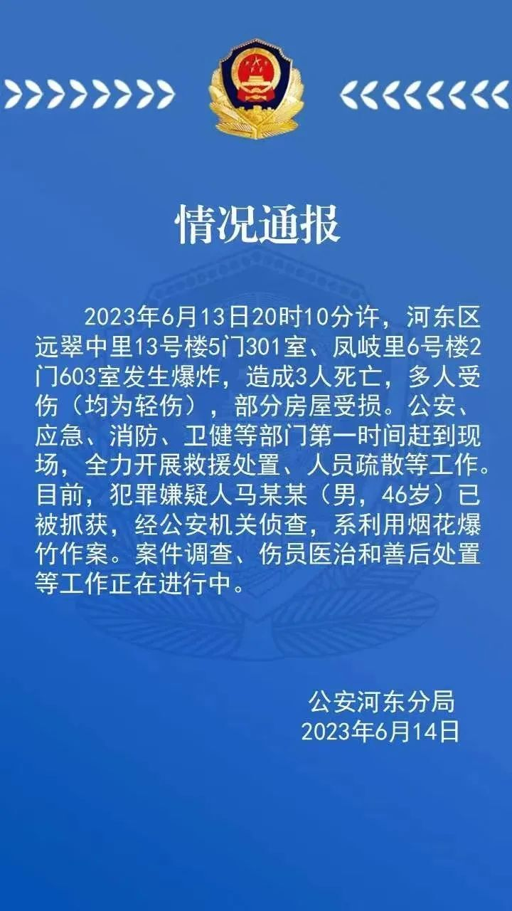
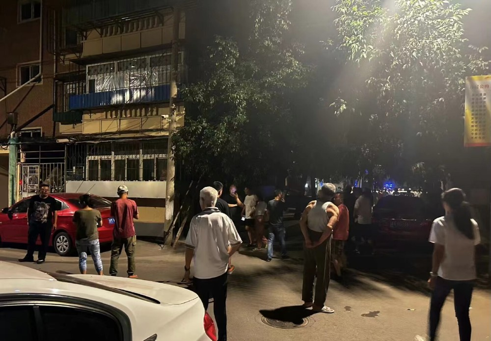
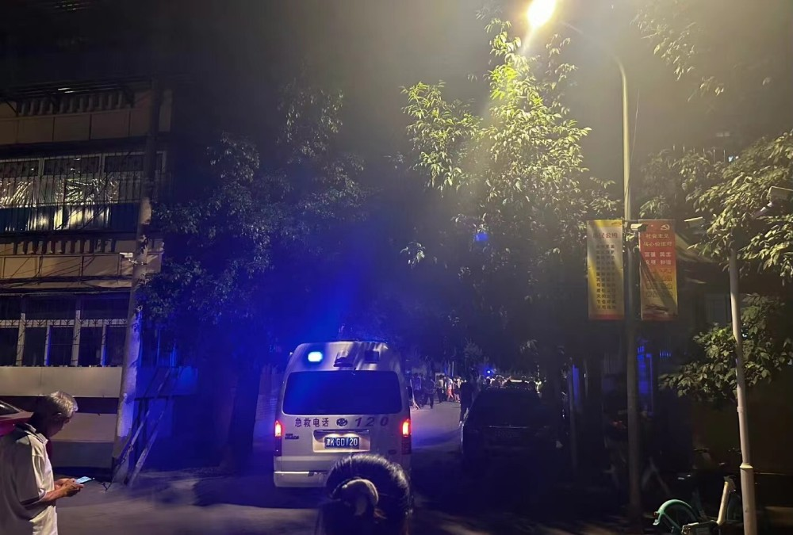

# 天津两居民楼爆炸致3死多伤，网友称小区外常年摆摊占道救护车进不去

6月13日晚，天津市河东区远翠中里小区的居民楼发生爆炸，有人员受伤，天津河东消防支队派出44辆救援车，目前救援工作正在进行。

14日，天津市公安局河东分局发布情况通报：

2023年6月13日20时10分许，河东区远翠中里13号楼5门301室、凤岐里6号楼2门603室发生爆炸， **造成3人死亡，多人受伤 (均为轻伤)**
，部分房屋受损。公安、应急、消防、卫健等部门第一时间赶到现场，全力开展救援处置、人员疏散等工作。

目前， **犯罪嫌疑人马某某 (男，46岁) 已被抓获** ，经公安机关侦查， **系利用烟花爆竹作案。** 案件调查、伤员医治和善后处置等工作正在进行中。

**此前报道**

6月13日，天津河东区一小区发生爆炸事故，根据微博网友发文显示，听到了疑似爆炸的声音，也有网友表示，当时还以为是打雷了。有微博用户发文表示，由于该小区外常年摆摊占道经营，消防车和救护车都无法进入。

顶端新闻记者获取多段视频看到，事发为天津市河东区远翠中里小区14区，消防人员已经进入小区进行救援，有居民表示，刚刚听到两声巨响。2-5楼都受到了影响，房屋很有可能成为危房。另一段视频显示，居民家中已经被爆炸波及，楼道以及消防通道已经被瓦砾完全堵死，并闻到了烧焦味，居民正在等待消防部门救援。

一位居住在附近刘先生说，爆炸是两个小时之前发生的，很多住户受到了影响。目前消防队员和救护车已经到达现场，周边居民已经开始疏散，并安置在周围酒店。

6月13日晚，顶端新闻记者致电天津市河东区东新街道，街道办电话处于无人接听状态。记者致电远翠中里物业，工作人员表示，目前发生爆炸的小区居民已开始撤离，具体情况等官方安排并通知。

来源：顶端新闻、央视新闻客户端、中国新闻社

