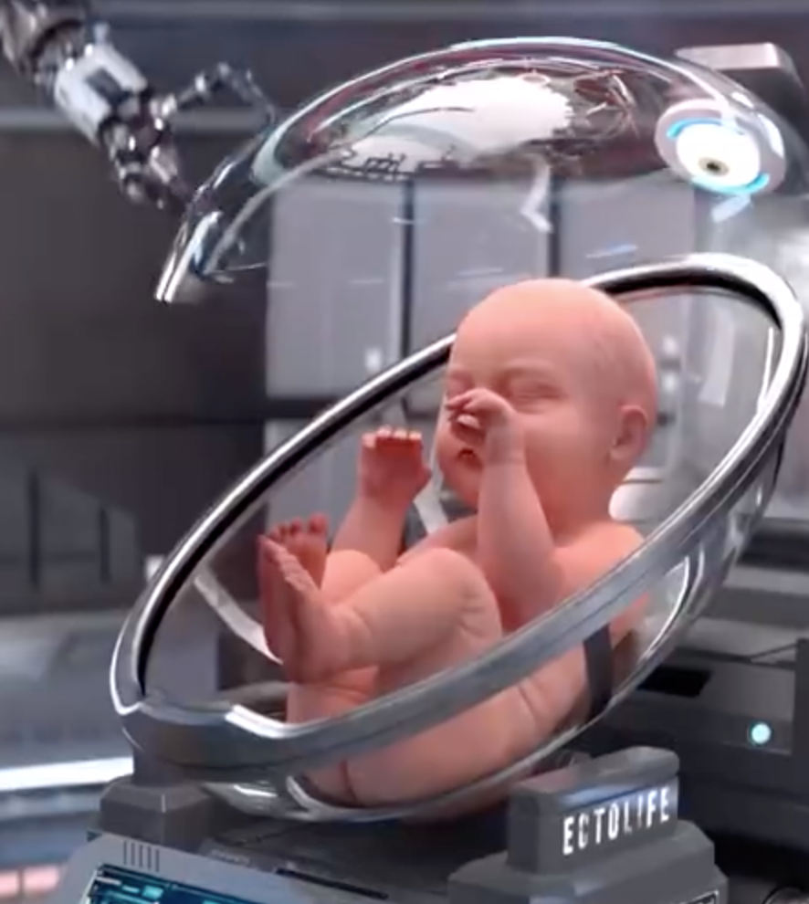

# 如何提高生育意愿？马斯克们力推的人造子宫，有调查显示支持者达八成

_图源：Ectolife短片截图_

**撰文｜罗思丁**

2023年1月，正在稳步推进人类移民火星计划的马斯克看大家不愿意生娃，担心这样下去，未来社会将面临缺乏劳动力的问题，便召来几位科技界富豪，讨论如何提高人们的生育意愿。

结果，几名亿万富翁提出，用“人造子宫”代替女性生孩子。币圈大佬，区块链平台“以太坊”联合创始人维塔利克·布特林就说，可以用人造子宫代替自然分娩，这种技术能消除怀孕的“负担”，让女性的工作不受生育影响。

一场亿万富翁们的讨论，造就了2023年的人造子宫热潮，这却并非什么新鲜事物。

人造子宫的设想，早在1924年就已出现。经历了近百年的浮浮沉沉，而今，不仅在亿万富翁们中，在更普通的大众中，人造子宫这个想法同样簇拥者众多。最近的一项网络调查显示，支持“人造子宫”的人数已经多达受访者总数的八成。

如果真的实现了人造子宫繁殖，不仅可以解决人类生育率走低，老龄化抬头的问题，那些科幻电影里的人造人、克隆人镜头也都将成为现实。

然而生育意愿的降低，是来自于怀孕的“负担”，还是养育的压力？当物质可以极大丰富，人民可以为所欲为的时代，人造子宫是否可以成为一项司空见惯的医疗服务？

到那时，自然分娩是否会是一种过时的陋习？到那时，男性和女性之间的社会分工和生存状态，会不会完全改变？

这一切，对人类文明来说，是拯救还是毁灭？

答案，也许不那么令人乐观。

**地球的人口危机，远在天边、近在眼前**

随着时间的推移，人类的生育率越来越低，这给我们留下了一个令人担忧的问题：人类是否正面临人口危机？

根据联合国的数据，现在全球每年的出生率已经从1950年的平均5.2%降至现在的2.5%不到，这意味着出生率已经下降了一半以上。而且，在一些国家和地区，生育率已经降至自然增长率以下，这将导致人口减少和人均年龄的增加。更糟糕的是，一些典型的生育问题，如生理缺陷等，也在阻止有生育意愿的人生育。这些问题给人类的未来蒙上了一层阴影。

按照联合国的定义，当一个国家生育率长期低于2.1时，这个国家将会进入老龄化社会，目前全球超过40个国家已经进入了这个行列。在高收入国家，这一趋势更加明显，比如：在日本、欧洲等地，出生率已经低于人口再生水平，这给社会带来了严重的问题。据预测，到2050年，65岁以上的老年人口占全球总人口的三分之一。

因此，马斯克们的担忧，如果放任生育率持续下降，人类社会经济大衰退并非危言耸听。

毕竟不光是发展中国家需要人口红利，发达国家一样需要人从事生产。

尽管各国政府已经采取了各种措施鼓励生育，但情况并没有得到根本上的改变。因此，我们需要寻找新的解决方案来缓解或解决这一问题。

人造子宫，最早于1924年由英国遗传学家、进化生物学学家霍尔丹（J.B.S.Haldane）提出，并预测到2074年，约70%的婴儿将在“体外孕育、诞生。”根据霍尔丹的设想，这种新型装置可以通过模拟哺乳动物子宫和卵生动物卵的条件，使受精卵在人造环境下发育，从而摆脱对母体的需求，也将女性从繁重的孕育工作中解放出来。

在科幻小说或电影中，未来世界里，人类使用人造子宫来生育孩子已经成为了一个普遍的现象。

《银翼杀手》中就出现了名为“瑞秋”的人造女性，她被恰到好处地设计成了一种合成生物，能够生育，同时还拥有灵魂和情感。

在《增长》中，曾经出现过一种名为“育龄器”（生育缸）的装置， **它是一种能够代替女性怀孕和生育的科技装置。**

在《鬼入侵》中，超级计算机MYCROFT为了解决生育问题而设计了人造子宫。

所有这些作品中，人造子宫往往被设想成解决人类生育问题，进而解决人口危机的关键技术。

**体外孕育，这个想法一点都不疯狂**

在电影《流浪地球》中，MOSS放弃地球时和吴京说：“空间站冷藏了30万人类受精卵、1亿颗基础农作物种子，储存着全球的动植物DNA图谱，并设有全部人类文明的数字资料库，确保在新的移民星球重建完整的人类文明。”

重建完整的人类文明，将30万受精卵逐一移入人类子宫，通过十月怀胎分娩显然完全不可行。这30万受精卵只会被移入批量生产人类的基地——人造子宫，孕育出新一代的人类文明的火种。

实际上，相对于“智子”、“二向箔”这样的想象，人造子宫的想法一点都不疯狂，甚至有点平常。

早在20世纪50年代，最早的人造子宫技术就已经被科学家们尝试实验，当时研究人造子宫的主要原因是为了抢救早产儿。彼时，因为技术限制，早产儿只有非常低的成活率。

1954年，伊曼纽尔·格林伯格首次设计了人造子宫的装置并申请了专利。

整个设计包括一个用来放置充满羊水的胎儿的水箱、一个连接到脐带的机器、血泵、一个人造肾脏和一个热水器。当然，在当时的条件下这仅仅是个粗糙的设想。

1960年代，美国国家航空航天局（NASA）就提出了一项“人工子宫”计划。目的是通过建立一个无重力环境来保证胎儿的正常发育。虽然这个计划最终没有实现，但是对于人工子宫技术的研究和探索在之后的几十年里一直没有停止。

今天，科学家们已经取得了令人印象深刻的进展：一些实验室已经拥有了可以维持胚胎生存的人造子宫，这些技术可以为那些生理有障碍的人提供生育的机会，同时也能拯救早产儿的生命。

到2017年4月，美国费城儿童医院的研究团队在《自然通讯》发表关于人造子宫首次通过了动物试验的论文，美国科学家实现了利用人造子宫培育羊的胚胎。

研究人员制造了一个充满人造羊水（含有盐和其他电解质的温水）的聚乙烯薄膜袋来模拟母羊的子宫。通过脐带接口连接氧气，形成封闭的流体人造环境。在聚乙烯薄膜袋外，配置一台机器胎盘，胎盘的“血管”与早产小羊的脐带连通。

这样一个看起来简单的模拟子宫环境，培育出了健康的小羊！

荷兰的埃因霍温理工大学，拥有目前世界上最大的人造子宫研究团队，2019年，荷兰科学家就声称他们创造出了世界上第一个人造子宫。

然而这项技术只能做到保护早产儿，无法代替女性子宫。

目前，无论是从生物还是从器械材料上，这种人造子宫都还不足以支撑整个生育过程，不过，欧盟“地平线2020计划”已出资290万欧元，资助他们继续这项研究。

荷兰埃因霍温理工大学教授、荷兰Máxima医疗中心产科专家Guid
Oei表示：“（现在）只是人类子宫的’体外版’。我们计划在2025年之前完成相关试验，以便投入临床使用。”

**人造子宫，会长什么样？**

在电影《黑客帝国》中，所有的人类都不是来源于女性的子宫内，而是一个像培养皿一样的容器之中，那么，真正的人造子宫会是什么样子呢？

在2017年的一次科研交流会上，费城儿童医院的研究团队曾展示过其最新设计的人造子宫模型。圆润的外观里面充满了丰富的人工羊水。模型的内饰在触感、舒适度、母性支撑方面。几乎100%还原了女性子宫最真实的模样。

不过，这种人造子宫中的小羊是一只早产的小羊，并非从受精卵开始。2021年，以色列的科学家们，首次用人造子宫，将5天大的小鼠胚胎培育了6天，成功培育出近百只健康小鼠，相当于达到了人类的胎儿阶段。

在这一过程中,小鼠的所有器官发育指标都正常。

他们的研究使用了一种类似于胶囊的人造子宫，里面装有液体，可以维持恒定的体温和供氧、营养等生理条件，而胚胎则通过名为“生命维持系统”的设备进行直接输注和呼吸。这项研究的成功意味着，胎儿在母亲体内正常发育的环境可以在实验室中进行模拟，未来可能有助于挽救早产儿的生命。

尽管中国的人造子宫研究相对较少，但是在最近几年，中国的一些高校和研究机构已经开始着手开展人造子宫方面的研究，涉及到多个领域，包括仿生材料、自适应控制、医疗机器人等。

中科院动物所顾奇研究员、王红梅研究员与中科院理化所王树涛研究员团队联合攻关，耗时近5年，开发仿生子宫，控制胚外组织迁移组装，模拟胚胎着床，首次成功将囊胚（E3.5）在体外发育至早期器官发生阶段（E8.5），相关成果近期在Advanced
Science发表。

**批量造人的美丽新世界，并不美丽**

然而，如果人造子宫能够成功，一个足以“批量造人”的未来，会是个美丽新世界吗？

公元6世纪，博士帕拉塞尔苏斯曾描述“炼金术造人”。方法是将雄性精液与马粪混合，放入全封闭的容器中。2个月后，会孵化出类人生物。被血液滋养后，会长成人类的缩小版。

1888年美国作家艾德华·贝拉米（Edward Bellamy）所著的小说《时光倒流》（Looking Backward,
2000-1887年）就描述了100多年后(2000年)的生活。一位波士顿青年在沉睡了113年之后，终于在2000年醒过来，发现理想的社会已经建立。其中有一种设备可以让婴儿从生产线上制造出来，人类不再有生育的痛苦和负担。

在当时，这部小说被翻译成20多种语言，在世界范围内广泛传播，不仅为当时尚处于光绪年间的中国打开了眼界，为当时很多学者画就了一张完美社会的蓝图，并带动了很多伟大思想的诞生。

然而到了近现代，有识之士开始对新生技术对人类文明、社会伦理产生的影响，产生深入的思考。

英国作家阿道司·赫胥黎在1932年发表的反乌托邦长篇小说《美丽新世界》中，讲述了虚构的福特纪元632年即公元2532年的社会，人类沦为垄断型基因公司和政治人物手中的玩偶的故事。通过讲述新旧世界的人们对于理性、科学、信仰的质疑，引发人们对于社会制度以及个人权利方面的反思。

在小说中，人类从生产线生产出来，就像福特公司大规模生产的汽车一样。虽然人人安居乐业、衣食无忧，但是家庭、个性，甚至喜怒哀乐都消失殆尽，人们不再有情感，一切都是为了感官愉悦，人类陷入了虚假、冰冷、机械化的幸福的“深渊”。

人性消泯，人成为了严密科学控制下，一群被注定了身分、命运的奴隶。所谓的“家庭”、“爱情”、“宗教”……皆成为历史名词，社会的箴言是“共有、统一、安定”。

作为一部著名的反乌托邦小说，《美丽新世界》显然高估了科学对于人性的改变能力。当然这种改变，也是潜移默化的。

2023年初，也门生物学家Hashem Al-
Ghaili发布了一个关于他的Ectolife项目的视频，虽然这个项目还处于概念阶段，这部短片，已经在全球范围内引发了150亿次的点击率，不少网友惊呼，这将让女性再次从生育中解放出来。

Hashem Al-
Ghaili声称，Ectolife项目已经研究了50年，拥有75个高度发达的妊娠实验室，每个实验室配备400个完全复制母体环境的人造子宫。每个“子宫”都配备了高精度的监测设备，随时监测胎儿心跳、血氧饱和度和体温。一旦检测到任何危险因素，立即发出警报，仪器将自动做出最佳反应。

胎儿和“子宫”之间还有一条人工脐带连接，模拟妈妈的成长环境。借助CRISPR-
Cas9基因编辑技术，父母还可以随心所欲地调整胎儿的遗传特征，如身高、肤色、智力指数等。

尽管Ectolife项目还处于概念阶段，却在科学界引起了轩然大波。很多人认为这项技术是对人类道德底线的冲击。“生娃机”践踏了人类最基本的尊严，颠倒了人与机器的标准关系。

即便是Hashem本人，也在介绍的过程当中表示：有些设想现在看来很美好，可一旦其成为现实，后果恐怕就不再会和我们想像的一样了。

2019年5月，曼彻斯特大学的律师伊丽莎白·克洛伊·罗曼尼斯（Elizabeth Chloe Romanis）在《英国医学杂志-
医学伦理学》发表的一篇文章中，探讨了人造子宫的生物伦理学，她警告说，这项技术会引起一些疑惑，比如谁该被选为实验对象？被测试的胎儿在人造子宫中又会受到怎样的长期影响？

“法律对胎儿和婴儿的处理方式有很大不同，而人造子宫的对象又该如何适应？”她补充说，“很明显，在人造子宫成为现实之前，必须先讨论相关的法律和道德问题。”

**人造子宫，会成为未来吗？**

从好的方面看，人造子宫将成为生殖技术领域的一项创新，并且为那些身体上无法生育的人提供希望。它可以为研究神经发育，早产儿的健康等问题提供新的思路和解决方案，也能够解放女性，让她们不必再被孕育的责任所束缚，能够与丈夫一起为家庭工作拼搏，让职场环境变得更公平。

但另一方面，现阶段的人造子宫技术仍面临许多挑战和限制。

首先，在使用人造子宫时，需要保证一系列的生理条件，例如维持体温、供氧和合适的营养等，以模拟胎儿在母亲身体内正常发育的环境。这可能需要大量的能源和物质，而且目前的技术仍难以做到完全模拟自然环境。此外，伦理问题也需要考虑，人造子宫可能会导致亲子关系的模糊化，也可能会引发不同群体之间的歧视，以及，它会促使我们重新思考，应该如何定义胎儿的人格和权利。

在应用到人类之前，我们必须解决这若干的科学和伦理问题。不过，人造子宫的未来同样具有诱惑力。

如若能够解决科学和伦理上的问题，那么人造子宫可能会成为一项革命性的技术，它可以帮助无法自然生育的人，维持全球人口规模，解决人口危机。

我们需要通过科学家们的努力和伦理规范的制定来确保人造子宫技术的可行性和安全性，也需要深入思考人工智能和先进机器学习等新兴技术在人造子宫领域中的应用。我们相信，在不久的将来，人造子宫技术将成为人类生育的一种重要方式，为人类社会带来更多健康幸福的生命。

